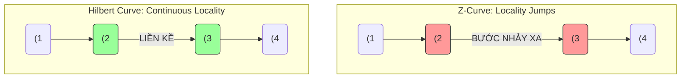

Hive Partitioning (Phân mảnh theo thư mục) và Z-Ordering đã từng là "tiêu chuẩn vàng" cho Data Layout trong thế hệ Data Lakehouse đầu tiên. Tuy nhiên, khi đối mặt với các luồng Streaming Ingestion liên tục và dữ liệu High Cardinality (có độ biến thiên cao như `user_id`), chúng bộc lộ những tử huyệt vật lý: **Directory Explosion (Bùng nổ thư mục)** và **Write Amplification (Khuếch đại ghi khổng lồ)**.

Để giải quyết triệt để vấn đề này, Databricks đã giới thiệu **Liquid Clustering** – một kiến trúc thay đổi hoàn toàn cuộc chơi: Chuyển dịch từ phân mảnh thư mục vật lý (Static Hard-boundaries) sang quản lý gom cụm tệp động (Dynamic File Clustering) ở tầng Siêu dữ liệu (Metadata) dựa trên thuật toán **Hilbert Curve**.

---

## 1. Nền Tảng Toán Học: Hilbert Curve vs Z-Curve

Cả Z-Order và Liquid Clustering đều sử dụng các đường cong lấp đầy không gian (Space-filling curves) để ánh xạ dữ liệu đa chiều (VD: `user_id` và `event_time`) xuống một chuỗi vật lý 1 chiều (1D) nhằm tối ưu hóa Data Skipping (Bỏ qua tệp khi truy vấn).

### Tử huyệt của Z-Curve (Locality Jumps)
Z-Curve (được dùng trong Z-Ordering truyền thống) có một nhược điểm kiến trúc chí mạng: **Bước nhảy cục bộ (Locality Jumps)**. Tại các điểm biên của chữ Z, những bản ghi dữ liệu gần nhau trong thực tế lại bị đẩy ra rất xa nhau trên chuỗi đĩa 1D. Điều này làm cho khoảng giá trị (Min/Max stats) của tệp bị kéo giãn, khiến Engine phải đọc thừa rất nhiều dữ liệu không liên quan.

### Sự Ưu Việt của Hilbert Curve
Ngược lại, **Hilbert Curve** (được dùng trong Liquid Clustering) là một đường cong uốn lượn liên tục (Continuous Fractal). Nó đảm bảo tính cục bộ tuyệt đối: hai điểm gần nhau trong không gian đa chiều sẽ *luôn luôn* nằm liền kề nhau trên đĩa cứng.



**Kết quả:** Khoảng Min/Max của các tệp Parquet trong Liquid thu hẹp đáng kể. Delta Engine có thể cắt tỉa (Pruning) tệp chính xác tuyệt đối.

---

## 2. Kiến Trúc Thực Thi: Flat Namespace & Z-Cubes

### 2.1. Giải quyết Over-Partitioning và Directory Explosion
**Sự cố Hive Partitioning:** Nếu bạn partition theo cột `user_id`, S3 sẽ sinh ra hàng triệu thư mục. Mỗi khi Spark query, nó phải gọi API `ListObjectsV2` của AWS S3 hàng triệu lần để duyệt cây thư mục trước khi chạm vào byte dữ liệu đầu tiên. Việc này làm sập Query Planning.

**Kiến trúc Liquid (Flat Namespace):**
Liquid Clustering loại bỏ hoàn toàn mô hình thư mục lồng nhau. Toàn bộ file Parquet được ném vào chung một Flat Namespace. Việc nhóm dữ liệu được quản lý bằng metadata bên trong Delta Log. Spark đọc Log trên RAM và trỏ thẳng `O(1)` đến URI của tệp Parquet, tiết kiệm chi phí I/O khổng lồ.

### 2.2. Z-Cubes và Incremental Clustering
Trong Z-Ordering cũ, chạy lệnh `OPTIMIZE` đồng nghĩa với việc Spark phải tải lại *toàn bộ* bảng, tính toán lại Z-Curve và ghi đè lại toàn bộ dữ liệu (Write Amplification cực lớn).

Liquid giải quyết bằng cấu trúc **Z-Cubes** bên trong Delta Log, đánh dấu trạng thái vòng đời của tệp:
- `Unclustered`: Tệp mới được Streaming Ingest vào, chưa được băm.
- `Clustered`: Tệp đã được phân cụm Hilbert.
- `Tombstone`: Tệp rác chờ `VACUUM`.

Khi Ingestion chạy, hệ thống chỉ kích hoạt **Incremental Clustering (Gom cụm tăng dần)**. Nó chỉ nhặt các tệp `Unclustered`, xử lý qua Hilbert Curve và hợp nhất chúng lại, không hề chạm vào dữ liệu lịch sử đã Clustered.

---

## 3. Rủi Ro Vận Hành & Lệch Dữ Liệu (Data Skew)

Data Skew (Lệch dữ liệu) là nguyên nhân số 1 gây kẹt task trên Spark (Straggler Tasks). Ví dụ: Partition theo `Country`, dữ liệu `US` tạo ra thư mục 500GB (1 task chạy 1 tiếng), `VN` tạo ra thư mục 10MB (1 task chạy 1 giây).

**Auto-balancing của Liquid:**
Liquid giám sát mật độ dữ liệu qua Hilbert Curve. 
- Vùng tọa độ quá đặc (`US`): Liquid tự động "xé" thành các tệp Parquet kích thước chuẩn [~1GB/tệp], giúp Spark rải đều task cho các Executors.
- Vùng thưa thớt (`VN`): Liquid tự động gom chúng chung với các cụm rời rạc khác (dựa trên Hilbert Curve) để tạo thành tệp 1GB, chấm dứt hoàn toàn lỗi Small Files.

---

## 4. Thực Chiến Code (Configuration)

Liquid Clustering hỗ trợ tối đa 4 cột và tỏa sáng nhất với dữ liệu **High Cardinality** (như ID, Session).
*Lưu ý: Không thể dùng chung Liquid Clustering và Partitioning/Z-Order trên cùng một bảng.*

### Cú pháp Khởi tạo DDL
```sql
-- Khai báo Liquid Clustering cực kỳ đơn giản
CREATE TABLE lakehouse.events (
  user_id STRING,
  session_id STRING,
  event_time TIMESTAMP,
  payload STRING
)
USING DELTA
CLUSTER BY (user_id, event_time);
```

### Tiến hóa linh hoạt (Schema Evolution)
Khác với Partitioning (đổi cột partition bắt buộc phải viết lại toàn bộ bảng vật lý), Liquid là một định nghĩa Logic. Bạn có thể đổi chiến lược gom cụm ngay lập tức. Dữ liệu cũ giữ nguyên Cluster cũ, dữ liệu mới sẽ áp dụng Cluster mới.

```sql
-- Query pattern thay đổi, cần cluster theo session thay vì user
ALTER TABLE lakehouse.events CLUSTER BY (session_id, event_time);
```

### Bật tính năng Tự động (Under thư Hood)
Để hệ thống tự động gom cụm mà không cần cronjob chạy `OPTIMIZE`, hãy kích hoạt các config sau trên Databricks (đòi hỏi thêm chút RAM ở Executor):

```text
# Tự động Tối ưu hóa khi Ghi (Predictive Optimization)
spark.databricks.delta.optimizeWrite.enabled true

# Tự động gộp Small Files ngầm định trong background
spark.databricks.delta.autoCompact.enabled auto
```

---

## Tổng Kết
Liquid Clustering là dấu chấm hết cho kỷ nguyên quản lý dữ liệu vật lý thủ công. Nó đẩy gánh nặng phân rã, tổ chức và cân bằng dữ liệu từ vai Data Engineer sang các thuật toán Metadata tự động (Hilbert Curve và Z-Cubes), tối ưu hóa triệt để chi phí Compute và I/O trên Cloud.

## Nguồn Tham Khảo
1. [Databricks: Debunking 8 data layout myths][https://www.databricks.com/blog/debunking-8-data-layout-myths-why-liquid-clustering-outperforms-partitioning]
2. [Databricks Delta Lake: Liquid Clustering Architecture](https://docs.delta.io/latest/delta-clustering.html]
3. *Designing Data-Intensive Applications* - Martin Kleppmann (Space-filling Curves).
