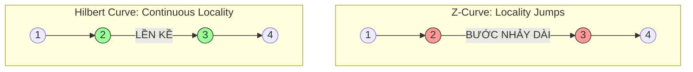
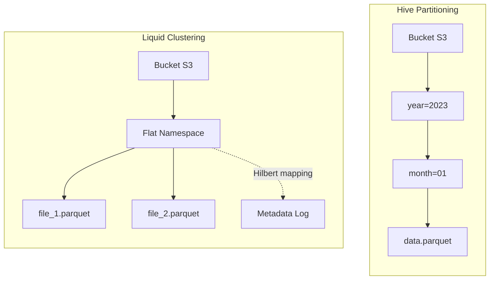

---
title: "Liquid Clustering Deep Dive: Tạm Biệt Partitioning và Z-Ordering"
difficulty: "Advanced"
tags: ["liquid-clustering", "delta-lake", "performance", "databricks", "data-engineering"]
readingTime: "18 mins"
lastUpdated: 2026-06-26
seoTitle: "Liquid Clustering trong Databricks là gì? Thay thế Partitioning và Z-Order"
metaDescription: "Kiến trúc Liquid Clustering trong Delta Lake. Phân tích thuật toán Hilbert Curve, cơ chế Auto-balancing và thay thế hoàn toàn Hive Partitioning."
description: "Tại sao Databricks lại tuyên bố Liquid Clustering là tiêu chuẩn mới? Phân tích sâu kiến trúc Flat Namespace, Incremental Clustering và thuật toán Auto-balancing."
Hive Partitioning và Z-Ordering đã làm tốt nhiệm vụ của mình trong kỷ nguyên Hadoop và Gen 1 Data Lakehouse. Tuy nhiên, ở quy mô Cloud-Native với luồng dữ liệu Streaming liên tục, chúng để lộ những yếu điểm kiến trúc chí mạng: Partitioning gây bùng nổ thư mục vật lý (Directory Explosion), còn Z-Ordering bóp nghẹt tài nguyên Compute (Write Amplification). 

Databricks đã thiết kế lại hoàn toàn lớp Storage Layout với **Liquid Clustering** – chuyển dịch từ phân mảnh thư mục cứng nhắc sang gom cụm tệp động (Dynamic File Clustering) sử dụng thuật toán **Hilbert Curve**.

## 1. Cách thức hoạt động dưới mui xe (Under the Hood)

Khác với Hive Partitioning chia dữ liệu thành các thư mục vật lý (hard-boundaries), Liquid Clustering ghi toàn bộ tệp Parquet vào một **Flat Namespace** duy nhất. Việc nhóm dữ liệu được quản lý hoàn toàn ở tầng Metadata (Delta Log). 

Để làm được điều này, Liquid Clustering kết hợp 2 kỹ thuật cốt lõi: **Đường cong Hilbert** (Toán học) và **Z-Cube** (Cấu trúc dữ liệu).

### 1.1. Đường cong Hilbert (Hilbert Curve) vs. Z-Curve
Cả Z-Order và Liquid đều dùng *Space-filling curves* để ánh xạ dữ liệu đa chiều xuống 1D. Tuy nhiên, Z-Curve có một nhược điểm chí mạng gọi là **Locality Jumps** (Bước nhảy cục bộ). Tại các điểm biên của chữ Z, dữ liệu kề nhau trong không gian thực tế lại bị đẩy ra rất xa nhau trên chuỗi 1D.

Ngược lại, **Hilbert Curve** có đặc tính hình học uốn lượn liên tục (continuous fractal). Nó đảm bảo rằng hai điểm gần nhau trong không gian đa chiều sẽ *luôn luôn* gần nhau trong chuỗi 1D.


**Kết quả:** Min/Max stats của tệp Parquet trong Liquid Clustering hẹp hơn Z-Order rất nhiều, giúp Data Skipping cắt tỉa tệp chính xác tuyệt đối.

### 1.2. Z-Cube Metadata Framework
Trong Delta Log của Liquid Clustering, Databricks duy trì một cấu trúc gọi là **Z-Cube**. 
Thay vì phải đọc toàn bộ bảng để tính toán lại Curve mỗi khi có dữ liệu mới (như Z-Order), Z-Cube theo dõi vòng đời của từng tệp:
- Tệp chưa được gom cụm (Unclustered).
- Tệp đã gom cụm (Clustered).
- Tệp rác (Tombstone).

Khi lệnh `OPTIMIZE` chạy, nó chỉ quét qua Z-Cube, nhặt các tệp *Unclustered*, băm chúng qua Hilbert Curve và ghi ra file Parquet mới. Đây gọi là **Incremental Clustering** (Gom cụm tăng dần).

## 1. Kiến trúc Vật lý (Physical Architecture)

Thay vì băm nhỏ tệp vào các cấu trúc thư mục lồng nhau (`year=2023/month=10/`), Liquid Clustering ghi toàn bộ tệp Parquet vào một **Flat Namespace** duy nhất. Tầng siêu dữ liệu (Delta Log) sẽ chịu trách nhiệm vẽ lại bản đồ logic giữa các tệp này thông qua thuật toán Hilbert Curve.



### Auto-Balancing (Cân bằng dung lượng tự động)
Trong môi trường Production, lệch dữ liệu (Data Skew) là nguyên nhân số 1 gây kẹt task trên Spark (Straggler Tasks). Với Liquid, khái niệm "Phân vùng lớn/Phân vùng nhỏ" biến mất.
Engine tự động phát hiện cụm tọa độ Hilbert quá dày đặc và tự động "xé" nó ra thành nhiều tệp Parquet tối ưu (~1GB/tệp). Các điểm dữ liệu rời rạc sẽ được ghép lại chung tệp để tránh lỗi Small Files.

## 2. Liquid Clustering khác gì Partitioning? (Systemic Trade-offs)

Mặc dù cả hai đều nhằm mục đích **Data Skipping**, nhưng sự khác biệt về kiến trúc là một trời một vực:

| Tiêu chí | Hive Partitioning | Liquid Clustering |
| :--- | :--- | :--- |
| **Cơ chế Pruning** | Hard-boundary (Bỏ qua Thư mục vật lý). | Soft-boundary (Bỏ qua Tệp dựa trên Delta Log Min/Max). |
| **Data Skew** | Yếu. Dễ sinh ra thư mục chứa hàng triệu file vài KB, hoặc thư mục rỗng. | **Cân bằng tự động (Auto-balancing)**. Nhờ Hilbert, các cụm dữ liệu quá dày sẽ tự bị "xé" thành các tệp ~1GB. Các điểm dữ liệu mỏng tự được gom chung. |
| **Write Amplification** | Thấp (Chỉ Append vào đúng thư mục). | Trung bình thấp (Nhờ **Write-Time Clustering** và Incremental Optimize). |
| **Khả năng thay đổi** | Cực khó. Đổi cột Partition đồng nghĩa viết lại toàn bộ bảng. | **Linh hoạt**. Thay đổi lệnh `CLUSTER BY` không bắt buộc viết lại dữ liệu cũ. |

### Incremental OPTIMIZE 
Z-Order yêu cầu Spark phải Shuffle toàn bộ dữ liệu lịch sử. Với Liquid, nhờ cấu trúc Z-Cube, `OPTIMIZE` chỉ tốn chi phí Compute cho lượng dữ liệu Delta (dữ liệu mới nạp vào). Chi phí DBU giảm đến 80%.

### 2.1. Đập tan 3 lời đồn (Myths) về Partitioning vs Liquid Clustering
Dựa trên công bố chính thức từ Databricks (tháng 6/2026), có 3 lầm tưởng lớn nhất mà các Data Engineer hay mắc phải:

**Lời đồn 1: "Partitioning nhanh hơn vì nó lọc thư mục (Directory Pruning) vật lý thay vì quét file"**
- *Sự thật:* Trong Object Storage (S3/GCS/ADLS), không có khái niệm "thư mục" thực sự, tất cả đều là Flat Namespace với prefix. Directory Pruning ở quy mô lớn thực tế yêu cầu engine phải list hàng chục ngàn API calls. Liquid Clustering giải quyết bằng Metadata Pruning: chỉ cần đọc 1 file Delta Log nhỏ trên RAM là biết chính xác 100% tọa độ các file Parquet cần lấy, bỏ qua hoàn toàn chi phí List API chậm chạp của S3.

**Lời đồn 2: "Cột Low-Cardinality (ví dụ: Country, Date) thì cứ dùng Partitioning là tốt nhất"**
- *Sự thật:* Ngay cả với Low-Cardinality, nếu dữ liệu của bạn có Data Skew (ví dụ: Mỹ chiếm 90% dữ liệu, Việt Nam chiếm 1%), Partitioning sẽ tạo ra Straggler Tasks. Liquid Clustering dùng Hilbert Curve sẽ tự động "cắt" dữ liệu nước Mỹ ra thành 100 tệp 1GB, và gom Việt Nam cùng các nước nhỏ khác vào chung 1 tệp, cân bằng tải hoàn hảo cho mọi Spark worker.

**Lời đồn 3: "Liquid không hỗ trợ Metadata-only operations (như DROP PARTITION)"**
- *Sự thật:* Liquid Clustering hoàn toàn hỗ trợ các thao tác như `DELETE` bằng cách cập nhật Delta Log (Tombstones), siêu nhanh mà không cần động vào dữ liệu vật lý.

## 3. Mã thực chiến (Executable Configs)

Sử dụng Liquid Clustering rất đơn giản thông qua cú pháp `CLUSTER BY`. Nó hỗ trợ tối đa 4 cột và hoạt động cực mượt với dữ liệu có **High Cardinality**.

```sql
-- Kích hoạt Liquid Clustering
CREATE TABLE events (
  user_id STRING,
  session_id STRING,
  event_time TIMESTAMP
)
USING DELTA
CLUSTER BY (user_id, event_time);

-- Thay đổi chiến lược Clustering không gây Write-Amplification (Evolving)
ALTER TABLE events CLUSTER BY (session_id);
```

**Under the hood Configs:**
Để tối đa hóa sức mạnh của Liquid trong môi trường ghi liên tục (Streaming), bạn nên kích hoạt cơ chế tự động dọn dẹp nội bộ của Databricks Engine trong cấu hình Cluster:

```text
# Spark Config
spark.databricks.delta.optimizeWrite.enabled true
spark.databricks.delta.autoCompact.enabled auto
```
Hai cờ này ép Spark phải hy sinh thêm một chút RAM và Latency ở khâu Write để đảm bảo dữ liệu ghi xuống luôn ở trạng thái gom cụm hoàn hảo nhất, tiết kiệm hàng giờ chạy `OPTIMIZE` thủ công sau này.

## 4. Khi nào KHÔNG dùng Liquid Clustering?

Dù được Databricks quảng bá là "Tiêu chuẩn mặc định mới", bạn **tuyệt đối không** dùng Liquid khi:
- Bảng cần được truy cập bởi các Query Engine đời cũ (Legacy Athena, PrestoDB) không hỗ trợ giao thức Delta Liquid Protocol. Các engine này sẽ vấp ngã khi không thấy cấu trúc thư mục truyền thống.
- Kích thước bảng siêu nhỏ (< 10GB). Chi phí xử lý siêu dữ liệu Hilbert sẽ lớn hơn chi phí quét toàn bộ bảng.

## Nguồn Tham Khảo (References)
* [Sách: Designing Data-Intensive Applications - Chapter 3 (Martin Kleppmann)](https://dataintensive.net/)
* [Databricks Blog: Debunking 8 data layout myths: why Liquid Clustering outperforms partitioning](https://www.databricks.com/blog/debunking-8-data-layout-myths-why-liquid-clustering-outperforms-partitioning)
* [Databricks Blog: Announcing Liquid Clustering for Delta Lake](https://www.databricks.com/blog/announcing-liquid-clustering-delta-lake)
* [Databricks Blog: How Liquid Clustering simplifies Data Layout](https://www.databricks.com/blog/how-liquid-clustering-simplifies-data-layout-and-improves-query-performance)
* [Delta Lake Docs: Liquid Clustering](https://docs.delta.io/latest/delta-clustering.html)
