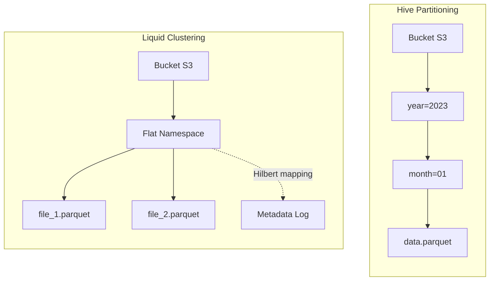

Hive Partitioning và Z-Ordering đã làm tốt nhiệm vụ của mình trong kỷ nguyên Hadoop và Gen 1 Data Lakehouse. Tuy nhiên, ở quy mô Cloud-Native với luồng dữ liệu Streaming liên tục, chúng để lộ những yếu điểm kiến trúc chí mạng: Partitioning gây bùng nổ thư mục vật lý (Directory Explosion), còn Z-Ordering bóp nghẹt tài nguyên Compute (Write Amplification). 

Databricks đã thiết kế lại hoàn toàn lớp Storage Layout với **Liquid Clustering** – chuyển dịch từ phân mảnh thư mục cứng nhắc sang gom cụm tệp động (Dynamic File Clustering) sử dụng thuật toán **Hilbert Curve**.

## 1. Kiến trúc Vật lý (Physical Architecture)

Thay vì băm nhỏ tệp vào các cấu trúc thư mục lồng nhau (`year=2023/month=10/`), Liquid Clustering ghi toàn bộ tệp Parquet vào một **Flat Namespace** duy nhất. Tầng siêu dữ liệu (Delta Log) sẽ chịu trách nhiệm vẽ lại bản đồ logic giữa các tệp này thông qua thuật toán Hilbert Curve.



### Auto-Balancing (Cân bằng dung lượng tự động)
Trong môi trường Production, lệch dữ liệu (Data Skew) là nguyên nhân số 1 gây kẹt task trên Spark (Straggler Tasks). Với Liquid, khái niệm "Phân vùng lớn/Phân vùng nhỏ" biến mất.
Engine tự động phát hiện cụm tọa độ Hilbert quá dày đặc và tự động "xé" nó ra thành nhiều tệp Parquet tối ưu (~1GB/tệp). Các điểm dữ liệu rời rạc sẽ được ghép lại chung tệp để tránh lỗi Small Files.

## 2. Systemic Trade-offs: Tại sao vượt trội hơn Z-Order?

Z-Order yêu cầu Spark phải Shuffle toàn bộ dữ liệu lịch sử để tính toán lại Curve. Liquid Clustering vượt qua điều này nhờ hai cơ chế cốt lõi:

1.  **Write-Time Clustering (Gom cụm ngay lúc ghi):** Khi chạy `INSERT` hoặc `MERGE`, dữ liệu nằm trên RAM đã được Spark rải vào các "bucket" logic của Liquid trước khi flush xuống đĩa. Tính trạng phân mảnh (Decay) được giảm thiểu ngay từ nguồn.
2.  **Incremental OPTIMIZE:** Lệnh `OPTIMIZE` của Liquid chỉ tìm và nhắm mục tiêu vào các tệp chưa được gom cụm (Unclustered files), thay vì đọc lại toàn bộ bảng. Chi phí Compute (DBU) giảm đến 80% so với `OPTIMIZE ZORDER`.

## 3. Mã thực chiến (Executable Configs)

Sử dụng Liquid Clustering rất đơn giản thông qua cú pháp `CLUSTER BY`. Nó hỗ trợ tối đa 4 cột và hoạt động cực mượt với dữ liệu có **High Cardinality**.

```sql
-- Kích hoạt Liquid Clustering
CREATE TABLE events (
  user_id STRING,
  session_id STRING,
  event_time TIMESTAMP
)
USING DELTA
CLUSTER BY (user_id, event_time);

-- Thay đổi chiến lược Clustering không gây Write-Amplification (Evolving)
ALTER TABLE events CLUSTER BY (session_id);
```

**Under the hood Configs:**
Để tối đa hóa sức mạnh của Liquid trong môi trường ghi liên tục (Streaming), bạn nên kích hoạt cơ chế tự động dọn dẹp nội bộ của Databricks Engine trong cấu hình Cluster:

```text
# Spark Config
spark.databricks.delta.optimizeWrite.enabled true
spark.databricks.delta.autoCompact.enabled auto
```
Hai cờ này ép Spark phải hy sinh thêm một chút RAM và Latency ở khâu Write để đảm bảo dữ liệu ghi xuống luôn ở trạng thái gom cụm hoàn hảo nhất, tiết kiệm hàng giờ chạy `OPTIMIZE` thủ công sau này.

## 4. Khi nào KHÔNG dùng Liquid Clustering?

Dù được Databricks quảng bá là "Tiêu chuẩn mặc định mới", bạn **tuyệt đối không** dùng Liquid khi:
- Bảng cần được truy cập bởi các Query Engine đời cũ (Legacy Athena, PrestoDB) không hỗ trợ giao thức Delta Liquid Protocol. Các engine này sẽ vấp ngã khi không thấy cấu trúc thư mục truyền thống.
- Kích thước bảng siêu nhỏ (< 10GB). Chi phí xử lý siêu dữ liệu Hilbert sẽ lớn hơn chi phí quét toàn bộ bảng.

## Nguồn Tham Khảo (References)
* [Sách: Designing Data-Intensive Applications - Chapter 3 (Martin Kleppmann)](https://dataintensive.net/)
* [Databricks Blog: Announcing Liquid Clustering for Delta Lake](https://www.databricks.com/blog/announcing-liquid-clustering-delta-lake)
* [Databricks Blog: How Liquid Clustering simplifies Data Layout](https://www.databricks.com/blog/how-liquid-clustering-simplifies-data-layout-and-improves-query-performance)
* [Delta Lake Docs: Liquid Clustering](https://docs.delta.io/latest/delta-clustering.html)
