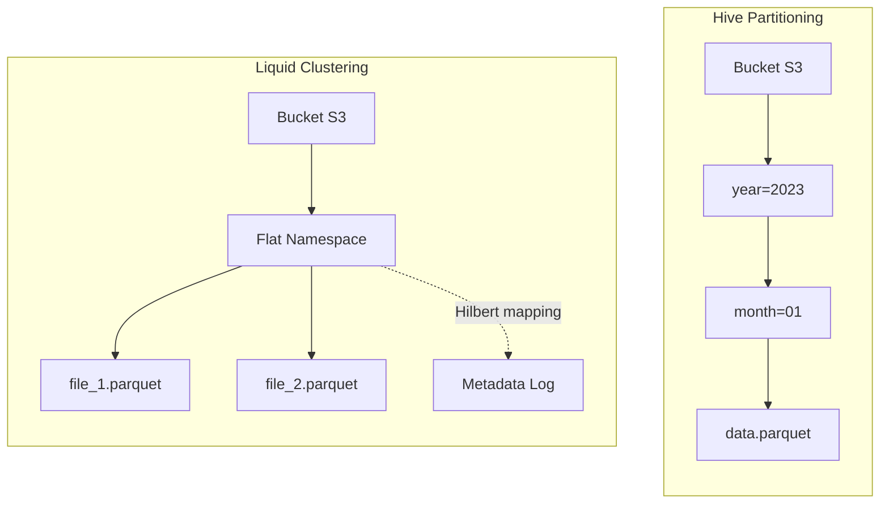

Hive Partitioning và Z-Ordering đã hoàn thành tốt vai trò trong kiến trúc Hadoop và thế hệ Data Lakehouse đầu tiên. Tuy nhiên, khi vận hành ở quy mô lớn với luồng dữ liệu liên tục, chúng bộc lộ các hạn chế kiến trúc: Partitioning dễ dẫn đến bùng nổ thư mục (Directory Explosion), còn Z-Ordering tiêu tốn nhiều tài nguyên Compute khi chạy lại (Write Amplification).

Để giải quyết, Databricks giới thiệu **Liquid Clustering** – chuyển dịch từ phân mảnh thư mục cứng nhắc sang gom cụm tệp động (Dynamic File Clustering) bằng thuật toán **Hilbert Curve**.

## 1. Kiến trúc bên dưới (Under the Hood)

Khác với Hive Partitioning chia dữ liệu thành các thư mục vật lý (hard-boundaries), Liquid Clustering ghi toàn bộ tệp Parquet vào một **Flat Namespace**. Việc nhóm dữ liệu được quản lý ở tầng siêu dữ liệu (Metadata) thông qua Delta Log.

Để làm được điều này, Liquid Clustering kết hợp 2 kỹ thuật cốt lõi: **Đường cong Hilbert** (Toán học) và **Z-Cube** (Cấu trúc dữ liệu).

### 1.1. Đường cong Hilbert (Hilbert Curve) vs. Z-Curve
Cả Z-Order và Liquid đều dùng *Space-filling curves* để ánh xạ dữ liệu đa chiều xuống 1D. Tuy nhiên, Z-Curve có một nhược điểm chí mạng gọi là **Locality Jumps** (Bước nhảy cục bộ). Tại các điểm biên của chữ Z, dữ liệu kề nhau trong không gian thực tế lại bị đẩy ra rất xa nhau trên chuỗi 1D.

Ngược lại, **Hilbert Curve** có đặc tính hình học uốn lượn liên tục (continuous fractal). Nó đảm bảo rằng hai điểm gần nhau trong không gian đa chiều sẽ *luôn luôn* gần nhau trong chuỗi 1D.


**Kết quả:** Min/Max stats của tệp Parquet trong Liquid Clustering hẹp hơn Z-Order rất nhiều, giúp Data Skipping cắt tỉa tệp chính xác tuyệt đối.

### 1.2. Z-Cube Metadata Framework
Trong Delta Log của Liquid Clustering, Databricks duy trì một cấu trúc gọi là **Z-Cube**. 
Thay vì phải đọc toàn bộ bảng để tính toán lại Curve mỗi khi có dữ liệu mới (như Z-Order), Z-Cube theo dõi vòng đời của từng tệp:
- Tệp chưa được gom cụm (Unclustered).
- Tệp đã gom cụm (Clustered).
- Tệp rác (Tombstone).

Khi lệnh `OPTIMIZE` chạy, nó chỉ quét qua Z-Cube, nhặt các tệp *Unclustered*, băm chúng qua Hilbert Curve và ghi ra file Parquet mới. Đây gọi là **Incremental Clustering** (Gom cụm tăng dần).

## 1. Kiến trúc Vật lý (Physical Architecture)

Thay vì băm nhỏ tệp vào các cấu trúc thư mục lồng nhau (`year=2023/month=10/`), Liquid Clustering ghi toàn bộ tệp Parquet vào một **Flat Namespace** duy nhất. Tầng siêu dữ liệu (Delta Log) sẽ chịu trách nhiệm vẽ lại bản đồ logic giữa các tệp này thông qua thuật toán Hilbert Curve.



### Auto-Balancing (Cân bằng dung lượng tự động)
Trong môi trường Production, lệch dữ liệu (Data Skew) là nguyên nhân số 1 gây kẹt task trên Spark (Straggler Tasks). Với Liquid, khái niệm "Phân vùng lớn/Phân vùng nhỏ" biến mất.
Engine tự động phát hiện cụm tọa độ Hilbert quá dày đặc và tự động "xé" nó ra thành nhiều tệp Parquet tối ưu (~1GB/tệp). Các điểm dữ liệu rời rạc sẽ được ghép lại chung tệp để tránh lỗi Small Files.

## 2. Liquid Clustering khác gì Partitioning? (Systemic Trade-offs)

Mặc dù cả hai đều nhằm mục đích **Data Skipping**, nhưng sự khác biệt về kiến trúc là một trời một vực:

| Tiêu chí | Hive Partitioning | Liquid Clustering |
| :--- | :--- | :--- |
| **Cơ chế Pruning** | Hard-boundary (Bỏ qua Thư mục vật lý). | Soft-boundary (Bỏ qua Tệp dựa trên Delta Log Min/Max). |
| **Data Skew** | Yếu. Dễ sinh ra thư mục chứa hàng triệu file vài KB, hoặc thư mục rỗng. | **Cân bằng tự động (Auto-balancing)**. Nhờ Hilbert, các cụm dữ liệu quá dày sẽ tự bị "xé" thành các tệp ~1GB. Các điểm dữ liệu mỏng tự được gom chung. |
| **Write Amplification** | Thấp (Chỉ Append vào đúng thư mục). | Trung bình thấp (Nhờ **Write-Time Clustering** và Incremental Optimize). |
| **Khả năng thay đổi** | Cực khó. Đổi cột Partition đồng nghĩa viết lại toàn bộ bảng. | **Linh hoạt**. Thay đổi lệnh `CLUSTER BY` không bắt buộc viết lại dữ liệu cũ. |

### Incremental OPTIMIZE 
Z-Order yêu cầu Spark phải Shuffle toàn bộ dữ liệu lịch sử. Với Liquid, nhờ cấu trúc Z-Cube, `OPTIMIZE` chỉ tốn chi phí Compute cho lượng dữ liệu Delta (dữ liệu mới nạp vào). Chi phí DBU giảm đến 80%.

### 2.1. Phân tích 3 lầm tưởng (Myths) về Partitioning vs Liquid Clustering
Dựa trên tài liệu kỹ thuật từ Databricks, có 3 lầm tưởng phổ biến khi so sánh hai kiến trúc này:

**Lầm tưởng 1: "Partitioning nhanh hơn vì nó bỏ qua thư mục (Directory Pruning) vật lý thay vì quét file"**
- *Thực tế:* Trong Object Storage (S3/GCS/ADLS), không có khái niệm "thư mục" vật lý, tất cả là Flat Namespace với các prefix. Directory Pruning ở quy mô lớn yêu cầu engine gọi hàng chục ngàn API list object. Liquid Clustering sử dụng Metadata Pruning: chỉ cần đọc Delta Log trên RAM để xác định chính xác danh sách file Parquet cần lấy, loại bỏ hoàn toàn độ trễ của API list từ cloud storage.

**Lầm tưởng 2: "Cột Low-Cardinality (ví dụ: Country, Date) thì dùng Partitioning là tối ưu nhất"**
- *Thực tế:* Ngay cả với dữ liệu Low-Cardinality, nếu phân bổ không đồng đều (Data Skew - ví dụ: US chiếm 90%, VN chiếm 1%), Partitioning sẽ sinh ra các Straggler Tasks. Liquid Clustering với thuật toán phân cụm tự động sẽ tự chia nhỏ dữ liệu của US thành các tệp ~1GB, và gom các nước nhỏ vào chung một tệp, giúp cân bằng tải (load balancing) tốt hơn cho các Spark executors.

**Lầm tưởng 3: "Liquid không hỗ trợ các thao tác Metadata-only (như DROP PARTITION)"**
- *Thực tế:* Liquid Clustering hỗ trợ các thao tác như `DELETE` thông qua việc cập nhật Delta Log (ghi Tombstones). Quá trình này diễn ra nhanh chóng ở tầng metadata mà không cần ghi lại toàn bộ file dữ liệu vật lý ngay lập tức.

## 3. Cấu hình thực tế (Configurations)

Sử dụng Liquid Clustering thông qua cú pháp `CLUSTER BY`. Nó hỗ trợ tối đa 4 cột và hoạt động hiệu quả ngay cả với dữ liệu có **High Cardinality**.

```sql
-- Kích hoạt Liquid Clustering
CREATE TABLE events (
  user_id STRING,
  session_id STRING,
  event_time TIMESTAMP
)
USING DELTA
CLUSTER BY (user_id, event_time);

-- Thay đổi chiến lược Clustering không gây Write-Amplification (Evolving)
ALTER TABLE events CLUSTER BY (session_id);
```

**Cấu hình tối ưu (Under the hood configs):**
Để duy trì hiệu năng của Liquid trong luồng ghi liên tục (Streaming), bạn nên cấu hình cơ chế tối ưu hóa tự động của Databricks:

```text
# Spark Config
spark.databricks.delta.optimizeWrite.enabled true
spark.databricks.delta.autoCompact.enabled auto
```
Hai tham số này yêu cầu Spark sử dụng thêm RAM và có thể tăng nhẹ Latency khi ghi, đổi lại dữ liệu luôn được gom cụm ở trạng thái tốt nhất ngay từ đầu, giảm thiểu thời gian chạy `OPTIMIZE` thủ công.

## 4. Khi nào không nên dùng Liquid Clustering?

Dù Liquid Clustering mang lại nhiều ưu điểm, bạn nên cân nhắc không sử dụng khi:
- Bảng được truy xuất thường xuyên bởi các Query Engine đời cũ (như Legacy Athena, PrestoDB) chưa hỗ trợ Delta Liquid Protocol. Các engine này có thể gặp lỗi khi không đọc được cấu trúc thư mục phân vùng truyền thống.
- Kích thước bảng quá nhỏ (< 10GB). Chi phí tính toán siêu dữ liệu Hilbert có thể lớn hơn chi phí quét tuần tự toàn bộ bảng.

## Nguồn Tham Khảo (References)
* [Sách: Designing Data-Intensive Applications - Chapter 3 (Martin Kleppmann)](https://dataintensive.net/)
* [Databricks Blog: Debunking 8 data layout myths: why Liquid Clustering outperforms partitioning](https://www.databricks.com/blog/debunking-8-data-layout-myths-why-liquid-clustering-outperforms-partitioning)
* [Databricks Blog: Announcing Liquid Clustering for Delta Lake](https://www.databricks.com/blog/announcing-liquid-clustering-delta-lake)
* [Databricks Blog: How Liquid Clustering simplifies Data Layout](https://www.databricks.com/blog/how-liquid-clustering-simplifies-data-layout-and-improves-query-performance)
* [Delta Lake Docs: Liquid Clustering](https://docs.delta.io/latest/delta-clustering.html)
