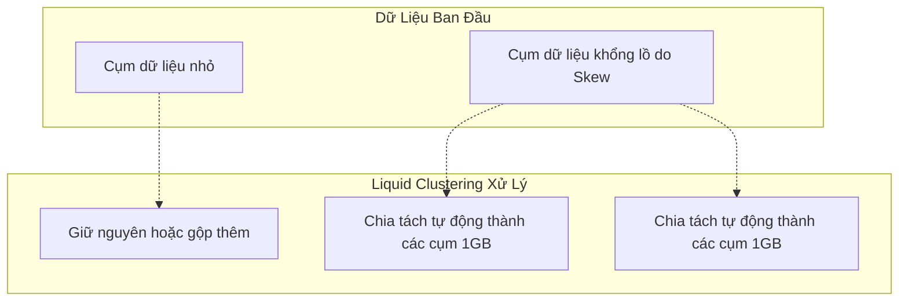

Trong nhiều năm, Data Engineer phải vật lộn với hai lựa chọn khó khăn khi thiết kế bảng dữ liệu lớn:
1. Dùng **Hive Partitioning**: Dễ sinh ra hàng triệu tệp nhỏ (Small files) và bị lệch dữ liệu (Data skew) nếu chọn sai cột.
2. Dùng **Z-Ordering**: Tránh được lệch dữ liệu nhưng tốn chi phí khổng lồ để tính toán lại (`OPTIMIZE`) và dữ liệu mau chóng bị phân rã (decay) khi có dữ liệu mới nạp vào.

Để giải quyết bài toán này một lần và mãi mãi, Databricks đã giới thiệu **Liquid Clustering** cho Delta Lake. Đây không chỉ là một bản vá, mà là một sự thay đổi hoàn toàn kiến trúc lưu trữ vật lý của bảng dữ liệu.

## 1. Liquid Clustering Hoạt Động Như Thế Nào?

Liquid Clustering vứt bỏ hoàn toàn khái niệm "Thư mục vật lý" (Physical Directories) của Hive Partitioning. 

Thay vì chia tệp vào các thư mục `year=2023/month=10/`, Liquid Clustering lưu **toàn bộ tệp vào một không gian phẳng (flat namespace)**. Ở tầng logic, hệ thống sử dụng thuật toán Clustering nâng cao (dựa trên *Hilbert Curve* - một phiên bản tối ưu hơn của Z-Order) để liên tục nhóm các bản ghi có giá trị giống nhau vào chung một tệp Parquet.

Điểm "Liquid" (chất lỏng) ở đây có nghĩa là: **Tính linh hoạt**. Kích thước và ranh giới của các cụm dữ liệu không bị cố định cứng nhắc mà có thể tự động co giãn, phân tách hoặc gộp lại tùy theo lượng dữ liệu được nạp vào.

### Cơ Chế Auto-Balancing (Tự Cân Bằng)



Với Partitioning, nếu phân vùng `ThànhPhố = HCM` có 100GB dữ liệu, nó sẽ nằm chết trong một thư mục khổng lồ. Nếu `ThànhPhố = CầnThơ` có 10KB, nó vẫn tạo ra một thư mục riêng biệt. 
Với Liquid Clustering, Databricks tự động nhận diện "Cụm HCM quá to" và tự động xé nó ra thành 100 tệp Parquet có kích thước tối ưu (ví dụ 1GB/tệp). Cụm "Cần Thơ" quá nhỏ sẽ được ghép chung tệp với các tỉnh miền Tây lân cận (theo đường cong Hilbert) để tránh lỗi tệp nhỏ.

## 2. Liquid Clustering vs Partitioning vs Z-Order

| Tiêu Chí | Hive Partitioning | Z-Ordering | Liquid Clustering |
| :--- | :--- | :--- | :--- |
| **Bố cục vật lý** | Thư mục lồng nhau (`/k=v/`) | Không gian phẳng | Không gian phẳng |
| **Lệch dữ liệu (Skew)** | Bị ảnh hưởng nặng nề. | Không bị ảnh hưởng. | **Hoàn toàn tự động cân bằng.** |
| **Cardinality** | Chỉ dùng được với Cardinality THẤP. | Dùng được với Cardinality CAO. | **Dùng tốt với MỌI Cardinality.** |
| **Chi phí bảo trì** | Thấp (Dữ liệu ghi thẳng vào thư mục). | Cực Cao (Phải xáo trộn toàn bộ bảng). | **Rất Thấp (Tối ưu hóa tăng dần - Incremental).** |
| **Sự phân rã (Decay)** | Không bị phân rã (ghi vào là chuẩn luôn). | Phân rã nhanh khi có dữ liệu mới. | **Không bị phân rã (Dữ liệu mới được gom cụm ngay lúc ghi - Write-time clustering).** |
| **Thay đổi cấu trúc** | Không thể. Phải đập đi xây lại toàn bộ bảng. | Chạy lại lệnh OPTIMIZE toàn bảng tốn kém. | **Chỉ cần đổi lệnh. Tự động áp dụng cho dữ liệu mới, không ép viết lại dữ liệu cũ.** |

## 3. Tại Sao Liquid Lại Rẻ Hơn Z-Order Rất Nhiều?

Vấn đề lớn nhất của Z-Order là **Write Amplification** (Khuếch đại ghi). Mỗi lần bạn chạy `OPTIMIZE ZORDER BY`, hệ thống gần như phải đọc toàn bộ bảng, tính toán lại đường cong Z và viết đè lại toàn bộ tệp. 

Ngược lại, Liquid Clustering sở hữu hai vũ khí tối thượng:

1. **Write-Time Clustering:** Ngay tại thời điểm bạn chạy lệnh `INSERT` hoặc `MERGE`, dữ liệu mới đã được Spark cố gắng gom cụm sẵn trên bộ nhớ (RAM) trước khi ghi xuống đĩa. Tính ngăn nắp được giữ ngay từ đầu.
2. **Incremental OPTIMIZE:** Khi bạn chạy lệnh `OPTIMIZE` định kỳ để dọn dẹp các tệp bị phân mảnh, thuật toán Liquid Clustering đủ thông minh để **chỉ chọn ra những tệp nào đang bị lộn xộn (unclustered)** để viết lại. Tệp nào đã ngoan ngoãn nằm đúng cụm rồi thì sẽ bị bỏ qua. Nhờ vậy, `OPTIMIZE` với Liquid chạy nhanh hơn và tốn ít DBU (tiền compute) hơn Z-Order gấp nhiều lần.

## 4. Cách Sử Dụng Liquid Clustering Trong Thực Tế

Cú pháp cực kỳ đơn giản và trực quan. Bạn sử dụng từ khóa `CLUSTER BY` khi tạo bảng:

```sql
-- Tạo bảng mới với Liquid Clustering
CREATE TABLE events (
  id STRING,
  user_id STRING,
  event_time TIMESTAMP,
  event_type STRING
)
USING DELTA
CLUSTER BY (user_id, event_time);
```

### Thay Đổi Cột Tối Ưu (Evolving Clustering)
Giả sử 6 tháng sau, yêu cầu kinh doanh thay đổi. Bạn không muốn truy vấn theo `user_id` nữa mà muốn truy vấn theo `event_type`. Với Partitioning, đây là dấu chấm hết. Với Liquid, bạn chỉ cần một câu lệnh:

```sql
ALTER TABLE events CLUSTER BY (event_type, event_time);
```
Điều kỳ diệu là lệnh này **chạy xong ngay lập tức**. Nó không hề viết lại hàng Petabyte dữ liệu cũ! Nó chỉ báo cho hệ thống biết rằng: "Từ giờ trở đi, các luồng dữ liệu `INSERT` mới hãy gom cụm theo `event_type` nhé". Các dữ liệu cũ sẽ từ từ được chuyển đổi (re-clustered) trong những lần bạn chạy lệnh `OPTIMIZE` tiếp theo.

## 5. Khi Nào KHÔNG Nên Dùng Liquid Clustering?

Mặc dù Databricks khuyến nghị Liquid Clustering là "Tiêu chuẩn mặc định mới" cho mọi bảng Delta, vẫn có một số trường hợp ngoại lệ:

1. **Tương thích hệ thống cũ (Legacy Compatibility):** Nếu bạn có một bảng Delta Lake mà nhiều hệ thống cũ (như Hive, PrestoDB phiên bản cũ không hiểu Liquid Protocol, Athena cũ) cùng truy cập, bạn buộc phải dùng Hive Partitioning truyền thống vì các engine đó dựa vào đường dẫn thư mục để đọc dữ liệu.
2. **Kích thước bảng quá nhỏ:** Nếu bảng của bạn chỉ có vài trăm Megabyte hoặc vài Gigabyte, việc cài đặt Liquid Clustering là không cần thiết. Đơn giản là dữ liệu quá nhỏ, quét toàn bộ bảng (Full Scan) cũng chỉ mất vài giây.

## 6. Tổng Kết

Liquid Clustering đại diện cho triết lý thiết kế hiện đại của Data Engineering: **"Đẩy độ phức tạp cho hệ thống, giải phóng con người"**. Bằng cách loại bỏ cấu trúc thư mục tĩnh và tự động hóa quá trình gom cụm, nó giúp các kỹ sư dữ liệu thoát khỏi cơn ác mộng cấu hình Partitioning và bảo trì Z-Order, tập trung hoàn toàn vào việc xây dựng logic nghiệp vụ.

---
**Bài viết tiếp theo:**
👉 **[Tối ưu hóa bảng trong Databricks: OPTIMIZE & VACUUM hoạt động như thế nào?](/concepts/3-storage-engines-formats/delta-optimize-vacuum/)**
