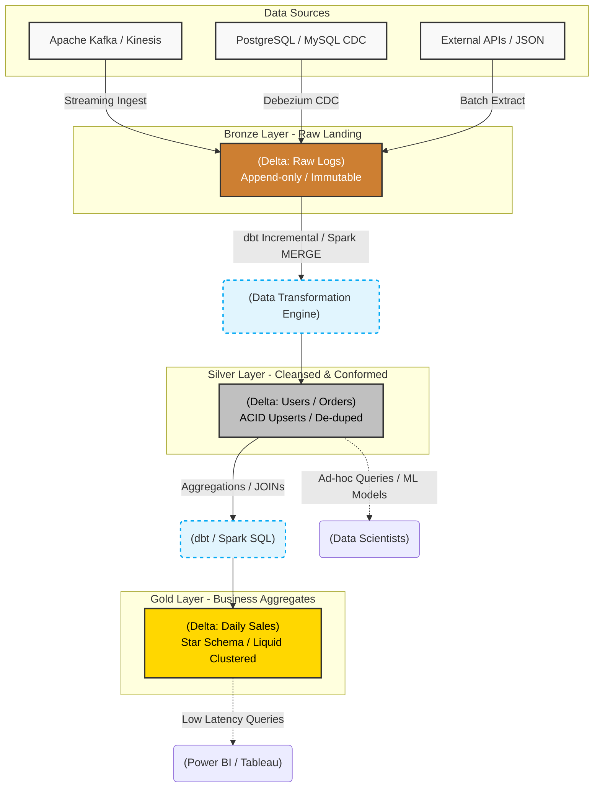

Lưu trữ dữ liệu vào Data Lake với hy vọng "Schema-on-read" sẽ giải quyết mọi bài toán phân tích đã được chứng minh là một sai lầm kiến trúc (Architectural Anti-pattern). Thiếu vắng tính toàn vẹn giao dịch (ACID) và kiểm soát chất lượng, Data Lake nhanh chóng thoái hóa thành **Data Swamp (Đầm lầy dữ liệu)**.

**Kiến trúc Medallion** (Bronze - Silver - Gold) được Databricks đề xuất như một Design Pattern tiêu chuẩn cho Data Lakehouse. Tuy nhiên, dưới góc độ của một **Staff Data Engineer**, Medallion không chỉ là việc tạo ra 3 cái thư mục logic trên S3/GCS. Nó là một pipeline **State Machine**, trong đó dữ liệu được luân chuyển, thay đổi trạng thái, làm sạch và tối ưu hóa layout vật lý qua từng giai đoạn. 

---

## 1. Kiến trúc Thực thi Vật lý (Physical Execution)

Trên thực tế, Kiến trúc Medallion hoạt động dựa trên các định dạng bảng mở (Open Table Formats) như Delta Lake hoặc Apache Iceberg, kết hợp với các công cụ biến đổi dữ liệu phân tán như **dbt (data build tool)** hoặc Apache Spark.



---

## 2. Đi sâu vào từng Layer: Code và Systemic Trade-offs

### 2.1. Bronze Layer: Bức tường lửa của sự thật (Immutable Landing)

Bronze layer không phải là bãi rác. Nó là điểm hạ cánh bảo toàn toàn bộ lịch sử (Historical Archive) và trạng thái thô nguyên bản nhất từ hệ thống nguồn.

-   **Đặc tính kỹ thuật:** `Append-only`. Tuyệt đối không thực hiện Update/Delete ở lớp này. Hệ thống chỉ ghi đè lên ở cuối file (Sequential Write).
-   **Systemic Trade-offs (Đánh đổi hệ thống):**
    -   **Storage Cost vs. Auditability:** Việc lưu trữ mọi payload thô vĩnh viễn tiêu tốn Storage Cost rất lớn (Storage Duplication). Bù lại, bạn có khả năng "Time Travel" và **Re-process** (chạy lại toàn bộ logic pipeline từ đầu) nếu phát hiện lỗi logic ở lớp Silver/Gold. Storage trên S3 rất rẻ, sự đánh đổi này là hoàn toàn xứng đáng.

### 2.2. Silver Layer: Single Source of Truth (SSOT)

Dữ liệu di chuyển từ Bronze sang Silver phải trải qua quá trình khắt khe: Schema Enforcement (ép kiểu cứng), Data Cleansing (loại Null/Invalid), và Deduplication (khử trùng lặp).

-   **Đặc tính kỹ thuật:** Hỗ trợ CRUD thông qua ACID Transactions. Xử lý Slowly Changing Dimensions (SCD Type 1/2) và Upserts.

**Thực chiến với dbt Incremental Materialization:**
Thay vì load lại (Full Refresh) hàng Terabyte dữ liệu mỗi ngày, Kỹ sư dữ liệu sử dụng chiến lược `incremental` của dbt để chỉ xử lý các dòng dữ liệu mới.

```sql
-- dbt model: models/silver/slv_orders.sql
{{ config(
    materialized='incremental',
    unique_key='order_id',
    incremental_strategy='merge',
    file_format='delta'
) }}

WITH source AS (
    SELECT 
        CAST(json_extract_path_text(raw_payload, 'order_id') AS STRING) AS order_id,
        CAST(json_extract_path_text(raw_payload, 'amount') AS DECIMAL(10,2)) AS amount,
        CAST(json_extract_path_text(raw_payload, 'status') AS STRING) AS status,
        _ingest_timestamp
    FROM {{ source('bronze', 'raw_orders') }}
)
SELECT * FROM source

    -- Systemic Trade-off: Lookback Window vs Performance
    -- Xử lý Late-Arriving Data bằng cách lùi lại 3 ngày (lookback window), 
    -- thay vì chỉ lấy đúng MAX(timestamp) để tránh mất mát dữ liệu do network delay.
    WHERE _ingest_timestamp >= (
        SELECT MAX(_ingest_timestamp) - INTERVAL 3 DAYS FROM {{ this }}
    )

-- Deduplication logic in case of CDC retries
QUALIFY ROW_NUMBER() OVER (PARTITION BY order_id ORDER BY _ingest_timestamp DESC) = 1
```

### 2.3. Gold Layer: Tiêu thụ độ trễ thấp (Low-Latency Consumption)

Gold layer chứa dữ liệu đã được **Aggregated** (tổng hợp), **Denormalized** (phi chuẩn hóa - Star Schema), và sẵn sàng phục vụ cho các BI Dashboard yêu cầu SLA phản hồi dưới 1 giây.

-   **Đặc tính kỹ thuật:** Read-heavy. Hạn chế tối đa các phép `JOIN` phức tạp khi truy vấn. 
-   **Physical Layout:** Tối ưu hóa cực độ cho việc đọc. Databricks sử dụng **Liquid Clustering** thay thế cho kỹ thuật Partitioning và Z-Ordering cũ kỹ.

```sql
-- Tạo Gold table sử dụng Liquid Clustering trên Delta Lake
CREATE TABLE gold.daily_sales_by_region (
    region_id STRING,
    sales_date DATE,
    total_revenue DECIMAL(18,2)
)
USING DELTA
-- Không dùng PARTITIONED BY, sử dụng CLUSTER BY cho phép lọc đa chiều linh hoạt
CLUSTER BY (region_id, sales_date);

-- Hệ thống tự động Re-cluster dưới nền để chống phân mảnh I/O
OPTIMIZE gold.daily_sales_by_region;
```

---

## 3. Đánh Đổi Hệ Thống (Systemic Trade-offs) & Operational Risks

Kiến trúc Medallion là một mẫu thiết kế thanh lịch, nhưng vận hành nó trên production chứa đầy cạm bẫy.

### 3.1. Multi-hop Latency vs. Data Governance
-   **Trade-off:** Việc đẩy dữ liệu tuần tự qua 3 chặng (Bronze $\rightarrow$ Silver $\rightarrow$ Gold) tạo ra **Độ trễ tích lũy (Cumulative Latency)**. Nếu mỗi chặng chạy batch 15 phút, dữ liệu lên Dashboard sẽ trễ ít nhất 45 phút.
-   **Hệ quả:** Nếu Business yêu cầu Real-time Analytics (độ trễ 1 giây), Medallion Batch Pipeline sẽ sụp đổ. Bạn phải dùng Streaming E2E (Spark Structured Streaming) hoặc bỏ qua Silver layer (Direct Bronze to Gold) cho các Use-cases đặc thù.

### 3.2. Rủi ro Tràn Bộ Nhớ (OOMKilled) và Shuffle Spill
Khi chạy dbt/Spark để merge dữ liệu từ Bronze lên Silver, nếu kích thước dữ liệu cập nhật quá lớn (ví dụ Backfill 1 năm dữ liệu), Join logic sẽ gây ra **Shuffle Spill** xuống đĩa cứng cục bộ.
-   **Hậu quả:** Node xử lý cạn kiệt Disk Space hoặc RAM, bị YARN/Kubernetes chém chết (OOMKilled - Exit code 137).
-   **Khắc phục:** Không bao giờ chạy Incremental Merge mù quáng cho một khối lượng dữ liệu khổng lồ. Sử dụng `--full-refresh` kết hợp với việc tạm thời tăng RAM Cluster (Vertical Scaling) cho các đợt Backfill lớn.

### 3.3. Phân mảnh file nhỏ (The Small File Problem)
Việc ghi Streaming hoặc chạy dbt incremental liên tục mỗi phút vào Bronze/Silver sẽ tạo ra hàng vạn file Parquet có kích thước tí hon (vài KB). 
-   **Hậu quả:** BI tool truy vấn lớp Gold sẽ bị treo vì I/O Overhead để đọc Metadata List của hàng nghìn file trên S3 quá lớn.
-   **Khắc phục:** Bắt buộc chạy các Job `OPTIMIZE` định kỳ (Bin-packing) hoặc bật tính năng `Auto Optimize` của Databricks Delta để gom các file nhỏ thành các block 1GB.

---

## Nguồn Tham Khảo
1.  **What is a Medallion Architecture?** - *Databricks Official*.
2.  **Liquid Clustering for Delta Lake** - *Databricks Engineering Blog*.
3.  **dbt Incremental Models Best Practices** - *dbt Labs Documentation*.
4.  *Designing Data-Intensive Applications (Chapter 10: Batch Processing, Chapter 11: Stream Processing) - Martin Kleppmann*
