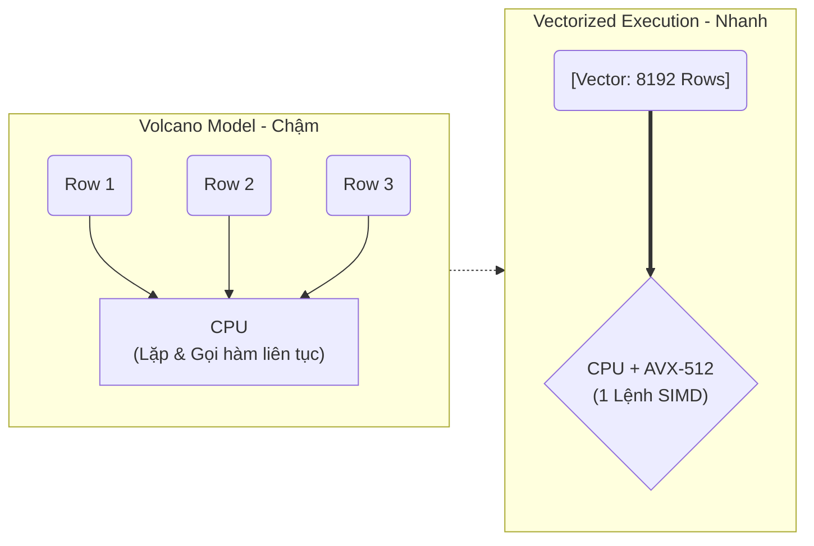
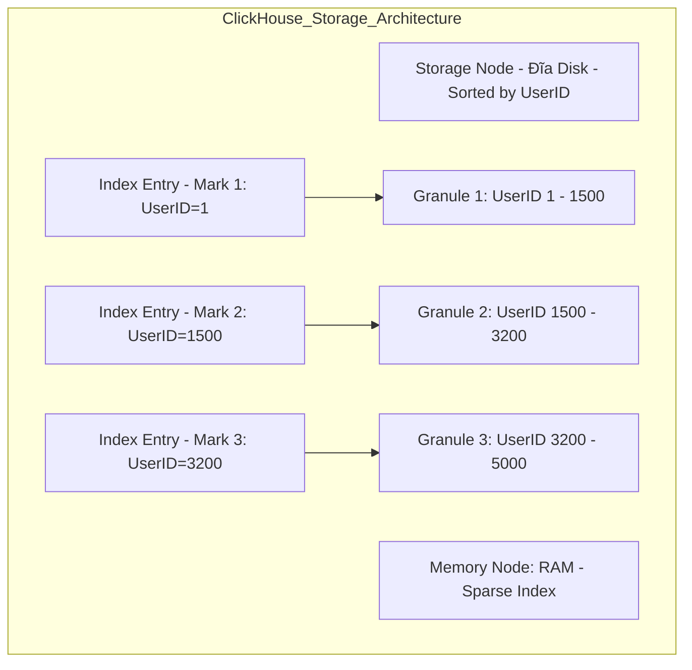

Các định nghĩa sách giáo khoa thường mô tả OLAP (Online Analytical Processing) bằng mô hình Khối đa chiều (OLAP Cubes), Roll-up, Drill-down. Tuy nhiên, dưới góc nhìn của một Kỹ sư Hệ thống (Staff Data/Platform Engineer), OLAP là bài toán tối ưu hóa phần cứng tận cùng: **Làm sao để vắt kiệt băng thông I/O của đĩa và tận dụng tối đa các tập lệnh SIMD của CPU đa nhân?**

Bài viết này mổ xẻ kiến trúc vật lý bên dưới các hệ thống OLAP hiện đại (như ClickHouse, Snowflake, Apache Druid, Databricks), sự đánh đổi (Systemic Trade-offs), và các tình huống sập hệ thống (Production Incidents).

---

## 1. Kiến trúc Thực thi Vật lý (Physical Execution)

Sức mạnh của một OLAP Engine hiện đại như ClickHouse hay Snowflake đến từ sự kết hợp của hai trụ cột: **Columnar Storage** (tối ưu Disk I/O) và **Vectorized Execution** (tối ưu CPU Compute).

### 1.1. Columnar Storage (Lưu trữ hướng cột)

Trong OLTP (như PostgreSQL, MySQL), dữ liệu được lưu theo dòng (Row-based). Khi bạn chạy `SELECT SUM(revenue) FROM sales`, Database vẫn phải đọc toàn bộ các cột khác (tên, ngày, ID, v.v.) từ đĩa cứng (Disk) lên RAM. Điều này gây lãng phí băng thông (I/O Amplification) khổng lồ.

Hệ thống OLAP lưu trữ mỗi cột thành một file (hoặc một Block vật lý) riêng biệt. 
- **I/O Pruning (Lược bỏ I/O):** Engine chỉ đọc chính xác các file chứa cột cần thiết.
- **Data Compression (Nén dữ liệu mật độ cao):** Vì dữ liệu trong một cột có cùng một kiểu dữ liệu (ví dụ: `Int32` cho tuổi), các thuật toán nén như Run-Length Encoding (RLE), Dictionary Encoding, ZSTD hoặc Delta Encoding hoạt động cực kỳ hiệu quả. Nó nén dữ liệu nhỏ lại 5x - 10x so với Row-based. Dung lượng nhỏ hơn $\rightarrow$ I/O đọc lên RAM nhanh hơn.

### 1.2. Vectorized Execution (SIMD) vs Volcano Iterator

Các Database truyền thống thường dùng mô hình **Volcano Iterator**: Xử lý từng dòng (Row-by-Row). Với một tỷ dòng, Engine phải gọi hàm ảo `next()` một tỷ lần. Overhead của việc gọi hàm và rẽ nhánh (Branching) khiến CPU Cache bị "nghẽn" (Cache Misses).

OLAP Engine hiện đại dùng **Vectorized Execution** (Thực thi Vector hóa):
- Dữ liệu được đọc và xử lý theo từng khối (Batch/Vector), thường từ 1,024 đến 65,536 giá trị cùng lúc.
- Khai thác tập lệnh **SIMD (Single Instruction, Multiple Data)** của CPU hiện đại (AVX2, AVX-512). Nghĩa là, CPU có thể thực hiện lệnh `ADD` (cộng) 16 số nguyên 32-bit trong một chu kỳ xung nhịp (Clock Cycle) duy nhất thay vì tốn 16 chu kỳ như bình thường.



---

## 2. Tối ưu hóa Truy xuất (Retrieval Optimizations)

### 2.1. Sparse Index (Chỉ mục thưa) trong ClickHouse

Nếu hệ thống OLTP dùng B-Tree (Dense Index - mỗi dòng một Entry) khiến Index phình to đến mức không thể chứa trong RAM, thì ClickHouse dùng **Sparse Index (Chỉ mục thưa)** kết hợp vật lý sắp xếp (Sorted Data).

ClickHouse chia dữ liệu thành các **Granules** (Mặc định 8,192 rows/granule). Index trên RAM chỉ lưu trữ **Mark (dấu mốc)** cho dòng đầu tiên của mỗi Granule.



*Cơ chế Query:* Khi User query `WHERE UserID = 2000`, ClickHouse dùng thuật toán Binary Search trên RAM để tìm ra giá trị nằm giữa Mark 2 và Mark 3. Nó sẽ lọc bỏ (Skip) hoàn toàn Granule 1 và 3, chỉ nạp Granule 2 từ đĩa cứng (Disk) lên RAM (Buffer) và thực hiện SIMD Scan.

**Cấu hình thực chiến (ClickHouse `MergeTree`):**
```sql
CREATE TABLE events (
    event_time DateTime,
    user_id UInt64,
    event_type String,
    revenue Float64
) ENGINE = MergeTree()
-- Xác định cấu trúc Sparse Index và thứ tự vật lý lưu trữ trên đĩa
ORDER BY (event_time, user_id) 
-- Điều chỉnh kích thước Vector tùy vào độ phân tán dữ liệu
SETTINGS index_granularity = 8192;
```

### 2.2. Sự Đánh Đổi: Late vs Early Materialization

- **Early Materialization (Gắn kết sớm):** Đọc toàn bộ các cột liên quan lên RAM ngay từ bước Filter. Nếu truy vấn có tính chọn lọc cao (VD: `WHERE age > 90`), việc này cực kỳ lãng phí RAM.
- **Selective Late Materialization (Gắn kết muộn):** Engine chỉ thực thi SIMD filter trên file chứa cột `age`. Sau khi tìm ra tập RowIDs hợp lệ (những người `age > 90`), nó mới "materialize" (gắn kết) cột `revenue` để tính toán. Giảm băng thông bộ nhớ khủng khiếp.

### 2.3. Z-Ordering vs Liquid Clustering

Khi dữ liệu lên đến hàng trăm Terabyte (như trong Databricks, Snowflake), việc lọc dữ liệu (Data Skipping) phụ thuộc vào cách dữ liệu được Gom cụm (Clustering).

- **Z-Ordering (Snowflake / Databricks):** Áp dụng đường cong không gian (Space-filling curves) để sắp xếp dữ liệu đa chiều (ví dụ `user_id` và `event_time`) thành một chiều vật lý. Cực kỳ tốt để Data Skipping trên nhiều cột cùng lúc.
  - **Trade-off (Đánh đổi):** Tốn rất nhiều Disk I/O và Compute (CPU) để chạy lệnh `OPTIMIZE ... ZORDER BY`. Phải ghi đè (Rewrite) các file Parquet nặng nề để sắp xếp lại dữ liệu khi có Ingestion mới.
- **Liquid Clustering (Databricks 2024+):** Thay thế Z-Ordering cứng nhắc. Cung cấp khả năng gom cụm tăng dần (Incremental), tránh việc viết lại toàn bộ file lịch sử. Tự động điều chỉnh (Auto-tuning) dựa trên mẫu truy vấn nền.

---

## 3. Rủi ro Vận hành & Real-world Incidents

Là Kỹ sư Hệ thống, bạn phải chuẩn bị cho những thảm họa (Disasters) khi User chạy các truy vấn "ngáo" [Bad queries].

### Incident 1: OOMKilled do Cartesian Explosion trong Hash Joins

Hệ thống OLAP phân tán (như Trino, Presto, Snowflake) cực kỳ nhạy cảm với các cú `JOIN` không có ràng buộc chặt chẽ.
- **Hiện tượng:** Truy vấn bị treo 30 phút, sau đó Node Worker chết đơ do Out-Of-Memory (JVM OOMKilled).
- **Nguyên nhân cốt lõi (Root Cause):** Khác với OLTP dùng Nested Loop Join, OLAP thường dùng **Hash Join**. Worker Node sẽ đẩy toàn bộ bảng nhỏ (Build Table) vào RAM để tạo Hash Table. Nếu cả 2 bảng đều quá lớn và khóa Join bị Data Skew (lệch dữ liệu cực lớn), RAM sẽ phình to tức thì. Nếu có các bản ghi trùng lặp (Duplicate Keys) ở cả 2 bên (M:N), nó tạo ra **Cartesian Explosion** (Bùng nổ tổ hợp, sinh ra hàng tỷ dòng rác trong RAM).
- **Cách khắc phục & Trade-off (FinOps):**
  - **Bật tính năng Spill-to-disk:** Chấp nhận giảm Throughput (tăng Latency) bằng cách cho phép Engine xả dữ liệu trung gian từ RAM xuống đĩa cứng (SSD NVMe) để giữ cho Node không bị sập (Crash).
  - Khử chuẩn (Denormalization) trước bằng dbt / Airflow. Tạo ra One-Big-Table (OBT) thay vì ép hệ thống JOIN on-the-fly. Ở ClickHouse, JOIN là ác mộng, OBT luôn được khuyến nghị.

### Incident 2: High Cardinality `GROUP BY` Bottlenecks

- **Hiện tượng:** Truy vấn `SELECT user_id, COUNT(DISTINCT session_id) GROUP BY user_id` chạy quét toàn cụm và OOM.
- **Nguyên nhân:** Cả `user_id` và `session_id` đều có Cardinality (Độ phân tán) cực cao (Hàng tỷ giá trị độc nhất). Để đếm chính xác, Engine phải duy trì một Hash Set khổng lồ trong RAM cho từng User. 
- **Cách khắc phục (Probabilistic Data Structures):**
  - Sử dụng thuật toán xấp xỉ (Approximate Algorithms) nếu User (Ví dụ: BI Analyst) chỉ cần nhìn xu hướng, không cần độ chính xác tuyệt đối 100%. 
  - Trong Snowflake/ClickHouse, dùng hàm dựa trên **HyperLogLog (HLL)** (VD: `uniqCombined` trong ClickHouse, `APPROX_COUNT_DISTINCT` trong Snowflake). HLL chỉ tốn vài Kilobytes RAM để ước lượng số lượng phần tử khác nhau trên hàng tỷ dòng với sai số rất nhỏ (~1-2%), giải quyết hoàn toàn rủi ro sập RAM.

---

## 4. ClickHouse vs Snowflake: Kiến trúc & Đánh đổi

| Yếu tố | ClickHouse (Levers-heavy) |" Snowflake (Abstraction-heavy) "|
| :--- | :--- | :--- |
| **Bản chất kiến trúc** | Trọng tâm vào hiệu năng thuần (Raw Speed), Real-time Ingestion. Phải tự tối ưu hóa. |" SaaS Managed. Tách rời hoàn toàn Storage (S3) và Compute (Virtual Warehouses). "|
|" **Quản trị (Ops)** "| Data Engineer phải tự điều chỉnh Compression Codec, Sparse Index (`ORDER BY`), Sharding. |" Giao quyền cho hệ thống. Snowflake tự động quản lý Micro-partitions, Z-Ordering (Clustering). "|
| **Use Case tốt nhất** | Real-time Logs, Time-series, IoT (Vắt kiệt hiệu năng với OBT). | Enterprise Data Warehouse, BI Reporting, Schema mềm dẻo. |

---

## Nguồn Tham Khảo
* [ClickHouse Architecture: A Fast Analytical Database](https://clickhouse.com/docs/en/architecture)
* [Vectorized Execution and Late Materialization in Analytical Databases (Research)](https://ceur-ws.org/)
* [Databricks Liquid Clustering vs Z-Ordering](https://docs.databricks.com/en/delta/clustering.html)
* *Designing Data-Intensive Applications* (Martin Kleppmann) - Chapter 3: Storage and Retrieval (Column-Oriented Storage).
