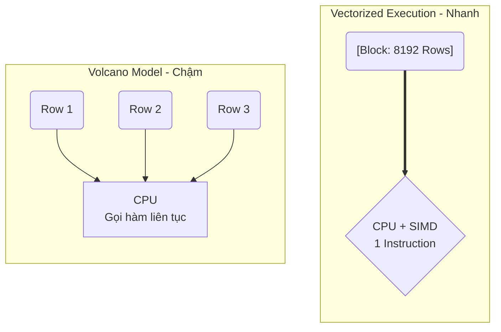

Các định nghĩa sách giáo khoa thường mô tả OLAP (Online Analytical Processing) bằng mô hình Khối đa chiều (OLAP Cubes), Roll-up, Drill-down. Tuy nhiên, dưới góc nhìn của một Kỹ sư Hệ thống (Data/Platform Engineer), OLAP là bài toán tối ưu hóa phần cứng: **Làm sao để vắt kiệt băng thông I/O của đĩa và tận dụng tối đa các tập lệnh SIMD của CPU?**

Bài viết này mổ xẻ kiến trúc vật lý bên dưới các hệ thống OLAP hiện đại (như ClickHouse, Databricks, Apache Druid, Snowflake), sự đánh đổi (trade-offs) hệ thống, và các tình huống sập hệ thống thực tế (Incidents).

---

## 1. Kiến trúc Thực thi Vật lý (Physical Execution)

Sức mạnh của một OLAP Engine hiện đại như ClickHouse hay DuckDB đến từ sự kết hợp của hai trụ cột: **Columnar Storage** (tối ưu I/O) và **Vectorized Execution** (tối ưu CPU).

### 1.1. Columnar Storage (Lưu trữ hướng cột)

Trong OLTP (như PostgreSQL, MySQL), dữ liệu được lưu theo dòng (Row-based). Khi bạn chạy `SELECT SUM(doanh_thu) FROM sales`, DB vẫn phải đọc toàn bộ các cột khác (tên, ngày, ID, v.v.) từ đĩa lên RAM. 

Hệ thống OLAP lưu trữ mỗi cột thành một file (hoặc một block vật lý) riêng biệt. 
- **Giảm thiểu I/O (I/O Pruning):** Engine chỉ đọc chính xác các file chứa cột cần thiết.
- **Nén dữ liệu (Compression):** Vì dữ liệu trong một cột có cùng kiểu (ví dụ: `Int32` cho tuổi), các thuật toán nén như Run-Length Encoding (RLE), Dictionary, ZSTD hoặc Delta Encoding hoạt động cực kỳ hiệu quả, nén dữ liệu nhỏ lại 5x - 10x so với Row-based.

### 1.2. Vectorized Execution vs Volcano Iterator

Các DB truyền thống thường dùng mô hình **Volcano Iterator**: xử lý từng dòng (Row-by-Row). Với một tỷ dòng, Engine phải gọi hàm `next()` một tỷ lần. Overhead của việc gọi hàm ảo (virtual function calls) và rẽ nhánh (branching) khiến CPU bị "nghẽn".

OLAP Engine hiện đại dùng **Vectorized Execution** (Thực thi Vector hóa):
- Dữ liệu được xử lý theo từng khối (Batch/Block), thường từ 1,024 đến 65,536 giá trị cùng lúc.
- Khai thác tập lệnh **SIMD (Single Instruction, Multiple Data)** của CPU hiện đại (AVX-512). CPU có thể cộng 16 số nguyên 32-bit trong một chu kỳ xung nhịp (clock cycle) duy nhất thay vì 16 chu kỳ.



---

## 2. Tối ưu hóa Truy xuất (Retrieval Optimizations)

### 2.1. Sparse Index (Chỉ mục thưa) trong ClickHouse

Nếu OLTP dùng B-Tree (Dense Index - mỗi dòng một entry) khiến Index phình to đến mức không thể chứa trong RAM, thì ClickHouse dùng **Sparse Index (Chỉ mục thưa)** kết hợp vật lý sắp xếp (Sorted Data).

ClickHouse chia dữ liệu thành các **Granules** (Mặc định 8,192 rows/granule). Index chỉ lưu trữ **Mark (dấu mốc)** cho dòng đầu tiên của mỗi granule.


*Khi query `WHERE UserID = 2000`, ClickHouse dùng Binary Search trên RAM để tìm ra giá trị nằm giữa Mark 2 và Mark 3. Nó sẽ bỏ qua (Skip) Granule 1 và 3, chỉ load Granule 2 từ đĩa lên.*

**Cấu hình thực chiến (ClickHouse):**
```sql
CREATE TABLE events (
    event_time DateTime,
    user_id UInt64,
    event_type String
) ENGINE = MergeTree()
-- Xác định cấu trúc Sparse Index và vật lý lưu trữ trên đĩa
ORDER BY (event_time, user_id) 
-- Điều chỉnh Granule size nếu cần (mặc định 8192)
SETTINGS index_granularity = 8192; 
```

### 2.2. Z-Ordering vs Liquid Clustering (Databricks)

Khi dữ liệu lớn, việc "Data Skipping" (lọc bỏ các block không cần thiết) phụ thuộc vào cách dữ liệu được gom cụm.

- **Z-Ordering:** Áp dụng đường cong không gian (Space-filling curves) để sắp xếp dữ liệu đa chiều (multi-dimensions) thành một chiều vật lý. Cực kỳ tốt để data skipping trên nhiều cột, nhưng **Trade-off** là tốn rất nhiều I/O và Compute để chạy lại lệnh `OPTIMIZE ... ZORDER BY` khi có dữ liệu mới (Ghi đè file nặng nề).
- **Liquid Clustering (Delta Lake mới):** Thay thế Z-Ordering và Partitioning truyền thống. Cung cấp khả năng gom cụm tăng dần (Incremental), tránh việc viết lại toàn bộ file.

```sql
-- Thay vì dùng Z-Ordering cứng nhắc, Liquid Clustering linh hoạt hơn
CREATE TABLE sales (
    date DATE,
    store_id STRING,
    amount DOUBLE
) USING DELTA
CLUSTER BY (date, store_id); -- Hỗ trợ tối đa 4 cột để tránh pha loãng hiệu suất
```
**Trade-off:** Liquid Clustering linh hoạt cho Write/Merge, nhưng nếu table quá nhỏ (< 1TB), overhead của cơ chế này không đáng kể, có thể trở thành "dao mổ trâu giết gà".

### 2.3. Selective Late Materialization

Trong OLAP, **Early Materialization** (Load toàn bộ các cột cần thiết từ đầu) có thể gây tràn RAM và lãng phí I/O nếu truy vấn có tính chọn lọc cao (VD: `WHERE age > 90`). 
Các hệ thống tân tiến sử dụng **Late Materialization**: Engine chỉ xử lý trên các file nén / vector của cột được filter trước. Chỉ khi tìm ra tập RowIDs hợp lệ (những người `age > 90`), nó mới "materialize" (gắn kết) các cột còn lại để trả về cho User.

---

## 3. Rủi ro Vận hành & Real-world Incidents

Dưới đây là các tình huống sập hệ thống (Incidents) thường gặp khi vận hành OLAP quy mô lớn.

### Incident 1: Cartesian Explosion & OOMKilled trong JOINs

Hệ thống OLAP phân tán (như Presto, Trino) cực kỳ nhạy cảm với các cú `JOIN` lớn.
- **Hiện tượng:** Truy vấn bị treo, sau đó node Worker chết do Out-Of-Memory (JVM OOMKilled).
- **Nguyên nhân cốt lõi (Root Cause):** Khác với OLTP dùng Nested Loop Join, OLAP thường dùng **Hash Join**. Node sẽ đẩy toàn bộ bảng nhỏ (Build table) vào RAM để tạo Hash Table. Nếu cả 2 bảng đều quá lớn và key bị Data Skew (lệch dữ liệu), RAM sẽ phình to tức thì. Nếu có các key duplicate ở cả 2 bên (M:N), nó tạo ra **Cartesian Explosion** (Bùng nổ dữ liệu tỷ lệ $M \times N$).
- **Cách khắc phục & Trade-off:**
  - Bật tính năng **Spill-to-disk**: Chấp nhận giảm Throughput (tăng Latency) bằng cách cho phép Engine xả dữ liệu trung gian từ RAM xuống đĩa để tránh OOM.
  - Sử dụng **Broadcast Join** cho bảng nhỏ (ép đẩy copy đến mọi node).
  - Khử chuẩn (Denormalization) trước bằng dbt / Spark (tạo One-Big-Table - OBT) thay vì JOIN on-the-fly.

### Incident 2: High Cardinality `GROUP BY` Bottlenecks

- **Hiện tượng:** Truy vấn `SELECT user_id, COUNT(DISTINCT session_id) GROUP BY user_id` chạy quá lâu hoặc OOM.
- **Nguyên nhân:** Cột `user_id` và `session_id` có Cardinality (độ phân tán) cực cao. Để đếm chính xác `COUNT(DISTINCT)`, Engine phải theo dõi chính xác từng ID độc nhất trong RAM bằng Hash Set. 
- **Cách khắc phục:**
  - Sử dụng thuật toán xấp xỉ (Approximate algorithms) nếu không cần độ chính xác 100%. Ví dụ: dùng hàm `uniq` hoặc `uniqCombined` trong ClickHouse (dựa trên thuật toán **HyperLogLog**).
  - HyperLogLog chỉ tốn vài Kilobytes RAM để ước lượng số lượng phần tử khác nhau trên hàng tỷ dòng với sai số rất nhỏ (~1-2%), giải phóng hoàn toàn gánh nặng bộ nhớ.

---

## Nguồn Tham Khảo (References)

* [ClickHouse: Architecture of a Fast Analytical Database](https://clickhouse.com/docs/en/architecture)
* [Vectorized Execution and Late Materialization in Analytical Databases (Research)](https://ceur-ws.org/)
* [Databricks Liquid Clustering vs Z-Ordering](https://docs.databricks.com/en/delta/clustering.html)
* *Designing Data-Intensive Applications* (Martin Kleppmann) - Chapter 3: Storage and Retrieval (Column-Oriented Storage).
* [DuckDB Architecture: Vectorized Query Execution](https://duckdb.org/why_duckdb)
