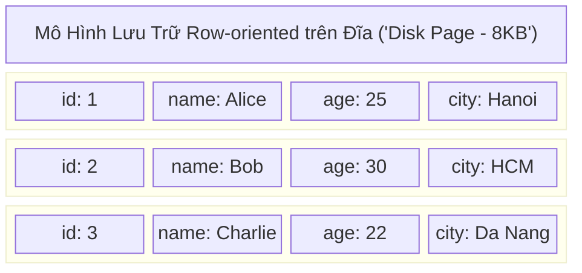
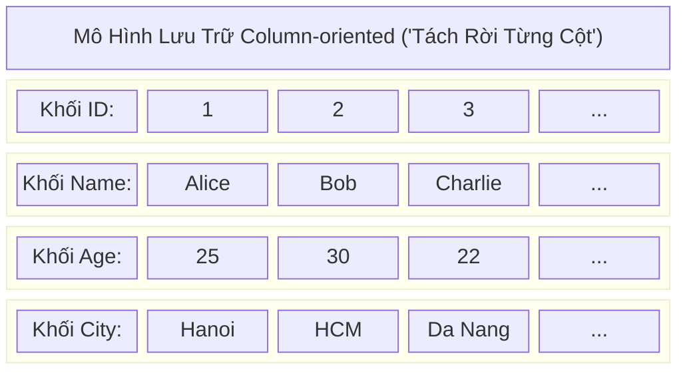
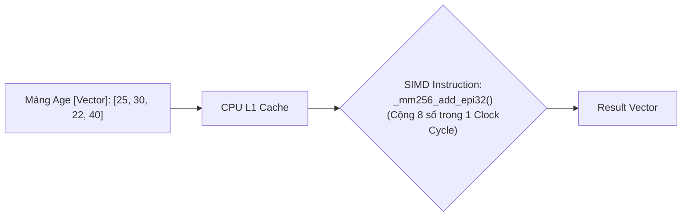

Sự phân định giữa OLTP (Online Transaction Processing) và OLAP (Online Analytical Processing) thường bị hiểu nhầm ở mức độ ứng dụng (Phục vụ người dùng cuối vs. Phục vụ BI/Report). Tuy nhiên, dưới lăng kính của Data Engineering và System Design, cốt lõi của sự khác biệt này nằm ở **Cách dữ liệu được tổ chức lưu trữ vật lý trên đĩa (Disk Layout)**, **Kiến trúc bộ nhớ (Memory Architecture)**, và **Mô hình thực thi truy vấn (Query Execution Model)**.

Bài viết này mổ xẻ sâu vào cơ chế Row-oriented (Lưu trữ hướng dòng) và Column-oriented (Lưu trữ hướng cột), cùng các rủi ro vận hành (Incidents) chí mạng thường gặp trong thực tế.

---

## 1. Row-Oriented Storage (Kiến Trúc OLTP)

Các hệ thống OLTP (như PostgreSQL, MySQL/InnoDB, Oracle) được sinh ra để xử lý hàng vạn giao dịch mỗi giây (High Concurrency) với độ trễ tính bằng mili-giây (Low Latency). 

### 1.1. Kiến Trúc Thực Thi Vật Lý (Physical Execution)

Trong mô hình **Row-oriented**, tất cả các trường (Cột) của một bản ghi (Tuple) được ghi liên tiếp nhau trên cùng một khối dữ liệu vật lý (thường gọi là Page hoặc Block, kích thước tiêu chuẩn 8KB - 16KB).



**Cơ chế hoạt động:**
- **Indexing (B-Tree/B+ Tree):** Hệ thống OLTP duy trì cấu trúc B+ Tree dày đặc. Khi bạn thực hiện `SELECT * FROM Users WHERE id = 2`, B+ Tree (với độ sâu cực thấp) giúp tìm chính xác con trỏ vật lý (Pointer) trỏ đến Page chứa dòng dữ liệu đó.
- **Buffer Pool (Memory Cache):** Cơ sở dữ liệu không đọc từng Byte, nó tải nguyên Page 8KB đó từ Disk lên RAM (Buffer Pool). Vì dữ liệu nằm kề nhau (Contiguous), CPU chỉ cần một thao tác I/O (Cache Hit) để lấy trọn vẹn toàn bộ các cột của User Bob.

### 1.2. Trade-offs Hệ Thống (Sự Đánh Đổi)

- **Điểm mạnh (Fast Random Writes/Reads):** Tối ưu tuyệt đối cho các thao tác CRUD (Create, Read, Update, Delete) theo từng bản ghi riêng lẻ (Point-lookup). Ghi thêm 1 user mới chỉ là thao tác Append vào cuối Page hoặc chèn vào Page đang trống (Free Space Map).
- **Điểm yếu chí mạng (Read / I/O Amplification):** 
  Giả sử Data Analyst chạy một truy vấn phân tích:
  ```sql
  -- Truy vấn OLAP quét toàn bảng
  SELECT AVG(age) FROM Users;
  ```
  Vì đĩa chỉ có thể đọc theo từng khối (Page-level I/O), hệ thống buộc phải tải toàn bộ các Page (chứa hàng GB dữ liệu của `id`, `name`, `city`) từ đĩa lên RAM, chỉ để vứt đi phần lớn dữ liệu và tính toán trên cột `age`. Việc này gây **Khuếch đại I/O (I/O Amplification)** khổng lồ, bóp nghẹt băng thông đĩa (Disk Bandwidth) và băng thông bộ nhớ (Memory Bus).

### 1.3. Rủi Ro Vận Hành Thực Tế (Production Risks)

- **Cache Thrashing (Vỡ Buffer Pool):** Nếu bạn để User chạy một câu lệnh Full Table Scan trên Database OLTP (Ví dụ: BI Tool chọc thẳng vào MySQL), hệ thống sẽ đẩy hàng triệu Page từ Disk lên RAM. Điều này quét sạch các dữ liệu "Nóng" (Hot data - Các Session của người dùng thực) đang nằm trong Buffer Pool (theo cơ chế LRU Eviction). Hậu quả: Toàn bộ App bị khựng lại (Latency Spike), thậm chí sập hệ thống (Out of Memory).
- **Write Amplification (Khuếch đại Ghi):** Trong InnoDB, việc cập nhật một cột chuỗi rất nhỏ cũng đòi hỏi hệ thống phải ghi lại nguyên cả Page 16KB xuống đĩa (Thông qua Doublewrite Buffer để đảm bảo Crash Recovery).

---

## 2. Column-Oriented Storage (Kiến Trúc OLAP)

Để phục vụ các khối lượng dữ liệu khổng lồ (từ hàng Terabyte đến Petabyte) trong Data Warehouse (Snowflake, BigQuery, ClickHouse) hay Data Lakehouse (Parquet, Delta Lake), mô hình **Column-oriented** là bắt buộc.

### 2.1. Kiến Trúc Thực Thi Vật Lý

Thay vì ghi theo dòng, dữ liệu được "Xoay" lại 90 độ. Tất cả các giá trị của **cùng một cột** sẽ được gom lại và ghi liên tiếp nhau thành các File hoặc Block vật lý riêng biệt.



### 2.2. Cơ Chế Tối Ưu Lõi [Core Mechanics]

**1. I/O Pruning (Lược Bỏ I/O) & Data Skipping:**
Khi chạy `SELECT AVG(age) FROM Users`, Engine OLAP sẽ **bỏ qua hoàn toàn** khối ID, Name, và City. Disk I/O giảm theo cấp số nhân (đôi khi từ 100GB xuống chỉ còn vài chục MB). Thay vì dùng B+ Tree nặng nề, OLAP lưu Metadata thống kê nhẹ gọi là **Zone Maps / Statistics** (Min/Max values cho mỗi khối). Nếu Query `WHERE age > 50`, mà khối hiện tại có `Max(age) = 40`, hệ thống sẽ Skip toàn bộ khối đó mà không chạm vào đĩa cứng.

**2. High Compression (Nén Dữ Liệu Tối Đa):**
Vì các giá trị đứng cạnh nhau có cùng kiểu dữ liệu (Homogeneous), các thuật toán nén chuyên dụng phát huy tối đa sức mạnh:
- **Run-length Encoding (RLE):** Chuỗi `['Hanoi', 'Hanoi', 'Hanoi', 'HCM', 'HCM']` nén vật lý thành `[['Hanoi', 3], ('HCM', 2)]`.
- **Dictionary Encoding:** Mã hóa các chuỗi dài thành các số nguyên (Integer) dựa trên bảng từ điển.
*Định luật OLAP:* Dữ liệu nén càng nhỏ $\rightarrow$ I/O đọc từ đĩa càng ít $\rightarrow$ Đẩy lên CPU Cache càng nhanh.

**3. Vectorized Execution (Thực thi SIMD):**
Các hệ thống OLAP hiện đại (ClickHouse, Databricks Photon Engine) từ bỏ mô hình xử lý "Từng-dòng-một" (Volcano Iterator Model) của PostgreSQL/MySQL. Thay vào đó, chúng nạp dữ liệu theo từng **Vector/Batch** (thường là mảng 1024 - 4096 giá trị) để tận dụng tập lệnh SIMD (Single Instruction, Multiple Data - AVX-512) của CPU.



**4. Late Materialization (Vật Chất Hóa Trễ):**
Hệ thống cố gắng duy trì dữ liệu ở dạng cột nén (hoặc các mảng con trỏ RowIDs) càng lâu càng tốt khi đi qua các Node Filter, HASH JOIN. Engine chỉ "Khâu" các cột lại thành cấu trúc dòng đầy đủ (Tuple Reconstruction) ở bước cuối cùng trước khi trả kết quả về cho Client. Việc này tiết kiệm lượng lớn CPU cycles và Memory Bandwidth.

### 2.3. Rủi Ro Vận Hành & Trade-offs (OLAP Incidents)

- **Tuple Reconstruction Penalty (Hình Phạt Khâu Dòng):** Truy xuất một bản ghi đầy đủ `SELECT * FROM Users WHERE id = 1` trong Snowflake/ClickHouse là một cực hình. Hệ thống phải tìm vị trí RowID ở cột ID, sau đó nhảy (Random Seek) sang các file Name, Age, City để "Khâu" chúng lại. Thao tác này tiêu tốn Random I/O khủng khiếp. Đừng bao giờ dùng OLAP làm Backend cho Web App!
- **Small Files Problem (Sự Cố Xé Phân Mảnh):** Vì mô hình cột ghi rất chậm (Phải xé 1 dòng dữ liệu ra nhiều File khác nhau), dữ liệu OLAP thường được ghi theo dạng Append-only (Batching). Nếu bạn dùng Kafka chèn từng dòng (Streaming Insert) mà không nén lại (Compaction Job), hệ thống sẽ sinh ra hàng triệu file Parquet/Part siêu nhỏ. Điều này làm sập NameNode hoặc làm Engine OOMKilled khi cố nạp hàng triệu Metadata Footers.

---

## 3. Tổng Kết: HTAP và Sự Trỗi Dậy của Lakehouse

Sự phân cực kiến trúc tạo ra một "Nỗi đau" lớn trong Data Engineering: Phải duy trì các Pipeline ETL/ELT nặng nề để chuyển dữ liệu từ OLTP [Row] sang OLAP (Column), gây ra độ trễ (Data Latency). Để giải quyết, các hệ thống **HTAP (Hybrid Transactional/Analytical Processing)** ra đời:

- **Dual-Format Engine (Ví dụ: TiDB, MySQL HeatWave):** TiDB sử dụng `TiKV` lưu trữ dạng Row-oriented cho OLTP, sau đó dùng thuật toán đồng bộ (Raft Consensus) liên tục sao chép ngầm và chuyển đổi vật lý sang `TiFlash` (Dưới dạng Column-oriented) cho OLAP. User chỉ thấy 1 Table duy nhất.
- **Lakehouse / Table Formats (Iceberg, Delta Lake):** Giữ nguyên lưu trữ dưới dạng Column-oriented (Parquet), nhưng bọc thêm một lớp Transaction Log (Metadata) mạnh mẽ hỗ trợ ACID (Row-level Updates/Deletes) ngay trên Amazon S3 / HDFS.

Hiểu sâu về cấu trúc vật lý Row/Column này là kỹ năng bắt buộc để một Kỹ sư Dữ liệu biết cách điều chỉnh (Tuning) hệ thống, chọn chiến lược Partition Key, và giải quyết các bài toán sập cụm do thắt cổ chai Memory/IO.

---

## Nguồn Tham Khảo

* [Designing Data-Intensive Applications - Martin Kleppmann (Chương 3: Storage and Retrieval)](https://dataintensive.net/)
* [Apache Parquet - Columnar Storage Format](https://parquet.apache.org/docs/)
* [Databricks Photon Engine: Vectorized Query Execution](https://databricks.com/product/photon)
* [ClickHouse Architecture: Column-oriented database and Vectorization](https://clickhouse.com/docs/en/architecture/column-oriented)
