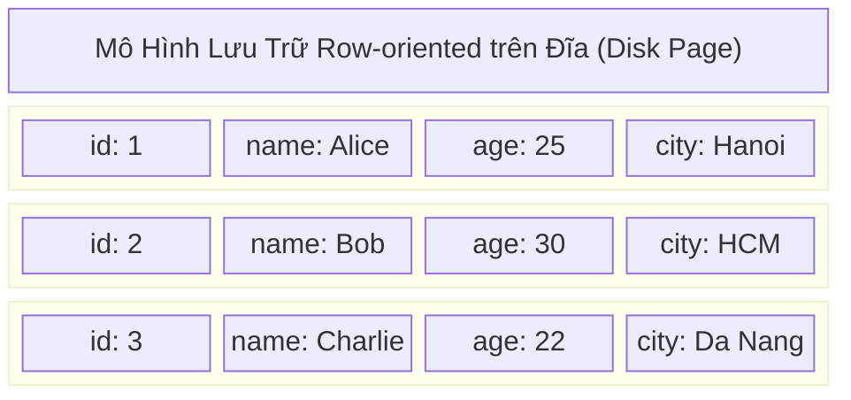
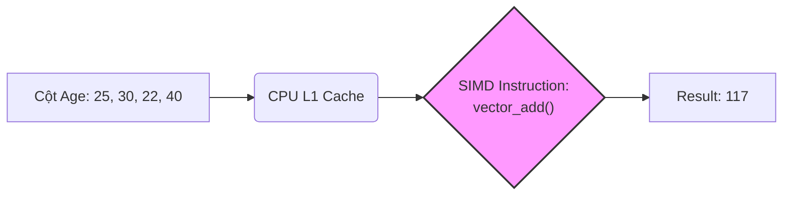

Sự phân định giữa OLTP (Online Transaction Processing) và OLAP (Online Analytical Processing) thường bị hiểu nhầm ở mức độ ứng dụng (phục vụ người dùng cuối vs. phục vụ BI/Report). Tuy nhiên, dưới lăng kính của Data Engineering và System Design, cốt lõi của sự khác biệt này nằm ở **Cách dữ liệu được tổ chức lưu trữ vật lý trên đĩa (Disk Layout)**, **Kiến trúc bộ nhớ (Memory Architecture)**, và **Mô hình thực thi truy vấn (Query Execution Model)**.

Bài viết này mổ xẻ sâu vào cơ chế Row-oriented (Lưu trữ hướng dòng) và Column-oriented (Lưu trữ hướng cột), cùng các rủi ro vận hành trong thực tế.

---

## 1. Row-Oriented Storage (Kiến Trúc OLTP)

Các hệ thống OLTP (như PostgreSQL, MySQL, Oracle) được sinh ra để xử lý hàng vạn giao dịch mỗi giây (High Concurrency) với độ trễ tính bằng mili-giây (Low Latency). 

### 1.1. Kiến Trúc Thực Thi Vật Lý (Physical Execution)

Trong mô hình **Row-oriented**, tất cả các trường (cột) của một bản ghi (tuple) được ghi liên tiếp nhau trên cùng một khối dữ liệu vật lý (thường gọi là Page hoặc Block, kích thước tiêu chuẩn 8KB - 16KB).

**Cơ chế hoạt động:**
- **Indexing (B+ Tree):** Hệ thống OLTP duy trì cấu trúc B+ Tree dày đặc. Khi bạn thực hiện `SELECT * FROM Users WHERE id = 2`, B+ Tree giúp truy tìm chính xác con trỏ vật lý (Pointer) trỏ đến Page chứa dòng dữ liệu đó.
- **Buffer Pool (Page Cache):** Cơ sở dữ liệu sẽ tải nguyên Page 8KB đó từ Disk lên RAM (Buffer Pool). Vì dữ liệu nằm kề nhau, CPU chỉ cần 1 thao tác I/O để lấy trọn vẹn toàn bộ các cột của User.

### 1.2. Trade-offs Hệ Thống (Đánh Đổi)

* **Điểm mạnh (Fast Random Writes/Reads):** Tối ưu tuyệt đối cho các thao tác CRUD (Create, Read, Update, Delete) theo từng bản ghi (Point-lookup). Ghi thêm 1 user mới chỉ là thao tác Append vào cuối Page hoặc chèn vào Page đang trống.
* **Điểm yếu (Read Amplification - Khuếch đại Đọc):** 
  Giả sử bạn chạy một truy vấn phân tích: `SELECT AVG(age) FROM Users`.
  Vì đĩa chỉ có thể đọc theo từng khối (block), hệ thống buộc phải tải toàn bộ các Page (chứa cả `id`, `name`, `city`) lên RAM chỉ để vứt đi phần lớn dữ liệu và lấy ra cột `age`. Việc này gây lãng phí khổng lồ băng thông đĩa (Disk I/O) và băng thông bộ nhớ (Memory Bandwidth).

### 1.3. Rủi Ro Vận Hành Thực Tế (Operational Risks)

* **Cache Thrashing (Vỡ Buffer Pool):** Nếu bạn chạy một câu lệnh quét toàn bảng (Full Table Scan) hoặc một câu lệnh phân tích nặng trên database OLTP, hệ thống sẽ đẩy hàng loạt Page từ Disk lên RAM. Điều này quét sạch các dữ liệu "nóng" (hot data) đang nằm trong Buffer Pool (theo cơ chế LRU), khiến các giao dịch của người dùng bị khựng lại (Latency Spike), thậm chí gây sập ứng dụng.
* **Write Amplification (Khuếch đại Ghi):** Trong các Engine như InnoDB (MySQL), việc cập nhật một cột nhỏ cũng đòi hỏi hệ thống phải ghi lại nguyên cả Page 16KB xuống đĩa (Doublewrite Buffer).

---

## 2. Column-Oriented Storage (Kiến Trúc OLAP)

Để phục vụ các khối lượng dữ liệu khổng lồ (từ hàng Terabyte đến Petabyte) trong Data Warehouse (Snowflake, BigQuery, ClickHouse) hay Data Lakehouse (Parquet, Iceberg, Delta Lake), mô hình **Column-oriented** được áp dụng.

### 2.1. Kiến Trúc Thực Thi Vật Lý

Thay vì ghi theo dòng, dữ liệu được "xoay" lại. Tất cả các giá trị của **cùng một cột** sẽ được gom lại và ghi liên tiếp nhau thành các file hoặc block riêng biệt.

### 2.2. Cơ Chế Tối Ưu Lõi (Core Mechanics)

**1. I/O Pruning (Cắt Tỉa I/O) & Data Skipping:**
Khi chạy `SELECT AVG(age) FROM Users`, hệ thống sẽ **bỏ qua hoàn toàn** khối ID, Name, và City. Disk I/O giảm theo cấp số nhân (đôi khi từ 100GB xuống chỉ còn vài chục MB). Thay vì dùng B+ Tree, OLAP lưu metadata thống kê gọi là **Zone Maps** (Min/Max values cho mỗi khối). Nếu query `WHERE age > 50`, mà khối hiện tại có `Max(age) = 40`, hệ thống sẽ skip toàn bộ khối đó mà không cần đọc lên RAM.

**2. High Compression (Nén Dữ Liệu Tối Đa):**
Vì các giá trị đứng cạnh nhau có cùng kiểu dữ liệu, các thuật toán nén chuyên dụng phát huy tối đa sức mạnh:
* **Run-length Encoding (RLE):** `['Hanoi', 'Hanoi', 'Hanoi', 'HCM', 'HCM']` nén thành `[('Hanoi', 3), ('HCM', 2)]`.
* **Dictionary Encoding:** Mã hóa các chuỗi dài thành các số nguyên Integer (Dictionary mapping), giúp giảm thiểu footprint trên bộ nhớ.
* Dữ liệu nén càng nhỏ, băng thông truyền từ Disk -> RAM -> CPU Cache càng nhanh.

**3. Vectorized Execution (Thực thi SIMD):**
Các hệ thống OLAP hiện đại (ClickHouse, Databricks Photon engine) từ bỏ mô hình xử lý "từng-dòng-một" (Volcano Iterator Model). Thay vào đó, chúng xử lý dữ liệu theo từng **Vector/Batch** (thường là mảng 1024 - 4096 giá trị) để tận dụng tập lệnh SIMD (Single Instruction, Multiple Data) của CPU.

**4. Late Materialization (Vật Chất Hóa Trễ):**
Hệ thống cố gắng duy trì dữ liệu ở dạng cột nén (hoặc các mảng con trỏ) càng lâu càng tốt đi qua các phép toán Filter, Join. Hệ thống chỉ "khâu" các cột lại thành cấu trúc dòng (Tuple Reconstruction) ở bước cuối cùng trước khi trả kết quả về cho Client. Việc này tiết kiệm lượng lớn CPU cycles và Memory.

### 2.3. Rủi Ro Vận Hành & Trade-offs

* **Tuple Reconstruction Penalty:** Truy xuất một bản ghi đầy đủ `SELECT * FROM Users WHERE id = 1` là một cơn ác mộng. Hệ thống phải tìm vị trí dòng ở cột ID, sau đó nhảy (seek) ngẫu nhiên sang các file Name, Age, City để "khâu" chúng lại. Thao tác này tiêu tốn CPU và Random I/O cực lớn.
* **Small File Problem (Phân Mảnh Dữ Liệu):** Vì mô hình cột ghi rất chậm (phải xé dữ liệu ra nhiều file), dữ liệu thường được ghi theo dạng Append-only (Batching). Nếu tần suất ghi liên tục (Streaming) mà không được nén lại (Compaction), hệ thống sẽ sinh ra hàng triệu file Parquet nhỏ, làm sập Metadata Store (ví dụ: JVM OOMKilled trên Spark Driver khi cố đọc manifest file).

---

## 3. Tổng Kết: HTAP và Sự Trỗi Dậy của Lakehouse

Sự phân cực kiến trúc tạo ra nhu cầu di chuyển dữ liệu (ETL/ELT) từ OLTP sang OLAP, gây ra độ trễ (Data Latency). Để giải quyết, các hệ thống **HTAP (Hybrid Transactional/Analytical Processing)** ra đời:

* **Dual-Format Engine (Ví dụ: TiDB):** Sử dụng `TiKV` lưu trữ dạng Row-oriented cho OLTP, sau đó dùng thuật toán đồng bộ (Raft consensus) liên tục sao chép và chuyển đổi sang `TiFlash` dưới dạng Column-oriented cho OLAP.
* **Lakehouse / Table Formats (Iceberg, Delta Lake):** Giữ nguyên lưu trữ dưới dạng Column-oriented (Parquet), nhưng bọc thêm một lớp Transaction Log (Metadata) hỗ trợ ACID (Row-level Updates/Deletes) ngay trên Data Lake.

Hiểu sâu về cấu trúc vật lý này là kỹ năng bắt buộc để một Kỹ sư dữ liệu biết cách tối ưu hóa truy vấn, chọn Partition Key / Z-Ordering phù hợp, và giải quyết các bài toán thắt cổ chai (Bottlenecks) về I/O.

---

## Nguồn Tham Khảo

* [Designing Data-Intensive Applications - Martin Kleppmann (Chương 3: Storage and Retrieval)](https://dataintensive.net/)
* [Apache Parquet - Columnar Storage Format](https://parquet.apache.org/docs/)
* [Databricks Photon Engine: Vectorized Query Execution](https://databricks.com/product/photon)
* [ClickHouse Architecture: Column-oriented database and Vectorization](https://clickhouse.com/docs/en/architecture/column-oriented)
* [AWS Database Blog: Decoupling OLTP and OLAP Workloads](https://aws.amazon.com/blogs/database/)
