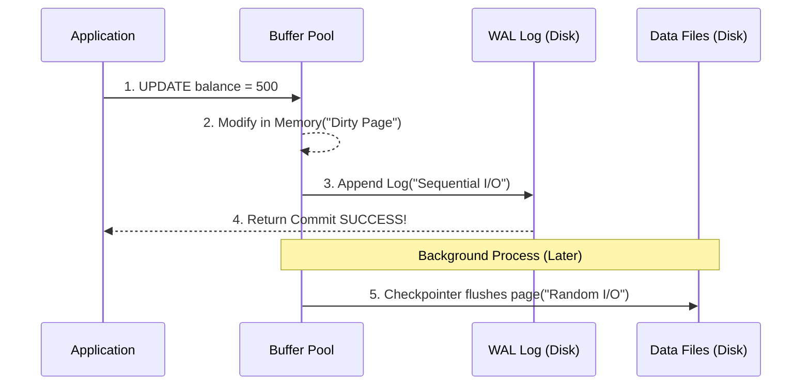

OLTP (Online Transaction Processing) thường bị hiểu nhầm một cách hời hợt là "hệ thống phục vụ người dùng cuối". Tuy nhiên, dưới lăng kính của Data/Backend Engineer, OLTP là một kỳ quan về thiết kế hệ thống nhằm giải quyết sự đánh đổi (trade-offs) giữa **Concurrency (Tính đồng thời)**, **Consistency (Tính nhất quán)**, và **I/O Latency (Độ trễ lưu trữ)**. 

Bài viết này sẽ bỏ qua định nghĩa sách giáo khoa để "mổ xẻ" kiến trúc vật lý của một RDBMS chuẩn (như PostgreSQL, MySQL InnoDB) và các kỹ thuật giúp nó chịu tải hàng nghìn TPS (Transactions Per Second) mà không làm sập hệ thống.

## 1. Kiến trúc Vật lý (Physical Execution Architecture)

Hệ thống OLTP truyền thống (Single-node) là một cỗ máy quản lý bộ nhớ và I/O khổng lồ. Mục tiêu tối thượng của nó là **tránh đọc/ghi trực tiếp xuống Disk càng nhiều càng tốt** vì chênh lệch tốc độ giữa RAM và SSD/HDD có thể lên tới hàng nghìn lần.

```mermaid
graph TD
    subgraph RAM["RAM Memory"]
        BP["Buffer Pool / Shared Buffers<br/>- Cache Data Pages<br/>- Chứa Dirty Pages"]
        LockManager["Lock Manager<br/>Quản lý Isolation"]
    end

    subgraph Disk["Disk Storage"]
        DataFiles["(Data Files<br/>B-Tree Index & Heap)"]
        WALFiles["WAL / REDO Logs<br/>Sequential Append-only"]
    end

    App("(Application") -->|1. SQL Query| BP
    App --> LockManager
    BP -->|2. Cache Miss| DataFiles
    DataFiles -->|3. Load 8KB Page| BP
    BP -.->|4. Asynchronous Checkpoint<br/>(Random I/O)| DataFiles
    BP ==>|5. Sync Commit<br/>(Sequential I/O)| WALFiles
```

### 1.1. Buffer Pool / Shared Buffers
Khi bạn chạy `SELECT * FROM users WHERE id = 1`, Database (DB) không quét ổ cứng ngay lập tức. Dữ liệu trên đĩa được chia thành các **Page/Block** (thường 8KB trong PostgreSQL hoặc 16KB trong MySQL). 
- DB sẽ nạp Page chứa `id = 1` từ Disk lên một vùng RAM gọi là **Buffer Pool** (MySQL) hoặc **Shared Buffers** (PostgreSQL).
- Các thao tác `UPDATE` cũng chỉ sửa dữ liệu ngay trên RAM. Lúc này, Page vừa được sửa bị đánh dấu là **Dirty Page** (trang nhớ bị dơ).
- Định kỳ, một background thread (như `Checkpointer` hoặc `Background Writer`) sẽ gom các Dirty Pages và `flush` (đẩy) ngược xuống Disk để giải phóng RAM.

> [!WARNING] Rủi ro vận hành (OOM & Cache Miss)
> Nếu cấu hình Buffer Pool quá nhỏ (`innodb_buffer_pool_size` trong MySQL hoặc `shared_buffers` trong Postgres), hệ thống không đủ RAM chứa các Active Pages, dẫn tới **Spill-to-disk** (quét I/O liên tục). Tốc độ query sẽ giảm từ mili-giây xuống hàng giây, kéo theo hàng loạt connection bị nghẽn (Connection pool exhaustion).

### 1.2. Write-Ahead Logging (WAL) - Linh hồn của Durability
Nếu một thao tác `UPDATE` chỉ ghi vào RAM (Dirty Page) và hệ thống mất điện, làm sao giữ được tính **Durability (Bền vững)** trong chuẩn ACID?
Câu trả lời là cơ chế **WAL (Write-Ahead Logging)** (hay `Redo Log` trong MySQL).

- **Nguyên lý cốt lõi:** Mọi thay đổi dữ liệu phải được ghi tuần tự vào một file log trên Disk *trước khi* (Ahead) giao dịch được phản hồi thành công (Committed) về cho Client.
- **Sự đánh đổi I/O:** 
  - Đẩy trực tiếp Data Page xuống đĩa là **Random I/O** (tìm ngẫu nhiên track/sector để ghi), cực kỳ chậm.
  - Ghi WAL là **Sequential I/O** (chỉ ghi nối tiếp vào đuôi file). Tốc độ Sequential I/O nhanh hơn Random I/O hàng trăm lần, kể cả trên ổ SSD NVMe. DB lợi dụng điều này để phản hồi ứng dụng nhanh nhất, còn việc đồng bộ Data Page (Random I/O) sẽ để Checkpointer làm ngầm (asynchronous) ở background.



### 1.3. B-Tree Index: Vũ khí đọc siêu tốc
Hệ thống OLTP cần tìm đúng 1 record trong hàng tỷ record với tốc độ mili-giây. Cấu trúc dữ liệu "quốc dân" cho bài toán này là **B-Tree** (thường là B+ Tree).
- Trong B+ Tree, chỉ các Node lá (Leaf nodes) chứa dữ liệu thực hoặc con trỏ vị trí vật lý (TID - Tuple ID). Các Node trung gian chỉ chứa Key để rẽ nhánh.
- **Độ sâu cây cực nông:** Thông thường độ sâu của cây chỉ khoảng 3-4 tầng có thể chứa hàng chục triệu bản ghi. Nghĩa là DB chỉ cần tốn 3-4 lần đọc khối dữ liệu (I/O) là đã lấy ra được row cần tìm.

## 2. Giải bài toán Đồng thời với MVCC (Multi-Version Concurrency Control)

Nếu Transaction A và Transaction B cùng lúc đọc và ghi vào tài khoản `ID = 1`, làm sao để tránh xung đột?
Cách thô sơ nhất là **Lock (Khóa cứng)**. Tuy nhiên Lock làm giảm Concurrency thê thảm (ai vào trước khóa lại, người sau phải xếp hàng).

Hầu hết RDBMS hiện đại dùng **MVCC**.
Nguyên lý của MVCC: **"Readers don't block Writers, and Writers don't block Readers"** (Đọc không chặn Ghi, Ghi không chặn Đọc).
- Khi bạn chạy `UPDATE`, DB không ghi đè row cũ. Nó tạo ra một **phiên bản (version)** hoàn toàn mới.
- Dòng cũ vẫn được giữ lại để phục vụ cho những Transaction khác đang `SELECT` (dựa trên một Snapshot quá khứ).
- Dưới DB Engine, mỗi dòng sẽ có các meta-data ẩn. Trong Postgres đó là `xmin` (ID của Transaction sinh ra nó) và `xmax` (ID của Transaction update/delete nó). Thông qua so sánh các ID này, DB biết Transaction nào được phép nhìn thấy row nào.

## 3. Các Mức độ Cô lập (Isolation Levels) & Dị thường (Anomalies)

Mặc dù có MVCC, việc cho phép bao nhiêu "ảo giác dữ liệu" xảy ra khi đọc/ghi đồng thời phụ thuộc vào **Isolation Level**. Nếu set Isolation level quá nghiêm ngặt -> Chậm (do xung đột Lock). Set quá lỏng lẻo -> Sai nghiệp vụ.

| Isolation Level | Dirty Read | Non-Repeatable Read | Phantom Read | Hiệu năng |
| :--- | :--- | :--- | :--- | :--- |
| **Read Uncommitted** | Có | Có | Có | Nhanh nhất (Không Lock) |
| **Read Committed** (Default Postgres) | Không | Có | Có | Nhanh |
| **Repeatable Read** (Default MySQL) | Không | Không | Có (Postgres chặn luôn) | Chậm hơn |
| **Serializable** | Không | Không | Không | Rất chậm (Gần như chạy tuần tự) |

### Khắc phục dị thường bằng Explicit Lock (Pessimistic Locking)
Dị thường kinh điển nhất của OLTP là mất mát dữ liệu (Lost Update) do Race Condition. Giả sử 2 app cùng gọi `SELECT balance` (đều thấy 100), sau đó cả hai cùng gọi `UPDATE balance = balance + 10`. Thay vì ra 120, kết quả cuối cùng lại là 110!

**Cách giải quyết phổ biến trong code:**
Thay vì đổi toàn bộ DB sang `Serializable` (gây sập tải), kỹ sư dùng Row-level Lock cụ thể bằng `SELECT ... FOR UPDATE`:

```sql
BEGIN;
-- Khóa dòng dữ liệu ngay từ lúc đọc (Không cho ai khác chọc vào)
SELECT balance FROM users WHERE id = 1 FOR UPDATE;

-- Giờ thì thoải mái xử lý logic trong code và update an toàn
UPDATE users SET balance = balance + 10 WHERE id = 1;
COMMIT;
```

## 4. Rủi Ro Vận Hành & Troubleshooting (Real-world Incidents)

Lý thuyết OLTP hoàn hảo, nhưng ở môi trường Production, Database rất dễ gục ngã vì thiết kế sai lầm của Application. 

### 4.1. Lock Contention & Deadlocks (Khóa chéo)
- **Triệu chứng:** Giao dịch bị kẹt (hung), CPU DB không cao nhưng số lượng Active Connections bùng nổ, ứng dụng báo timeout.
- **Nguyên nhân:** Transaction A giữ Lock ở Table 1 chờ Table 2; trong khi Transaction B giữ Lock ở Table 2 chờ Table 1. Hoặc quá nhiều app cùng `UPDATE` một dòng duy nhất (Hot Row) sinh ra hàng đợi Lock cực lớn.
- **Khắc phục:** 
  - Quy định thứ tự update đồng nhất trong Codebase (luôn update bảng/row theo thứ tự Alphabet hoặc ID tăng dần).
  - Giảm thiểu tối đa kích thước vòng đời của 1 giao dịch. Không nhét gọi API (3rd party) hoặc thao tác tính toán nặng vào bên trong `BEGIN...COMMIT`.

### 4.2. Khủng hoảng MVCC Bloat (PostgreSQL)
Bởi vì cơ chế MVCC không ghi đè dữ liệu, các version cũ (Dead Tuples) phải được dọn dẹp bằng một background process gọi là **Auto-Vacuum**.
- **Incident:** Khi bảng có tần suất `UPDATE`/`DELETE` quá lớn (ví dụ: Lưu trạng thái giỏ hàng liên tục), Auto-vacuum chạy không kịp. 
- **Hậu quả:** Bảng phình to (Bloat) lên hàng chục GB dù dữ liệu khả dụng (Live Tuples) chỉ vài MB. Nó dẫn tới B-Tree Index bị phân mảnh, mỗi cú `SELECT` lại load hàng loạt file rác lên Buffer Pool -> Gây ra **Tràn RAM (OOMKilled)** và làm sập DB.
- **Khắc phục:** Tinh chỉnh (Tuning) lại `autovacuum_vacuum_scale_factor`, giảm `statement_timeout` để giết các Transaction treo (long-running query) – thủ phạm chính block Auto-vacuum.

### 4.3. Connection Pool Exhaustion
Mỗi Connection vào RDBMS tiêu tốn tài nguyên khá lớn (với Postgres là khoảng 5-10MB RAM mỗi Process `fork`). 
- Nếu ứng dụng Microservices của bạn mở cùng lúc 2,000 connections tới DB, nó sẽ ăn sạch 20GB RAM trước cả khi thực thi bất kỳ câu truy vấn nào. Nếu là kiến trúc Serverless (AWS Lambda) gọi trực tiếp DB thì đây là thảm họa.
- **Khắc phục:** Kiến trúc bắt buộc phải có Connection Pooler trung gian (như **PgBouncer**, **Odyssey**, hoặc **AWS RDS Proxy**) để dồn ghép hàng vạn request vào một số lượng kết nối DB nhất định.

## 5. OLTP Ở Kỷ Nguyên Cloud: NewSQL và Distributed SQL

RDBMS truyền thống (MySQL, PostgreSQL) vốn được thiết kế theo tư duy kiến trúc Monolithic. Để scale, cách phổ biến nhất là Vertical Scaling (Nâng cấp máy chủ to hơn, thêm RAM, thêm CPU). 

Tuy nhiên, khi chạm đến giới hạn vật lý (VD: Dữ liệu Terabytes, hàng chục ngàn TPS), các Tech Giant đã chuyển sang kiến trúc **Distributed SQL (NewSQL)** như CockroachDB, TiDB, YugabyteDB hoặc Google Cloud Spanner.

- **Kiến trúc:** Dữ liệu tự động chia nhỏ (Sharding) trên nhiều Nodes máy chủ vật lý, đồng thời sử dụng các thuật toán đồng thuận phân tán như **Raft** hoặc **Paxos** để giữ vững cam kết ACID trong môi trường network bị phân mảnh (Network Partition).
- **Sự đánh đổi (Trade-offs):** Mặc dù chịu tải ngang rất tốt (Horizontal Scale), Distributed SQL chịu hệ lụy về **Độ trễ Mạng (Network Latency)** do phải RPC gọi chéo giữa các Node. Các truy vấn `JOIN` phức tạp thường chậm hơn đáng kể so với việc chạy cục bộ trên một máy chủ PostgreSQL cực mạnh.

## 6. Nguồn Tham Khảo (References)
- [Designing Data-Intensive Applications (Chapter 3: Storage and Retrieval, Chapter 7: Transactions) - Martin Kleppmann](https://dataintensive.net/)
- [PostgreSQL Internals: Write-Ahead Log (WAL)](https://www.postgresql.org/docs/current/wal-intro.html)
- [MySQL 8.0 Reference Manual: InnoDB Architecture](https://dev.mysql.com/doc/refman/8.0/en/innodb-architecture.html)
- [Database Internals: A Deep Dive into How Distributed Data Systems Work - Alex Petrov](https://www.databass.dev/)
- [TiDB Architecture - The Evolution of Distributed Systems](https://docs.pingcap.com/tidb/dev/tidb-architecture)
