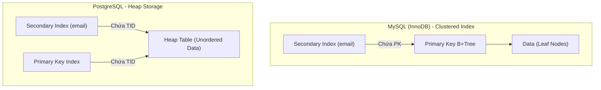

OLTP (Online Transaction Processing) thường bị hiểu nhầm một cách hời hợt là "hệ thống phục vụ người dùng cuối". Tuy nhiên, dưới lăng kính của một **Staff Data/Backend Engineer**, OLTP là một kỳ quan về thiết kế hệ thống nhằm giải quyết sự đánh đổi (trade-offs) giữa **Concurrency (Tính đồng thời)**, **Consistency (Tính nhất quán)**, và **I/O Latency (Độ trễ lưu trữ)**. 

Bài viết này sẽ bỏ qua định nghĩa sách giáo khoa để "mổ xẻ" kiến trúc vật lý cốt lõi, đặc biệt là cuộc chiến khốc liệt về mặt kiến trúc giữa hai tượng đài RDBMS: **MySQL (InnoDB)** và **PostgreSQL**.

---

## 1. Kiến trúc Lưu trữ Vật lý: Clustered Index vs. Heap Storage

Sự khác biệt cốt lõi nhất quyết định toàn bộ hành vi I/O, hiệu năng và chiến lược vận hành nằm ở cách dữ liệu được tổ chức trên Disk.

### 1.1. MySQL (InnoDB): Clustered Index (Cấu trúc gom cụm)
Trong InnoDB, **B+Tree của Primary Key (PK) chính là bảng dữ liệu**. Dữ liệu thực (Row Data) nằm ở tầng lá (Leaf nodes) của B+Tree.
*   **Secondary Index (Chỉ mục phụ):** Khi bạn tạo một index trên cột `email`, tầng lá của index này không chứa dữ liệu thực, mà chứa **giá trị của Primary Key**.
*   **Trade-off (Đánh đổi hệ thống):**
    *   **Pro:** Truy vấn bằng PK (`SELECT * FROM users WHERE id = 1`) nhanh tuyệt đối (Single hop).
    *   **Con (Read Penalty):** Truy vấn qua Secondary Index phải nhảy 2 lần (Double lookup): Lần 1 quét cây `email` để lấy PK, lần 2 quét cây PK để lấy dữ liệu.
    *   **Con (Write Penalty - Page Split):** Vì dữ liệu bị ép buộc phải sắp xếp theo thứ tự của PK, nếu bạn dùng UUID v4 (random string) làm Primary Key, InnoDB sẽ liên tục phải tách trang bộ nhớ (Page Split) và gây phân mảnh ổ cứng khủng khiếp. **Luôn dùng BigInt Auto-Increment hoặc ULID cho InnoDB PK.**

### 1.2. PostgreSQL: Heap Storage (Đống lộn xộn có tổ chức)
Trong Postgres, dữ liệu được vứt vào một cấu trúc gọi là "Heap" (không có thứ tự). Tất cả các index (kể cả Primary Key) đều là **Secondary Index**. 
*   Thay vì chứa PK, tầng lá của Index chứa một con trỏ vật lý **TID (Tuple ID - Block number + Offset)** trỏ thẳng tới vị trí dòng dữ liệu trong Heap.
*   **Trade-off (Đánh đổi hệ thống):**
    *   **Pro:** Mọi index (PK hay cột thường) đều có tốc độ quét bằng nhau (Single hop từ Index -> Heap). Không bị phụ thuộc vào thứ tự PK.
    *   **Con (Write Amplification - Khuếch đại ghi):** Khi cập nhật một dòng, Postgres không thể cập nhật in-place. Nó ghi dòng mới vào một block trống. Việc đổi vị trí (TID thay đổi) buộc hệ thống phải cập nhật lại **TẤT CẢ** các index đang trỏ tới dòng đó, gây ra I/O cực lớn.



---

## 2. WAL và Buffer Pool: Cuộc chiến I/O

Mục tiêu tối thượng của Database là **tránh đọc/ghi trực tiếp xuống Disk càng nhiều càng tốt**.

1.  **Buffer Pool (Shared Buffers):** Thay vì đọc trực tiếp đĩa cứng, DB nạp các Block dữ liệu (8KB-16KB) lên RAM. Khi `UPDATE`, DB chỉ sửa trên RAM (tạo ra **Dirty Page**).
2.  **WAL (Write-Ahead Log):** Nếu cúp điện, Dirty Page mất sạch. Để đảm bảo Durability (ACID), mọi thay đổi phải được ghi tuần tự vào file WAL trên Disk *trước khi* (Ahead) trả kết quả cho Client.
    *   *Vì sao ghi WAL nhanh?* WAL là **Sequential I/O** (ghi nối đuôi vào ổ cứng). Tốc độ của nó nhanh hơn hàng trăm lần so với **Random I/O** (tìm ngẫu nhiên để ghi đè Data Block). Background process (Checkpointer) sẽ từ từ xả Dirty Page xuống disk sau (Asynchronous).

---

## 3. MVCC: Đọc không chặn Ghi

Nếu Transaction A và B cùng `UPDATE` và `SELECT` một tài khoản, Lock toàn bảng (Table Lock) sẽ làm hệ thống chết cứng. Giải pháp là **MVCC (Multi-Version Concurrency Control)**.

### 3.1. Cơ chế hoạt động
Khi chạy `UPDATE`, DB không ghi đè dữ liệu cũ. Nó tạo ra một **phiên bản (version)** mới. Transaction cũ vẫn nhìn thấy dữ liệu cũ, Transaction mới nhìn thấy dữ liệu mới.

### 3.2. Hệ lụy vận hành (Systemic Bloat)
Bởi vì Postgres dùng Heap Storage và không ghi đè, các version cũ (Dead Tuples) vẫn nằm chết trong Disk, làm bảng phình to (Bloat). Một background process gọi là **Auto-Vacuum** có nhiệm vụ chạy ngầm để thu hồi chỗ trống.

**Incident Thực Chiến:** Khi bảng có lượng `UPDATE` cực lớn (ví dụ session/cart tracking), Auto-Vacuum chạy không kịp. Bảng 10GB có thể phình lên 100GB. Index bị phân mảnh, mỗi cú `SELECT` load hàng ngàn rác lên RAM -> Hệ thống sập vì **OOMKilled**.

### 3.3. Tối ưu hóa bằng HOT (Heap Only Tuple) Updates
Để giảm thiểu "Khuếch đại ghi" (Write Amplification) trong Postgres, ta phải tận dụng cơ chế HOT. Khi `UPDATE` các cột không nằm trong bất kỳ Index nào, Postgres sẽ cập nhật ngay trong cùng một Block (nếu còn chỗ) mà không cần update tất cả các Index.

**Cấu hình Staff-level (Giảm FILLFACTOR):**
```sql
-- Mặc định FILLFACTOR là 100 (nhét data đầy block).
-- Giảm xuống 90 để chừa lại 10% không gian trống trong mỗi block.
-- Giúp Postgres có không gian thực hiện HOT Updates, tránh I/O khủng khiếp.
ALTER TABLE cart_sessions SET (fillfactor = 90);

-- Tuning Auto-Vacuum cho các bảng siêu lớn (chạy dọn dẹp nhạy bén hơn)
ALTER TABLE cart_sessions SET (
    autovacuum_vacuum_scale_factor = 0.05, -- Chạy vacuum khi có 5% dữ liệu thay đổi (thay vì 20%)
    autovacuum_analyze_scale_factor = 0.02
);
```

---

## 4. Troubleshooting (Khắc phục sự cố)

### 4.1. Lock Contention & Deadlocks (Khóa chéo)
-   **Triệu chứng:** Giao dịch bị kẹt (hung), CPU DB thấp nhưng Active Connections bùng nổ (Spike), ứng dụng báo timeout.
-   **Nguyên nhân:** Quá nhiều App Server cùng cố gắng `UPDATE` một dòng duy nhất (Hot Row - ví dụ tổng doanh thu hệ thống) sinh ra hàng đợi Lock (Row-level lock queue).
-   **Giải pháp Kiến trúc:** Tách Hot Row thành nhiều rows nhỏ (Sharding counter) và sum lại khi đọc, hoặc ném qua Redis, không để RDBMS gánh Write Concurrency quá 500 TPS trên cùng 1 row.

### 4.2. Connection Pool Exhaustion (Cạn kiệt kết nối)
-   **Sự cố:** Postgres fork một Process (tốn 5-10MB RAM) cho mỗi kết nối. Kiến trúc Microservices hoặc Serverless/Lambda mở 2,000 kết nối đồng thời sẽ ăn sạch 20GB RAM trước khi chạy bất cứ câu SQL nào.
-   **Giải pháp:** Bắt buộc sử dụng Connection Pooler trung gian (PgBouncer, Odyssey, hoặc AWS RDS Proxy) ở chế độ `transaction_pooling` để dồn ghép 10,000 request ứng dụng vào 100 kết nối DB vật lý.

---

## Nguồn Tham Khảo (References)

1.  **Designing Data-Intensive Applications (Chapter 3: Storage and Retrieval, Chapter 7: Transactions)** - *Martin Kleppmann*.
2.  **PostgreSQL Internals: Write-Ahead Log (WAL) and MVCC**.
3.  **MySQL 8.0 Reference Manual: InnoDB Architecture**.
4.  **Database Internals: A Deep Dive into How Distributed Data Systems Work** - *Alex Petrov*.
