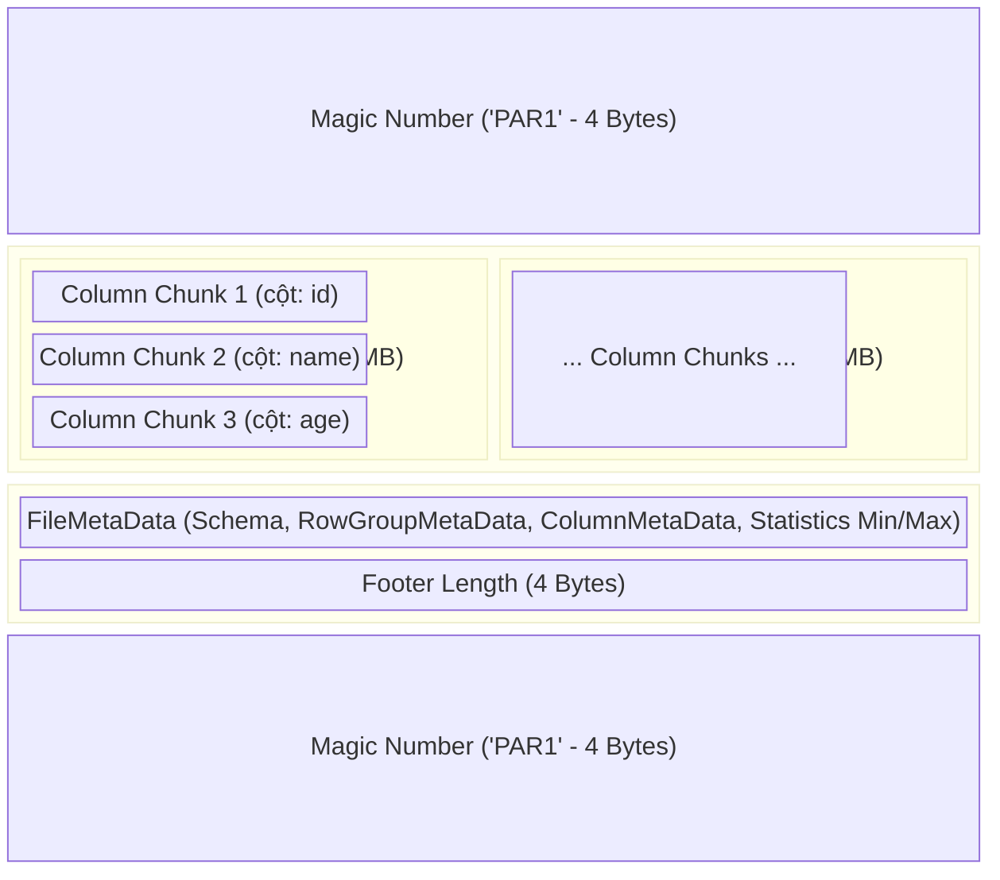

Apache Parquet là xương sống của mọi nền tảng Data Lake và Lakehouse hiện đại (từ HDFS, S3 cho đến kiến trúc Iceberg, Delta Lake). Tuy nhiên, hầu hết Data Engineer chỉ dừng lại ở việc gọi API `df.write.parquet()` như một hộp đen. Để thiết kế hệ thống tối ưu cho các Engine MPP (Massively Parallel Processing) như Spark hay Trino, và để xử lý triệt để các rủi ro vận hành (OOMKilled, I/O Bottleneck), bạn buộc phải nắm rõ cấu trúc phân bổ vật lý (Physical Layout) ở mức độ Byte.

Bài viết này mổ xẻ kiến trúc Parquet dưới lăng kính System Design, tập trung vào Data Layout, Quá trình Encoding, và các Trade-offs hệ thống.

---

## 1. Kiến trúc Thực thi Vật lý (Physical File Layout)

Một file Parquet **KHÔNG** được thiết kế để đọc từ đầu đến cuối (Stream-friendly) như CSV hay JSON. Nó là một định dạng tối ưu cho việc **Đọc ngược từ dưới lên (Read-from-Footer)** nhằm kích hoạt cơ chế Data Skipping (Bỏ qua dữ liệu) một cách triệt để nhất.



### 1.1. Cấu trúc Phân cấp (Hierarchical Structure)
Kiến trúc bên trong Parquet được chia làm 4 cấp độ vật lý từ lớn đến nhỏ:
1. **File:** Đơn vị vật lý cấp cao nhất. Bắt đầu và kết thúc bằng Magic Number (`PAR1`). Phần đuôi chứa **Footer Metadata** rất quan trọng.
2. **Row Group (Logical Grouping):** File được phân tách ngang thành các Row Groups (mặc định phổ biến là 128MB hoặc 256MB). Đây chính là đơn vị chia tải (Parallelization unit) cho các Spark Tasks hoặc Trino Splits. Một Task sẽ nạp một hoặc nhiều Row Group vào RAM một cách độc lập.
3. **Column Chunk (Physical Grouping):** Bên trong Row Group, dữ liệu được băm dọc thành các Column Chunk. Nếu bảng có 50 cột, một Row Group sẽ có chính xác 50 Column Chunks. Dữ liệu của một cột được gom liên tiếp nhau, tối ưu tuyệt đối cho **Sequential Disk I/O**.
4. **Page (Compression Unit):** Đơn vị vật lý nhỏ nhất để Nén (Compression) và Mã hóa (Encoding), thường khoảng 1MB. Có 3 loại chính:
   - **Data Page:** Chứa dữ liệu thực tế đã nén.
   - **Dictionary Page:** Bảng băm từ điển (Dành cho Dictionary Encoding).
   - **Index Page:** Metadata hỗ trợ Point-Lookup (Bloom Filters, Min/Max Index).

---

## 2. Predicate Pushdown và Nghệ thuật Data Skipping

Điểm "ăn tiền" nhất của Parquet nằm ở năng lực **không đọc những dữ liệu không cần thiết**.

Giả sử chạy truy vấn [Query]:
```sql
SELECT name FROM users WHERE age > 30;
```

Thay vì quét hàng TB dữ liệu từ S3, Engine sẽ thực thi **Predicate Pushdown** (Đẩy điều kiện lọc xuống tầng lưu trữ):
1. Đọc 8 bytes cuối cùng của file để lấy `Footer Length` và `PAR1`.
2. Dùng Offset lùi lại, nạp toàn bộ cấu trúc `FileMetaData` vào RAM.
3. Quét `RowGroupMetaData` $\rightarrow$ `ColumnMetaData` của cột `age`. Parquet đã tính sẵn **Statistics (Min, Max, Null Count)** khi ghi file.
4. Nếu `Max(age) = 25` ở Row Group 1, toàn bộ Chunk hàng trăm MB này bị **Skip hoàn toàn**. CPU và Network I/O không bị lãng phí cho việc kéo file và Uncompress Data Pages của Row Group đó.

### Trade-offs: Min/Max Overlap và Clustering
- **Vấn đề chồng lấp (Overlap):** Nếu dữ liệu ghi ngẫu nhiên (Unsorted) theo thời gian, khoảng Min/Max sẽ phình to. Ví dụ, `age` trong Row Group 1 là `[5, 80]`, Row Group 2 là `[1, 90]`. Filter Pushdown trở nên vô dụng, Engine buộc phải nạp tất cả Row Groups lên RAM [Full Scan].
- **Giải pháp Kiến trúc:** Để tối đa hóa Data Skipping, dữ liệu lúc Ghi (Write-time) phải được phân cụm. Các định dạng Lakehouse (Delta/Iceberg) giải quyết việc này bằng **Z-Ordering** (hoặc Liquid Clustering) - kỹ thuật gom nhóm đa chiều (Multi-dimensional clustering) để đảm bảo các Range Min/Max của nhiều cột không bị giao nhau, thu hẹp Data Space cần đọc.

---

## 3. Encoding Pipeline: Tối ưu trước khi Nén (Compression)

Một sai lầm cơ bản của Junior Engineer là đánh đồng Encoding (Mã hóa biểu diễn) và Compression (Nén byte). Parquet chạy hai Phase này tuần tự:
**Raw Data $\rightarrow$ Encoding $\rightarrow$ Compression (Snappy/ZSTD) $\rightarrow$ Disk**.

### 3.1. Dictionary Encoding + Bit-Packing
Đây là vũ khí tối thượng cho các cột Categorical (Cardinality thấp).
Thay vì ghi cứng chuỗi String `['VN', 'VN', 'SG', 'US', 'VN']` tốn dung lượng, Parquet thực hiện:
1. Tạo một **Dictionary Page**: `{0: 'VN', 1: 'SG', 2: 'US'}`
2. Lưu mảng chỉ mục [Index] vào **Data Page** bằng **Bit-Packing**: `[0, 0, 1, 2, 0]`. Vì từ điển chỉ có 3 phần tử (max index = 2], Parquet dùng đúng **2 bits** cho mỗi index. Tiết kiệm hàng chục lần so với lưu String nguyên bản (Mỗi String tốn vài Bytes).

**Operational Risk (Dictionary Bloat):**
- Nếu cột chứa UUID, SessionID (High Cardinality), kích thước từ điển sẽ bùng nổ.
- Parquet có cơ chế Threshold (Mặc định 1MB cho Dictionary Page). Nếu vượt quá, nó buộc phải **Fallback về Plain Encoding** (Lưu Raw, không mã hóa). Kết quả: Dung lượng file tăng đột biến, tiêu thụ RAM khi đọc phình to khủng khiếp.

### 3.2. Run-Length Encoding (RLE)
Được kết hợp với Bit-Packing, RLE cực kỳ mạnh mẽ khi nén dữ liệu lặp lại liên tục (hoặc Sparse Data có nhiều Nulls).
Chuỗi lặp `0, 0, 0, 0, 0, 1` sẽ được mã hóa vật lý thành `(5, 0), (1, 1)` - tốn đúng 4 bytes.

---

## 4. Dremel Algorithm: Giải mã Dữ liệu Lồng nhau (Nested Data)

Để xử lý cấu trúc JSON/BSON phức tạp (Array of Structs), Parquet không Serialize nguyên Object (Gây tốn I/O nếu User chỉ Query 1 thuộc tính nhỏ). Nó "Trải phẳng" (Shredding) dữ liệu đa tầng thành các Cột phẳng (Flat columns) nhờ thuật toán **Dremel** (Của Google).

Dremel gán thêm hai tham số Metadata vào từng giá trị (Value) nguyên thủy:
- **Definition Level (DL):** Chỉ ra thuộc tính bị `NULL` ở độ sâu nào trong cây JSON. Nó giúp Engine phân biệt chính xác: "Mảng bị Null", "Struct trong mảng bị Null", hay "Giá trị nguyên thủy bị Null".
- **Repetition Level (RL):** Chỉ ra độ sâu mà tại đó một Element mới trong Array bắt đầu. Nếu RL = 0, đó là bản ghi (Row) mới hoàn toàn. Nếu RL > 0, Engine biết giá trị này là phần tử tiếp theo trong mảng của Row hiện tại.

*Kết quả:* Truy vấn `SELECT user.address.city` chỉ kéo đúng tập Data Pages của `city` từ ổ đĩa lên RAM, bỏ qua mọi nhánh dữ liệu lồng nhau (Nested objects) khác.

---

## 5. Rủi ro Vận hành (Incident Post-Mortems)

Dưới góc độ Platform, cấu hình Parquet sai cách là nguyên nhân hàng đầu gây sập Cluster.

### 5.1. Bài toán Row Group Sizing (OOMKilled)
- **Cấu hình quá lớn (Ví dụ > 1GB/Row Group):** Tỷ lệ nén cực tốt, nhưng khi Spark/Trino đọc, chúng phải Uncompress nguyên một Row Group khổng lồ vào RAM trước khi xử lý (Dữ liệu khi giải nén thường phình to ra gấp 3-5 lần). Hậu quả: Worker Node cạn kiệt bộ nhớ Heap $\rightarrow$ **JVM OOMKilled**, Task bị Crash.
- **Cấu hình quá nhỏ (Ví dụ < 10MB/Row Group):** Sinh ra bài toán Small Blocks. Overhead của Footer Metadata khổng lồ, chia cắt I/O Sequential thành Random I/O, bóp nghẹt Throughput.
- **Tiêu chuẩn thiết kế:** Giữ ngưỡng **128MB - 256MB** mỗi Row Group.

### 5.2. Sự cố "Quái vật" Small Files (Metadata Overhead)
Đọc 10,000 file Parquet kích thước 10KB trên Amazon S3 sẽ chậm hơn hàng chục lần so với đọc 1 file Parquet 100MB.
*Nguyên nhân:* Để đọc Footer, Engine phát sinh HTTP `GET` request (Byte-Range) cho mỗi file. Network Latency + NameNode/S3 List API Overhead tạo thành thắt cổ chai (Bottleneck).
*Khắc phục FinOps:* Phải có DataOps Job chạy ngầm (Như OPTIMIZE trên Delta Lake) để Compaction (Gom file) định kỳ.

### 5.3. Mảnh Code Thực Chiến (PySpark Tuning)

Dưới đây là thiết lập Parquet chuẩn mực cho môi trường Production Lakehouse của một Staff DE, thay vì dùng cấu hình mặc định (vốn dùng Snappy nén yếu và bỏ qua Z-Ordering).

```python
# 1. Tối ưu hóa ở cấp độ Cluster/Session
# Chuẩn mực mới, ZSTD nén sâu hơn Snappy, giải nén cực nhanh (Cân bằng CPU/Storage)
spark.conf.set("spark.sql.parquet.compression.codec", "zstd") 
# Tăng buffer đọc Vectorized, giúp tận dụng lệnh SIMD của CPU
spark.conf.set("spark.sql.parquet.columnarReaderBatchSize", "4096") 

(df.write
  .format("parquet")
  .mode("overwrite")
  # 2. Tránh Small Files: Khống chế số lượng file đầu ra, mỗi file khoảng 256MB-1GB
  .repartition(20)
  
  # 3. Data Layout (Cực kỳ quan trọng): Sắp xếp cục bộ giúp thu hẹp Min/Max Overlap, 
  # Kích hoạt tối đa Predicate Pushdown
  .sortWithinPartitions("tenant_id", "created_at")
  
  # 4. Row Group Sizing: Ghi đè cấu hình kích thước Block, 256MB tối ưu I/O throughput vs RAM
  .option("parquet.block.size", 268435456)
  
  # 5. Dictionary Tuning: Tắt từ điển cho cột High Cardinality (UUID/SessionID)
  # Tránh lỗi Fallback và giảm chi phí RAM/CPU lúc Build từ điển
  .option("parquet.enable.dictionary#request_uuid", "false")
  
  # 6. Point-lookup: Bật Bloom Filter cho cột hay dùng trong mệnh đề WHERE tĩnh
  # (vd: WHERE request_uuid = 'abc-123'). Tiết kiệm Disk I/O tuyệt đối.
  .option("parquet.bloom.filter.enabled#request_uuid", "true")
  
  .save("s3a://data-lake/core/events/")
)
```

---

## 6. Tổng kết

- Kiến trúc Columnar của Parquet [Row Group $\rightarrow$ Column Chunk $\rightarrow$ Page] được sinh ra để tối ưu Disk I/O bằng cách **Đọc chọn lọc (Pruning)**.
- **Data Layout quyết định 80% hiệu năng:** Parquet chỉ phát huy tối đa sức mạnh nếu dữ liệu được sắp xếp (Sorted/Z-Ordered) để tận dụng Min/Max Statistics ở cấp độ File Footer.
- Encoding hiệu quả (Dictionary, RLE) đóng vai trò giảm dung lượng dữ liệu thô (Raw) từ trước khi thuật toán Nén khối (Zstd/Snappy) can thiệp. Việc cấu hình sai Dictionary Bloat hay Row Group Size sẽ dẫn đến rủi ro sập cụm OOMKilled kinh điển.

---

## Nguồn Tham Khảo
* [Apache Parquet Format Specifications (Official GitHub]][https://github.com/apache/parquet-format]
* [Dremel: Interactive Analysis of Web-Scale Datasets (Google Whitepaper, 2010]][https://research.google.com/pubs/pub36632.html] - Thuật toán đằng sau Encoding lồng nhau của Parquet.
* [Databricks: Data Skipping and Z-Ordering Implementation][https://docs.databricks.com/en/delta/data-skipping.html]
* [Designing Data-Intensive Applications - Martin Kleppmann (SSTables and LSM-Trees]](https://dataintensive.net/)
