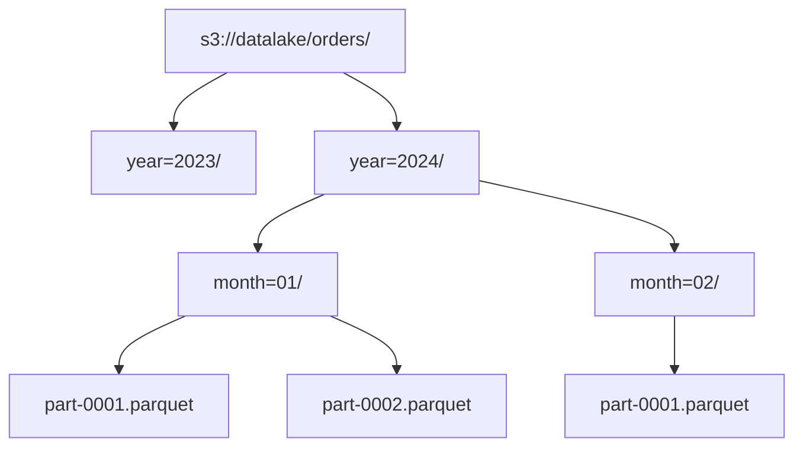
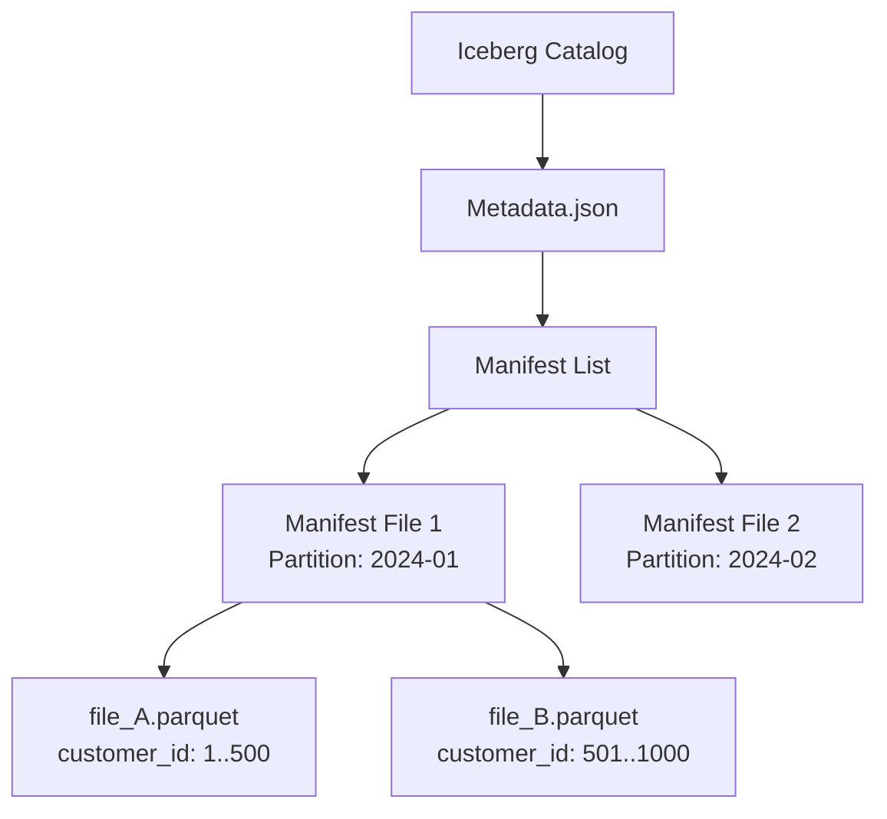

Khi xử lý các tập dữ liệu ở quy mô hàng chục Terabyte hoặc Petabyte, việc quét toàn bộ (Full Table Scan) không chỉ tiêu tốn tài nguyên I/O, CPU, RAM mà còn dẫn đến nguy cơ sập cluster (OOMKilled) hoặc tắc nghẽn mạng do Xáo trộn dữ liệu (Network Shuffle). **Partitioning (Phân vùng)** là chốt chặn đầu tiên và cơ bản nhất để tối ưu hóa I/O bằng cách giới hạn phạm vi dữ liệu cần đọc (Partition Pruning).

Tuy nhiên, người ta thường mắc kẹt ở khái niệm "chia nhỏ dữ liệu theo thư mục". Dưới góc nhìn của một Kỹ sư Hệ thống, Partitioning đòi hỏi sự đánh đổi khốc liệt giữa tốc độ đọc (Read Path) và chi phí bảo trì (Write Path). 

## Kiến trúc Thực thi Vật lý (Physical Execution)

Trong môi trường phân tán (Spark, Trino) và lưu trữ Object Storage (S3, GCS) hoặc HDFS, Partitioning không phải là một tính năng "ảo" của Database, mà nó phản ánh trực tiếp **layout vật lý** trên ổ cứng.

### 1. The Legacy: Hive-style Partitioning

Trong kỷ nguyên Hadoop/Hive, Partitioning đồng nghĩa với việc tạo ra cấu trúc thư mục lồng nhau dạng `key=value`. 



**Cơ chế hoạt động:**
Khi Engine nhận câu lệnh `SELECT * FROM orders WHERE year=2024 AND month=01`, nó sẽ gọi tới **Metastore** (thường là HMS - Hive Metastore). Metastore trả về danh sách URI S3 cụ thể. Quá trình này giúp engine bỏ qua việc gọi hàm S3 `LIST` đắt đỏ trên thư mục `year=2023`.

**Trade-off (Đánh đổi hệ thống):**
- Bị ràng buộc tĩnh (Static): Nếu bạn lưu theo `year/month/day`, nhưng User muốn query theo `customer_id`, hệ thống bắt buộc phải **Full Scan**.
- Thắt cổ chai ở Metastore: Việc lưu metadata của hàng triệu thư mục làm phình to HMS (MySQL/Postgres base) và gây chậm trễ khi lập kế hoạch truy vấn (Query Planning).

### 2. Kỷ nguyên Hiện đại: Metadata-driven (Apache Iceberg, Delta Lake)

Thay vì dựa vào thư mục vật lý, các định dạng Data Lakehouse hiện đại sử dụng **cây siêu dữ liệu (Metadata Tree)** để theo dõi phân vùng, kết hợp với metadata thống kê cấp độ file (min/max/count).



Iceberg giới thiệu khái niệm **Hidden Partitioning**. Bạn lưu timestamp `created_at` ở file vật lý, nhưng định nghĩa Partitioning là `day(created_at)`. Query Engine tự động áp dụng Partition Pruning mà không bắt Data Engineer phải tạo thêm một cột ảo `created_day` như bên Hive, từ đó tránh sai lệch query do quên điều kiện lọc.

## Các Chiến lược Phân vùng & Cấu hình Thực chiến

### Range Partitioning (Phân vùng theo khoảng)
Tuyệt đại đa số Data Warehouse dùng Range Partitioning dựa trên thời gian (`event_date`, `created_at`).

```sql
-- Ví dụ tạo bảng Iceberg phân vùng ẩn theo tháng trên Athena/Trino
CREATE TABLE datalake.orders (
    order_id BIGINT,
    customer_id VARCHAR,
    amount DECIMAL(10, 2),
    created_at TIMESTAMP
)
PARTITIONED BY (month(created_at)) 
WITH (
    format = 'PARQUET',
    write_compression = 'SNAPPY'
);
```

### Hash Partitioning (Bucketing)
Khi cần join hai bảng khổng lồ (ví dụ: `users` và `transactions`), việc thực hiện Hash Join thông thường sẽ kích hoạt Network Shuffle toàn cụm để gom cùng ID về một Node. Điều này cực kỳ tốn chi phí và hay gây tràn RAM (Spill-to-disk).

Bằng cách dùng **Bucketing** (Hash Partitioning), ta ép hệ thống chia file dựa trên Hash của `customer_id` ngay từ lúc ghi (Write-time). Khi Join, Spark sẽ đọc thẳng các bucket tương ứng mà **KHÔNG CẦN SHUFFLE**.

```python
# Spark DataFrame API: Phân vùng kết hợp Range (Date) và Hash (Bucketing)
(df.write
   .partitionBy("event_date")
   .bucketBy(16, "customer_id")
   .sortBy("customer_id")
   .format("parquet")
   .saveAsTable("optimized_transactions"))
```

## Rủi ro Vận hành (Operational Risks) & Khắc phục

Partitioning là con dao hai lưỡi. Thiết kế sai lầm có thể giết chết hệ thống.

### 1. Sập hệ thống do Data Skew (Lệch Dữ liệu)

**Triệu chứng:** Một Spark Job chạy 99% rất nhanh, nhưng 1% cuối cùng bị treo hàng giờ, sau đó ném lỗi `Executor OOMKilled`.
**Nguyên nhân:** Khi phân vùng hoặc GroupBy theo một cột có phân phối mất cân đối (ví dụ: `country_code` trong đó Việt Nam chiếm 95% volume). Một worker node (Executor) phải gánh lượng dữ liệu khổng lồ của Việt Nam trong khi các node khác rảnh rỗi chờ đợi (Straggler Node).

**Cách khắc phục:**
1.  **Salting Technique:** Thêm một tiền tố ngẫu nhiên (Salt) vào Partition Key để đánh tơi dữ liệu ra nhiều node, sau đó gom lại ở bước thứ hai.
2.  **Kích hoạt AQE (Adaptive Query Execution):** Trên Spark 3.0+, AQE có tính năng `Skew Join`. Khi phát hiện một partition quá bự khi shuffle, Spark sẽ tự động xé nhỏ (split) partition đó thành nhiều phần để các task khác cùng xử lý.

```properties
# Bật tính năng chống Skew tự động trong cấu hình Spark
spark.sql.adaptive.enabled=true
spark.sql.adaptive.skewJoin.enabled=true
spark.sql.adaptive.skewJoin.skewedPartitionFactor=5
```

### 2. Thảm họa "Small Files Problem" (Vấn đề File Nhỏ)

**Triệu chứng:** Query load 10GB dữ liệu lại tốn thời gian hơn query 100GB dữ liệu. S3 trả về lỗi `503 Slow Down` do thắt cổ chai API. Hadoop NameNode báo động đỏ do cạn RAM.
**Nguyên nhân:** **Over-partitioning**. Data Engineer quyết định phân vùng theo `year/month/day/hour` và thêm cột phân loại trạng thái. Hậu quả là sinh ra hàng chục ngàn thư mục, mỗi thư mục chỉ chứa 1 file Parquet nặng vài KB. Khi quét dữ liệu, chi phí I/O để mở (open file) và lấy siêu dữ liệu (metadata fetch) còn lớn hơn nhiều so với việc tải khối dữ liệu thô.

**Quy tắc ngón tay cái:**
- File Parquet hoạt động hiệu quả nhất ở dung lượng từ **128MB - 512MB** (hoặc tới 1GB).
- Bắt buộc phải gom file định kỳ (Compaction) để dọn dẹp các file nhỏ thông qua lệnh `OPTIMIZE`.

```sql
-- Gom các file nhỏ thành file chuẩn bằng Delta Lake
OPTIMIZE datalake.orders 
WHERE event_date >= current_date() - INTERVAL 7 DAYS;
```

## Kỷ nguyên mới: Z-Ordering & Liquid Clustering

Rào cản lớn nhất của Partitioning là **tính cứng nhắc**. Dữ liệu chỉ được xếp theo 1 chiều (ví dụ: Thời gian). Nếu ta query theo ID, hệ thống vẫn phải scan diện rộng (Full Scan trên các Partition).

Để vượt qua rào cản này, Data Lakehouse đưa ra khái niệm Data Layout đa chiều.

### Z-Ordering
Gom cụm không gian (Spatial clustering) ánh xạ các cột đa chiều (ví dụ: `event_date` và `customer_id`) thành một giá trị không gian 1 chiều (Z-value). Dữ liệu có liên quan mật thiết ở cả 2 cột sẽ nằm vật lý cạnh nhau. Khi kết hợp với Data Skipping, nó đem lại hiệu năng thần tốc cho các bộ lọc trên bất kỳ cột nào thuộc tập Z-Order.

### Liquid Clustering (Databricks)
Tiến xa hơn Z-Ordering, **Liquid Clustering** ra đời để thay thế hoàn toàn Partitioning truyền thống. Kỹ thuật này cho phép:
1. **Dynamic Layout:** Định nghĩa lại layout dữ liệu mà không cần phải viết lại (rewrite) dữ liệu cũ, tránh nỗi ác mộng di chuyển file (migration) khi Data Model thay đổi.
2. **Auto-tuning:** Tự động duy trì hiệu năng và gom cụm dựa vào các mẫu truy vấn (Query patterns) nền.
3. **High Concurrency:** Bằng việc gỡ bỏ thư mục vật lý để quản lý Row-level (cấp dòng), nó giải quyết triệt để lỗi `ConcurrentAppendException` khi có nhiều pipeline cùng ghi vào 1 partition.

```sql
-- Khởi tạo bảng với Liquid Clustering thay vì Partitioning (Databricks)
CREATE TABLE events (
  id STRING, 
  user_id STRING, 
  event_time TIMESTAMP
)
CLUSTER BY (user_id, event_time);
```

## Tổng Kết

Partitioning không chỉ đơn thuần là phân chia dữ liệu vào các folder. Nó là quá trình kiến trúc nhằm tối ưu hóa I/O, giảm áp lực lên RAM, tránh tràn đĩa (Spill-to-disk) và cứu sống hệ thống trước thảm họa Cartesian Explosion. Dù với Hive-style cổ điển hay Liquid Clustering tiên tiến, cốt lõi của Data Engineering vẫn là thấu hiểu vòng đời, mô hình truy cập dữ liệu và quản lý rủi ro tại tầng vật lý.

## Nguồn Tham Khảo
* [SSTables and LSM-Trees - Designing Data-Intensive Applications (Chapter 3)](https://dataintensive.net/)
* [Apache Iceberg: Hidden Partitioning & Metadata Tree](https://iceberg.apache.org/docs/latest/partitioning/)
* [Apache Spark: Adaptive Query Execution (AQE) and Skew Optimization](https://spark.apache.org/docs/latest/sql-performance-tuning.html#adaptive-query-execution)
* [Databricks Blog: Debunking data layout myths - why Liquid Clustering outperforms partitioning](https://www.databricks.com/blog/debunking-8-data-layout-myths-why-liquid-clustering-outperforms-partitioning)
* [Databricks Blog: Announcing Automatic Liquid Clustering](https://www.databricks.com/blog/announcing-automatic-liquid-clustering)
