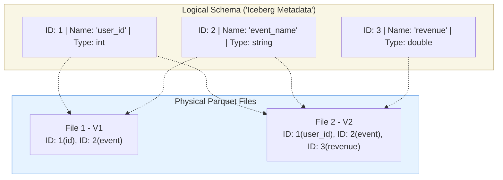
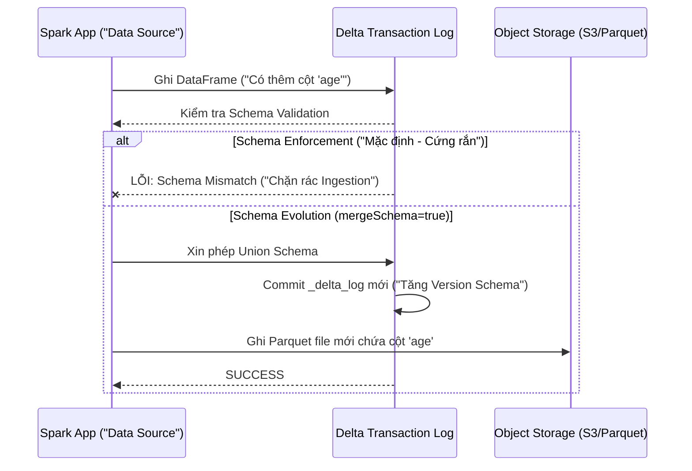

Trong môi trường Data Engineering quy mô lớn, **Schema Drift** (Sự trôi dạt cấu trúc dữ liệu) không phải là "Nếu" mà là "Khi nào". Ứng dụng Upstream (OLTP, Microservices) liên tục cập nhật tính năng: Thêm trường `utm_source`, đổi tên `cust_id` thành `customer_id`, hoặc xóa cột chứa PII để tuân thủ GDPR. 

Nếu Data Platform từ chối tiếp nhận, Pipeline sẽ gãy (Broken Pipeline) và On-call Engineer sẽ bị đánh thức lúc 2h sáng. Nếu nhắm mắt tiếp nhận tất cả (Schema-on-read ngây thơ), Data Lake sẽ biến thành Data Swamp (Bãi lầy dữ liệu) với cấu trúc phân mảnh không thể truy vấn.

**Schema Evolution (Tiến hóa cấu trúc)** là năng lực của Storage Layer (Iceberg, Delta Lake) và Serialization format (Avro, Protobuf) cho phép thay đổi Metadata của bảng một cách nguyên tử (Atomic) để tương thích với dữ liệu mới, **mà không cần phải thực hiện chiến dịch Migration hoặc Full-table Rewrite** trên hàng Petabyte dữ liệu vật lý.

---

## 1. Nền tảng Lý thuyết: Backward & Forward Compatibility

Trước khi nói về Iceberg hay Spark, ta phải hiểu nguyên lý tương thích (Compatibility Rules) của hệ thống phân tán. Khi Producer (Microservice) và Consumer (Data Warehouse) được Deploy ở hai thời điểm khác nhau, dữ liệu phải đảm bảo tính tương thích.

| Loại Tương thích | Ý nghĩa | Use Case Thực Tế | Thao tác Hợp lệ (Ví dụ) |
| :--- | :--- | :--- | :--- |
|" **Backward Compatibility (Tương thích ngược)** "| Consumer **Mới** có thể đọc dữ liệu **Cũ**. |" Bạn update Spark Job để đọc cột mới, nhưng Job vẫn phải xử lý được dữ liệu ngày hôm qua (chưa có cột đó). "| - Thêm cột mới (Có giá trị Default).<br>- Xóa một cột. |
| **Forward Compatibility (Tương thích xuôi)** | Consumer **Cũ** có thể đọc dữ liệu **Mới**. | Microservice đã update sinh ra trường dữ liệu mới, nhưng Spark Job cũ chưa được update vẫn phải chạy bình thường. |" - Thêm một cột mới (Consumer cũ sẽ tự bỏ qua - Ignore).<br>- Xóa cột (Chỉ hợp lệ nếu cột đó là Optional). "|
| **Full Compatibility** | Bao gồm cả Backward và Forward. |" Lý tưởng nhất cho Event-Driven Architecture (Kafka). "| Cực kỳ hạn chế. Thường chỉ cho phép thêm/xóa cột Optional. |

**Đánh đổi (Trade-off):** Nếu bạn ép buộc Full Compatibility qua Confluent Schema Registry, Backend Developer sẽ phàn nàn vì họ không thể đổi Data Type hoặc đổi tên biến tự do. Nếu bạn thả lỏng, Data Engineer sẽ lãnh đủ hậu quả khi dữ liệu bị `NULL` hàng loạt.

---

## 2. Bản chất Vật lý của Schema Evolution trên Data Lake

Tại sao RDBMS truyền thống (như PostgreSQL, MySQL) có thể `ALTER TABLE ADD COLUMN` rất nhanh, nhưng trên Hadoop/Data Lake thời kỳ đầu lại là ác mộng?

Trong Data Lake thế hệ thứ nhất (Hive + Parquet):
1. **Schema-on-read ngây thơ:** Hive lưu Schema trong Metastore (Logical), nhưng dữ liệu vật lý nằm ở các file Parquet chứa Schema ở phần *Footer* (Physical).
2. **Coupling vật lý:** Khi Query, Engine (Spark, Trino) đối chiếu Schema từ Hive với Parquet Footer bằng **Tên cột (Column Name)**. Nếu bạn đổi tên `id` thành `user_id` trong Hive, Spark đọc file Parquet cũ (chỉ có cột `id`) sẽ trả về `NULL` cho `user_id`, và mất luôn toàn bộ dữ liệu lịch sử của cột `id`.

Table Formats hiện đại giải quyết bài toán này bằng cách đưa **Metadata Layer** lên làm nguồn chân lý duy nhất (Single Source of Truth), tách rời hoàn toàn Logical Schema và Physical Schema.

---

## 3. Kiến trúc Giải quyết Schema Evolution

### 3.1. Apache Iceberg: Unique Column IDs (Mapping bằng ID)

Iceberg là chuẩn mực (Gold Standard) cho In-place Schema Evolution. Thiết kế cốt lõi của Iceberg là **không bao giờ Track cột bằng Tên (Name), mà bằng ID (Integer duy nhất).** Đây chính là triết lý vay mượn từ Protocol Buffers (Protobuf).



**Cơ chế hoạt động ở tầng vật lý:**
- **Add Column:** Cấp phát một ID mới (VD: `ID: 3 -> revenue`). Các file Parquet cũ không có ID 3 sẽ được Iceberg Reader tự động fill `NULL` khi quét.
- **Rename Column:** Đổi tên Logical từ `id` thành `user_id`. Vật lý bên dưới (File 1) vẫn map với `ID: 1`. Dữ liệu cũ hoàn toàn nguyên vẹn. Trino/Spark tự động đổi tên khi hiển thị cho User.
- **Drop Column:** Xóa `ID: 2` khỏi Logical Schema. Lần query tiếp theo, Engine bỏ qua (Skip) cột `ID: 2` từ Parquet Footer, dù dữ liệu vật lý vẫn còn đó. Tránh được việc phải Rewrite toàn bộ Parquet files.
- **Side-effect Free:** Nếu sau đó bạn thêm lại một cột mới cũng tên là `event_name`, Iceberg sẽ cấp cho nó `ID: 4`. Nó tách biệt hoàn toàn với `ID: 2` cũ. Tránh thảm họa dữ liệu cũ "sống dậy" (Zombie data).

### 3.2. Delta Lake: Schema Enforcement & mergeSchema

Triết lý của Delta Lake (trong hệ sinh thái Databricks) xoay quanh **Sự an toàn trước (Enforcement) - Tiến hóa sau (Evolution)**.
Delta theo dõi Schema trong Transaction Log (`_delta_log/00000X.json`). 



**Mã thực chiến (PySpark):**

Tuyệt đối KHÔNG nên để `mergeSchema` bật mặc định toàn hệ thống. Hãy Trigger Explicitly tại bước MERGE cho lớp Bronze:

```python
# Cấu hình an toàn nhất cho ETL Pipelines sử dụng SQL MERGE
# Khi thượng nguồn đổi Schema, Data Lake tự động thêm cột mới vào bảng
spark.sql("""
    MERGE WITH SCHEMA EVOLUTION INTO gold_users t
    USING staging_users s
    ON t.user_id = s.user_id
    WHEN MATCHED THEN UPDATE SET *
    WHEN NOT MATCHED THEN INSERT *
""")
```

*Lưu ý: Các phiên bản Delta Lake mới hiện nay cũng đã hỗ trợ **Column Mapping** (tương tự Column IDs của Iceberg) bằng cách bật TBLPROPERTIES `delta.columnMapping.mode = 'name'`. Điều này cho phép Rename và Drop cột mà không cần Rewrite file cứng.*

---

## 4. Các Loại Thay Đổi Schema (Type Operations)

Một Engine chuẩn Lakehouse phải hỗ trợ các phép toán tiến hóa sau:

1. **Additive (Thêm cột / Nested fields):** Luôn an toàn (Backward Compatible).
2. **Rename (Đổi tên):** Yêu cầu Column IDs (Iceberg) hoặc Column Mapping (Delta). Nếu không dùng tính năng này, hệ thống cũ sẽ hiểu lầm là Drop + Add (Làm mất sạch dữ liệu).
3. **Type Promotion / Widening (Nới rộng kiểu):** `INT` $\rightarrow$ `BIGINT` hoặc `FLOAT` $\rightarrow$ `DOUBLE`. Safe operation vì không mất mát dữ liệu (Data Loss). Trino/Spark xử lý Casting này tại Runtime (On-the-fly) khi đọc Parquet blocks.
4. **Type Narrowing (Thu hẹp):** `BIGINT` $\rightarrow$ `INT` hoặc `STRING` $\rightarrow$ `INT`. **Nguy cơ sập hệ thống (Data Loss / Runtime Exception)**. Các Table Format đều *từ chối* Operation này. Bạn bắt buộc phải đọc lên, Cast bằng Spark, và ghi đè (Overwrite / Rewrite) toàn bộ bảng.
5. **Drop (Xóa):** Xóa Logical (Chỉ ẩn đi). Cần lên lịch chạy `VACUUM` (Delta) hoặc `Rewrite Data Files` (Iceberg) ngoài giờ hành chính để dọn dẹp dung lượng vật lý thực sự.

---

## 5. Rủi Ro Vận Hành & Trade-offs (Sự đánh đổi)

Data Engineer không được phép lạm dụng Schema Evolution. Dưới đây là những "Systemic Trade-offs" bạn phải đối mặt.

### 5.1. "Double-Edged Sword" (Gươm hai lưỡi)
*   **Lợi ích:** Data Ingestion layer (Bronze) cực kỳ linh hoạt. Airflow DAGs không bao giờ Crash giữa đêm vì Upstream thêm một trường Tracking mới.
*   **Trade-off (Đánh đổi):** Downstream Consumers (BI Dashboards Tableau/PowerBI, ML Models) sẽ "vỡ vụn" (Break). Tableau Extract Query sẽ văng lỗi nếu một cột bị Drop. ML Model sẽ dự đoán sai bét nếu một Feature bỗng nhiên toàn `NULL` do bị đổi tên ở thượng nguồn.
*   **Chiến lược kiến trúc:** Áp dụng **Medallion Architecture Strictness**. 
    *   Ở lớp **Bronze/Raw:** Cho phép `mergeSchema` thoải mái. 
    *   Ở lớp **Silver/Gold:** Chạy Validation cứng bằng dbt tests hoặc Great Expectations. Bắt buộc Schema Enforcement. Cấm tiệt Schema Evolution tự động.

### 5.2. OOMKilled do Schema Registry Overload
Nếu hệ thống thả cửa cho Schema thay đổi hàng nghìn lần (Ví dụ: Cấu trúc JSON Upstream bị dị dạng, tạo ra *Cartesian Explosion* của các cột Dynamic), Metadata (như `_delta_log` hoặc Iceberg Manifests) sẽ phình to khủng khiếp.
*   **Hậu quả:** Spark Driver bị **OOMKilled** (Out of Memory) ngay tại Phase Query Planning trước khi kịp chạm vào Data vật lý. JVM Heap không gánh nổi Schema Registry khổng lồ trong RAM.
*   **Khắc phục:** Giới hạn số lượng cột tĩnh. Những trường quá Dynamic (như UTM tags thay đổi liên tục) nên gom vào một cột `MAP<STRING, STRING>` hoặc kiểu `VARIANT` / `JSON` string.

### 5.3. Nợ Kỹ Thuật Vật Lý (Physical Tech Debt)
Schema Evolution chỉ là thay đổi Logical. Vật lý bên dưới (Parquet files) trở nên lộn xộn: File A có 10 cột, File B có 15 cột, File C bị đổi tên.
Dù Engine hỗ trợ đọc gộp, nhưng I/O Efficiency giảm sút. CPU phải tốn thêm Cycles để "Align" [Căn chỉnh] Schema ở Runtime, khiến Vectorized Reader của Parquet bị giảm hiệu năng.
*   **FinOps Khắc phục:** Định kỳ chạy `OPTIMIZE` (Delta) hoặc `RewriteDataFiles` (Iceberg) để **Compact** và đồng nhất Physical Schema về Version mới nhất. Trả Compute Cost lấy lại Query Speed.

---

## Nguồn Tham Khảo
1. **Apache Iceberg Documentation:** [Schema Evolution in Iceberg][https://iceberg.apache.org/docs/latest/evolution/] (Giải thích cơ chế Unique Column ID).
2. **Databricks Blog:** [Merge with Schema Evolution](https://docs.databricks.com/en/delta/update-schema.html] (Cú pháp SQL `MERGE WITH SCHEMA EVOLUTION`).
3. **Designing Data-Intensive Applications:** Martin Kleppmann (Chapter 4: Encoding and Evolution). Phân tích nền tảng về Forward/Backward Compatibility của Avro/Protobuf.
4. **Confluent Schema Registry:** Best practices chặn rác từ lớp Kafka Streaming bằng Compatibility Rules.
