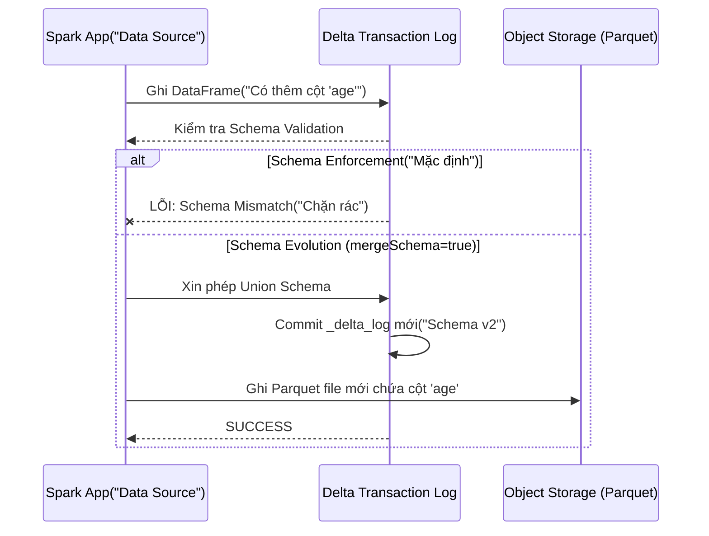

Trong môi trường Data Engineering quy mô lớn, **Schema Drift** (sự trôi dạt cấu trúc dữ liệu) không phải là "nếu" mà là "khi nào". Ứng dụng upstream (OLTP, Microservices) liên tục cập nhật tính năng: thêm trường `utm_source`, đổi tên `cust_id` thành `customer_id`, hoặc xóa cột chứa PII. 

Nếu Data Platform từ chối tiếp nhận, pipeline sẽ gãy (Broken Pipeline). Nếu nhắm mắt tiếp nhận tất cả, Data Lake sẽ biến thành Data Swamp (Bãi lầy dữ liệu) với cấu trúc phân mảnh.

**Schema Evolution (Tiến hóa cấu trúc)** là năng lực của Storage Layer (cụ thể là Table Formats như Iceberg, Delta Lake, Hudi) cho phép thay đổi metadata của bảng một cách nguyên tử (atomic) để tương thích với dữ liệu mới, **mà không cần phải thực hiện những chiến dịch migration hoặc full-table rewrite đắt đỏ** trên hàng petabyte dữ liệu vật lý (Parquet/ORC).

---

## 1. Bản chất Vật lý của Schema Evolution

Tại sao RDBMS truyền thống (như PostgreSQL, MySQL) có thể `ALTER TABLE ADD COLUMN` rất nhanh, nhưng trên Hadoop/Data Lake thời kỳ đầu lại là ác mộng?

Trong RDBMS, dữ liệu được quản lý bởi Storage Engine nội bộ. Khi thêm cột, DB thường chỉ cập nhật System Catalog (Metadata) và mặc định cột mới là `NULL` cho các block dữ liệu cũ. 

Tuy nhiên, trong Data Lake thế hệ thứ nhất (Hive + Parquet):
1. **Schema-on-read ngây thơ:** Hive lưu schema trong Metastore, nhưng vật lý là các file Parquet chứa schema ở phần *Footer*.
2. **Coupling vật lý:** Khi query, engine (Spark, Trino) đối chiếu schema từ Hive với Parquet Footer bằng **Tên cột (Column Name)**. Nếu bạn đổi tên `id` thành `user_id` trong Hive, Spark đọc file Parquet cũ (chỉ có cột `id`) sẽ trả về `NULL` cho `user_id`, và mất luôn dữ liệu cột `id`.

Table Formats hiện đại giải quyết bài toán này bằng cách đưa **Metadata Layer** lên làm nguồn chân lý duy nhất (Single Source of Truth), tách rời hoàn toàn logical schema và physical schema.

---

## 2. Kiến trúc Giải quyết Schema Evolution

### 2.1. Apache Iceberg: Unique Column IDs

Iceberg là chuẩn mực (gold standard) cho in-place schema evolution. Thiết kế cốt lõi của Iceberg là **không bao giờ track cột bằng Tên (Name), mà bằng ID (Integer).**

```mermaid
graph TD
    subgraph Logical_Schema["Logical Schema("Iceberg Metadata")"]
        L1["ID: 1 | Name: 'user_id' | Type: int"]
        L2["ID: 2 | Name: 'event_name' | Type: string"]
        L3["ID: 3 | Name: 'revenue' | Type: double"]
    end

    subgraph Physical_Files["Physical Parquet Files"]
        F1["File 1 - V1<br/>ID: 1(id), ID: 2(event)"]
        F2["File 2 - V2<br/>ID: 1(user_id), ID: 2(event), ID: 3(revenue)"]
    end

    L1 -.-> F1
    L1 -.-> F2
    L2 -.-> F1
    L2 -.-> F2
    L3 -.-> F2
```

**Cơ chế hoạt động:**
- **Add Column:** Cấp phát một ID mới (VD: `ID: 3 -> revenue`). Các file Parquet cũ không có ID 3 sẽ được Iceberg Reader tự động fill `NULL` khi quét.
- **Rename Column:** Đổi tên logical từ `id` thành `user_id`. Vật lý bên dưới vẫn map với `ID: 1`. Dữ liệu cũ hoàn toàn nguyên vẹn.
- **Drop Column:** Xóa `ID: 2` khỏi Logical Schema. Lần query tiếp theo, Engine bỏ qua (không thèm đọc) cột `ID: 2` từ Parquet Footer, dù dữ liệu vật lý vẫn còn đó. Tiết kiệm I/O.
- **Side-effect Free:** Đảm bảo 100% không bao giờ đọc nhầm dữ liệu của cột bị xóa cho một cột mới tạo lại cùng tên (vì ID mới sẽ khác ID cũ).

### 2.2. Delta Lake: Schema Enforcement & mergeSchema

Triết lý của Delta Lake (đặc biệt trong hệ sinh thái Databricks) xoay quanh **Sự an toàn trước (Enforcement) - Tiến hóa sau (Evolution)**.

Delta theo dõi schema trong Transaction Log (`_delta_log/00000X.json`). 



**Mã thực chiến (PySpark):**

Tuyệt đối không nên để `mergeSchema` bật mặc định toàn hệ thống. Hãy trigger explicitly tại bước MERGE:

```python
# Cách 1: Bật option lúc write (Batch)
df_new.write.format("delta") \
    .mode("append") \
    .option("mergeSchema", "true") \
    .save("s3://bucket/gold/users")

# Cách 2: Dùng SQL chuẩn (Databricks Runtime 12.2+)
# Đây là cách clean và an toàn nhất cho ETL Pipelines
spark.sql("""
    MERGE WITH SCHEMA EVOLUTION INTO gold_users t
    USING staging_users s
    ON t.user_id = s.user_id
    WHEN MATCHED THEN UPDATE SET *
    WHEN NOT MATCHED THEN INSERT *
""")
```

*Lưu ý: Các phiên bản Delta mới hiện nay cũng đã hỗ trợ **Column Mapping** (tương tự ID của Iceberg) bằng cách bật TBLPROPERTIES `delta.columnMapping.mode = 'name'`. Điều này cho phép đổi tên và xóa cột mà không cần rewrite.*

---

## 3. Các Loại Thay Đổi Schema (Type Operations)

Một engine chuẩn Lakehouse phải hỗ trợ các phép toán tiến hóa sau:

1. **Additive (Thêm cột/Nested fields):** Luôn an toàn (Forward/Backward Compatible).
2. **Rename (Đổi tên):** Yêu cầu Column IDs (Iceberg) hoặc Column Mapping (Delta). Nếu không, hệ thống sẽ hiểu lầm là Drop + Add.
3. **Type Promotion / Widening (Nới rộng kiểu):** `INT` $\rightarrow$ `BIGINT` hoặc `FLOAT` $\rightarrow$ `DOUBLE`. Safe operation vì không mất dữ liệu. Trino/Spark xử lý casting này tại runtime (on-the-fly) khi đọc Parquet blocks.
4. **Type Narrowing (Thu hẹp):** `BIGINT` $\rightarrow$ `INT` hoặc `STRING` $\rightarrow$ `INT`. **Nguy cơ sập hệ thống (Data Loss / Runtime Exception)**. Các Table Format đều *từ chối* operation này. Bạn bắt buộc phải đọc lên, cast, và ghi đè (Overwrite / Rewrite).
5. **Drop (Xóa):** Xóa logical. Cần lên lịch chạy `VACUUM` (Delta) hoặc `Rewrite Data Files` (Iceberg) sau đó để dọn dẹp dung lượng vật lý thực sự.

---

## 4. Rủi Ro Vận Hành & Trade-offs (Sự đánh đổi)

Data Engineer không được phép lạm dụng Schema Evolution. Dưới đây là những "Systemic Trade-offs" bạn phải đối mặt.

### 4.1. "Double-Edged Sword" (Gươm hai lưỡi)
*   **Lợi ích:** Data Ingestion layer (Bronze) cực kỳ linh hoạt, code không bao giờ crash giữa đêm vì upstream đổi tên trường.
*   **Trade-off (Đánh đổi):** Downstream Consumers (BI Dashboards Tableau/PowerBI, ML Models) sẽ "vỡ vụn" (break). Tableau extract query sẽ LỖI nếu một cột bị Drop. ML Model sẽ dự đoán sai nếu một feature bỗng nhiên toàn `NULL` do bị đổi tên ở thượng nguồn.
*   **Khắc phục:** Áp dụng **Medallion Architecture strictness**. Ở lớp Bronze/Raw: Cho phép `mergeSchema`. Ở lớp Silver/Gold: Chạy validation cứng bằng dbt tests hoặc Great Expectations. Bắt buộc Schema Enforcement.

### 4.2. Hiệu năng Query (Query Planning Overhead)
*   Mỗi lần tiến hóa schema, metadata snapshot sinh ra một version mới.
*   Nếu hệ thống thả cửa cho schema thay đổi hàng nghìn lần (do cấu trúc JSON upstream bị dị dạng, tạo ra *Cartesian Explosion* của các cột), metadata (như `_delta_log` hoặc Iceberg Manifests) sẽ phình to khủng khiếp.
*   **Hậu quả:** Spark Driver bị **OOMKilled** (Out of Memory) ngay tại phase Query Planning trước khi kịp chạm vào data vật lý. JVM Heap không gánh nổi Schema Registry khổng lồ.
*   **Khắc phục:** Dùng Schema Registry (như Confluent) chặn từ cửa Kafka. Giới hạn số lượng cột tĩnh. Những trường quá dynamic (thay đổi liên tục) nên gom vào một cột `MAP<STRING, STRING>` hoặc `VARIANT` / `JSON` string.

### 4.3. Nợ Kỹ Thuật Vật Lý (Physical Tech Debt)
*   Schema Evolution chỉ là logical. Vật lý bên dưới (Parquet files) trở nên lộn xộn: File A có 10 cột, File B có 15 cột, File C bị đổi tên.
*   Dù Engine hỗ trợ đọc gộp, nhưng I/O efficiency giảm sút, CPU phải tốn thêm cycles để "align" (căn chỉnh) schema ở runtime, Vectorized Reader của Parquet bị giảm hiệu năng.
*   **Khắc phục:** Định kỳ chạy `OPTIMIZE` (Delta) hoặc `RewriteDataFiles` (Iceberg) để **Compact** và đồng nhất physical schema về version mới nhất. Đánh đổi Compute Cost lấy Query Speed.

---

## 5. Kết Luận

Schema Evolution biến Data Lake từ một kho chứa thụ động thành một hệ thống linh hoạt (Resilient System). Tuy nhiên, "Với quyền lực lớn, trách nhiệm càng cao" - việc thả nổi Schema Evolution không có rào chắn sẽ biến Lakehouse thành một bãi rác không thể query. Kỹ sư Data giỏi là người biết cấu hình *khi nào hệ thống nên linh hoạt (Ingestion)* và *khi nào hệ thống phải cứng rắn (Consumption)*.

---

## Nguồn Tham Khảo

1.  **Apache Iceberg Documentation:** [Schema Evolution in Iceberg](https://iceberg.apache.org/docs/latest/evolution/) (Giải thích cơ chế Unique Column ID).
2.  **Databricks Blog:** [Merge with Schema Evolution](https://docs.databricks.com/en/delta/update-schema.html) (Cú pháp `MERGE WITH SCHEMA EVOLUTION`).
3.  **Martin Kleppmann:** *Designing Data-Intensive Applications (Chapter 4: Encoding and Evolution)*. Phân tích nền tảng về Forward/Backward Compatibility.
4.  **Confluent:** [Schema Registry & Schema Evolution](https://docs.confluent.io/platform/current/schema-registry/avro.html) (Best practices chặn rác từ lớp Streaming).
