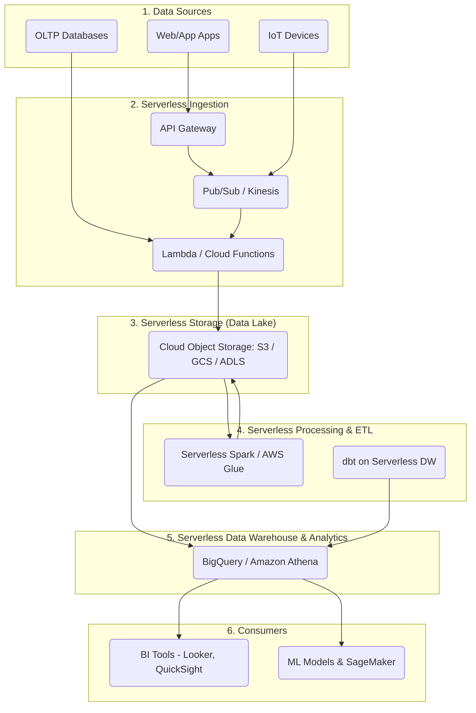

Trước đây, khi bắt tay vào một dự án phân tích dữ liệu lớn, việc đầu tiên bạn phải làm là dự toán xem mình cần mua bao nhiêu máy chủ vật lý, hoặc cấp phép (provision) bao nhiêu máy ảo (VM) trên cloud. Sau đó là các công đoạn cài đặt, cấu hình hệ điều hành, framework (như Hadoop, Spark), và liên tục bảo trì, cập nhật hệ thống. 

Với sự ra đời của **Serverless Data Processing** (Xử lý dữ liệu không máy chủ), gánh nặng quản trị hạ tầng (infrastructure management) gần như được loại bỏ hoàn toàn. Kỹ sư dữ liệu giờ đây có thể tập trung tối đa vào việc phát triển logic xử lý và khai thác giá trị từ dữ liệu.

---

## 1. Serverless Data Processing là gì?

**Serverless Data Processing** hay **Serverless Data Architecture** là một mô hình thực thi điện toán đám mây trong đó nhà cung cấp dịch vụ đám mây tự động quản lý việc cấp phát và phân bổ tài nguyên máy chủ. Bạn không cần phải tạo, cấu hình, duy trì hay mở rộng (scale) bất kỳ cụm máy chủ nào. 

Trong ngữ cảnh dữ liệu, hệ thống (chẳng hạn như Google BigQuery, Amazon Athena, AWS Glue, Snowflake Serverless) sẽ tự động cấp phát và mở rộng sức mạnh tính toán (Compute) ngay lập tức dựa trên khối lượng công việc, tính phức tạp của truy vấn và sẽ tự động thu hẹp về 0 (scale to zero) khi tác vụ hoàn thành.

### Các đặc điểm cốt lõi

1. **Không quản lý cơ sở hạ tầng (Zero Infrastructure Management):** Không có hệ điều hành để vá lỗi (patch), không có cluster để theo dõi (monitor) hay khởi động lại khi gặp sự cố. Nhà cung cấp cloud lo toàn bộ vòng đời của máy chủ bên dưới.
2. **Khả năng mở rộng tự động và vô hạn (Auto-scaling):** Tự động mở rộng tài nguyên tính toán từ 0 lên hàng ngàn node trong tích tắc khi có một truy vấn phức tạp hoặc lượng dữ liệu khổng lồ đổ về, và thu về 0 khi không có workload.
3. **Mô hình tính phí Pay-as-you-go / Pay-per-query:** Bạn chỉ trả tiền cho tài nguyên tính toán thực sự được tiêu thụ (ví dụ: tính theo số GB/TB dữ liệu được quét trong một câu lệnh SQL, hoặc số giây/megabyte RAM mà một hàm chạy). Không có chi phí cho thời gian rảnh (idle time).
4. **Tính sẵn sàng cao (High Availability):** Các dịch vụ serverless mặc định được thiết kế để chịu lỗi tốt (fault-tolerant) và phân tán trên nhiều vùng khả dụng (Availability Zones) mà không cần can thiệp cài đặt thêm.

> [!NOTE] 
> "Serverless" (Không máy chủ) không có nghĩa là không có máy chủ vật lý tồn tại. Thực chất vẫn có hàng ngàn máy chủ vật lý chạy bên dưới trong các Data Center, nhưng chúng hoàn toàn vô hình đối với người dùng (abstracted away). Người dùng chỉ tương tác với "Dịch vụ" thay vì "Máy chủ".

---

## 2. Serverless Data vs. Traditional Data Architecture

Để hiểu rõ hơn sự ưu việt của Serverless Data, hãy so sánh nó với kiến trúc dữ liệu truyền thống (như Hadoop On-premise hoặc Provisioned Cloud VMs).

| Đặc điểm | Traditional/Provisioned Architecture (Hadoop, Redshift Provisioned) | Serverless Data Architecture (BigQuery, Athena) |
| :--- | :--- | :--- |
| **Quản lý hạ tầng** | Nặng nề: Cần Admin/DevOps cấu hình mạng, cài đặt phần mềm, OS patching. | Không có: Cloud vendor quản lý tất cả dưới nền. |
| **Mở rộng (Scaling)** | Scale bằng tay (manual) hoặc thông qua các rule auto-scaling có độ trễ lớn (phút/giờ). Khó scale scale-to-zero. | Tự động (Automatic) và tức thời (giây/mili-giây). Scale về 0 khi không dùng. |
| **Chi phí** | Trả tiền theo công suất được cấp (ví dụ: thuê 10 servers chạy 24/7), bất kể có dùng hết hay không. Lãng phí lớn khi nhàn rỗi. | Trả tiền theo lượng dữ liệu quét (Pay-per-byte) hoặc thời gian thực thi (Pay-per-second). |
| **Phân tách Compute & Storage** | Compute và Storage thường gắn liền (Coupled), hoặc phân tách nhưng khó scale độc lập một cách tối ưu. | Phân tách hoàn toàn (Decoupled). Lưu trữ trên S3/GCS chi phí siêu rẻ, Compute chỉ gọi lên khi cần tính toán. |
| **Dự báo dung lượng** | Phải dự báo trước lượng tải (Capacity Planning) để mua tài nguyên, rất dễ dẫn đến over-provision (lãng phí) hoặc under-provision (tắc nghẽn hệ thống). | Không cần dự báo. Hệ thống tự động cấp đủ sức mạnh để xử lý bất cứ lúc nào. |

---

## 3. Kiến trúc tổng thể của Serverless Data Platform

Một nền tảng dữ liệu serverless hoàn chỉnh bao phủ toàn bộ vòng đời của dữ liệu từ khi sinh ra cho đến khi được trực quan hóa, với sự góp mặt của hàng loạt các dịch vụ cloud-native.

### 3.1. Ingestion (Thu thập dữ liệu)
* **Streaming/Real-time:** Amazon Kinesis Data Firehose, Google Cloud Pub/Sub, AWS EventBridge. Chúng tự động mở rộng theo lưu lượng tin nhắn (message) gửi đến mà không cần cấu hình số lượng broker hay partition phức tạp như Apache Kafka truyền thống.
* **Batch:** Hàm FaaS (Function-as-a-Service) như AWS Lambda, Google Cloud Functions được kích hoạt (trigger) mỗi khi có một file mới thả vào Cloud Storage, tự động xử lý file đó ngay lập tức.

### 3.2. Storage (Lưu trữ - Data Lake)
Trái tim của kiến trúc Serverless là Cloud Object Storage như **Amazon S3, Google Cloud Storage (GCS), Azure Data Lake Storage (ADLS)**. Chúng mang lại khả năng lưu trữ không giới hạn, độ bền (durability) dữ liệu lên tới 99.999999999% (11 số 9), với chi phí cực kỳ rẻ và hoàn toàn không cần quản lý không gian lưu trữ (capacity).

### 3.3. Processing & ETL (Xử lý dữ liệu)
Thay vì duy trì một cụm Apache Spark chạy 24/7:
* **Serverless Spark / Data Integration:** AWS Glue, Google Cloud Dataproc Serverless. Cung cấp môi trường chạy Spark mà bạn chỉ cần submit code, hệ thống tự cấp phát hàng trăm worker node, chạy xong tự tắt và tự giải phóng tài nguyên.
* **Event-driven ETL:** Sử dụng các hàm Serverless (AWS Lambda/Cloud Functions) cho các tác vụ chuyển đổi dữ liệu nhỏ gọn, nhẹ nhàng (ví dụ: parse JSON, filter, masking data) theo cơ chế phản ứng sự kiện (event-driven).

### 3.4. Query & Analytics (Truy vấn và Phân tích)
* **Google BigQuery:** Kho dữ liệu (Data Warehouse) Serverless nổi tiếng nhất. Bạn nạp dữ liệu vào và viết SQL. BigQuery có thể quét hàng Terabyte, Petabyte dữ liệu trong vài giây bằng cách huy động hàng nghìn CPU chạy ngầm mà bạn không cần cấu hình.
* **Amazon Athena:** Cho phép bạn viết SQL truy vấn trực tiếp dữ liệu đang nằm dưới dạng file trên S3. Không cần bước tải dữ liệu (load) vào Database, hệ thống chỉ tính phí trên số GB dữ liệu quét được cho mỗi câu truy vấn.

### 3.5. Orchestration (Điều phối)
* **AWS Step Functions / Google Cloud Workflows:** Công cụ trực quan giúp điều phối các bước ETL, định tuyến luồng dữ liệu, tự động thử lại (retry) khi gặp lỗi.
* **Managed Apache Airflow (MWAA/Cloud Composer):** Mặc dù bản thân Airflow cần server, các managed version này che giấu (abstract) hạ tầng đi, giảm tải công sức vận hành, hướng đến trải nghiệm serverless một phần cho Data Engineer.

---

## 4. Ưu điểm và Nhược điểm của Serverless Data

### 4.1. Ưu điểm (Lợi ích vượt trội)

* **Giảm Time-to-Market:** Data Engineer chỉ cần tập trung viết SQL, Python code. Một luồng (pipeline) dữ liệu có thể được dựng lên và chạy trên môi trường production trong vài giờ thay vì vài tuần chờ xin cấp ngân sách setup hạ tầng mạng và server.
* **Chi phí hiệu quả cho Spiky Workloads:** Đối với các tác vụ tải không đều (ví dụ: các Job ETL chỉ chạy 2 lần 1 ngày, hoặc các báo cáo tổng hợp cuối tháng), serverless giúp tiết kiệm khổng lồ vì doanh nghiệp không phải trả tiền cho thời gian "nhàn rỗi" (idle) của hệ thống.
* **Tự động đối phó với tải đột biến:** Trong các sự kiện như Black Friday, lượng truy cập và dữ liệu ghi nhận có thể tăng gấp hàng chục lần. Hệ thống Serverless tự động mở rộng theo yêu cầu ngay lập tức mà không gây sập nền tảng.
* **Bảo mật và Compliance tốt hơn:** Các bản vá lỗi hệ điều hành, bảo mật mạng lưới luôn được các ông lớn đám mây (AWS, GCP, Azure) chủ động lo liệu và cập nhật thường xuyên.

### 4.2. Nhược điểm và Thách thức (Trade-offs)

> [!WARNING] 
> Serverless Data Processing không phải là "viên đạn bạc" giải quyết mọi bài toán. Nó đi kèm với những rủi ro và giới hạn đặc thù cần cân nhắc.

* **Khó dự báo và kiểm soát chi phí (Cost Predictability):** Dịch vụ tính tiền theo lượng tiêu thụ thực tế. Một câu lệnh SQL do vô tình quét nhầm một bảng khổng lồ (un-partitioned) trên BigQuery có thể "đốt" của bạn hàng nghìn đô la trong vài giây. Đối với các workload chạy với tải **lớn và liên tục 24/7**, việc thuê tài nguyên tĩnh (Provisioned Server) thường sẽ rẻ hơn nhiều so với Serverless.
* **Vendor Lock-in (Bị trói buộc vào nhà cung cấp):** Khi bạn xây dựng nền tảng sử dụng AWS Lambda, Glue, Athena kết hợp sâu với Step Functions, kiến trúc của bạn dính chặt với hệ sinh thái AWS. Việc chuyển đổi sang một đám mây khác (như GCP) hoặc mang về tự chạy On-premise sẽ yêu cầu tái thiết kế và viết lại code diện rộng.
* **Cold Start (Khởi động lạnh):** Khi một hàm máy tính (như Lambda) không được kích hoạt trong một khoảng thời gian, nó sẽ bước vào trạng thái "ngủ". Khi có yêu cầu mới xuất hiện, hệ thống mất một khoảng thời gian (từ vài trăm mili-giây đến vài giây) để cung cấp (spin-up) lại môi trường chạy. Điều này không phù hợp cho các luồng xử lý dữ liệu yêu cầu độ trễ siêu thấp (ultra-low latency).
* **Giới hạn tài nguyên thực thi:** Các ứng dụng Serverless thường có giới hạn ngặt nghèo về thời gian chạy tối đa (VD: AWS Lambda giới hạn 15 phút), dung lượng RAM lớn nhất, không gian đĩa /tmp hạn chế. Bạn không thể can thiệp sâu vào nhân OS hay thực hiện tinh chỉnh (tuning) phần cứng ở mức thấp.

---

## 5. Khi nào nên dùng và không nên dùng?

**✅ NÊN DÙNG:**
* Khởi tạo dự án Data Platform mới, công ty startup muốn xây dựng hệ thống nhanh chóng với đội ngũ nhân sự mỏng (ít Data Engineer, không có DevOps).
* Tác vụ có tính chu kỳ hoặc tải không đều (Spiky workloads, Event-driven ETL).
* Nhu cầu phân tích Ad-hoc (truy vấn khám phá dữ liệu thô trên Data Lake mà không muốn setup Database phân tích chuyên dụng).
* Xử lý luồng sự kiện (Event processing) theo thời gian thực từ IoT, Web/App clickstreams.

**❌ KHÔNG NÊN DÙNG:**
* Workload có tần suất cực cao, xử lý ổn định liên tục 24/7. (Ví dụ: Một cụm Kafka xử lý đều đặn 100,000 message/giây liên tục không ngừng. Trong trường hợp này, tự host trên EC2/GCE hoặc dùng dịch vụ Managed Dedicated sẽ tiết kiệm chi phí hơn rất nhiều so với dùng Serverless API + Lambda).
* Các hệ thống giao dịch yêu cầu độ trễ cam kết cực thấp và cố định ở mức dưới mili-giây (sub-millisecond latency).
* Yêu cầu bảo mật đặc thù buộc toàn bộ hạ tầng phần cứng và dữ liệu phải lưu trữ On-Premise (on-site).
* Khi khối lượng tính toán quá lớn và phức tạp cần tùy chỉnh cấu hình cấp hệ điều hành (Low-level tuning).

---

## 6. Best Practices để vận hành Serverless Data

Để tận dụng tối đa Serverless Data mà không gặp "ác mộng" về chi phí vào cuối tháng, bạn cần tuân thủ các quy tắc tối ưu hoá quan trọng:

### 1. Tối ưu hóa định dạng dữ liệu (Columnar & Compression)
Nhiều dịch vụ như Amazon Athena tính tiền dựa trên lượng dữ liệu quét tính bằng MB/GB. Đừng bao giờ lưu trữ dữ liệu dưới định dạng thô như CSV hay JSON dạng plain-text cho các tác vụ truy vấn phân tích. 
* Chuyển đổi dữ liệu sang các định dạng **Columnar** (Lưu trữ theo cột) tối ưu như [Apache Parquet](/concepts/3-storage-engines-formats/parquet-internals) hoặc **ORC**. 
* Sử dụng thuật toán nén dữ liệu (Snappy, Zstandard) để giảm đáng kể dung lượng file lưu trên Storage, từ đó giảm số lượng byte bị engine đọc qua mỗi lần truy vấn.

### 2. Bắt buộc sử dụng Partitioning (Phân vùng dữ liệu)
Hãy chia nhỏ dữ liệu trên Cloud Storage theo cấu trúc cây thư mục (ngày, tháng, khu vực, trạng thái). 
Ví dụ cấu trúc trên S3: `s3://my-bucket/sales/year=2023/month=10/day=01/`. Khi truy vấn, nếu bạn thêm điều kiện `WHERE year='2023'`, Serverless engine sẽ bỏ qua (prune) hoàn toàn các thư mục năm khác. Tính năng **Partition Pruning** này giúp câu SQL chạy nhanh hơn gấp nhiều lần và tiết kiệm phần lớn ngân sách.

### 3. Thiết lập các chốt chặn chi phí (Cost Controls & Alerts)
* Trên **Google BigQuery**, luôn thiết lập **Custom Quotas** (hạn mức byte quét tối đa theo ngày, theo mỗi dự án, theo từng tài khoản người dùng) và thiết lập Alert (Cảnh báo) ngưỡng ngân sách.
* Trên **Amazon Athena**, nên sử dụng các Workgroup để đặt giới hạn về dữ liệu được quét cho mỗi nhóm user. 
Những thao tác này ngăn chặn hiệu quả tình huống thảm hoạ khi một nhân sự BI vô tình chạy một truy vấn `SELECT *` khổng lồ không có bộ lọc `LIMIT` hoặc `WHERE`.

### 4. Áp dụng Table Formats hiện đại
Để xử lý các bài toán hỗ trợ transaction ACID trên Data Lake bằng Serverless Engine một cách an toàn và hiệu quả, xu hướng hiện nay là kết hợp sử dụng các Open Table Formats như [Apache Iceberg](/concepts/3-storage-engines-formats/apache-iceberg), [Delta Lake](/concepts/3-storage-engines-formats/delta-lake) hoặc Apache Hudi. Các Table Format này cung cấp các siêu dữ liệu (metadata pointer) thông minh giúp engine biết chính xác đường dẫn đến từng file cần thiết, tăng tốc quá trình lọc file và lập kế hoạch (planning) thay vì quét thư mục mù quáng.

---

## Tài Liệu Tham Khảo
* **AWS Serverless Data Analytics Architecture**
* [Google Cloud BigQuery Under the Hood](https://cloud.google.com/blog/products/data-analytics/a-deep-dive-into-bigquery-architecture)
* **Serverless Data Engineering on AWS - Book**
* [Apache Parquet Format Specifications](https://parquet.apache.org/docs/)
* [Apache Iceberg: An Architectural Look Under the Covers](https://iceberg.apache.org/docs/latest/)
* [Delta Lake: High-Performance ACID Table Storage - Databricks](https://delta.io/)
* [SSTables and LSM-Trees - Designing Data-Intensive Applications (Chapter 3)](https://dataintensive.net/)
* **Z-Ordering and Liquid Clustering - Databricks Optimization**
