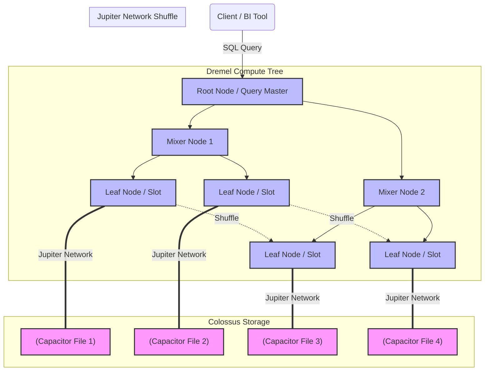

Khái niệm "Serverless" (Không máy chủ) thường bị giới marketing lạm dụng như một "viên đạn bạc" giải quyết mọi bài toán cơ sở hạ tầng. Tuy nhiên, đối với một Kỹ sư Dữ liệu (Data Engineer), hiểu "Serverless" không phải là việc tin rằng không có máy chủ, mà là hiểu **cách nhà cung cấp đám mây quản lý, phân bổ (provision) và thu hồi tài nguyên (compute/storage/network) một cách tự động và vô hình** ở quy mô Petabyte.

Thay vì phải tự cấu hình Yarn/Mesos trên một cụm Hadoop On-premise, hệ thống Serverless cho phép bạn gửi một câu lệnh SQL hoặc một đoạn mã Python, và hệ thống sẽ tự động huy động hàng ngàn CPU Core trong vài giây, sau đó thu hồi (Scale-to-zero) ngay lập tức khi chạy xong.

---

## 1. Kiến trúc Thực thi Vật lý (Physical Execution Architecture)

Để hiểu tại sao các hệ thống Serverless Data Warehouse như **Google BigQuery** hay **Amazon Athena** có thể quét qua hàng Terabyte dữ liệu chỉ trong vài giây, chúng ta cần nhìn sâu vào kiến trúc phần cứng và hệ điều hành phân tán (Distributed OS) bên dưới của chúng. Lấy **Google BigQuery** làm ví dụ kinh điển.

BigQuery đạt được khả năng mở rộng vô hạn nhờ vào triết lý **Decoupling of Compute and Storage** (Phân tách hoàn toàn giữa Tính toán và Lưu trữ). Nó được cấu thành từ 4 công nghệ lõi của Google:

1. **Colossus (Storage):** Hệ thống tệp phân tán (Distributed File System) thế hệ thứ 2 của Google (kế nhiệm GFS). Dữ liệu được lưu trữ dưới định dạng **Capacitor** (Columnar format hỗ trợ dictionary encoding và nén dữ liệu cực mạnh).
2. **Borg (Orchestration):** Tiền thân của Kubernetes. Borg quản lý việc cấp phát tài nguyên tính toán (Compute slots) trong các trung tâm dữ liệu. Khi bạn chạy một câu query, Borg ngay lập tức cấp phát hàng nghìn container (slots) đang rảnh rỗi.
3. **Dremel (Compute Engine):** Động cơ thực thi truy vấn theo cấu trúc cây (Tree Architecture). Dremel chia nhỏ câu lệnh SQL và phân tán xuống hàng ngàn node để đọc dữ liệu song song.
4. **Jupiter (Network):** Mạng lõi Petabit siêu tốc nối giữa Compute và Storage. Nhờ có Jupiter, các Dremel Node có thể đọc dữ liệu trực tiếp từ Colossus với tốc độ như đang đọc từ ổ cứng nội bộ, và xáo trộn dữ liệu (Network Shuffle) giữa các node ở tốc độ 1 Petabit/giây.

### 1.1. Luồng thực thi truy vấn (Query Execution Flow) qua Dremel

Khi bạn gõ `SELECT ... GROUP BY`, BigQuery không chạy trên một máy chủ duy nhất. Dremel biến nó thành một "cây thực thi".




1. **Leaf Nodes (Slots):** Chịu trách nhiệm công việc nặng nhọc nhất (Heavy lifting). Chúng đọc dữ liệu từ Colossus, thực hiện các phép lọc (`WHERE`) và phép tính toán một phần (`Partial Aggregation`).
2. **Network Shuffle:** Nếu bạn thực hiện `JOIN` hoặc `GROUP BY`, dữ liệu cần phải được trao đổi qua lại giữa các Node. Nhờ mạng Jupiter, quá trình Memory-to-Memory transfer này diễn ra cực nhanh mà không bị nghẽn (bottleneck).
3. **Mixer Nodes:** Nhận kết quả từ các Leaf Nodes, tiếp tục gộp lại (Aggregation) và đẩy lên Root Node.
4. **Root Node:** Trả kết quả cuối cùng cho Client.

Tương tự, **Amazon Athena** cũng sử dụng **Presto/Trino** engine chạy trên hạ tầng tính toán tự động co giãn, tách biệt hoàn toàn với hệ thống lưu trữ **Amazon S3**.

---

## 2. Serverless Data Integration (FaaS & Serverless Spark)

Bên cạnh Data Warehouse, việc xử lý luồng (ETL/ELT) cũng dịch chuyển mạnh sang Serverless.

### 2.1. Function-as-a-Service (FaaS) - AWS Lambda, Google Cloud Functions
FaaS là trái tim của kiến trúc Event-driven Data Pipeline. Khi một sự kiện xảy ra (ví dụ: Một file log được tải lên S3, hoặc một message chui vào Kinesis/PubSub), hạ tầng đám mây sẽ **khởi tạo một MicroVM (như AWS Firecracker)**, load code của bạn vào (Python/Node.js), chạy hàm, và hủy VM đó ngay sau khi xong.
- **Ưu điểm:** Chi phí cực rẻ cho Event-driven workloads.
- **Giới hạn vật lý:** AWS Lambda bị giới hạn tối đa 15 phút thực thi, 10GB RAM, và 10GB dung lượng lưu trữ `/tmp`. Do đó, FaaS **KHÔNG** dành cho Heavy Batch Processing (như xử lý file CSV 50GB).

### 2.2. Serverless Spark (AWS Glue, Dataproc Serverless)
Để thay thế cho việc duy trì một cụm EMR (Elastic MapReduce) tốn kém, Serverless Spark cho phép bạn chỉ cần cung cấp file `.py` hoặc `.scala` và chỉ định cấu hình (ví dụ: cần 10 DPUs - Data Processing Units). Hệ thống sẽ tự cấp phát (provision) cụm Spark ẩn, chạy Job, rồi tự tắt.
Tuy nhiên, Kỹ sư Dữ liệu vẫn phải đối mặt với các vấn đề cốt lõi của Spark như **Network Shuffle**, **Data Skew** (lệch dữ liệu), và **Spill-to-disk** nếu cấu hình tài nguyên cấp phát không đủ.

---

## 3. Systemic Trade-offs & Operational Risks (Đánh đổi Hệ thống & Rủi ro Vận hành)

Khi bạn bỏ quyền kiểm soát phần cứng cho nhà cung cấp đám mây, bạn phải chấp nhận những sự đánh đổi hệ thống sau:

### 3.1. Latency vs. Throughput (Độ trễ và Thông lượng)
- **Vấn đề:** Các hệ thống Serverless được tối ưu hóa cho **Throughput** (thông lượng quét cực lớn, quét 1TB dữ liệu trong 3 giây) thay vì **Latency** (độ trễ phản hồi tính bằng mili-giây).
- **Cold Start (Khởi động lạnh):** Khi một hàm Lambda hoặc một job Serverless Spark chưa được gọi trong thời gian dài, nó bị rơi vào trạng thái ngủ. Lần gọi tiếp theo có thể mất từ vài trăm mili-giây đến vài phút để "spin up" (cấp phát IP, mount EBS volume, load container).
- **Trade-off:** Không thể dùng Serverless cho các hệ thống OLTP yêu cầu `sub-millisecond latency` (Ví dụ: Hệ thống khớp lệnh chứng khoán).

### 3.2. Sự "Bùng nổ" Chi Phí (Cost Unpredictability)
Hệ thống tính tiền theo Pay-per-use. Với Athena/BigQuery, chi phí thường tính trên số byte được quét (Ví dụ: $5 cho mỗi 1TB quét).
- **Incident kinh điển - "Cartesian Explosion":** Một Data Analyst viết câu SQL: `SELECT * FROM table_A CROSS JOIN table_B` (hoặc thiếu điều kiện JOIN). Câu lệnh này buộc engine đọc toàn bộ cả 2 bảng khổng lồ và sinh ra hàng tỷ hàng kết quả trung gian. BigQuery sẽ vui vẻ cấp phát hàng nghìn Slots để xử lý, và bạn có thể nhận hóa đơn hàng ngàn Đô la chỉ cho một cú click chuột sai lầm.

### 3.3. Out of Memory (OOMKilled) trong Serverless Spark
- **Hiện tượng:** Mặc dù Serverless (như AWS Glue), tài nguyên RAM cho mỗi Worker node (Executor) vẫn là một con số hữu hạn. Nếu bạn thực hiện phép `JOIN` giữa hai bảng bị Data Skew nghiêm trọng, một Executor có thể nhận về lượng dữ liệu phình to vượt quá bộ nhớ RAM của nó, dẫn đến lỗi `OOMKilled` và toàn bộ Job bị chết.
- **Khắc phục:** Mặc dù hạ tầng là Serverless, bạn vẫn phải tối ưu hóa mã nguồn (Salting key để chống Data skew, sử dụng Broadcast Hash Join cho bảng nhỏ).

---

## 4. Tối ưu Hiệu suất và Chi phí (FinOps / Performance Tuning)

Trong thế giới Serverless Data, **Tối ưu hiệu năng đồng nghĩa với Tối ưu chi phí.** Giảm được số lượng Byte phải đọc từ ổ cứng không chỉ làm Job chạy nhanh hơn, mà còn trực tiếp làm giảm hóa đơn cuối tháng.

### 4.1. File Formats & Compression (Định dạng cột và Nén)
**TUYỆT ĐỐI KHÔNG** query trực tiếp file CSV/JSON trên S3 bằng Athena hoặc BigQuery.
- **Tại sao?** CSV lưu dữ liệu theo hàng (Row-oriented). Lệnh `SELECT user_id` buộc hệ thống phải quét (scan) mọi cột trong file.
- **Giải pháp:** Chuyển đổi file sang định dạng Columnar như **Apache Parquet** hoặc **ORC**. Engine chỉ cần đọc đúng các block chứa cột `user_id`. Kết hợp nén bằng thuật toán **Snappy** hoặc **ZSTD**, số byte bị quét sẽ giảm từ 90-95%.

### 4.2. Partitioning và Partition Pruning
Phân vùng dữ liệu (Partitioning) theo cấu trúc thư mục trên Object Storage.
Ví dụ: `s3://my-datalake/events/year=2023/month=10/day=05/`

Khi truy vấn:
```sql
SELECT count(*) 
FROM events 
WHERE year = '2023' AND month = '10' AND day = '05';
```
Nhờ **Partition Pruning**, Engine sẽ chối bỏ hoàn toàn các thư mục của những ngày/tháng khác. Nó sẽ bỏ qua hàng Terabyte dữ liệu mà không tốn một xu phí quét nào.

### 4.3. Sự vươn lên của Open Table Formats (Iceberg / Delta Lake)
Một nhược điểm chí mạng của Cloud Object Storage (S3/GCS) là lệnh List Directory (`ls`) rất chậm. Nếu một table Serverless có hàng chục nghìn partition, việc liệt kê xem có bao nhiêu partition để lập kế hoạch truy vấn (Query Planning) có thể mất vài phút.
Sử dụng **Apache Iceberg** hoặc **Delta Lake** giải quyết triệt để vấn đề này. Chúng duy trì các file Metadata (JSON/Avro) chứa con trỏ (pointers) trỏ trực tiếp tới từng file vật lý chứa dữ liệu. Engine (như Athena) chỉ cần đọc Metadata này trong tích tắc để biết chính xác cần quét những file Parquet nào, loại bỏ hoàn toàn quá trình List Directory lề mề.

---

## Nguồn Tham Khảo (References)

1. **Google Cloud Blog:** [A deep dive into BigQuery architecture (Colossus, Borg, Dremel, Jupiter)](https://cloud.google.com/blog/products/data-analytics/a-deep-dive-into-bigquery-architecture)
2. **AWS Architecture Center:** [Serverless Data Analytics Patterns](https://aws.amazon.com/architecture/)
3. **Sách:** *Designing Data-Intensive Applications* (Chapter 3: SSTables, Column-Oriented Storage) - Martin Kleppmann.
4. **Apache Parquet Documentation:** [Parquet Format Specifications](https://parquet.apache.org/docs/)
5. **Apache Iceberg:** [An Architectural Look Under the Covers](https://iceberg.apache.org/docs/latest/)
