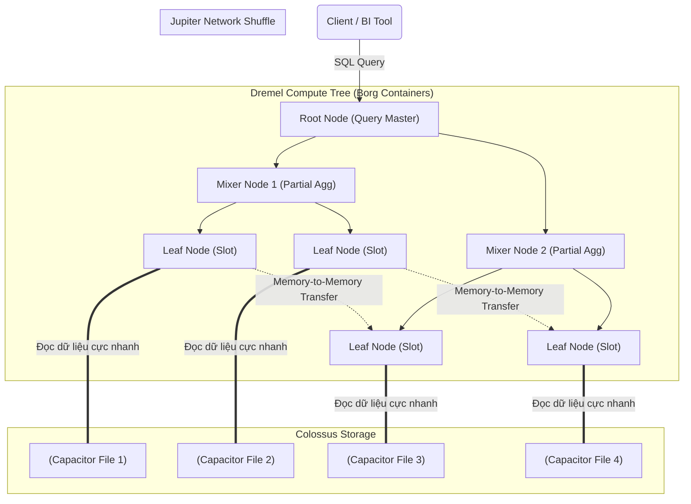

Khái niệm "Serverless" (Không máy chủ) thường bị giới Marketing lạm dụng như một "Viên đạn bạc" giải quyết mọi bài toán nhức đầu về cơ sở hạ tầng. Tuy nhiên, dưới lăng kính của một Staff Data Engineer, hiểu "Serverless" tuyệt đối không phải là tin rằng không có phần cứng vật lý nào tồn tại, mà là **hiểu cách các nhà cung cấp đám mây quản lý, cấp phát (Provision) và thu hồi tài nguyên (Compute/Storage/Network) một cách vô hình** ở quy mô Petabyte trong vài mili-giây.

Thay vì phải tự lên kịch bản cấu hình YARN/Mesos trên một cụm Hadoop On-premise, hệ thống Serverless cho phép bạn ném một câu lệnh SQL hoặc một đoạn mã Python vào, hệ thống sẽ tự động huy động hàng ngàn CPU Core trong tích tắc, sau đó lập tức thu hồi (Scale-to-zero) khi Job kết thúc. Tiền chỉ được tính trên số Byte quét hoặc số mili-giây thực thi.

---

## 1. Kiến trúc Thực thi Vật lý (Physical Execution Architecture)

Làm thế nào **Google BigQuery** hay **Amazon Athena** có thể quét qua hàng Terabyte dữ liệu S3/GCS chỉ trong vòng 5 giây? Để có câu trả lời, chúng ta phải "mổ xẻ" kiến trúc phần cứng và Hệ điều hành phân tán (Distributed OS) của BigQuery.

Khác với máy chủ truyền thống, BigQuery đạt được khả năng mở rộng vô cực nhờ triết lý **Decoupling of Compute and Storage** (Phân tách hoàn toàn phần Tính toán và Lưu trữ). Nó là sự kết hợp của 4 cỗ máy quái vật độc quyền của Google:

1. **Colossus (Storage):** Hệ thống tệp phân tán thế hệ thứ 2 (Kế nhiệm GFS). Dữ liệu vật lý được nén chặt dưới định dạng **Capacitor** (Columnar format hỗ trợ Encoding cực mạnh). Colossus đảm bảo dữ liệu được nhân bản (Replication) an toàn mà không cần Compute Node.
2. **Borg (Orchestration):** Tiền thân của Kubernetes. Borg quản lý hàng chục triệu Container trong các trung tâm dữ liệu. Khi bạn chạy một câu Query, Borg ngay lập tức xé rào cấp phát hàng nghìn Container (Compute Slots) đang rảnh rỗi ở bất cứ đâu trong Data Center cho bạn.
3. **Dremel (Compute Engine):** Động cơ thực thi truy vấn theo cấu trúc Cây (Tree Architecture). Dremel chặt nhỏ câu lệnh SQL và phân phát xuống hàng ngàn Worker Node để cày ải dữ liệu song song.
4. **Jupiter (Network):** Mạng lõi Petabit siêu tốc nối giữa Compute và Storage. Nhờ có Jupiter, các Dremel Node có thể đọc dữ liệu trực tiếp từ Colossus với tốc độ y hệt như đang đọc từ ổ SSD nội bộ, và xáo trộn dữ liệu (Network Shuffle) giữa các node ở tốc độ kinh hoàng.

### 1.1. Luồng thực thi truy vấn (Query Execution Flow)
Khi bạn gõ `SELECT country, SUM(amount) FROM sales GROUP BY country`, Dremel biến nó thành một "Cây thực thi đa cấp".

1. **Leaf Nodes (Slots):** Cấp thấp nhất, chịu trách nhiệm bốc vác nặng nhọc nhất (Heavy Lifting). Chúng đọc dữ liệu từ Colossus, thực hiện phép lọc (`WHERE`) và phép tính tổng cục bộ.
2. **Network Shuffle:** Vì bạn dùng `GROUP BY`, dữ liệu của cùng 1 quốc gia phải được gom về chung 1 Node. Jupiter Network cho phép các Leaf Node ném dữ liệu chéo cho nhau qua RAM siêu nhanh.
3. **Mixer Nodes:** Gộp kết quả từ các Leaf Node lại và đẩy dần lên Root Node.

**Amazon Athena** cũng sở hữu mô hình tương tự, nhưng nó dùng Engine mã nguồn mở **Presto / Trino** thay vì Dremel, và gọi trực tiếp xuống hạ tầng lưu trữ **Amazon S3**.

---

## 2. Serverless Data Integration (FaaS & Serverless Spark)

Ngoài Data Warehouse, phần xử lý luồng ETL (Extract-Transform-Load) cũng đang "Serverless hóa".

### 2.1. AWS Lambda / Cloud Functions (FaaS)
FaaS là xương sống của kiến trúc Event-Driven. Khi có 1 sự kiện (Ví dụ: File JSON thả vào S3), hạ tầng sẽ **khởi tạo một MicroVM (như công nghệ AWS Firecracker)**, nạp mã Python/Node.js của bạn vào, chạy hàm và hủy VM ngay lập tức.
- **Giới hạn vật lý khắc nghiệt:** AWS Lambda bị khóa cứng thời gian chạy tối đa 15 phút, 10GB RAM, dung lượng Disk `/tmp` cũng chỉ 10GB. 
- **Kết luận:** Nó chỉ dành cho Lightweight Event, tuyệt đối **KHÔNG** dùng Lambda để xử lý file CSV 50GB.

### 2.2. Serverless Spark (AWS Glue, Databricks Serverless, Dataproc Serverless)
Thay vì duy trì cụm Amazon EMR đắt đỏ, Serverless Spark cho phép bạn chỉ cần quăng file `.py`, chỉ định số lượng DPUs (Data Processing Units) mong muốn, và đi ngủ. Hạ tầng tự Spin-up các Container chạy Spark ngầm.
Dù phần cứng đã ẩn đi, nhưng tư duy thuật toán thì không. Kỹ sư vẫn phải vật lộn với **Network Shuffle**, **Data Skew** (Lệch dữ liệu), và thảm họa **Spill-to-disk** y hệt như chạy trên máy chủ vật lý.

---

## 3. Đánh Đổi Hệ Thống & Rủi Ro Cháy Túi (Operational Risks)

Khi bạn giao phó quyền quản lý phần cứng cho Nhà cung cấp (Vendor), bạn phải chấp nhận các đánh đổi khốc liệt sau:

### 3.1. Throughput (Thông Lượng) vs Latency (Độ Trễ)
- **Bản chất:** Hệ thống Serverless OLAP sinh ra để cày 1TB dữ liệu trong 3 giây (High Throughput), chứ KHÔNG PHẢI trả về 1 dòng trong 5 mili-giây (Low Latency).
- **Bài toán Cold Start (Khởi động lạnh):** Khi Job của bạn kích hoạt sau một thời gian dài nghỉ ngơi, hệ thống có thể mất vài giây đến vài phút để "đánh thức" Container, gán IP mạng, nạp biến môi trường.
- **Trade-off:** Cấm kỵ dùng Serverless (Như Athena/Lambda) cho các hệ thống Real-time cấp bách như Khớp lệnh giao dịch chứng khoán hay Phản hồi API Game online.

### 3.2. Cơn Ác Mộng Cartesian Explosion (Bùng nổ Chi phí)
Các hệ thống như BigQuery hay Athena mặc định tính phí Pay-per-scan (Trích phần trăm trên số Terabyte bạn quét). Ví dụ: 5 Đô-la cho 1 TB.
- **Tình huống:** Một bạn Data Analyst mới vào nghề gõ nhầm SQL: `SELECT * FROM table_A CROSS JOIN table_B` (Hoặc quên khóa JOIN). 
- **Hậu quả:** Câu lệnh ngu ngốc này ép BigQuery tạo ra hàng Tỷ hàng trung gian. Khốn nỗi, BigQuery quá mạnh, nó vui vẻ huy động hàng nghìn Slot để cày nát cả 2 bảng. Cuối tháng, sếp gọi bạn lên vì hóa đơn Cloud tăng vọt 50,000 Đô-la chỉ vì 1 cú Enter.

### 3.3. Out of Memory (OOMKilled) trong AWS Glue
Mặc dù gọi là Serverless, bộ nhớ RAM cấp phát cho mỗi Worker (Executor) vẫn là giới hạn cứng (Ví dụ 16GB). Khi bạn `JOIN` hai bảng bị Data Skew (Một Key quá lớn ôm 80% dữ liệu), lượng dữ liệu đổ dồn về 1 Executor sẽ gây tràn RAM (OOMKilled). Toàn bộ Job sập đổ bất chấp chữ "Serverless".

---

## 4. Kỷ Nguyên FinOps: Tối Ưu Hiệu Năng & Chi Phí

Trong Serverless, **Tốc độ tỷ lệ thuận với Chi phí**. Đọc ít dữ liệu hơn = Chạy nhanh hơn = Trả ít tiền hơn. Cùng áp dụng 3 nguyên tắc FinOps cốt lõi:

### 4.1. Cấm kỵ CSV/JSON - Hãy dùng Columnar Format
**TUYỆT ĐỐI KHÔNG** dùng Athena/BigQuery để truy vấn trực tiếp file CSV (Row-based) trên S3.
Lệnh `SELECT user_id` trên CSV ép Engine tải (Scan) toàn bộ các cột khác (tên, địa chỉ, lịch sử mua hàng) lên RAM.
- **Giải pháp:** Chuyển đổi file thành định dạng Cột (Columnar) như **Apache Parquet** hoặc **ORC**. Kết hợp với thuật toán nén **Snappy/ZSTD**, số byte quét thực tế có thể giảm từ 95% - 99%.

### 4.2. Partition Pruning (Cắt tỉa Phân vùng)
Tổ chức thư mục dữ liệu trên S3 theo dạng Partition cứng: `s3://data-lake/sales/year=2026/month=06/`.
Khi truy vấn `WHERE year = '2026' AND month = '06'`, hệ thống chỉ cần vào đúng thư mục đó. Nó tự động bỏ qua (Prune) hàng trăm thư mục khác, không tính 1 cắc phí Scan nào cho những dữ liệu đó.

### 4.3. Loại Bỏ "List Directory" Bằng Iceberg/Delta Lake
Một điểm yếu chí tử của S3/GCS là lệnh liệt kê thư mục [List Directory / `ls`] cực kỳ chậm chạp. Nếu bảng của bạn có 50,000 thư mục Partition, Athena có thể mất 30 giây chỉ để quét Metadata (Lên kế hoạch xem cần đọc file nào) trước khi thực sự chạy Query.
- **Sự vươn lên của Open Table Formats:** Dùng **Apache Iceberg**, **Delta Lake** hoặc **Apache Hudi**. Chúng sở hữu một tệp Metadata tập trung (Manifest file) liệt kê thẳng địa chỉ vật lý của từng Parquet File nhỏ. Engine chỉ mất 0.1 giây để đọc Manifest và biết chính xác đường dẫn File cần mở. Tốc độ Query lột xác hoàn toàn.

---

## Nguồn Tham Khảo (References)
1. **Google Cloud Blog:** [A deep dive into BigQuery architecture (Colossus, Borg, Dremel, Jupiter)](https://cloud.google.com/blog/products/data-analytics/a-deep-dive-into-bigquery-architecture)
2. **AWS Blog:** [Top 10 Performance Tuning Tips for Amazon Athena](https://aws.amazon.com/blogs/big-data/top-10-performance-tuning-tips-for-amazon-athena/)
3. **Sách Kinh Điển:** *Designing Data-Intensive Applications* (Martin Kleppmann) - Phân tích kiến trúc Data Warehousing.
4. **Apache Iceberg:** [Under the Hood Architecture](https://iceberg.apache.org/docs/latest/)
