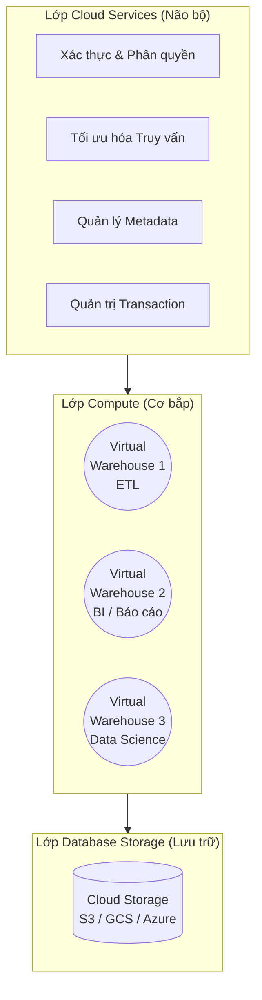

Nếu đã từng làm việc trong các dự án di chuyển dữ liệu lên đám mây (Cloud Migration) hoặc xây dựng Modern Data Stack, chắc chắn bạn không lạ lẫm gì với cái tên **Snowflake**. Từ một nền tảng Cloud Data Warehouse, Snowflake đã mở rộng và tự định vị mình là một **Data Cloud** toàn diện.

Được thiết kế hoàn toàn mới cho kỷ nguyên đám mây (Cloud-native), Snowflake giải quyết những hạn chế cố hữu của các hệ thống cơ sở dữ liệu truyền thống bằng một kiến trúc hoàn toàn phân tách (decoupled architecture). Với Snowflake, bạn không cần cài đặt phần mềm, không cấu hình máy chủ phần cứng, và cũng không cần quản lý các bản vá lỗi. Mọi thứ được phân phối dưới dạng **Software-as-a-Service (SaaS)**.

## Kiến trúc 3 Lớp Độc Đáo (Three-Layer Architecture)

Kiến trúc của Snowflake là sự kết hợp thông minh giữa mô hình **Shared-disk** (lưu trữ tập trung) và **Shared-nothing** (tính toán phân tán độc lập). Dữ liệu được lưu trữ tập trung ở một nơi duy nhất, nhưng việc xử lý lại được phân tán qua các cụm máy chủ ảo độc lập không chia sẻ tài nguyên tính toán với nhau.

Kiến trúc này bao gồm 3 lớp chính:



### 1. Lớp Cloud Services (Não bộ)
Đây là "bộ não" điều phối toàn bộ hệ thống. Bất kỳ câu lệnh SQL hay yêu cầu nào gửi vào Snowflake đều phải đi qua lớp này đầu tiên. Các nhiệm vụ chính bao gồm:
* **Xác thực & Bảo mật:** Kiểm tra user/password, quyền truy cập dữ liệu (RBAC).
* **Trình tối ưu hóa Truy vấn (Query Optimizer):** Phân tích cú pháp SQL và tự động lập kế hoạch thực thi hiệu quả nhất.
* **Quản lý Metadata:** Snowflake không sử dụng Index truyền thống. Thay vào đó, nó lưu trữ Metadata (giá trị Min/Max, số lượng NULL) của mọi cột. Metadata này giúp hệ thống biết chính xác khu vực nào chứa dữ liệu cần tìm để tối ưu tốc độ đọc.
* **Quản trị Giao dịch:** Đảm bảo các thuộc tính ACID cho toàn bộ các thao tác dữ liệu.

### 2. Lớp Compute (Cơ bắp)
Lớp này cung cấp sức mạnh tính toán để thực thi truy vấn. Snowflake sử dụng các **Virtual Warehouses** (Kho ảo) — bản chất là các cụm máy chủ (EC2 trên AWS hoặc VM trên nền tảng khác).
* **Phân tách hoàn toàn (Isolation):** Bạn có thể tạo nhiều Virtual Warehouse độc lập. Ví dụ: một Warehouse `XL` dành cho đội Data Engineer chạy job ETL nặng, một Warehouse `M` dành riêng cho đội Analyst kéo báo cáo trên Tableau. Vì độc lập nên truy vấn nặng của ETL sẽ **không bao giờ** làm chậm báo cáo của Analyst.
* **Instant Elasticity:** Bạn có thể tự động bật/tắt (Auto-suspend / Auto-resume) hoặc tự động thay đổi kích cỡ của Warehouse ngay lập tức tùy theo nhu cầu thực tế để tiết kiệm chi phí. Tiền chỉ bị trừ theo **giây** khi Warehouse đang hoạt động.

### 3. Lớp Database Storage (Lưu trữ)
Lớp lưu trữ vật lý của Snowflake được đặt trên các hệ thống Object Storage của Cloud Provider (như Amazon S3, Google Cloud Storage).
* Dữ liệu khi nạp vào sẽ được tự động tổ chức lại dưới định dạng cột (Columnar format), tự động nén (compressed) và mã hóa mạnh (AES-256).
* Bạn không thể (và không cần) can thiệp trực tiếp vào file ở lớp này. Mọi tương tác thêm/sửa/xóa đều phải thông qua giao diện SQL của Snowflake.

---

## Cách Lưu Trữ: Sức Mạnh của Micro-partitions

Thay vì phải tạo các khóa phân vùng (partition keys) thủ công lớn như các hệ thống Hadoop hay Hive, Snowflake tự động chia nhỏ toàn bộ dữ liệu thành hàng triệu khối gọi là **Micro-partitions**.

> [!NOTE]
> **Đặc điểm của Micro-partitions:**
> * **Kích thước nhỏ gọn:** Mỗi khối có kích thước chỉ từ 50MB - 500MB (trước khi nén).
> * **Lưu trữ dạng cột (Columnar):** Bên trong mỗi khối, dữ liệu được sắp xếp theo từng cột độc lập. Truy vấn chỉ đọc những cột có trong lệnh `SELECT`.
> * **Data Pruning (Cắt tỉa dữ liệu):** Nhờ lớp Metadata ghi nhận giới hạn Min/Max, khi bạn `SELECT * WHERE date = '2023-10-01'`, Snowflake sẽ quét qua Metadata, lập tức loại bỏ (prune) 99% các micro-partitions không chứa ngày này, và chỉ đọc 1% dữ liệu cần thiết. Đây là bí quyết giúp truy vấn trong Snowflake luôn đạt tốc độ chóng mặt.

---

## Những Tính Năng Độc Quyền (Core Features)

Sự phân tách giữa Storage và Compute đã mở ra khả năng thiết kế những tính năng vượt trội:

### 1. Time Travel & Fail-safe
* **Time Travel:** Cho phép bạn "quay ngược thời gian" để truy vấn trạng thái dữ liệu ở một thời điểm trong quá khứ (hỗ trợ tối đa 90 ngày). Rất hữu ích khi cần khôi phục lại (Undelete) một bảng hoặc schema lỡ tay bị drop.
  ```sql
  -- Truy vấn bảng dữ liệu giống hệt như thời điểm 1 tiếng trước
  SELECT * FROM transactions 
  AT(OFFSET => -60*60);
  ```
* **Fail-safe:** Là một cửa sổ an toàn 7 ngày sau khi hạn Time Travel kết thúc. Trong khoảng thời gian này, dữ liệu không thể phục hồi bằng lệnh SQL mà phải gửi ticket hỗ trợ cho Snowflake. Đây là lớp phòng thủ cuối cùng phòng chống sự cố do con người hoặc mã độc thảm họa.

### 2. Zero-Copy Cloning
Một tính năng mang tính cách mạng cho quá trình phát triển (Dev/Test).
* Snowflake cho phép bạn tạo một bản sao (clone) của toàn bộ database dung lượng hàng Terabyte chỉ trong vài giây và **không tốn thêm bất kỳ dung lượng đĩa cứng nào**.
* Thay vì sao chép file dữ liệu vật lý (như cơ chế copy truyền thống), lệnh Clone chỉ tạo các con trỏ Metadata mới trỏ đến các Micro-partitions gốc ban đầu. Bạn có thể thả ga nghịch phá bản Clone mà không ảnh hưởng tới bảng Production gốc.

### 3. Secure Data Sharing
Việc chia sẻ dữ liệu giữa các công ty trước đây thường yêu cầu FTP, trích xuất file CSV hoặc xây dựng API rất cồng kềnh.
* Với Snowflake Data Sharing, bạn có thể cấp quyền truy cập "Live" vào các bảng dữ liệu của mình cho đối tác bên ngoài mà **không cần copy hay di chuyển dữ liệu**.
* Bên nhận dữ liệu (Consumer) sẽ sử dụng Virtual Warehouse (sức mạnh tính toán) của chính họ để query trên dữ liệu của bạn, đồng nghĩa với việc bạn không bị mất phí tính toán khi đối tác đọc dữ liệu.

### 4. Snowpipe (Continuous Data Ingestion)
Thay vì chạy các batch job lớn mỗi đêm để load dữ liệu, Snowpipe mang đến khả năng nạp dữ liệu gần với thời gian thực (Micro-batching).
* Mỗi khi có một file mới thả vào bucket Amazon S3, một sự kiện (Event) sẽ đánh thức Snowpipe. Hệ thống tự động nạp ngay file dữ liệu đó vào bảng với chi phí cực rẻ chỉ tính theo lượng giây xử lý thực tế.

---

## Ưu và Nhược điểm

**Ưu điểm vượt trội:**
* **Bảo trì bằng Không (Zero Maintenance):** Bạn không phải tạo index, không cân bằng dung lượng đĩa (vacuum), không tối ưu phân mảnh.
* **Mở rộng linh hoạt & Concurrency cao:** Không còn khái niệm "Tranh chấp tài nguyên". Hàng ngàn người dùng có thể query đồng thời nhờ việc tách lập vô hạn các Warehouse ảo.
* **Hỗ trợ Data Science & MLOps:** Tính năng Snowpark cho phép chạy mã Python, Java, Scala song song trực tiếp bên trong engine của Snowflake mà không cần kéo dữ liệu ra ngoài.

**Điểm hạn chế cần lưu ý:**
* **Rủi ro Chi phí (Cost Overrun):** Vì mô hình tính phí pay-per-second, các doanh nghiệp dễ gặp "Cú sốc hóa đơn" nếu không cài đặt tính năng `Auto-Suspend` (Tự động tắt Compute khi rảnh rỗi) hoặc viết câu lệnh truy vấn lãng phí, cấp phát các Warehouse có size khổng lồ.
* **Không hợp với OLTP:** Tốc độ thêm mới (INSERT) hoặc cập nhật (UPDATE) từng dòng (row-by-row) có độ trễ lớn, không phù hợp thay thế các database giao dịch trực tuyến như PostgreSQL hay MySQL.

---

## Tài Liệu Tham Khảo
* [Snowflake Documentation: Key Concepts & Architecture](https://docs.snowflake.com/en/user-guide/intro-key-concepts)
* [Understanding Micro-partitions and Data Clustering](https://docs.snowflake.com/en/user-guide/tables-clustering-micropartitions)
* [Snowflake Time Travel & Fail-safe](https://docs.snowflake.com/en/user-guide/data-time-travel)
* [Introduction to Snowpark](https://docs.snowflake.com/en/developer-guide/snowpark/index)
