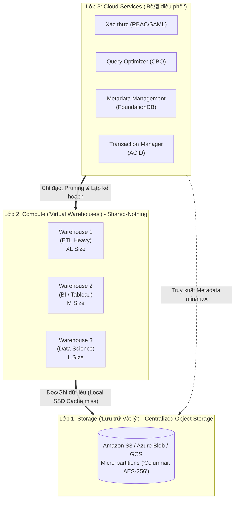

Nếu chỉ nhìn từ bên ngoài, Snowflake giống như một cơ sở dữ liệu SQL truyền thống (RDBMS). Tuy nhiên, dưới góc nhìn System Design của một Kỹ sư Hệ thống (Staff Engineer), Snowflake mang trong mình kiến trúc **Multi-Cluster Shared-Data** (Đa cụm tính toán - Chia sẻ kho lưu trữ chung) - một bước tiến phá vỡ giới hạn của cả kiến trúc Shared-Nothing truyền thống (như Amazon Redshift Classic) và Shared-Disk (như Oracle RAC).

Thay vì lưu trữ dữ liệu cục bộ trên các Node tính toán (Compute) và phải đối mặt với bài toán Rebalancing/Resharding đau đầu mỗi khi Scale, Snowflake tách biệt hoàn toàn ranh giới vật lý giữa **Lưu trữ (Storage)**, **Tính toán (Compute)** và **Quản lý trạng thái (Cloud Services)**. Sự phân tách này chính là nền tảng của xu hướng **Storage-Compute Decoupling** trong Data Engineering hiện đại.

---

## 1. Kiến trúc 3 Lớp Phân Tách (The Three-Layer Architecture)



### 1.1. Lớp Storage (Centralized Persistent Storage)

Snowflake không tự xây dựng hệ thống phân tán vật lý (như HDFS) cho việc lưu trữ, mà tận dụng kiến trúc Object Storage của các Cloud Provider (Amazon S3, GCS, Azure Blob) để đạt được độ bền bỉ (Durability) $99.999999999\%$. 

Dữ liệu khi Ingestion vào Snowflake được tự động băm nhỏ thành hàng triệu khối gọi là **Micro-partitions**.

**Cơ chế hoạt động của Micro-partitions ở tầng vật lý:**
- Kích thước nhỏ gọn (khoảng 50-500MB dữ liệu gốc trước khi nén).
- Lưu trữ dưới định dạng Columnar (Hướng cột) để tối ưu hóa việc nén (Compression) và lược bỏ I/O (I/O Pruning). Dữ liệu được mã hóa tự động ở trạng thái nghỉ (Encryption at Rest - AES-256).
- **Tính bất biến (Immutability):** Các Micro-partitions này là Read-Only. Khi thực hiện lệnh `UPDATE` hoặc `DELETE` (DML), Snowflake **không** sửa file vật lý cũ. Thay vào đó, nó tạo ra các Micro-partitions mới (Cơ chế **Copy-on-Write**) và đánh dấu file cũ là "Tombstone" (đã hết hạn) ở lớp Metadata. 
- Nhờ tính bất biến này, tính năng **Time Travel** (truy vấn dữ liệu ở một thời điểm trong quá khứ, ví dụ: lấy lại dữ liệu vô tình bị DROP cách đây 7 ngày) được thực thi cực nhanh mà không làm giảm hiệu năng hệ thống.

### 1.2. Lớp Compute (Virtual Warehouses)

Lớp Compute bao gồm các cụm máy chủ MPP (Massively Parallel Processing) độc lập, được gọi là **Virtual Warehouses**. Thực chất, đây là các cụm EC2/Compute Engine instances chạy ngầm, được cấp phát tài nguyên theo T-shirt size (X-Small đến 6X-Large).

- **Local SSD Caching:** Mỗi khi đọc dữ liệu từ Remote Storage (S3), Virtual Warehouse sẽ Cache các Micro-partitions đó vào ổ SSD NVMe cục bộ. Các truy vấn sau nếu dùng chung Warehouse sẽ đọc thẳng từ SSD, loại bỏ Network Latency của S3. Nếu Cache đầy, Snowflake dùng thuật toán LRU (Least Recently Used) để đẩy dữ liệu cũ ra.
- **Resource Isolation (Cô lập tài nguyên):** Đội Data Science có thể Spin-up một Warehouse `2X-Large` để Train Model phức tạp, trong khi Đội Data Analyst dùng Warehouse `Medium` cho Tableau Dashboard. Cả hai cùng đọc một bảng Fact trên S3 nhưng chạy trên 2 cụm Compute hoàn toàn độc lập $\rightarrow$ **Tuyệt đối không có Resource Contention (Tranh chấp tài nguyên)**. Query của Data Scientist dẫu có nặng đến đâu cũng không làm chậm Dashboard của CEO.
- **Multi-cluster Scaling:** Đối với High-Concurrency Workloads (Hàng nghìn người dùng truy cập cùng lúc), thay vì Scale-up (tăng Size), bạn có thể cấu hình Multi-cluster Warehouse để Scale-out (tự động đẻ thêm các cụm cùng Size) nhằm chia sẻ hàng đợi (Queue).

### 1.3. Lớp Cloud Services (The "Brain")

Đây là lớp duy nhất duy trì trạng thái (Stateful) của toàn bộ hệ thống (Metadata, Transaction ACID, Access Control RBAC). Ở sâu bên trong (Under the hood), Snowflake sử dụng **FoundationDB** (một Distributed Key-Value Store cực mạnh với khả năng ACID Transaction phân tán) để quản lý Metadata.

Khi bạn gửi một câu `SELECT`, Cloud Services sẽ không chạm vào dữ liệu thô. Thay vào đó, nó quét Metadata (như `Min/Max values`, `Null count` của từng Micro-partition) để lập kế hoạch. Quá trình này giúp Engine bỏ qua việc đọc hàng TB dữ liệu không liên quan, gọi là **Data Pruning**.

---

## 2. Infrastructure-as-Code: Terraform & Cấu hình FinOps

Trong môi trường Enterprise, **KHÔNG AI** tạo Warehouse bằng việc Click chuột trên giao diện (UI) Web. Mọi thứ phải là Infrastructure-as-Code để kiểm soát phiên bản và Audit. Dưới đây là cách cấu hình một Virtual Warehouse chuẩn mực bằng Terraform để tối ưu FinOps (tránh Bill Shock) và đảm bảo High Concurrency.

```hcl
# Cấu hình Multi-cluster Warehouse cho đội BI/Báo cáo (Tableau/Looker)
resource "snowflake_warehouse" "bi_reporting_wh" {
  name           = "BI_REPORTING_WH"
  warehouse_size = "MEDIUM" # Tương đương 4 Compute Nodes
  
  # Auto-scaling cấu hình cho High Concurrency (Chống Spike traffic 8h sáng)
  min_cluster_count = 1
  max_cluster_count = 5 # Tự động nở ra tối đa 5 clusters khi có hàng trăm query dồn vào Queue
  scaling_policy    = "STANDARD" # Scale-out ngay lập tức khi Queue bắt đầu đầy
  
  # FinOps (Tối ưu chi phí): Tự động tắt sau 60 giây không có query để tránh "đốt" Snowflake Credits
  auto_suspend = 60 
  auto_resume  = true
  
  # Hệ thống an toàn (Guardrails): Hạn chế query "điên" (Cartesian Join) chạy ngầm quá lâu
  statement_timeout_in_seconds = 1800 # Kill query sau 30 phút
}
```

---

## 3. Systemic Trade-offs & Operational Risks (Rủi ro Vận hành)

Khi triển khai Snowflake ở quy mô hàng Petabyte, nền tảng không có phép thuật (No Magic). Dưới đây là những lỗi hệ thống (Production Incidents) chí mạng thường gặp:

### 3.1. Rủi ro Spill-to-Disk (Tràn bộ nhớ)

- **Triệu chứng:** Khi một truy vấn (thường là `HASH JOIN` giữa 2 bảng tỷ dòng, `GROUP BY` High Cardinality, hoặc Window Functions) xử lý tập dữ liệu có dung lượng lớn hơn bộ nhớ RAM hiện tại của Virtual Warehouse, dữ liệu sẽ phải tràn ra (Spill) Local SSD của Node Compute. Nếu SSD cục bộ vẫn đầy, nó sẽ tiếp tục tràn ra Remote Storage (S3).
- **Trade-off (Đánh đổi hiệu năng):** Cứ mỗi cấp độ Spill, Latency tăng lên theo cấp số nhân. Tràn ra SSD cục bộ làm chậm 2-5 lần, nhưng tràn ra Remote Storage (S3) làm Query chậm đi gấp 10-100 lần (do Disk I/O và Network Latency khổng lồ).
- **Cách khắc phục:**
  - **Scale-up:** Tăng Warehouse Size (Đổi từ Medium lên Large) để có thêm dung lượng RAM và Local SSD trên mỗi Node.
  - **SQL Tuning:** Kiểm tra xem truy vấn có bị **Cartesian Explosion** (JOIN thiếu khóa, sinh ra tỷ dòng rác) hay không. Tránh dùng `ORDER BY` ở Sub-queries.

```sql
-- Dành cho Staff Engineer: Query Audit để tìm ra các Warehouse đang bị "Spill-to-disk" nghiêm trọng nhất trong 7 ngày qua
SELECT 
    WAREHOUSE_NAME,
    SUM(BYTES_SPILLED_TO_LOCAL_STORAGE) / 1024 / 1024 / 1024 AS local_spill_gb,
    SUM(BYTES_SPILLED_TO_REMOTE_STORAGE) / 1024 / 1024 / 1024 AS remote_spill_gb,
    COUNT(QUERY_ID) as num_spilled_queries
FROM SNOWFLAKE.ACCOUNT_USAGE.QUERY_HISTORY
WHERE START_TIME > DATEADD(day, -7, CURRENT_TIMESTAMP())
  AND (BYTES_SPILLED_TO_REMOTE_STORAGE > 0 OR BYTES_SPILLED_TO_LOCAL_STORAGE > 0)
GROUP BY 1
ORDER BY remote_spill_gb DESC, local_spill_gb DESC;
```

### 3.2. Sự cố "Metadata Fragmentation" & Cluster Keys

- **Triệu chứng:** Truy vấn bảng quét rất chậm, quét tốn hàng TB dữ liệu và rất nhiều Credit dù đã Filter bằng `WHERE created_at = '2026-01-01'`.
- **Bản chất vật lý:** Snowflake không dùng B-Tree Index truyền thống. Nó phụ thuộc hoàn toàn vào việc Data Pruning qua Metadata. Nếu dữ liệu nạp vào theo luồng Streaming (Kafka) hoặc bị UPDATE liên tục, các giá trị Min/Max của các Micro-partitions sẽ bị chồng chéo (Overlap) chằng chịt. Khi Query, Snowflake không thể loại trừ (Prune) được file nào cả, dẫn đến hiện tượng **Full Table Scan ngầm**.
- **Trade-off (Clustering Cost):**
  - Để khắc phục, bạn phải cấu hình `CLUSTER BY` để Snowflake chạy Background Job (Serverless Compute) xếp lại vật lý dữ liệu (Auto-Clustering). 
  - Đánh đổi lớn: **Tốc độ truy vấn (Read Performance) vs. Chi phí Compute nền (Auto-Clustering Cost)**. Clustering ngầm đốt rất nhiều Credit. Đừng lạm dụng Cluster Keys, chỉ dùng cho các bảng rất lớn (> 1TB) và có Query Pattern tĩnh.

```sql
-- Thiết lập Cluster Key theo Ngày tạo (và Merchant ID) để tối ưu Pruning
ALTER TABLE fct_transactions CLUSTER BY (DATE_TRUNC('DAY', created_at), merchant_id);

-- Kiểm tra độ phân mảnh (Depth) của bảng. 
-- Average Depth càng cao chứng tỏ dữ liệu đang bị Overlap lớn (Cần đợi Auto-Clustering chạy).
SELECT SYSTEM$CLUSTERING_INFORMATION('fct_transactions', '(DATE_TRUNC(''DAY'', created_at))');
```

---

## 4. Giải phẫu Zero-Copy Cloning (Copy-on-Write)

Đội ngũ Sales của Snowflake hay dùng thuật ngữ "Zero-Copy Cloning" để quảng cáo việc tạo môi trường DEV/QA tức thì. Nhưng ở tầng hệ thống, thực chất nó là gì?

Zero-Copy Cloning là một **Thao tác Metadata (Metadata-only Operation)**, hoàn toàn không copy byte dữ liệu nào ở mức OS/Storage.
- Khi bạn chạy `CREATE TABLE dev_db.users CLONE prod_db.users;`
- Cloud Services Layer (FoundationDB) đơn giản tạo ra một con trỏ (Pointer) mới, trỏ về đúng danh sách các khối Micro-partitions của `prod_db.users` tại thời điểm đó. Quá trình diễn ra trong vài mili-giây và tiêu tốn `0 byte` Storage.
- **Trade-off & Rủi ro FinOps:** 
  Dù Clone ban đầu là "Miễn phí", nhưng khi bạn chạy các lệnh DML [INSERT/UPDATE/DELETE] trên bảng Clone, hệ thống kích hoạt **Copy-on-Write**. Các Micro-partitions mới được sinh ra và tính phí Storage riêng rẽ. Nếu bạn chạy một lệnh dbt làm UPDATE 80% dữ liệu bảng Clone, dung lượng Storage của môi trường DEV lúc đó sẽ phình to tiệm cận bằng bảng PROD gốc. Hãy kiểm soát chặt chẽ vòng đời (Lifecycle) của các Clone DB!

---

## Nguồn Tham Khảo
* [The Snowflake Elastic Data Warehouse (SIGMOD 2016 Paper]][https://dl.acm.org/doi/10.1145/2882903.2903741] - Báo cáo kỹ thuật nguyên thủy về kiến trúc Multi-Cluster Shared-Data.
* [Snowflake Documentation: Virtual Warehouses & Concurrency][https://docs.snowflake.com/en/user-guide/warehouses-overview]
* [Snowflake Documentation: Understanding Micro-partitions and Data Clustering][https://docs.snowflake.com/en/user-guide/tables-clustering-micropartitions]
* [Designing Data-Intensive Applications, Martin Kleppmann](https://dataintensive.net/] - Nền tảng về Columnar Storage và cơ chế Copy-on-Write.
