Lưu trữ dữ liệu thô (Parquet, ORC, Avro) trên Object Storage (S3, GCS) là nền tảng của Data Lake. Tuy nhiên, khi hệ thống đạt tới quy mô Petabyte với hàng nghìn Data Pipeline chạy đồng thời, việc quản lý trực tiếp các tệp vật lý này sẽ dẫn đến thảm họa về tính nhất quán, hiệu năng và chi phí.

Đó là lúc **Table Format (Định dạng bảng)** xuất hiện. Nó không thay thế File Format (như Parquet). Nó bọc bên ngoài các tệp này một **Lớp Siêu dữ liệu Giao dịch (Transactional Metadata Layer)**, biến một thư mục chứa hàng triệu tệp tin rời rạc thành một "Bảng" cơ sở dữ liệu thực thụ với đầy đủ tính chất ACID. Dưới góc độ một Staff Engineer, việc chọn Table Format là kiến trúc định hình toàn bộ hệ sinh thái Dữ liệu.

---

## 1. Vấn đề của Data Lake Nguyên Thủy

Trước khi Iceberg hay Delta ra đời, Apache Hive (Hive Metastore - HMS) là chuẩn mực. HMS ánh xạ một "bảng" vào một thư mục vật lý. Cách tiếp cận này bộc lộ những tử huyệt chí mạng:

1.  **Directory Listing Problem ($O(N)$ vs $O(1)$):** Để tìm dữ liệu, query engine phải gọi lệnh `S3 LIST` trên toàn bộ thư mục. Một thư mục có 100,000 tệp sẽ tốn hàng phút chỉ để liệt kê (I/O Bottleneck).
2.  **Thiếu cách ly giao dịch (No Snapshot Isolation):** S3 có tính chất *Eventual Consistency*. Khi một job Spark đang overwrite dữ liệu, một query khác đọc vào đúng lúc đó sẽ bị lỗi `FileNotFoundException` hoặc tệ hơn là đọc ra dữ liệu rác (Dirty Reads).
3.  **Thay đổi Lược đồ (Schema Evolution đắt đỏ):** Thay đổi kiểu dữ liệu hay xóa cột đòi hỏi phải viết lại toàn bộ (Rewrite) dữ liệu cũ, tiêu tốn lượng Compute Cost khổng lồ.

Table Format giải quyết triệt để điều này bằng cách chuyển mô hình quản lý từ **"Theo dõi Thư mục" (Directory-tracking)** sang **"Theo dõi Tệp" (File-tracking)**.

---

## 2. Kiến trúc Thực thi Vật lý: Cuộc chiến Metadata

Để hiểu cách Table Format hoạt động, chúng ta hãy mổ xẻ kiến trúc của hai kẻ khổng lồ: **Apache Iceberg** và **Delta Lake**.

```mermaid
graph TD
    subgraph Iceberg_Architecture ["Apache Iceberg (Metadata Tree)"]
        C1["Iceberg Catalog"] --> M1["metadata.json"]
        M1 --> ML1["Manifest List"]
        ML1 --> MF1["Manifest File (Min/Max)"]
        MF1 --> P1["File1.parquet"]
    end

    subgraph Delta_Architecture ["Delta Lake (Transaction Log)"]
        C2["Delta Catalog"] --> DL1["_delta_log/00001.json"]
        DL1 --> DL2["_delta_log/00002.json"]
        DL2 --> CP["_delta_log/00002.checkpoint.parquet"]
        CP --> P2["File2.parquet"]
    end
    
    style Iceberg_Architecture fill:#f4f4f9,stroke:#333
    style Delta_Architecture fill:#f9f4f4,stroke:#333
```



### 2.1. Apache Iceberg: Cây Metadata Phân Cấp
Iceberg sử dụng kiến trúc cây 4 lớp (Catalog $\rightarrow$ Metadata JSON $\rightarrow$ Manifest List $\rightarrow$ Manifest Files). 
-   **Luồng Đọc (O(1)):** Khi Query, Engine (Trino/Spark) nhảy vào Catalog, lấy Metadata JSON, đọc Manifest List. Nhờ chỉ số Min/Max lưu ở Manifest, Engine **cắt tỉa (Prune)** 99% các file không cần thiết trước khi chạm vào S3. Quá trình List S3 bị triệt tiêu hoàn toàn.

### 2.2. Delta Lake: Transaction Log (Log-based)
Delta Lake tạo một thư mục `_delta_log` chứa các file JSON tuần tự (00001.json, 00002.json) ghi lại mọi hành động (Add file, Remove file).
-   **Luồng Đọc:** Engine tải toàn bộ JSON này lên RAM để tính toán ra trạng thái Snapshot cuối cùng của bảng. 
-   **Trade-off:** Để tránh việc đọc hàng triệu file JSON làm nghẽn RAM, Delta tự động gộp các file JSON thành một `checkpoint.parquet` (mỗi 10 commit). Cấu trúc phẳng (Flat) này phù hợp nhất với engine Spark/Photon.

---

## 3. Sự Đánh Đổi Hệ Thống (Systemic Trade-offs)

Việc chọn Table Format là quyết định "Vendor Lock-in" quan trọng nhất.

### 3.1. Apache Iceberg: Kẻ Thống Trị Engine-Neutral
-   **Đặc trưng:** Phát triển tại Netflix. Cực kì tối ưu cho Data Skipping ở quy mô Exabytes.
-   **Vũ khí tối thượng - Hidden Partitioning:** Iceberg lưu trữ logic chia phân vùng dưới dạng Metadata (VD: biến đổi `timestamp` thành `months`). User chỉ cần query cột gốc, hệ thống tự động cắt tỉa file. Hơn nữa, nó cho phép **Partition Evolution** (Đổi chiến lược phân vùng mà không cần rewrite dữ liệu cũ).
-   **Trade-offs:** Iceberg quản lý Metadata rất phức tạp. Hệ sinh thái hoàn toàn "mở", đòi hỏi kỹ sư phải tự lắp ghép (VD: kết hợp Nessie Catalog + Trino + Flink), không có giải pháp "ăn sẵn" hoàn hảo.

### 3.2. Delta Lake: Quyền Lực Của Databricks
-   **Đặc trưng:** Được tối ưu hóa tận răng cho hệ sinh thái Spark và Databricks.
-   **Vũ khí tối thượng:** Tích hợp Structured Streaming vô đối. Các tính năng như `Liquid Clustering` hay `OPTIMIZE` chạy out-of-the-box siêu mượt.
-   **Trade-offs:** Delta "thiên vị" hệ sinh thái JVM/Spark. Mặc dù đã có Delta UniForm để tương thích chéo với Iceberg, nếu bạn chạy Trino/Presto, hiệu năng đọc Delta vẫn sẽ có khoảng cách so với Iceberg.

### 3.3. Apache Hudi: "Quái Vật" Streaming & Upserts
-   **Đặc trưng:** Phát triển tại Uber (Hadoop Upserts Deletes and Incrementals). Sinh ra cho luồng CDC tần suất siêu cao.
-   **Vũ khí tối thượng - Merge-on-Read (MoR):** Hudi hỗ trợ mạnh mẽ bảng MoR. Các bản cập nhật được ghi đè vào Log files. Khi truy vấn, hệ thống tự động merge Log và Parquet (Latency cực thấp cho Write).
-   **Trade-offs (Vận hành cực khổ):** Cấu hình Hudi là một cơn ác mộng. Bạn phải tinh chỉnh hàng chục thông số `compaction`, `cleaning`, `indexing` để tránh bị **OOMKilled**. Hudi đánh đổi sự thanh lịch để lấy tốc độ Ingestion.

---

## 4. Rủi ro Vận hành và FinOps Trap

### 4.1. The Small File Problem (Mảnh vỡ dữ liệu)
Streaming pipeline đẩy dữ liệu mỗi phút sẽ tạo ra hàng vạn file Parquet tí hon. 
-   **Sự cố:** Quá trình đọc bị tắc nghẽn ở I/O. Driver của Spark bị **OOMKilled** do metadata tree quá lớn, văng khỏi Heap Size.
-   **Khắc phục:** Chạy Job chạy ngầm để **Compact** (gom) các file nhỏ (Target size: 128MB - 512MB).

### 4.2. Khủng hoảng Time Travel (FinOps Trap)
Table Format hỗ trợ `Time Travel` (Truy vấn dữ liệu quá khứ) và `ACID` nhờ việc **KHÔNG XÓA** file cũ khi Update/Delete. 
-   **Sự cố:** Nếu không được quản lý, chi phí Storage trên AWS S3/Azure Blob sẽ phình to không giới hạn.
-   **Thực chiến (Code):** Kỹ sư bắt buộc phải dọn dẹp các Snapshots rác (Vacuum/Expire) định kỳ bằng Spark.

**Cấu hình dọn dẹp Delta Lake (Spark SQL):**
```sql
-- Dọn dẹp (xóa vật lý) các file data không còn nằm trong snapshot hiện tại
-- RETAIN 168 HOURS (7 ngày) là khoảng an toàn để các job đang chạy không bị lỗi FileNotFound
VACUUM prod_db.user_events RETAIN 168 HOURS;
```

**Cấu hình dọn dẹp Apache Iceberg (Spark SQL):**
```sql
-- Xóa các Metadata Snapshots và file vật lý cũ hơn timestamp chỉ định
CALL catalog.system.expire_snapshots(
  table => 'prod_db.user_events',
  older_than => TIMESTAMP '2023-10-01 00:00:00.000',
  retain_last => 5
);

-- Xóa các "Orphan files" (File rác không nằm trong bất kỳ Snapshot nào)
CALL catalog.system.remove_orphan_files(
  table => 'prod_db.user_events'
);
```

---

## Nguồn Tham Khảo
1.  **Apache Iceberg: An Architectural Look Under the Covers** - *Dremio Engineering*.
2.  **Delta Lake: The Definitive Guide** - *O'Reilly*.
3.  **Apache Hudi vs Delta Lake vs Apache Iceberg** - *Onehouse Blog*.
4.  **Designing Data-Intensive Applications** - *Martin Kleppmann*.
