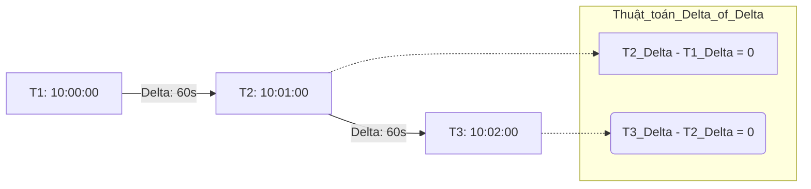
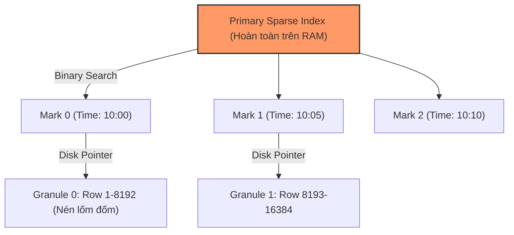

Trong các hệ thống phân tán, dữ liệu Chuỗi thời gian (Time-Series Data) phát sinh từ các cảm biến IoT, hệ thống giám sát (Kubernetes Metrics), Telemetry hay giao dịch tài chính mang một đặc thù vật lý vô cùng dị biệt: **Khối lượng ghi (Write) khổng lồ, luồng dữ liệu chỉ thêm mới (Append-only, hiếm khi Update), và các truy vấn phân tích thường quét dữ liệu theo một khoảng thời gian dài.**

Sử dụng RDBMS truyền thống (như MySQL hay PostgreSQL thuần) làm Data Store cho Time-Series sẽ ngay lập tức dẫn tới các điểm nghẽn nghiêm trọng về I/O đĩa và OOM (Out of Memory). Đó là lý do các hệ thống **Time-Series Databases (TSDB)** chuyên dụng ra đời.

---

## 1. Physical Execution: Tại sao B-Tree của RDBMS Gục Ngã?

RDBMS truyền thống (MySQL, Postgres) mặc định sử dụng cấu trúc **B-Tree** cho Primary/Secondary Index. 
- **Write Amplification (Khuếch đại Ghi khốc liệt):** Cấu trúc B-Tree sinh ra để phục vụ Random Read/Write cực tốt. Tuy nhiên, khi đối mặt với **High Ingestion Rate** (Bơm hàng triệu bản ghi mỗi giây), các Node trong B-Tree bị đẩy nhanh đến trạng thái đầy, kích hoạt cơ chế **Page Splits** (Tách trang) và cập nhật lại toàn bộ cây liên tục. Sự khuếch đại Ghi này gây ra hiện tượng Disk Thrashing (Nghẽn I/O đĩa), làm Write Throughput giảm tụt dốc thê thảm.
- **Lãng phí I/O (Row-oriented):** Khi phân tích Time-Series, ta thường quét (Scan) một vài cột (Ví dụ: Tính trung bình `cpu_usage`) trong một khoảng thời gian dài 30 ngày. B-Tree buộc RDBMS phải nạp toàn bộ Dòng (Row) chứa rất nhiều cột không liên quan từ đĩa cứng lên RAM, làm cạn kiệt băng thông bộ nhớ.

Để sinh tồn, TSDB BẮT BUỘC phải sử dụng kết hợp **Columnar Storage (Lưu trữ hướng Cột)** và các cấu trúc dữ liệu Ghi tuần tự (Log-Structured / LSM-Tree) để biến Random I/O thành Sequential I/O.

---

## 2. Đột Phá Lưu Trữ: Thuật Toán Nén Gorilla (Facebook 2015)

Dữ liệu chuỗi thời gian phình to với tốc độ kinh hoàng. Để hệ thống có thể lưu Cache dữ liệu nóng (Hot Data) trên RAM và phục vụ Query ở tốc độ Sub-millisecond, Facebook đã công bố thuật toán **Gorilla (VLDB 2015)**. Nó giúp nén kích thước lưu trữ Time-series xuống tới 10 lần.

Gorilla nén dữ liệu dựa trên đặc thù vật lý sau: Dữ liệu Sensor/Metrics gửi về cực kỳ đều đặn (Ví dụ: Cứ đúng 10 giây gửi 1 lần) và giá trị thay đổi rất ít (Ví dụ: Nhiệt độ 50.1°C lên 50.2°C).

### 2.1. Nén Timestamp: Delta-of-Delta
Thay vì lưu Timestamp 64-bit khổng lồ cho mỗi dòng, Gorilla tính khoảng cách thời gian giữa 2 lần gửi (`Delta`). Nếu thiết bị gửi cực kỳ đều đặn, `Delta` là một hằng số. Gorilla đi xa hơn bằng cách tính **Hiệu số của Hiệu số (Delta-of-Delta)**. Vì Delta là hằng số, Delta-of-Delta phần lớn sẽ bằng 0.

*Hệ thống mã hóa hàng triệu số 0 này chỉ bằng 1 bit duy nhất.*

### 2.2. Nén Giá trị Float: XOR Compression
Với các giá trị Float64, Gorilla sử dụng toán tử **XOR (Exclusive OR)** ở cấp độ Bit giữa giá trị hiện tại và giá trị trước đó.
- Nếu Nhiệt độ không đổi, XOR = 0 (Chỉ tốn 1 bit lưu trữ).
- Nếu thay đổi nhỏ xíu (Từ 50.1 -> 50.2), phép XOR sẽ tạo ra một chuỗi Bit chứa hàng chục số 0 ở đầu (Leading Zeros) và cuối (Trailing Zeros). Gorilla cắt bỏ toàn bộ số 0 này, chỉ lưu số lượng Zeros và mẩu dữ liệu có nghĩa ở giữa.

---

## 3. Cơn Ác Mộng Khốc Liệt Nhất: High Cardinality

**Cardinality (Độ phân cực)** là tổng số chuỗi thời gian (Time-series) duy nhất tồn tại trong hệ thống. Một chuỗi được định danh bằng công thức: `Metric_Name + {Tag_Key: Tag_Value}`.

- Ví dụ 1: Hệ thống có 100 Servers, phân bổ ở 3 Regions -> `Cardinality = 100 * 3 = 300` (Rất an toàn).
- Ví dụ 2: Data Engineer thiếu kinh nghiệm thêm Tag `container_id` (Do Kubernetes sinh Hash ngẫu nhiên và liên tục hủy đi tạo mới) hoặc Tag `user_id` -> `Cardinality = 100 * 3 * 1,000,000 = 300,000,000`.

**Hậu quả sập hệ thống (OOMKilled):**
Các TSDB truyền thống (như InfluxDB, Prometheus) duy trì một **Inverted Index (Chỉ mục Đảo ngược)** khổng lồ trên RAM để Map các Metadata Tags tới các Chuỗi vật lý dưới đĩa. Khi Cardinality bùng nổ, Index này phình to vượt quá dung lượng RAM vật lý. 
Lúc này, hệ điều hành (OS) bắt đầu Swap dữ liệu xuống đĩa cứng, dẫn đến độ trễ Ghi (Write Timeout) tăng vọt. Cuối cùng, tiến trình bị OS "Bắn bỏ" (OOMKilled).

**Cách Netflix đối phó (Atlas & Druid):** 
Netflix sử dụng Atlas (In-memory TSDB) và hứng chịu nỗi đau High Cardinality với dữ liệu Event Logs. Để khắc phục, họ phải dùng kỹ thuật **Streaming Alert Evaluation** (Đánh giá cảnh báo trên Luồng ngay trước khi Ghi xuống đĩa) để né giới hạn bộ nhớ, đồng thời dùng **Apache Druid Roll-ups** để gom nhóm (Pre-aggregate) các Row có cùng Dimension (Tags) theo thời gian, ép Cardinality giảm xuống trước khi Ingest.

---

## 4. Kiến trúc và Trade-offs: InfluxDB vs TimescaleDB vs ClickHouse

Thị trường TSDB chia làm 3 trường phái hệ thống: Purpose-built (InfluxDB), Relational Extension (TimescaleDB) và OLAP Engine (ClickHouse).

### 4.1. InfluxDB (TSM & TSI Architecture)
InfluxDB được viết bằng Go/Rust, sinh ra chuyên biệt 100% cho Time-Series.
- **TSM (Time-Structured Merge Tree):** Là bản tối ưu hóa của kiến trúc LSM-Tree chuyên cho Time-Series. Hỗ trợ Write siêu tốc và nén Gorilla.
- **TSI (Time Series Index):** Khi nhận ra Inverted Index trên RAM không thể Scale và gây sập vì High Cardinality, InfluxDB tạo ra TSI để đẩy Index xuống Disk (Sử dụng Memory-mapped files để "Lợi dụng" tính năng LRU Cache của OS).

**Trade-offs (Sự đánh đổi):**
- *Ưu điểm:* Cài đặt nhẹ, dễ dùng, nén dữ liệu cực gắt, hỗ trợ Data Retention (Tự động xóa rác) và Downsampling (Roll-up dữ liệu cũ) ngầm.
- *Nhược điểm:* TSI giảm tải RAM nhưng **Write Throughput vẫn bị tụt huyết áp** bởi High Cardinality. Mỗi khi có một Series mới (Churning), Engine buộc phải cập nhật Inverted Index lề mề trên đĩa. Bản mã nguồn mở (OSS) bị khóa chức năng Clustering (Phân tán nhiều Node).

### 4.2. TimescaleDB (PostgreSQL Extension)
Thay vì đập đi xây lại một Engine hoàn toàn mới, TimescaleDB biến PostgreSQL thành TSDB nhờ kiến trúc **Hypertables**. Lập trình viên chỉ thấy 1 Bảng (Table) duy nhất, nhưng ở tầng vật lý, dữ liệu bị băm vằn thành hàng nghìn **Chunks (Mảnh nhỏ)** theo thời gian.

**Trade-offs (Bài toán cấu hình Chunk Size):**
Sự sống còn của TimescaleDB nằm ở việc cấu hình tham số `chunk_time_interval`. 
- **Nếu Chunk quá lớn (Ví dụ 1 Tháng):** B-Tree Index của Chunk đang được Ghi (Active Chunk) sẽ phình to vượt quá 25% RAM. Postgres bị ép đẩy Index xuống đĩa, gây Disk Thrashing làm sập luồng Ingest.
- **Nếu Chunk quá nhỏ (Ví dụ 1 Giờ):** Gây ra **Metadata Bloat**. Khi bạn gõ `SELECT` 1 tháng, Query Planner của Postgres phải tính toán Execution Plan cho 720 Chunks con. Thời gian Plan Query (Lên kế hoạch) còn lâu hơn cả thời gian quét đĩa.
- *Ưu điểm:* Hỗ trợ Full SQL chuẩn, khả năng `JOIN` bá đạo với dữ liệu Business (Ví dụ: `JOIN` log nhiệt độ với bảng `Customer_Info`).

### 4.3. ClickHouse (Sparse Index & Columnar OLAP)
ClickHouse không thèm dùng Inverted Index cho Tags. Thay vào đó, nó là một cỗ máy cày ải OLAP dựa trên họ **MergeTree** và cấu trúc **Sparse Index (Chỉ mục Thưa)**.

Thay vì Index từng Dòng như Postgres, ClickHouse nhóm dữ liệu thành các **Granules (Hạt)** (Mặc định 8,192 dòng/Granule). Index chỉ lưu trữ giá trị đầu tiên của mỗi Granule. 

**Trade-offs [Chất dứt điểm High Cardinality]:**
- *Ưu điểm:* **Tuyệt chiêu trị tận gốc High Cardinality**. Vì không có Inverted Index khổng lồ nào cả, ClickHouse sử dụng sức mạnh đọc đĩa thô bạo (Brute-force Columnar Scan) kết hợp Sparse Index cực nhẹ (Nằm gọn trên RAM). Tốc độ Ingest có thể đạt hàng chục triệu Rows/giây bất chấp có bao nhiêu Tag.
- *Nhược điểm:* Thao tác `UPDATE/DELETE` là ác mộng (Phải dùng cơ chế `ALTER TABLE ... UPDATE` phi đồng bộ - Asynchronous Mutation). Thiếu các hàm Time-series có sẵn (Ví dụ: Trượt cửa sổ Gap-filling), buộc Data Engineer phải viết SQL phức tạp chết đi sống lại.

---

## 5. Kiến trúc Tổng kết (Decision Tree)

Dành cho System Design Interview hoặc chọn Stack:
1. Chọn **InfluxDB/Prometheus**: Nếu Team chỉ cần giám sát (Monitor/Alerting) máy chủ K8s, quy mô vửa phải, muốn có sẵn Retention/Downsampling.
2. Chọn **TimescaleDB**: Nếu dữ liệu Time-series cần được `JOIN` chặt chẽ với dữ liệu nghiệp vụ (Postgres), Team thành thạo SQL, quy mô không đòi hỏi một Cluster phân tán quá lớn.
3. Chọn **ClickHouse (Hoặc Apache Druid)**: Nếu hệ thống thuộc chuẩn Mega-scale (Hàng chục Tỷ bản ghi/ngày), dữ liệu chứa Logs/Metrics phức tạp, và Team liên tục mất ngủ vì sập Server do High Cardinality.

---

## Nguồn Tham Khảo (References)

1. **Facebook Whitepaper:** [Gorilla: A Fast, Scalable, In-Memory Time Series Database (VLDB 2015]][https://www.vldb.org/pvldb/vol8/p1816-teller.pdf]
2. **Netflix Tech Blog:** [Atlas: Netflix's Primary Telemetry Platform][https://netflixtechblog.com/]
3. **InfluxData Docs:** [InfluxDB Storage Engine (TSM & TSI]][https://docs.influxdata.com/influxdb/v1.8/concepts/storage_engine/]
4. **Timescale Docs:** [Hypertables and Chunks Architecture][https://docs.timescale.com/use-timescale/latest/hypertables/]
5. **ClickHouse Docs:** [Sparse Primary Indexes and Data Skipping](https://clickhouse.com/docs/en/optimize/sparse-primary-indexes]
