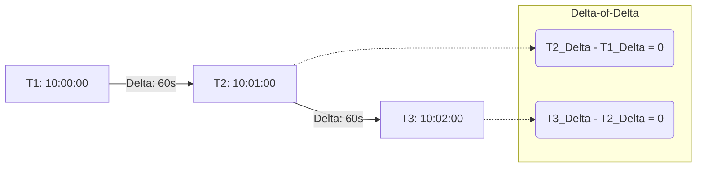
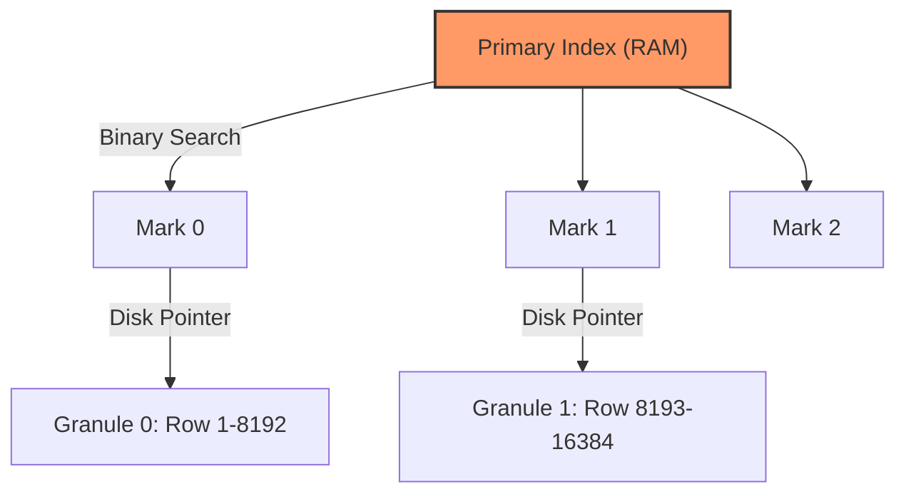

Trong các hệ thống phân tán, dữ liệu chuỗi thời gian (Time-Series Data) phát sinh từ các cảm biến IoT, log hệ thống (Kubernetes), telemetry hay giao dịch tài chính mang một đặc thù dị biệt: **Khối lượng ghi (Write) khổng lồ, Append-only (hầu như không bao giờ Update), và các truy vấn phân tích (OLAP) thường quét dữ liệu theo một khoảng thời gian dài.**

Sử dụng RDBMS truyền thống (như MySQL hay PostgreSQL thuần) làm Data Store cho Time-Series sẽ dẫn tới các điểm nghẽn nghiêm trọng về I/O đĩa và OOM (Out of Memory). Đó là lý do các hệ thống **Time-Series Databases (TSDB)** chuyên dụng ra đời.

## 1. Physical Execution: Tại sao B-Tree của RDBMS gục ngã?

RDBMS truyền thống mặc định sử dụng cấu trúc **B-Tree** cho primary/secondary index. 
- **Write Amplification (Khuếch đại Ghi):** B-Tree hoạt động cực tốt cho Random Read/Write. Tuy nhiên, khi đối mặt với **High Ingestion Rate** (hàng triệu bản ghi mỗi giây), các node trong B-Tree bị đẩy nhanh đến trạng thái đầy, kích hoạt cơ chế **Page Splits** (tách trang) và cập nhật lại toàn bộ cây. Sự khuếch đại ghi này gây ra Disk Thrashing (nghẽn I/O đĩa), làm Write Throughput giảm tụt dốc.
- **Lãng phí I/O (Row-oriented):** Khi phân tích Time-Series, ta thường quét (scan) một vài cột (ví dụ: `cpu_usage`) trong một khoảng thời gian dài. RDBMS phải nạp toàn bộ Row (chứa rất nhiều cột không liên quan) từ đĩa lên RAM.

Đó là lý do TSDB phải sử dụng kết hợp **Columnar Storage (Lưu trữ hướng cột)** và các cấu trúc Log-Structured (như LSM-Tree) để biến Random I/O thành Sequential I/O.

## 2. Thuật toán nén Gorilla (Facebook 2015)

Dữ liệu chuỗi thời gian phình to rất nhanh, đòi hỏi các thuật toán nén chuyên biệt để hệ thống có thể lưu cache dữ liệu nóng (hot data) trên RAM. Đột phá lớn nhất chính là thuật toán **Gorilla**, được Facebook giới thiệu trong Whitepaper năm 2015, giảm kích thước lưu trữ xuống tới 10 lần.

Gorilla nén dữ liệu dựa trên đặc thù: Dữ liệu Time-series gửi về cực kỳ đều đặn (VD: mỗi 10 giây) và giá trị thay đổi rất ít (VD: nhiệt độ 50.1°C -> 50.2°C).

### 2.1. Delta-of-Delta (Nén Timestamp)
Thay vì lưu Timestamp 64-bit khổng lồ, Gorilla tính khoảng cách giữa các Timestamp (`Delta`). Nếu thiết bị gửi đều đặn, `Delta` là một hằng số. Gorilla tiếp tục tính **Hiệu số của hiệu số (Delta-of-Delta)**. Vì Delta không đổi, Delta-of-Delta phần lớn sẽ bằng 0.


*Hệ thống mã hóa số 0 này chỉ bằng 1 bit duy nhất.*

### 2.2. XOR-Based Float Compression (Nén Giá trị)
Với các giá trị Float, Gorilla sử dụng toán tử **XOR (Exclusive OR)** giữa giá trị hiện tại và giá trị trước đó.
- Nếu không đổi, XOR = 0 (lưu bằng 1 bit).
- Nếu thay đổi nhỏ, XOR sẽ trả ra chuỗi bit chứa rất nhiều số 0 ở đầu (Leading zeros) và cuối (Trailing zeros). Hệ thống chỉ cần lưu số lượng zero và các bit có nghĩa ở giữa.

---

## 3. Cơn Ác Mộng: High Cardinality

**Cardinality (Độ phân cực)** là tổng số chuỗi thời gian (time-series) duy nhất trong hệ thống. Một chuỗi được định danh bằng: `Metric_Name + {Tag_Key: Tag_Value}`.

- Hệ thống 100 Servers, 3 Regions -> `Cardinality = 300` (Rất an toàn).
- Thêm tag `container_id` (được Kubernetes sinh ra ngẫu nhiên và hủy đi liên tục) -> `Cardinality = 100 * 3 * 1,000,000 = 300,000,000`.

**Hậu quả của High Cardinality (Đặc biệt là Churning Cardinality):**
Các TSDB truyền thống (như InfluxDB, Prometheus) duy trì một **Inverted Index** khổng lồ để map metadata tags tới các series vật lý. Khi Cardinality bùng nổ, Index này phình to, vượt quá dung lượng RAM. Hệ thống bắt đầu Swap xuống đĩa, dẫn đến OOMKilled (Out of Memory) hoặc Write Timeout.

---

## 4. Kiến trúc và Trade-offs: InfluxDB vs. TimescaleDB vs. ClickHouse

Thị trường chia làm 3 trường phái chính: Purpose-built (InfluxDB), Relational Extension (TimescaleDB) và OLAP Engine (ClickHouse).

### 4.1. InfluxDB (TSM & TSI Architecture)

InfluxDB được viết bằng Go/Rust, sinh ra chuyên biệt cho Time-Series.

- **TSM (Time-Structured Merge Tree):** Là bản tối ưu hóa của LSM-Tree chuyên cho Time-Series.
- **TSI (Time Series Index):** Khi nhận ra Inverted Index trên RAM không thể scale (gây ra sự cố High Cardinality), InfluxDB tạo ra TSI để đẩy Index xuống disk (sử dụng memory-mapped files để tận dụng LRU cache của OS).

```bash
# Code thực chiến: Dữ liệu InfluxDB Line Protocol
# <measurement>[,<tag_key>=<tag_value>...] <field_key>=<field_value>[,<field2>=<field2>...] [timestamp]
cpu,host=serverA,region=us-west usage_user=10.0,usage_system=5.0 1687799400000000000
```

**Trade-offs (Sự đánh đổi):**
- *Ưu điểm:* Cài đặt siêu nhanh, nén dữ liệu cực tốt, quản lý Retention và Downsampling tích hợp sẵn (Continuous Queries).
- *Nhược điểm:* TSI giảm tải RAM nhưng **Write Throughput vẫn bị ảnh hưởng nặng** bởi High Cardinality. Mỗi series mới sinh ra (churning) buộc engine phải cập nhật Inverted Index trên đĩa. Bản mã nguồn mở không hỗ trợ Clustering phân tán.

### 4.2. TimescaleDB (PostgreSQL Extension)

Thay vì tạo ra engine hoàn toàn mới, TimescaleDB biến PostgreSQL thành TSDB nhờ kiến trúc **Hypertables**. Lập trình viên tương tác với một bảng duy nhất, nhưng ở mức vật lý (Physical Layer), dữ liệu được phân mảnh thành các **Chunks**.

```sql
-- Chuyển đổi bảng PostgreSQL thành Hypertable
CREATE TABLE conditions (
  time        TIMESTAMPTZ       NOT NULL,
  location    TEXT              NOT NULL,
  temperature DOUBLE PRECISION  NULL
);

-- Phân mảnh (chunk) dữ liệu mỗi 7 ngày
SELECT create_hypertable('conditions', by_range('time', INTERVAL '7 days'));
```

**Trade-offs (Tối ưu Chunk Size):**
Bài toán kiến trúc lớn nhất của TimescaleDB là cấu hình `chunk_time_interval`. 
- **Nếu Chunk quá lớn:** Index của Chunk đang Write (Active Chunk) vượt quá 25% RAM. OS phải đẩy Index xuống disk -> Gây Disk Thrashing trong lúc Ingest.
- **Nếu Chunk quá nhỏ:** Gây ra **Metadata Bloat** và Query Planning Overhead. Khi SELECT, Query Planner của Postgres phải tính toán execution plan cho hàng nghìn Chunks con, làm thời gian plan query lâu hơn cả thời gian execute.
- *Ưu điểm:* Hỗ trợ SQL chuẩn, có thể `JOIN` trực tiếp với dữ liệu nghiệp vụ (VD: `JOIN` log với bảng `User_Profile`).

### 4.3. ClickHouse (Sparse Index & Columnar OLAP)

ClickHouse không dùng Inverted Index như InfluxDB, thay vào đó nó là một cỗ máy cày ải OLAP dựa trên họ **MergeTree** và **Sparse Index (Chỉ mục thưa)**. 

Thay vì index từng dòng, ClickHouse nhóm dữ liệu thành các **Granules** (mặc định 8,192 dòng/granule). Index chỉ lưu trữ giá trị đầu tiên của mỗi granule. 



```sql
-- Khởi tạo bảng MergeTree trong ClickHouse
CREATE TABLE system_metrics (
    timestamp DateTime,
    container_id String,
    cpu_usage Float32
) ENGINE = MergeTree()
ORDER BY (timestamp, container_id) -- Dữ liệu sắp xếp vật lý theo time
SETTINGS index_granularity = 8192;
```

**Trade-offs (Giải quyết triệt để High Cardinality):**
- *Ưu điểm:* **Trị tận gốc High Cardinality**. Vì không duy trì Inverted Index khổng lồ cho từng Tag, ClickHouse sử dụng sức mạnh rà soát cột (brute-force scan) kết hợp Sparse Index (nằm hoàn toàn trên RAM). Tốc độ Ingest có thể đạt hàng triệu rows/giây mà không bị ngộp.
- *Nhược điểm:* Các thao tác UPDATE/DELETE rất nặng (phải dùng `ALTER TABLE ... UPDATE` dạng Mutation phi đồng bộ). Thiếu các hàm Time-series tích hợp sẵn (như các hàm trượt cửa sổ phức tạp), yêu cầu Data Engineer phải viết SQL phức tạp hơn.

---

## 5. Kiến trúc Tổng kết (Decision Tree)

1. Chọn **InfluxDB** nếu: Team chỉ cần xây dựng hệ thống giám sát Metrics (Monitor/Alerting), hệ sinh thái đã dùng TICK/Telegraf, Cardinality kiểm soát được.
2. Chọn **TimescaleDB** nếu: Dữ liệu Time-series cần được `JOIN` mạnh mẽ với Business Data (Postgres), team vững SQL, quy mô không đòi hỏi một cluster phân tương lớn.
3. Chọn **ClickHouse** nếu: Hệ thống thuộc hàng Mega-scale (hàng chục tỷ bản ghi), dữ liệu chứa logs/traces/metrics phức tạp, và hệ thống liên tục crash vì High/Churning Cardinality.

---

## Nguồn Tham Khảo (References)

1. [Gorilla: A Fast, Scalable, In-Memory Time Series Database (Facebook Whitepaper, 2015)](https://www.vldb.org/pvldb/vol8/p1816-teller.pdf)
2. [InfluxDB Storage Engine: Time-Structured Merge Tree (TSM) & Time Series Index (TSI)](https://docs.influxdata.com/influxdb/v1.8/concepts/storage_engine/)
3. [TimescaleDB Architecture: Hypertables and Chunks (Timescale Docs)](https://docs.timescale.com/use-timescale/latest/hypertables/)
4. [ClickHouse Sparse Indexes and Data Skipping (ClickHouse Official Blog)](https://clickhouse.com/docs/en/optimize/sparse-primary-indexes)

