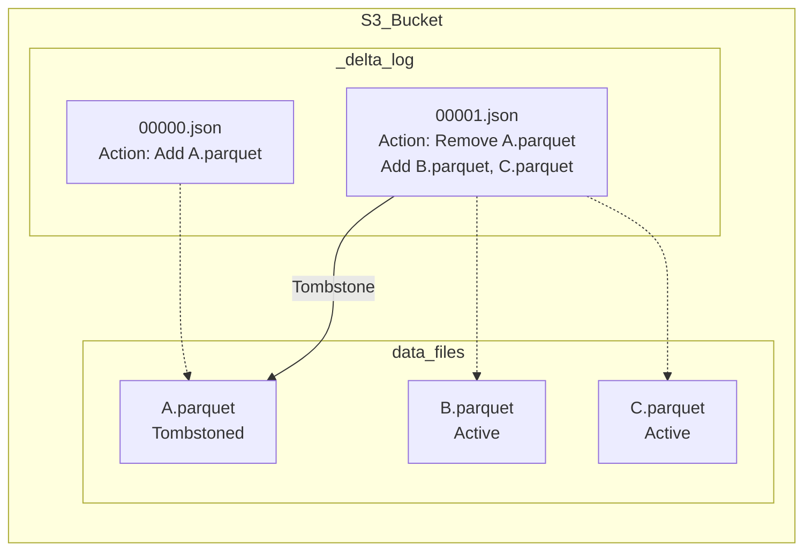

Khi một Data Pipeline vô tình chạy lệnh `DELETE` xóa trắng bảng hoặc ghi nhầm hàng triệu record lỗi (bad data), phản xạ đầu tiên của Data Engineer không còn là tìm file backup hôm qua. Nhờ tính năng **Time Travel** trên các Table Format hiện đại (Delta Lake, Apache Iceberg, Apache Hudi), việc khôi phục (rollback) chỉ tốn vài giây.

Tuy nhiên, Time Travel không phải là "phép thuật". Dưới góc nhìn kiến trúc hệ thống, nó là một dạng triển khai của **MVCC (Multi-Version Concurrency Control)** trên Cloud Object Storage (S3/GCS). Bài viết này sẽ mổ xẻ cách cơ chế này hoạt động ở tầng vật lý, những rủi ro vận hành (Operational Risks) và sự đánh đổi (Trade-offs) bạn phải trả.

## 1. Kiến trúc Thực thi Vật lý (Physical Execution)

Trên Data Lakehouse, dữ liệu vật lý là **bất biến (Immutable)**. Các file Parquet một khi được ghi xuống S3 sẽ không bao giờ bị sửa đổi in-place. Mọi thao tác `UPDATE`, `DELETE`, `MERGE` thực chất là tạo ra các file Parquet *mới* và đánh dấu các file cũ là "đã xóa" (Tombstoned).

### 1.1. Cơ chế Transaction Log của Delta Lake
Delta Lake quản lý phiên bản thông qua thư mục `_delta_log`. Mỗi giao dịch (commit) tạo ra một file JSON (ví dụ `00000.json`, `00001.json`).



Khi bạn truy vấn `VERSION AS OF 0`, Spark engine sẽ đọc file `00000.json`, nhận diện file `A.parquet` và quét nó, hoàn toàn phớt lờ sự tồn tại của `B` và `C`.

### 1.2. Cơ chế Snapshot & Manifest của Apache Iceberg
Iceberg sử dụng mô hình cây phân cấp Metadata. Mỗi lần commit, Iceberg sinh ra một **Snapshot** mới. Snapshot trỏ tới một **Manifest List**, và Manifest List trỏ tới các **Manifest Files** chứa danh sách đường dẫn tới các file Parquet thực tế.

Iceberg lưu trữ mốc thời gian (timestamp) gắn liền với từng Snapshot ID. Khi bạn gọi Time Travel, engine tìm Snapshot ID gần nhất với mốc thời gian yêu cầu và nạp chính xác cây metadata đó lên RAM (Driver node).

## 2. Code Thực chiến (Show, Don't Tell)

### Truy vấn dữ liệu lịch sử (Point-in-time)

**Với PySpark (Delta Lake):**
```python
# Đọc dữ liệu tại một version cụ thể
df_v5 = spark.read.format("delta").option("versionAsOf", 5).load("s3://bucket/my_table")

# Đọc dữ liệu tại một mốc thời gian
df_time = spark.read.format("delta") \
  .option("timestampAsOf", "2026-06-01T12:00:00.000Z") \
  .load("s3://bucket/my_table")
```

**Với Trino SQL (Apache Iceberg):**
```sql
-- Iceberg hỗ trợ cú pháp FOR SYSTEM_VERSION AS OF hoặc FOR TIMESTAMP AS OF
SELECT * 
FROM iceberg_catalog.my_db.my_table FOR TIMESTAMP AS OF TIMESTAMP '2026-06-01 12:00:00.000';
```

### Rollback (Khôi phục thảm họa)

Thay vì viết Spark job đè lại toàn bộ data, các Table Format hỗ trợ Rollback thông qua Metadata (cực nhanh, O(1) time complexity vì bản chất chỉ là thay đổi con trỏ metadata):

```sql
-- Delta Lake: Đưa bảng về Version 10
RESTORE TABLE my_table TO VERSION AS OF 10;

-- Iceberg: Gọi system procedure để quay về snapshot trước đó
CALL catalog.system.rollback_to_timestamp('my_db', 'my_table', TIMESTAMP '2026-06-01 12:00:00.000');
```

## 3. Rủi ro Vận hành & Systemic Trade-offs

Giữ lại mọi file Parquet để phục vụ Time Travel là một con dao hai lưỡi. Dưới đây là những góc nhìn đánh đổi mà một Staff Engineer phải cân nhắc.

### 3.1. Sự cố Kinh điển: `FileNotFoundException` (Concurrent Reader Failure)

**Tình huống:** 
- Lúc 08:00 AM, một Data Scientist khởi chạy một Spark job train model trên toàn bộ lịch sử bảng, dự kiến mất 3 tiếng để chạy (bắt đầu đọc từ Version 50).
- Lúc 09:00 AM, một cronjob bảo trì hệ thống chạy lệnh `VACUUM` (Delta) hoặc `expire_snapshots` (Iceberg) với cấu hình retention quá thấp (VD: `RETAIN 0 HOURS`).
- Kết quả: `VACUUM` quét S3 và xóa vật lý các file Parquet bị đánh dấu tombstone của Version 50. Lúc 09:05 AM, các Executor của Spark job cố gắng fetch file Parquet đó từ S3 và văng lỗi **`FileNotFoundException`**. Toàn bộ cluster sập.

**Troubleshooting & Best Practice:**
- **Tuyệt đối KHÔNG** set retention threshold xuống sát 0 trên môi trường Production trừ khi bạn cực kỳ hiểu rõ luồng đọc/ghi.
- Mức retention tiêu chuẩn thường là **7 ngày**. Đủ để Time Travel và an toàn cho các truy vấn đọc kéo dài (long-running readers).
- *Trade-off:* **Storage Cost vs. Query Safety**. Bạn trả thêm tiền lưu trữ Cloud cho các file rác trong 7 ngày để đổi lấy tính sẵn sàng và sự an toàn.

### 3.2. Metadata Explosion (Nổ tung Metadata ở Driver Node)

Nếu bạn ingest dữ liệu bằng Spark Structured Streaming, mỗi micro-batch (vài giây) sẽ tạo ra một commit. Sau 1 tháng, bạn có hàng triệu file `.json` (Delta) hoặc `snap-*.avro` (Iceberg). 

Khi một truy vấn phân tích mới khởi chạy, Node Driver phải tải toàn bộ đống metadata khổng lồ này lên RAM để tính toán State hiện tại (quét qua hàng nghìn file logs). Hậu quả: **JVM OOMKilled (Out of Memory)** hoặc thời gian planning câu query tốn nhiều thời gian hơn cả thời gian execution thực sự.

**Giải pháp & Khắc phục:**
- **Checkpointing (Delta Lake):** Cứ sau 10 commit, Delta tự động gom metadata thành một file `.checkpoint.parquet` duy nhất. Tuy nhiên, nếu bạn time-travel về một version nằm sâu giữa 2 checkpoint xa xôi, engine vẫn phải load lại rất nhiều file JSON rời rạc.
- **Tối ưu Tần suất Commit:** Cân nhắc tinh chỉnh lại `trigger` interval của các streaming job (ví dụ: từ 1 giây lên 1 phút) để giảm lượng commit rác, giúp metadata gọn nhẹ và query planning nhanh hơn.

### 3.3. Dọn rác với VACUUM và Expire Snapshots (FinOps)

Để tối ưu chi phí lưu trữ đám mây (FinOps), việc lên lịch chạy quá trình dọn dẹp định kỳ (Garbage Collection) là bắt buộc. Quá trình này sẽ rà soát metadata và gửi HTTP `DELETE` object xuống S3 để xóa file vật lý.

**Delta Lake (VACUUM):**
```sql
-- Dọn dẹp các file rác không còn tham chiếu trong 168 giờ (7 ngày) qua
VACUUM my_table RETAIN 168 HOURS;
```
*Lưu ý:* Nếu bạn cố ép RETAIN < 168 hours (dưới 7 ngày), Spark mặc định sẽ ném ra exception để bảo vệ bạn. Để bypass, bạn phải cấu hình `set spark.databricks.delta.retentionDurationCheck.enabled = false`. Tuy nhiên, hãy nhớ lại thảm họa ở mục 3.1 trước khi quyết định.

**Apache Iceberg:**
```sql
-- Dọn dẹp snapshot cũ khỏi metadata
CALL catalog.system.expire_snapshots(
  table => 'my_db.my_table',
  older_than => TIMESTAMP '2026-06-19 00:00:00.000',
  retain_last => 5 -- Luôn đảm bảo giữ lại ít nhất 5 snapshot gần nhất dù đã quá hạn
);
```

## Nguồn Tham Khảo (References)

1. [Databricks: Diving Into Delta Lake - Unpacking The Transaction Log](https://www.databricks.com/blog/2019/08/21/diving-into-delta-lake-unpacking-the-transaction-log.html)
2. [Apache Iceberg Official Docs: Snapshot Isolation and Time Travel](https://iceberg.apache.org/docs/latest/snapshots/)
3. [Martin Kleppmann - Designing Data-Intensive Applications (Chapter 3: SSTables, LSM-Trees và B-Trees)](https://dataintensive.net/)
4. [Delta Lake Docs: VACUUM and Safety Checks](https://docs.delta.io/latest/delta-utility.html#vacuum)
