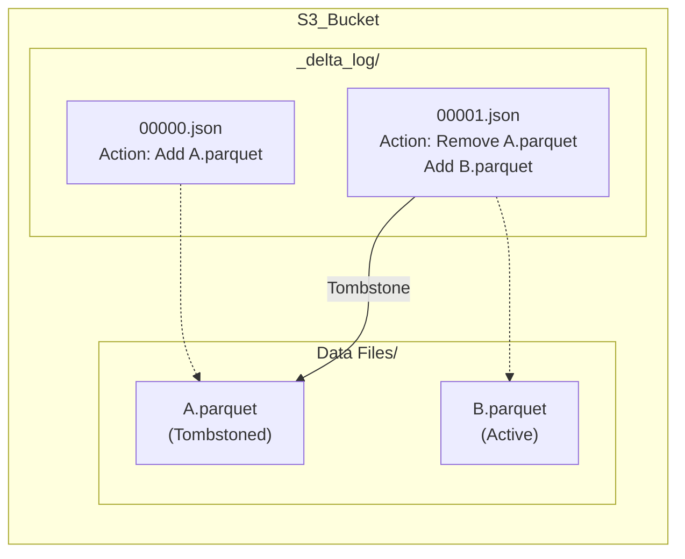

Khi một Data Pipeline vô tình chạy lệnh `DELETE` xóa trắng bảng hoặc ghi nhầm hàng triệu record lỗi (bad data), phản xạ đầu tiên của Data Engineer truyền thống là tìm file backup hôm qua và hì hục khôi phục. Nhưng trên Data Lakehouse (Delta Lake, Apache Iceberg), việc khôi phục (rollback) chỉ tốn vài giây thông qua tính năng **Time Travel**.

Tuy nhiên, Time Travel không phải là "phép thuật". Dưới góc nhìn kiến trúc hệ thống, nó là một dạng triển khai của **MVCC (Multi-Version Concurrency Control)** và **Snapshot Isolation** trên Cloud Object Storage (S3/GCS). Bạn đang dùng tiền (Storage Cost) để mua lấy sự an toàn.

---

## 1. Kiến Trúc Thực Thi Vật Lý (MVCC & Immutability)

Nguyên lý tối thượng của Data Lakehouse: **Dữ liệu vật lý là Bất biến (Immutable)**.
Các file Parquet một khi được ghi xuống S3 sẽ KHÔNG BAO GIỜ bị sửa đổi (in-place update). Mọi thao tác `UPDATE` hoặc `DELETE` thực chất là:
1. Ghi các file Parquet *mới* chứa dữ liệu đã cập nhật.
2. Đánh dấu các file Parquet *cũ* là "đã xóa" (Tombstoned) ở tầng Metadata.

### 1.1. Delta Lake: Nhật Ký Giao Dịch (Transaction Log)
Delta quản lý phiên bản thông qua thư mục `_delta_log`. Mỗi giao dịch (commit) tạo ra một file JSON tuần tự.


Khi bạn truy vấn `VERSION AS OF 0`, Spark sẽ đọc file `00000.json`, nhận diện file `A.parquet` và quét nó, hoàn toàn phớt lờ sự tồn tại của `B.parquet`.

### 1.2. Apache Iceberg: Cây Metadata (Snapshot Tree)
Iceberg tạo ra một cây phân cấp rành mạch hơn. Mỗi lần commit sinh ra một **Snapshot**.
Snapshot trỏ tới một **Manifest List**, Manifest List trỏ tới các **Manifest Files**, và cuối cùng trỏ tới File Parquet.
Nhờ lưu trữ Timestamp gắn chặt với Snapshot ID, Iceberg cho phép rollback về chính xác một sát na trong quá khứ một cách dễ dàng (O(1) time complexity vì chỉ đổi con trỏ Metadata).

---

## 2. Thực Chiến Time Travel (Code)

### Truy vấn Point-in-time
**PySpark (Delta Lake):**
```python
# Đọc dữ liệu tại Version 5
df_v5 = spark.read.format("delta").option("versionAsOf", 5).load("s3://bucket/table")

# Đọc dữ liệu tại thời điểm quá khứ
df_time = spark.read.format("delta") \
  .option("timestampAsOf", "2026-06-01T12:00:00.000Z") \
  .load("s3://bucket/table")
```

**Trino SQL [Apache Iceberg]:**
```sql
SELECT * FROM iceberg.my_db.my_table 
FOR TIMESTAMP AS OF TIMESTAMP '2026-06-01 12:00:00.000';
```

### Khôi phục thảm họa (Rollback)
Quá trình này diễn ra ngay lập tức, không tốn I/O để di chuyển data:
```sql
-- Delta Lake
RESTORE TABLE my_table TO VERSION AS OF 10;

-- Iceberg
CALL catalog.system.rollback_to_timestamp('my_db', 'my_table', TIMESTAMP '2026-06-01 12:00:00.000');
```

---

## 3. Rủi Ro Vận Hành & Systemic Trade-offs

Giữ lại mọi file Parquet rác để phục vụ Time Travel là một con dao hai lưỡi. Bạn phải đối mặt với các sự cố sau:

### 3.1. Sự Cố Kinh Điển: `FileNotFoundException`
**Tình huống:** 
- `08:00 AM`: Data Scientist chạy một job Spark train AI cực nặng, dự kiến quét bảng trong 3 tiếng (Bắt đầu đọc từ Version 50).
- `09:00 AM`: Data Engineer cài cronjob chạy lệnh `VACUUM RETAIN 0 HOURS` (Xóa ngay lập tức mọi data cũ để tiết kiệm tiền S3).
- **Kết quả:** `VACUUM` xóa vật lý các file Parquet Tombstoned của Version 50. Lúc `09:05 AM`, Spark Executor của Data Scientist gọi API `S3 GET` để lấy file Parquet đó $\rightarrow$ Văng lỗi **`FileNotFoundException`**. Toàn bộ job AI 3 tiếng sập đổ.

**Best Practice:**
- Tuyệt đối **KHÔNG BAO GIỜ** set retention threshold xuống sát `0`.
- Standard industry là giữ **7 ngày (168 giờ)**. Bạn chấp nhận trả thêm tiền AWS S3 cho 7 ngày dữ liệu rác để bảo vệ các Long-running Queries (Reader Isolation).

### 3.2. Metadata Explosion (JVM OOMKilled)
Nếu hệ thống Kafka Streaming của bạn đẩy dữ liệu và commit mỗi giây, sau 1 tháng bạn sẽ có 2.5 triệu file JSON metadata. 
Khi chạy câu lệnh `SELECT COUNT(*)`, Node Driver của Spark phải load 2.5 triệu file JSON lên bộ nhớ RAM (Heap) để dựng lại Snapshot.
$\rightarrow$ Hậu quả: Spark Driver chết vì **OOMKilled** trước khi chạm vào bất kỳ file Parquet nào.
**Giải pháp:** Giảm tần suất trigger của Streaming Job (Ví dụ: 1 phút/lần thay vì 1 giây/lần), hoặc phụ thuộc vào Checkpointing của Delta Lake.

### 3.3. FinOps vs History (Dọn rác vật lý)
Để tối ưu chi phí Cloud, bạn phải chủ động dọn rác (Hard Delete) bằng các lệnh sau:

**Delta Lake (VACUUM):**
```sql
-- Dọn dẹp file vật lý không thuộc về bất kỳ active snapshot nào trong 7 ngày qua
VACUUM production.orders RETAIN 168 HOURS;
```

**Apache Iceberg (Expire Snapshots):**
```sql
CALL catalog.system.expire_snapshots(
  table => 'my_db.my_table',
  older_than => TIMESTAMP '2026-06-19 00:00:00.000',
  retain_last => 5 -- Safety net: Luôn giữ 5 snapshot gần nhất
);
```

---

## Nguồn Tham Khảo (References)
* [Delta Lake Docs: VACUUM and Safety Checks](https://docs.delta.io/latest/delta-utility.html#vacuum)
* [Apache Iceberg: Snapshot Isolation and Time Travel](https://iceberg.apache.org/docs/latest/snapshots/)
* *Designing Data-Intensive Applications (Chapter 3: SSTables, LSM-Trees và B-Trees)* - Martin Kleppmann.
