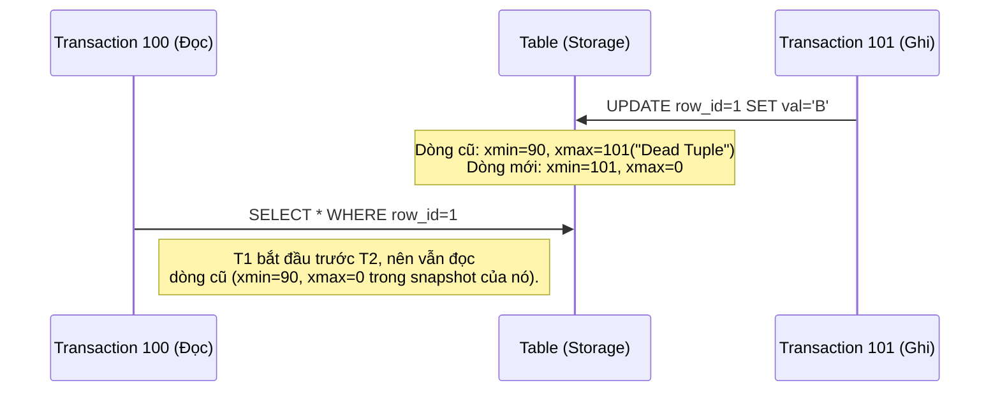
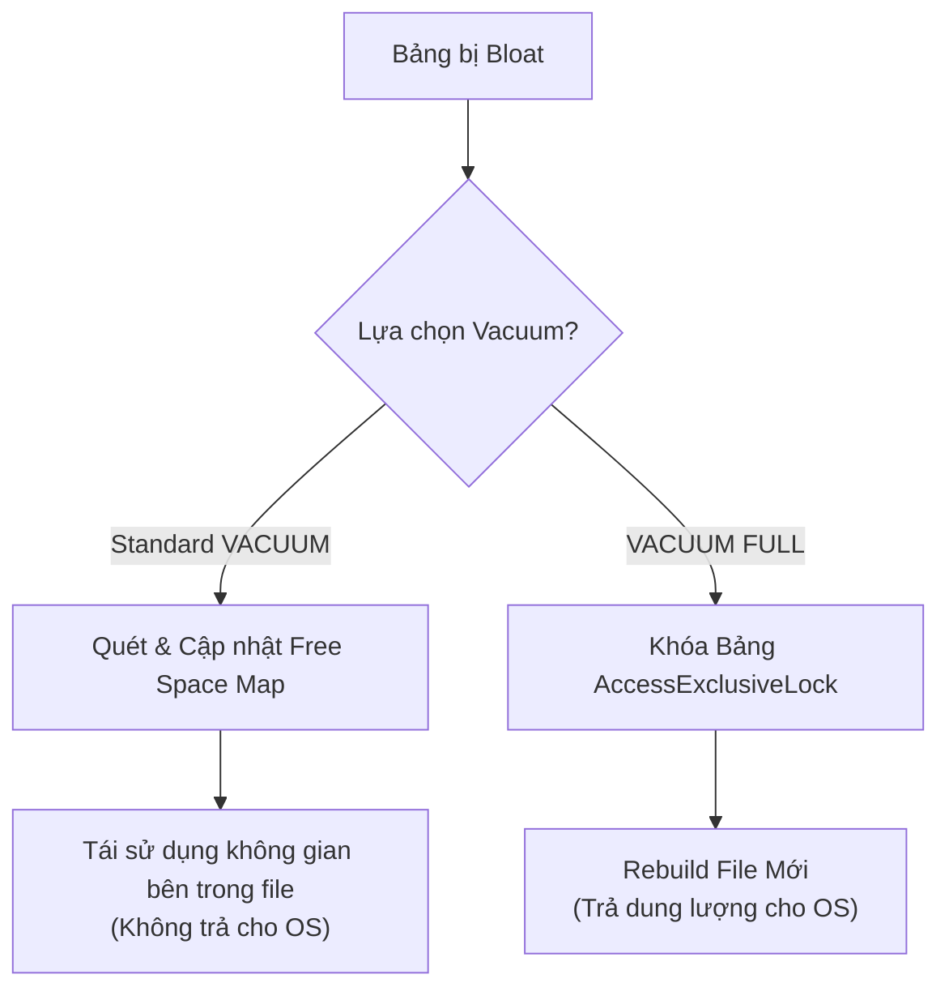

Trong các hệ thống quản trị cơ sở dữ liệu truyền thống như PostgreSQL và các Data Lakehouse hiện đại (Delta Lake, Apache Iceberg), cơ chế **MVCC (Multi-Version Concurrency Control)** được sử dụng làm nền tảng cốt lõi để cho phép nhiều giao dịch (transaction) cùng đọc và ghi dữ liệu đồng thời mà không bị lock (khóa) lẫn nhau. 

Tuy nhiên, "cái giá" của MVCC là sự phình to dữ liệu (Data Bloat) do các phiên bản cũ bị bỏ lại. Để hệ thống không bị tràn ổ cứng hoặc suy giảm hiệu suất trầm trọng, cơ chế **Vacuum** ra đời như một Garbage Collector (Bộ thu gom rác) cho Storage Engine.

Bài viết này đi sâu vào phân tích kiến trúc vật lý của Dead Tuples, cách Vacuum vận hành, sự đánh đổi hệ thống (Trade-offs) và những rủi ro sập hệ thống thực tế.

---

## 1. Cơ chế Vật lý của MVCC và Sự hình thành "Dead Tuples"

### 1.1. Trong PostgreSQL (RDBMS)

PostgreSQL không bao giờ ghi đè trực tiếp (in-place update) lên dữ liệu vật lý. Mỗi dòng (Row/Tuple) trong PostgreSQL đều đi kèm với các trường metadata ẩn (System Columns) như `xmin` (ID của Transaction tạo ra dòng) và `xmax` (ID của Transaction xóa/cập nhật dòng).

Khi một lệnh `UPDATE` hoặc `DELETE` diễn ra:
- **DELETE:** PostgreSQL cập nhật `xmax` của dòng hiện tại thành ID của Transaction gọi lệnh DELETE. Dòng này không bị xóa khỏi đĩa cứng ngay lập tức.
- **UPDATE:** Thực chất là quá trình `DELETE` dòng cũ và `INSERT` dòng mới. 

Những dòng bị đánh dấu xóa (có `xmax` hợp lệ và transaction đó đã commit) được gọi là **Dead Tuples**. Dưới đây là sơ đồ luồng mô phỏng MVCC trong PostgreSQL:



**Hậu quả (Data Bloat):** Nếu một bảng Transaction Table liên tục bị UPDATE, các Dead Tuples sẽ lấp đầy các Page (Block 8KB mặc định của Postgres), khiến các truy vấn `Seq Scan` (Quét tuần tự) phải đọc qua một lượng khổng lồ "rác", làm tăng I/O và giảm throughput.

### 1.2. Trong Data Lakehouse (Delta Lake / Apache Iceberg)

Kiến trúc Lakehouse dựa trên các file bất biến (Immutable Files) như Parquet. Do đó, hiện tượng sinh rác diễn ra ở cấp độ **File** thay vì cấp độ Tuple.

- Khi có lệnh `MERGE`, `UPDATE` hoặc `DELETE`, hệ thống sẽ ghi các bản ghi hợp lệ sang một (hoặc nhiều) file Parquet mới.
- Các file cũ bị đánh dấu là "Tombstoned" (trong Delta Log) hoặc bị loại khỏi Snapshot mới nhất (trong Iceberg Manifest).
- Các file cũ này vẫn nằm trơ trọi trên Object Storage (Amazon S3 / GCS) để phục vụ cho **Time Travel** (Truy vấn lại dữ liệu trong quá khứ).

Nếu không được dọn dẹp, dung lượng S3 sẽ tăng theo cấp số nhân.

---

## 2. Kiến trúc Thực thi Vật lý (Physical Execution) của Vacuum

### 2.1. PostgreSQL: Standard Vacuum vs Vacuum Full

PostgreSQL chia tiến trình dọn dẹp làm hai chiến lược với Trade-offs hoàn toàn trái ngược nhau.

#### Standard VACUUM (Cơ chế dọn dẹp chạy ngầm)
- **Cách hoạt động:** Quét các Page trong bảng, xác định các Dead Tuples và thêm địa chỉ của chúng vào **Free Space Map (FSM)**. Từ đó, các lệnh `INSERT`/`UPDATE` tiếp theo có thể chèn dữ liệu vào các khoảng trống này.
- **Trade-off:** Rất nhẹ, chạy song song với các thao tác Đọc/Ghi (`ShareUpdateExclusiveLock`). Tuy nhiên, nó **không trả lại dung lượng (Disk Space) cho Hệ điều hành (OS)**. File vật lý vẫn giữ nguyên kích thước lớn nhất nó từng đạt.

#### VACUUM FULL (Rebuild toàn bộ bảng)
- **Cách hoạt động:** Tạo ra một file vật lý hoàn toàn mới, copy toàn bộ Live Tuples (dữ liệu còn sống) sang, sau đó xóa file cũ. Trả lại toàn bộ không gian cho OS.
- **Trade-off chí mạng:** Yêu cầu `AccessExclusiveLock`. Toàn bộ bảng bị khóa cứng. **Mọi thao tác SELECT, INSERT, UPDATE, DELETE đều bị block cho đến khi chạy xong.** Không bao giờ dùng lệnh này trên Production vào giờ cao điểm!



### 2.2. Delta Lake: VACUUM Command

Trong Delta Lake, lệnh `VACUUM` xóa vĩnh viễn các file dữ liệu vật lý không còn được tham chiếu bởi Delta Log và đã cũ hơn một khoảng thời gian giữ lại (Retention Period).

```sql
-- Chạy trên Spark SQL / Databricks
-- Lệnh này xóa các file rác cũ hơn 168 giờ (7 ngày)
VACUUM events_table RETAIN 168 HOURS;
```

**Bẫy Vận Hành (Operational Trap):** Nhiều Junior Data Engineer thường set `RETAIN 0 HOURS` để tiết kiệm chi phí S3. Nếu có một job Streaming đang ngầm đọc một file cũ (để xử lý late data), mà lệnh VACUUM vừa xóa mất file đó trên S3, Streaming Job sẽ **crash lập tức** với lỗi `FileNotFoundException`.

### 2.3. Apache Iceberg: Tách bạch Metadata và Data Files

Iceberg giải quyết bài toán Data Bloat một cách tinh tế hơn bằng việc chia Garbage Collection thành 2 phase riêng biệt:

1. **`expire_snapshots` (Dọn dẹp Metadata):** Xóa các Snapshot cũ khỏi `metadata.json`, giúp metadata không bị phình to làm chậm quá trình Query Planning của Trino/Spark.
2. **`remove_orphan_files` (Dọn dẹp Physical Files):** Quét thư mục S3, so sánh với các file đang được Snapshot hợp lệ tham chiếu. Bất kỳ file Parquet nào không nằm trong danh sách sẽ bị xóa bỏ.

```sql
-- Iceberg Spark SQL Thực chiến
-- Bước 1: Xóa Metadata Snapshot cũ hơn 7 ngày
CALL catalog.system.expire_snapshots(
  table => 'db.events',
  older_than => TIMESTAMP '2026-06-19 00:00:00.000',
  retain_last => 5
);

-- Bước 2: Dọn rác vật lý bị mồ côi (Orphan files)
CALL catalog.system.remove_orphan_files(
  table => 'db.events',
  older_than => TIMESTAMP '2026-06-23 00:00:00.000'
);
```
Sự tách bạch này giúp Iceberg an toàn hơn: `remove_orphan_files` có thể dọn được cả các file rác sinh ra do quá trình Write bị crash giữa chừng (những file chưa kịp đưa vào metadata).

---

## 3. Rủi ro Vận hành & Cấu hình Autovacuum (Troubleshooting)

### 3.1. Thảm họa Transaction ID Wraparound (PostgreSQL)
PostgreSQL dùng số nguyên 32-bit cho Transaction ID (XID), giới hạn ở khoảng 2 tỷ (2,147,483,648). Khi hệ thống chạm đến giới hạn này, XID sẽ "bọc vòng" (wraparound) quay về 0. 
- **Hậu quả:** Các transaction hiện tại sẽ thấy dữ liệu cũ kỹ (vừa ghi hôm qua) bỗng nhiên biến thành dữ liệu "của tương lai" (do XID > 2 tỷ lớn hơn XID 0), khiến mọi dữ liệu biến mất khỏi các lượt đọc. Database sẽ **ngừng hoạt động (force shutdown)** để bảo vệ dữ liệu.
- **Cách khắc phục:** Vacuum đóng vai trò cực kỳ quan trọng trong việc "đóng băng" (Freeze) các XID cũ. Khi `age(relfrozenxid)` của một bảng quá cao, Autovacuum sẽ kích hoạt cơ chế `VACUUM FREEZE` để đánh dấu dòng đó là "vĩnh viễn hiển thị với mọi người", reset XID age về 0.

### 3.2. Cấu hình Autovacuum Thực chiến cho Bảng Lớn
Autovacuum chạy ngầm và dựa vào công thức:
`Ngưỡng_kích_hoạt = autovacuum_vacuum_threshold + autovacuum_vacuum_scale_factor * số_dòng_của_bảng`

Mặc định, `scale_factor` là 0.2 (20%). Nếu bảng có 1 tỷ dòng, phải có 200 triệu dòng thay đổi thì Autovacuum mới chạy. Điều này là **quá trễ** cho các hệ thống High-Traffic.

**Code Cấu hình (`postgresql.conf`):**
```yaml
# Tinh chỉnh chung để Autovacuum chạy mạnh mẽ hơn
autovacuum_max_workers = 5              # Tăng số luồng chạy song song (mặc định 3)
autovacuum_vacuum_cost_limit = 2000     # Tăng limit I/O để chạy nhanh hơn (mặc định 200)
autovacuum_vacuum_cost_delay = 2ms      # Giảm độ trễ giữa các lượt quét (mặc định 20ms)

# Đối với bảng siêu lớn, nên ALTER TABLE riêng thay vì chỉnh toàn cục:
# ALTER TABLE heavy_updates SET (autovacuum_vacuum_scale_factor = 0.01);
```

### 3.3. Chiến lược Retention an toàn cho Data Lakehouse
Ở môi trường Production, quy tắc bất thành văn cho Delta Lake / Iceberg là:
- Luôn giữ Retention của Vacuum tối thiểu từ **3 đến 7 ngày**. 
- Khoảng thời gian này là độ trễ an toàn để các Batch Job chạy lại khi có sự cố, cũng như để Team Data có thể "Time Travel" truy nguyên nguyên nhân nếu logic xử lý bị lỗi.

---

## 4. Nguồn Tham Khảo (References)

1. [Understanding autovacuum in Amazon RDS for PostgreSQL environments (AWS Database Blog)](https://aws.amazon.com/blogs/database/understanding-autovacuum-in-amazon-rds-for-postgresql-environments/)
2. [Apache Iceberg Maintenance: Expire Snapshots & Remove Orphan Files (Official Docs)](https://iceberg.apache.org/docs/latest/maintenance/)
3. [Databricks: Vacuum a Delta table (Official Docs)](https://docs.databricks.com/en/delta/vacuum.html)
4. *Designing Data-Intensive Applications (Chapter 3: Storage and Retrieval)* - Martin Kleppmann.
