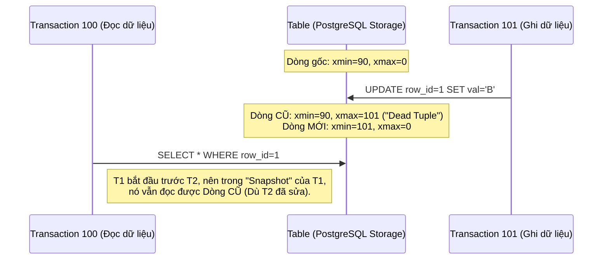
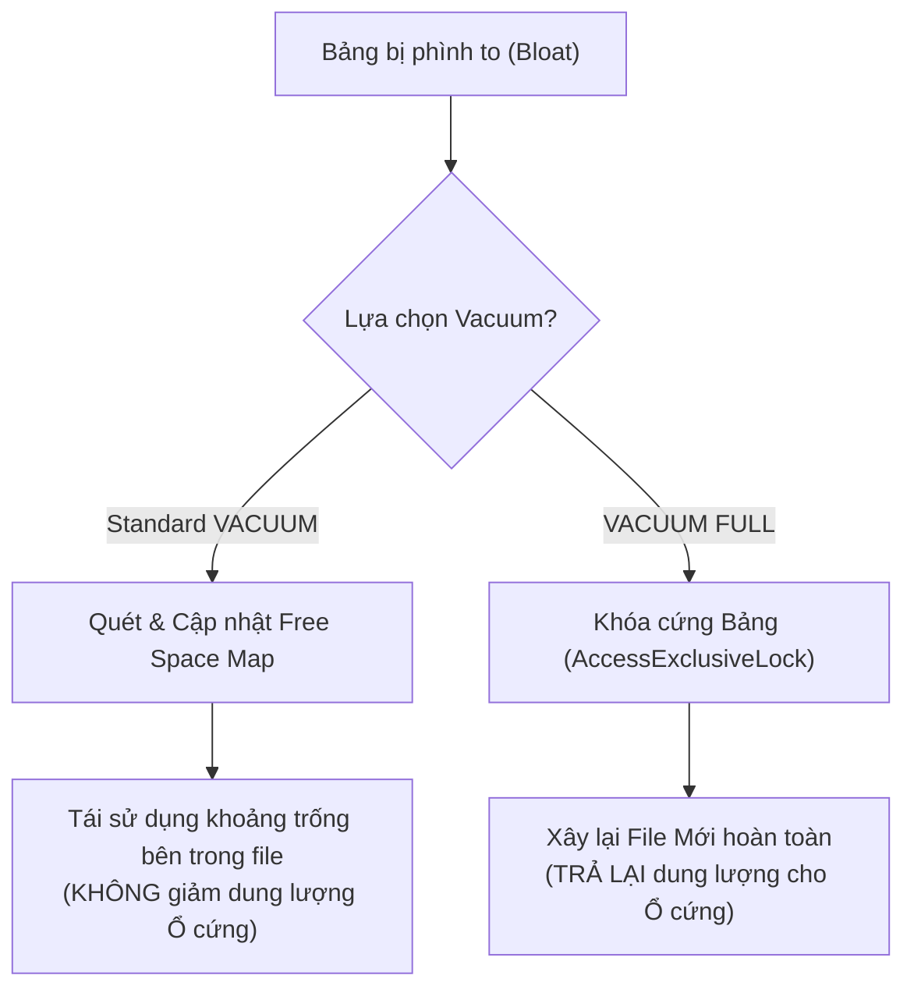

Trong các hệ quản trị cơ sở dữ liệu (DBMS) kinh điển như PostgreSQL, hay các Data Lakehouse hiện đại (Delta Lake, Apache Iceberg), cơ chế **MVCC (Multi-Version Concurrency Control - Kiểm soát đồng thời đa phiên bản)** được sử dụng làm nền tảng cốt lõi. Nó cho phép hàng ngàn Giao dịch (Transaction) cùng Đọc và Ghi dữ liệu đồng thời mà không bị Khóa (Lock) lẫn nhau, đảm bảo hiệu năng cực cao.

Tuy nhiên, "Bữa trưa không có gì là miễn phí". Cái giá vật lý của MVCC là sự phình to dữ liệu không kiểm soát (**Data Bloat**) do các "Bóng ma" (Phiên bản dữ liệu cũ) bị bỏ lại trên đĩa. Để hệ thống không bị tràn ổ cứng hoặc suy giảm hiệu suất trầm trọng, cơ chế **Vacuum** ra đời, đóng vai trò như một cỗ máy dọn rác (Garbage Collector) cho Storage Engine.

Bài viết này đi sâu vào phân tích kiến trúc vật lý của Dead Tuples, cách Vacuum vận hành, sự đánh đổi (Trade-offs) và những rủi ro sập hệ thống (System Crash) thực tế.

---

## 1. Cơ chế Vật lý của MVCC và Sự hình thành "Dead Tuples"

### 1.1. Trong PostgreSQL (RDBMS)
PostgreSQL có một triết lý thiết kế bất di bất dịch: **Không bao giờ ghi đè trực tiếp (In-place update) lên dữ liệu vật lý**. Thay vào đó, mỗi dòng dữ liệu (Row/Tuple) trong PostgreSQL đều đi kèm với các trường Metadata ẩn (System Columns) là `xmin` (ID của Transaction tạo ra dòng) và `xmax` (ID của Transaction xóa/cập nhật dòng).

Khi một lệnh `UPDATE` hoặc `DELETE` diễn ra:
- **Lệnh DELETE:** PostgreSQL không xóa file trên ổ cứng. Nó chỉ lẳng lặng cập nhật giá trị `xmax` của dòng hiện tại thành ID của Transaction gọi lệnh DELETE.
- **Lệnh UPDATE:** Thực chất là sự kết hợp của 2 hành động liên tiếp: `DELETE` dòng cũ (Gắn `xmax`) và `INSERT` một dòng mới hoàn toàn (Với `xmin` mới).

Những dòng bị đánh dấu xóa (Có `xmax` hợp lệ và Transaction đó đã Commit thành công) được gọi là **Dead Tuples (Những dòng đã chết)**.



**Hậu quả khốc liệt (Data Bloat):** Nếu một Bảng liên tục bị UPDATE (Ví dụ: Bảng trạng thái Đơn hàng), hàng triệu Dead Tuples sẽ lấp đầy các Page (Block 8KB mặc định của Postgres). Khi có câu lệnh `SELECT *`, Engine phải quét (Seq Scan) qua một bãi rác khổng lồ những dòng đã chết, làm tăng Disk I/O lên hàng trăm lần và giảm Throughput thê thảm.

### 1.2. Trong Data Lakehouse (Delta Lake / Apache Iceberg)
Kiến trúc Lakehouse dựa trên nền tảng các File Parquet bất biến (Immutable Files) trên S3. Hiện tượng sinh rác diễn ra ở **Cấp độ File** thay vì Cấp độ Dòng (Tuple).
- Khi bạn chạy lệnh `MERGE`, `UPDATE` hoặc `DELETE`, Spark Engine sẽ đọc File Parquet cũ, lọc bỏ dữ liệu cần xóa, và ghi toàn bộ phần còn lại sang một File Parquet MỚI TINH.
- Các File CŨ KHÔNG BỊ XÓA. Chúng bị đánh dấu là "Tombstoned" (Trong Delta Log) hoặc bị loại khỏi Snapshot mới nhất (Trong Iceberg Manifest).
- Các File cũ này vẫn nằm trơ trọi trên Object Storage để phục vụ tính năng **Time Travel** (Truy vấn lại dữ liệu trong quá khứ). Nếu không dọn, tiền S3 hàng tháng sẽ khiến công ty phá sản.

---

## 2. Kiến trúc Thực thi Vật lý của Vacuum

Để dọn rác, chúng ta dùng lệnh Vacuum. Nhưng tùy thuộc vào nền tảng, cơ chế của nó cực kỳ khác nhau.

### 2.1. PostgreSQL: Standard VACUUM vs VACUUM FULL
PostgreSQL chia tiến trình dọn dẹp làm hai chiến lược với Trade-offs hoàn toàn trái ngược nhau.

#### Standard VACUUM (Cơ chế dọn rác thông thường)
- **Cách hoạt động:** Nó lướt qua các Page trong Bảng, xác định vị trí của các Dead Tuples và ghi địa chỉ của chúng vào một cấu trúc gọi là **Free Space Map (FSM)**. Từ đó, các lệnh `INSERT` tiếp theo có thể chèn dữ liệu mới vào những khoảng trống rỗng này.
- **Trade-off:** Rất nhẹ nhàng, nó chỉ chiếm `ShareUpdateExclusiveLock`, nghĩa là Bảng vẫn có thể Đọc/Ghi bình thường. Tuy nhiên, **Nó KHÔNG trả lại dung lượng (Disk Space) cho Hệ điều hành (OS)**. File vật lý của Table vẫn giữ nguyên kích thước khổng lồ lớn nhất mà nó từng đạt.

#### VACUUM FULL (Rebuild toàn cục)
- **Cách hoạt động:** Tạo ra một File vật lý hoàn toàn mới trên ổ cứng, copy từng dòng Live Tuples (Dữ liệu còn sống) sang, sau đó xóa File cũ. Trả lại toàn bộ không gian trống cho OS.
- **Trade-off chí mạng:** Yêu cầu `AccessExclusiveLock`. Toàn bộ Bảng bị khóa cứng. **Mọi thao tác SELECT, INSERT, UPDATE, DELETE của User đều bị treo (Block) cho đến khi chạy xong.** Tuyệt đối không bao giờ chạy lệnh này trên Production vào giờ cao điểm!



### 2.2. Delta Lake: VACUUM Command
Lệnh `VACUUM` trong Delta Lake xóa vĩnh viễn các File Parquet vật lý trên S3 không còn được tham chiếu bởi Delta Log và đã cũ hơn một khoảng thời gian Retention.

```sql
-- Lệnh này xóa vĩnh viễn các file rác cũ hơn 168 giờ (7 ngày)
VACUUM events_table RETAIN 168 HOURS;
```
**Bẫy Vận Hành (Operational Trap):** Nhiều Junior Data Engineer thích gõ `RETAIN 0 HOURS` để tiết kiệm tiền S3 ngay lập tức. Hậu quả: Nếu có một Job Streaming đang ngầm đọc một File cũ (Để xử lý Late Data) mà lệnh VACUUM vừa xóa mất File đó trên S3, Streaming Job sẽ **Crash lập tức** với lỗi `FileNotFoundException`.

### 2.3. Apache Iceberg: Tách bạch Metadata và Data Files
Iceberg giải quyết bài toán Data Bloat tinh tế hơn bằng việc băm Garbage Collection thành 2 Phase độc lập:
1. **`expire_snapshots` (Dọn dẹp Metadata):** Xóa các Snapshot cũ khỏi File `metadata.json`, giúp cấu trúc Metadata không bị phình to (Ngăn chặn lỗi OOM khi Spark Planning).
2. **`remove_orphan_files` (Dọn dẹp Physical Files):** Quét toàn bộ thư mục S3, đối chiếu với các File đang được Snapshot hợp lệ tham chiếu. Bất kỳ File Parquet "Mồ côi" nào không nằm trong danh sách sẽ bị xóa bỏ.

```sql
-- Bước 1: Xóa Metadata Snapshot cũ hơn 7 ngày
CALL catalog.system.expire_snapshots(
  table => 'db.events',
  older_than => TIMESTAMP '2026-06-19 00:00:00.000'
);

-- Bước 2: Dọn rác vật lý bị mồ côi (Orphan files) trên S3
CALL catalog.system.remove_orphan_files(
  table => 'db.events',
  older_than => TIMESTAMP '2026-06-23 00:00:00.000'
);
```
Sự tách bạch này giúp Iceberg cực kỳ an toàn. Nó có thể dọn sạch cả những File rác sinh ra do hệ thống bị sập điện giữa chừng khi đang `INSERT` (Những file đã ghi xuống S3 nhưng chưa kịp cập nhật vào Metadata).

---

## 3. Rủi ro Vận hành (Troubleshooting) & Autovacuum

### 3.1. Thảm họa Transaction ID Wraparound (PostgreSQL)
PostgreSQL dùng số nguyên 32-bit cho Transaction ID (XID), giới hạn ở khoảng 2 tỷ (2,147,483,648). Khi hệ thống chạm đến giới hạn này, XID sẽ bị "Bọc vòng" (Wraparound) quay ngược về 0. 
- **Hậu quả:** Các Transaction hiện tại sẽ thấy dữ liệu cũ (XID 2 Tỷ, vừa ghi hôm qua) bỗng nhiên biến thành dữ liệu "Của tương lai" (Vì XID Hiện tại là 0 < 2 Tỷ). Theo luật MVCC, dữ liệu tương lai sẽ bị Ẩn. **Toàn bộ dữ liệu của bạn sẽ đột ngột bốc hơi khỏi các lượt `SELECT`**. PostgreSQL sẽ tự động **Tắt máy (Force Shutdown)** để tự vệ chống hỏng dữ liệu (Data Corruption).
- **Cách khắc phục:** Vacuum đóng vai trò then chốt trong việc "Đóng băng" (Freeze) các XID cũ. Khi tuổi (Age) của một XID quá cao, Autovacuum sẽ kích hoạt cơ chế `VACUUM FREEZE` để đánh dấu dòng đó là "Vĩnh viễn hiển thị với mọi người", reset XID Age về 0.

### 3.2. Cấu hình Autovacuum Thực chiến cho Bảng Lớn
PostgreSQL có một Process chạy ngầm tên là Autovacuum. Nó tự động kích hoạt dựa vào công thức:
`Ngưỡng_kích_hoạt = autovacuum_vacuum_threshold + autovacuum_vacuum_scale_factor * Số_dòng_của_Bảng`

Mặc định, `scale_factor` là 0.2 (20%). Nếu Bảng của bạn có 1 Tỷ dòng, phải có 200 Triệu dòng thay đổi thì Autovacuum mới chạy. Điều này là **Quá trễ** cho các hệ thống High-Traffic. Rác sẽ ngập ngụa trước khi nó kịp chạy.

**Tinh chỉnh cấu hình (`postgresql.conf`):**
```yaml
# Tinh chỉnh toàn cục để Autovacuum chạy mạnh mẽ & nhanh hơn
autovacuum_max_workers = 5              # Tăng số luồng chạy song song (Mặc định 3)
autovacuum_vacuum_cost_limit = 2000     # Tăng ngân sách I/O để chạy nhanh hơn (Mặc định 200)
autovacuum_vacuum_cost_delay = 2ms      # Giảm độ trễ ngủ giữa các lượt quét (Mặc định 20ms)

# Đối với bảng siêu lớn (Billion rows), nên ALTER TABLE riêng biệt:
# Ép Autovacuum chạy liên tục khi có 1% dữ liệu thay đổi
ALTER TABLE heavy_updates_table SET (autovacuum_vacuum_scale_factor = 0.01);
```

### 3.3. Chiến lược Retention an toàn cho Data Lakehouse
Ở môi trường Production, quy tắc bất thành văn cho Delta Lake / Iceberg là:
- Luôn giữ Retention của Vacuum tối thiểu từ **3 đến 7 ngày**. 
- Khoảng thời gian này là độ trễ sống còn (Safety Net) để các Batch Job có thể chạy lại (Rerun) khi Pipeline bị lỗi, cũng như để Team Data có thể "Time Travel" truy nguyên nguyên nhân Data Quality Issue trước khi rác bị xóa vĩnh viễn.

---

## 4. Nguồn Tham Khảo [References]

1. **PostgreSQL Official Docs:** [Routine Vacuuming & Preventing Transaction ID Wraparound Failures][https://www.postgresql.org/docs/current/routine-vacuuming.html]
2. **AWS Database Blog:** [Understanding autovacuum in Amazon RDS for PostgreSQL][https://aws.amazon.com/blogs/database/understanding-autovacuum-in-amazon-rds-for-postgresql-environments/]
3. **Apache Iceberg Maintenance:** [Expire Snapshots & Remove Orphan Files](https://iceberg.apache.org/docs/latest/maintenance/]
4. **Sách chuyên ngành:** *Designing Data-Intensive Applications* (Martin Kleppmann) - MVCC and Storage Engines.
