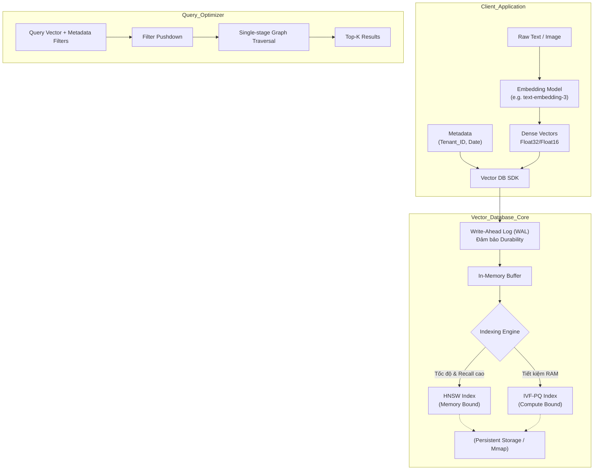

Khác với Relational Database (RDBMS - PostgreSQL, MySQL) sinh ra để giải quyết bài toán ACID và truy vấn có cấu trúc, hay NoSQL tối ưu cho sự linh hoạt của Document/Key-Value, **Vector Database** ra đời để giải quyết một bài toán duy nhất nhưng cực kỳ tốn kém về mặt tài nguyên (Compute & Memory): **Tìm kiếm xấp xỉ trong không gian nhiều chiều (Approximate Nearest Neighbor - ANN)** ở quy mô khổng lồ.

Hệ thống RAG (Retrieval-Augmented Generation) hay Recommendation System hiện đại sẽ sụp đổ ngay lập tức nếu bạn dùng thuật toán Brute-force (K-NN - quét tuyến tính) để tìm kiếm qua hàng tỷ vectors 1536-chiều (ví dụ OpenAI Embeddings). Thời gian phản hồi sẽ tăng từ vài mili-giây (ms) lên vài phút. 

Dưới góc nhìn của một Staff Engineer, Vector Database bản chất là một **hệ thống đánh đổi độ chính xác (Recall) để lấy tốc độ (Latency) và giảm thiểu RAM (Memory Footprint)**.

---

## 1. Kiến trúc Thực thi Vật lý (Physical Execution)

Một Vector Database hoàn chỉnh ở cấp độ Enterprise (như Milvus, Qdrant) không chỉ lưu trữ mảng số. Nó là một hệ thống phân tán phức tạp bao gồm:



Khác với B-Tree index của RDBMS (có độ phức tạp $O(\log N)$) cho exact match, Vector DB sử dụng các cấu trúc dữ liệu xác suất (probabilistic) - gọi là ANN.

---

## 2. Trái tim của Vector DB: HNSW vs. IVF-PQ

Đây là quyết định hệ thống (Systemic Decision) quan trọng nhất bạn phải đưa ra. Không có "silver bullet" (giải pháp hoàn hảo).

### 2.1. HNSW (Hierarchical Navigable Small World) - Nhà vô địch về Latency

HNSW là thuật toán "State-of-the-Art" (được dùng làm mặc định trong Pinecone, Qdrant, Weaviate, pgvector). Nó dựa trên cấu trúc đồ thị nhiều tầng (Multi-layer Graph) lấy cảm hứng từ Skip-list.

*   **Cơ chế:** Các vectors được liên kết với nhau bằng các edges (cạnh). Tầng trên cùng rất thưa thớt. Khi query, thuật toán nhảy vào tầng trên cùng, tìm node gần nhất, rồi "rơi" xuống tầng dưới (dày đặc hơn), tiếp tục duyệt cho đến khi chạm tầng đáy.
*   **Systemic Trade-offs:**
    *   **Pro:** Latency cực thấp ($O(\log N)$) và Recall (độ chính xác) cực cao (thường > 95% đến 99%). Cực kỳ mượt mà cho các hệ thống Online RAG. Hỗ trợ Update/Delete (CRUD) rất tốt.
    *   **Con:** **Cực kỳ tốn RAM (Memory-bound).** Thuật toán phải duy trì danh sách các neighbors (edges) cho mọi node. Một index HNSW có thể phình to hơn 1.5 - 2 lần kích thước raw vectors. Nếu bạn có 1 tỷ vectors 1536-chiều (khoảng 6TB raw data), HNSW index có thể đòi hỏi 10TB RAM để giữ mọi thứ trên bộ nhớ. CFO công ty bạn sẽ ngất xỉu khi nhìn thấy hóa đơn AWS.

### 2.2. IVF-PQ (Inverted File Index kết hợp Product Quantization) - Cứu cánh cho FinOps

Được phát triển bởi FAISS (Meta), IVF-PQ là sự lựa chọn bắt buộc khi bạn Scale-out (Hàng chục triệu đến hàng tỷ vectors) và không đủ tiền thuê hàng tá servers RAM khủng.

*   **IVF (Inverted File - Partitioning):** Dùng thuật toán K-means để nhóm không gian vector thành $K$ cụm (Voronoi cells). Khi truy vấn, hệ thống chỉ tính toán khoảng cách đến tâm cụm (centroids), sau đó chỉ quét các vectors nằm trong 1 hoặc vài cụm gần nhất.
*   **PQ (Product Quantization - Lossy Compression):** Kỹ thuật nén **mất mát dữ liệu**. Nó cắt một vector dài (ví dụ 1536 chiều) thành nhiều khối nhỏ (vd: 8 khối). Sau đó dùng clustering để gán cho mỗi khối một ID (byte ngắn).
*   **Systemic Trade-offs:**
    *   **Pro:** Ép RAM cực mạnh. PQ có thể nén vector nhỏ lại 10-50 lần. Giảm thiểu chi phí hạ tầng (Cost/FinOps champion).
    *   **Con:** Recall giảm mạnh do nén Lossy và rủi ro miss cụm của IVF (nếu vector nằm ở biên). **Đặc biệt:** Khi dữ liệu thay đổi (Data Drift), bạn phải chạy lại (Re-train) thuật toán clustering K-means cho toàn bộ index, gây tốn Compute khổng lồ. Không phù hợp với dữ liệu update liên tục.

---

## 3. Metadata Filtering: Bãi mìn "Cartesian Explosion"

Trong thực tế, bạn hiếm khi tìm KNN chay. Luôn luôn có filter: *"Tìm 5 tài liệu giống văn bản này NHƯNG thuộc `tenant_id = 'A'` và `status = 'ACTIVE'`"*. Vector DB xử lý bài toán này qua 3 hướng thiết kế vật lý:

1.  **Post-filtering:** Tìm Top-100 KNN bằng HNSW trước, sau đó loại bỏ những kết quả không thỏa mãn metadata.
    *   *Sự cố:* Nếu bộ lọc metadata quá khắt khe (chỉ 1% data thỏa mãn), 99/100 kết quả bị loại. User nhận được 1 kết quả (Zero hits), dù trong DB vẫn còn hàng ngàn vector phù hợp nằm xa hơn một chút.
2.  **Pre-filtering:** Chạy bộ lọc metadata trước (dùng Inverted Index như RDBMS) để lấy danh sách ID, rồi mới quét HNSW trên tập con đó.
    *   *Sự cố (Disconnected Graph):* HNSW Graph bị đứt gãy. Nếu bộ lọc loại bỏ 90% nodes, các nodes còn lại bị rời rạc, làm đứt gãy các đường đi (edges). HNSW mất tác dụng, hệ thống rớt về Brute-force -> CPU 100%, OOMKilled.
3.  **Single-stage Filtering (Custom HNSW):** Các Engine hiện đại như Qdrant, Milvus thiết kế lại HNSW. Bộ lọc metadata được nhúng thẳng vào quá trình duyệt đồ thị. Nếu một node bị metadata reject, hệ thống bỏ qua (không đưa vào kết quả) nhưng **vẫn mượn các cạnh (edges) của node đó** để đi tiếp đến các neighbors khác. Đây là kiến trúc tối ưu nhất hiện nay.

---

## 4. Code Thực Chiến: Cấu hình `pgvector` dưới góc độ Staff Engineer

Đừng phó mặc cho cấu hình mặc định. PostgreSQL với extension `pgvector` là sự lựa chọn hoàn hảo ("Good Enough") để tránh Dependency Hell [không phải vận hành thêm cụm Qdrant/Milvus] nếu bạn có dưới 10-20 triệu vectors.

Dưới đây là DDL để cấu hình HNSW Index đúng chuẩn cho Production, tránh bóp nghẹt RAM của Postgres:

```sql
-- Kích hoạt extension pgvector
CREATE EXTENSION IF NOT EXISTS vector;

-- Tạo bảng lưu trữ Chunk dữ liệu cho RAG
CREATE TABLE knowledge_chunks (
    id BIGSERIAL PRIMARY KEY,
    tenant_id UUID NOT NULL,
    content TEXT,
    -- Cột lưu trữ vector 1536 chiều của OpenAI
    embedding vector(1536) 
);

-- BẮT BUỘC: Tạo Index B-Tree cho Metadata để hỗ trợ Pre/Post-filtering nhanh nhất
CREATE INDEX idx_tenant_id ON knowledge_chunks(tenant_id);

-- TỐI ƯU HNSW INDEX:
-- Mặc định m=16, ef_construction=64. 
-- Ở đây ta tăng m=32 (Tăng Recall, chấp nhận tốn RAM)
-- Tăng ef_construction=128 (Build chậm hơn nhưng Graph chất lượng cao hơn)
CREATE INDEX hnsw_idx_embedding ON knowledge_chunks 
USING hnsw (embedding vector_cosine_ops)
WITH (m = 32, ef_construction = 128);

-- LƯU Ý KHI QUERY (Trong ứng dụng Python/NodeJS, thực thi lệnh này trước khi query)
-- Điều chỉnh ef_search để tăng Recall lúc Query (Mặc định là 40, tăng lên 100)
SET hnsw.ef_search = 100;

-- Truy vấn lấy Top 5 chunks gần nhất cho một Tenant cụ thể
SELECT id, content, (embedding <=> '[0.1, 0.2, ...]'] AS cosine_distance
FROM knowledge_chunks
WHERE tenant_id = '123e4567-e89b-12d3-a456-426614174000'
ORDER BY cosine_distance ASC
LIMIT 5;
```

---

## 5. Rủi Ro Vận Hành & Troubleshooting (OOMKilled)

-   **JVM/Node OOMKilled (Out Of Memory):** Sự cố kinh điển nhất. Khi Insert lượng lớn vectors, quá trình build HNSW Graph đẩy RAM lên đỉnh điểm. Container bị Kubernetes chém chết (OOMKilled). 
    *   *Khắc phục:* Trong Qdrant, cấu hình `memmap_threshold` để đổ metadata và vector xuống Disk (SSD NVMe) thay vì giữ trên RAM. Trên `pgvector`, giới hạn `work_mem` hoặc dùng IVF-PQ nếu tập dữ liệu quá khổng lồ.
-   **Index Build Bottleneck:** Khi có luồng Kafka liên tục đổ vectors vào DB, cập nhật đồ thị HNSW tốn rất nhiều CPU (Consumer Lag phình to).
    *   *Khắc phục:* Dừng build index tạm thời trong lúc bulk insert, sau đó build offline.

---

## Nguồn Tham Khảo (References)

1.  **Qdrant Documentation: Indexing and HNSW Configuration** - Đi sâu vào Single-stage filtering.
2.  **Milvus Architecture: Scaling Vector Database** - Thiết kế phân tán cho tỷ vectors.
3.  **Engineering at Meta: Faiss** - Thư viện lõi cho IVF-PQ và thuật toán ANN.
4.  **pgvector Documentation** - Cấu hình tối ưu Index trên PostgreSQL.
