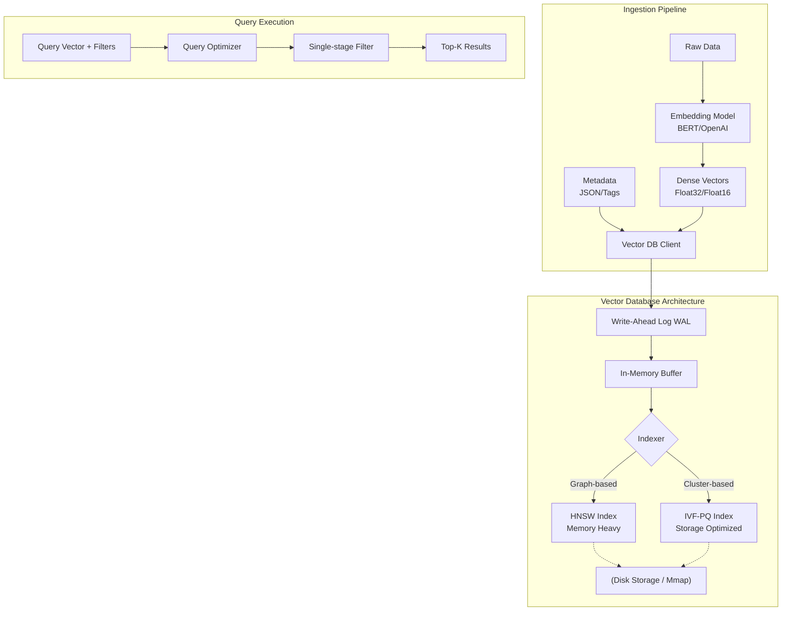

Khác với Relational Database (RDBMS) sinh ra để giải quyết bài toán ACID và truy vấn cấu trúc, hay NoSQL tối ưu cho sự linh hoạt của Document/Key-Value, **Vector Database** ra đời để giải quyết một bài toán duy nhất nhưng cực kỳ tốn kém về mặt tính toán: **Tìm kiếm xấp xỉ không gian nhiều chiều (Approximate Nearest Neighbor - ANN)** ở quy mô khổng lồ.

Hệ thống RAG (Retrieval-Augmented Generation) hay Recommendation System hiện đại sẽ sụp đổ nếu dùng `numpy` hoặc `pgvector` với Brute-force (K-NN) để quét qua hàng tỷ vectors 1536-chiều. Thời gian phản hồi sẽ tăng từ vài mili-giây (ms) lên vài phút.

---

## 1. Kiến trúc Thực thi Vật lý (Physical Execution)

Một Vector Database hoàn chỉnh không chỉ lưu trữ mảng số. Nó là một hệ thống phân tán bao gồm Storage Engine, Indexing Engine, và Query Optimizer.



Khác với B-Tree index của RDBMS (độ phức tạp $O(\log N)$) cho exact match, Vector DB sử dụng các cấu trúc dữ liệu xác suất (probabilistic) để đánh đổi một chút độ chính xác (Recall) lấy tốc độ phản hồi tính bằng mili-giây.

## 2. Các Thuật Toán Indexing Cốt Lõi & Đánh Đổi

Đây là "trái tim" của Vector DB. Không có "silver bullet" (giải pháp hoàn hảo), Data Engineer phải chọn Index dựa trên Trade-offs giữa **Latency (Tốc độ)**, **Recall (Độ chính xác)**, và **Memory Footprint (RAM)**.

### 2.1. HNSW (Hierarchical Navigable Small World)
HNSW là thuật toán "State-of-the-Art" hiện nay (sử dụng mặc định trong Pinecone, Qdrant, Milvus). Dựa trên cấu trúc đồ thị nhiều tầng (multi-layer graph) giống như Skip-list kết hợp với Navigable Small World.

* **Cơ chế:** Các vectors được liên kết với nhau bằng các edges (cạnh). Tầng trên cùng rất thưa thớt (chỉ vài node). Khi query, thuật toán nhảy vào tầng trên cùng, tìm node gần nhất, rồi "rơi" xuống tầng dưới (dày đặc hơn), tiếp tục duyệt cho đến khi chạm tầng đáy (chứa toàn bộ node).
* **Đánh đổi (Trade-offs):**
  * **Pro:** Latency cực thấp ($O(\log N)$) và Recall cực cao (thường > 95%).
  * **Con:** Cực kỳ tốn RAM (Memory-bound). Nó phải duy trì danh sách các neighbors (edges) cho mọi node trên RAM. Một index HNSW có thể phình to hơn 1.5 - 2 lần kích thước raw vectors. Thời gian Build Index (Insertion time) cũng rất chậm vì phải cập nhật lại cấu trúc đồ thị.

### 2.2. IVF-PQ (Inverted File Index kết hợp Product Quantization)
Được phát triển mạnh mẽ bởi FAISS (Meta), IVF-PQ là cứu cánh khi bạn có hàng tỷ vectors (Scale-out) và không đủ tiền thuê hàng tá servers RAM khủng.

* **IVF (Inverted File):** Dùng thuật toán K-means để nhóm không gian vector thành $K$ cụm (Voronoi cells). Khi truy vấn, thay vì quét toàn bộ, hệ thống chỉ tìm cụm gần query vector nhất (centroids) và chỉ quét các vectors trong cụm đó.
* **PQ (Product Quantization):** Kỹ thuật nén **Lossy**. Nó cắt vector (ví dụ 1536 chiều) thành nhiều khối nhỏ (vd: 8 khối, mỗi khối 192 chiều). Sau đó dùng clustering để gán cho mỗi khối một ID (byte). 
* **Đánh đổi (Trade-offs):**
  * **Pro:** Ép RAM cực mạnh. PQ có thể nén vector nhỏ lại 10-50 lần (phù hợp với môi trường Memory-constrained). IVF giúp tăng tốc độ quét tuyến tính.
  * **Con:** Recall giảm đáng kể do nén Lossy và khả năng miss cụm của IVF (nếu vector nằm ở biên của Voronoi cell). Ngoài ra, khi dữ liệu drift (thay đổi phân phối), phải Re-cluster lại toàn bộ IVF (cực kỳ tốn CPU).

## 3. Metadata Filtering: The Cartesian Explosion Problem

Trong thực tế, bạn hiếm khi tìm KNN chay. Thường chúng ta cần query: *"Tìm 5 tài liệu giống văn bản này NHƯNG tác giả phải là 'A' và ngày tạo > '2024-01-01'"*. Vector DB xử lý bài toán này qua 3 hướng thiết kế vật lý:

1. **Post-filtering:** Tìm Top-100 KNN trước bằng HNSW, sau đó loại bỏ những kết quả không thỏa mãn điều kiện metadata. 
   * **Rủi ro:** Nếu 98/100 kết quả bị loại bởi metadata, user chỉ nhận được 2 kết quả (Missing results/Zero hits), dù trong DB vẫn còn hàng ngàn vector phù hợp xa hơn.
2. **Pre-filtering:** Chạy bộ lọc metadata trước (giống RDBMS) để lấy danh sách ID, rồi mới quét HNSW/KNN trên tập con đó.
   * **Rủi ro (HNSW Disconnected Graph):** Nếu bộ lọc quá khắt khe (chỉ 1% data thỏa mãn), các node còn lại trên đồ thị HNSW sẽ rời rạc, làm đứt gãy các đường đi (edges). HNSW sẽ mất tác dụng hoặc phải rớt về Brute-force, dẫn đến Latency tăng vọt.
3. **Single-stage Filtering (Custom HNSW):** Đây là cách các Engine hiện đại như Qdrant hay Milvus giải quyết. Bộ lọc metadata được nhúng thẳng vào quá trình duyệt đồ thị. Nếu một node bị metadata reject, hệ thống bỏ qua nhưng vẫn mượn các cạnh (edges) của node đó để đi tiếp đến các neighbors khác.

## 4. Cấu hình Kỹ thuật (Staff-level Configuration)

Đừng phó mặc cho cấu hình mặc định. Dưới đây là ví dụ cấu hình Collection trong Qdrant qua Python SDK để tối ưu HNSW Index cho môi trường Production, ngăn chặn **OOMKilled** (Out Of Memory).

```python
from qdrant_client import QdrantClient
from qdrant_client.models import Distance, VectorParams, HnswConfigDiff, OptimizersConfigDiff

client = QdrantClient("localhost", port=6333)

client.create_collection(
    collection_name="enterprise_knowledge_base",
    vectors_config=VectorParams(
        size=1536,  # Kích thước vector của OpenAI text-embedding-ada-002
        distance=Distance.COSINE
    ),
    # 1. Tối ưu kiến trúc HNSW Graph
    hnsw_config=HnswConfigDiff(
        m=32, # Số lượng cạnh (edges) tối đa mỗi node. Tăng M giúp tăng Recall (độ chính xác) nhưng ăn RAM (Memory Footprint) mạnh hơn.
        ef_construct=200, # Kích thước queue khi build index. Càng lớn build càng chậm nhưng cấu trúc graph càng tốt.
        full_scan_threshold=10000 # Nếu Pre-filtering trả về < 10,000 vectors, dùng Brute-force luôn thay vì duyệt Graph (tránh Overhead).
    ),
    # 2. Tối ưu Storage / Chống OOMKilled
    optimizers_config=OptimizersConfigDiff(
        memmap_threshold=20000, # Nếu segment > 20k vectors, chuyển payload (metadata) sang Mmap (Disk) thay vì giữ trên RAM. 
        indexing_threshold=20000 # Chờ gom đủ 20k vectors mới build HNSW graph để tối ưu Write-Throughput.
    )
)
```

## 5. Rủi Ro Vận Hành & Troubleshooting (Operational Risks)

- **JVM/Node OOMKilled:** Xảy ra cực kỳ phổ biến khi HNSW Index phình to vượt quá RAM của Kubernetes Pod. **Cách khắc phục:** Cấu hình `memmap_threshold` để đổ metadata xuống disk, hoặc chuyển sang dùng IVF-PQ nếu tập dữ liệu lên đến hàng trăm triệu.
- **Index Build Bottleneck (Consumer Lag):** Khi có luồng streaming (Kafka) liên tục đổ vector vào DB, quá trình cập nhật đồ thị HNSW tốn rất nhiều CPU. **Cách khắc phục:** Tuning tham số `indexing_threshold` hoặc `ef_construct` nhỏ lại trong lúc bulk insert, sau đó build index offline.

## 6. Lựa chọn Vector DB

- **Pinecone:** Serverless, managed. Phù hợp nếu team không có/thiếu Data Engineer cứng về hạ tầng. Ẩn đi hoàn toàn sự phức tạp nhưng chi phí ở quy mô lớn sẽ rất đắt.
- **Qdrant:** Viết bằng Rust. Nổi bật với Single-stage filtering cực tốt, Payload lưu trữ hiệu quả (hỗ trợ Mmap/Disk). Đang là lựa chọn ưu tiên cho các team tự host (On-premise/Kubernetes).
- **Milvus:** Sinh ra cho Scale-out (Hàng tỷ vectors). Kiến trúc microservices cực kỳ phức tạp (tách biệt query node, data node, index node). Chỉ dùng khi bạn là Enterprise có dữ liệu khổng lồ.
- **pgvector:** Extension của Postgres. Dùng index `ivfflat` hoặc `hnsw`. Lựa chọn tuyệt vời ("Good Enough") nếu hệ thống đã có Postgres và số lượng vector < 10 triệu, giúp giảm "Dependency Hell" (không cần maintain thêm cụm Qdrant/Milvus).

---

## Nguồn Tham Khảo (References)

1. [Qdrant Documentation: Indexing and HNSW Configuration](https://qdrant.tech/documentation/concepts/indexing/)
2. [Milvus Architecture: Scaling Vector Database](https://milvus.io/docs/architecture_overview.md)
3. [Engineering at Meta: Faiss - A library for efficient similarity search](https://engineering.fb.com/2017/03/29/data-infrastructure/faiss-a-library-for-efficient-similarity-search/)
4. *Bui, L.* (2024). Operational Risks in Vector Search Systems (Tech Blog Analysis).
