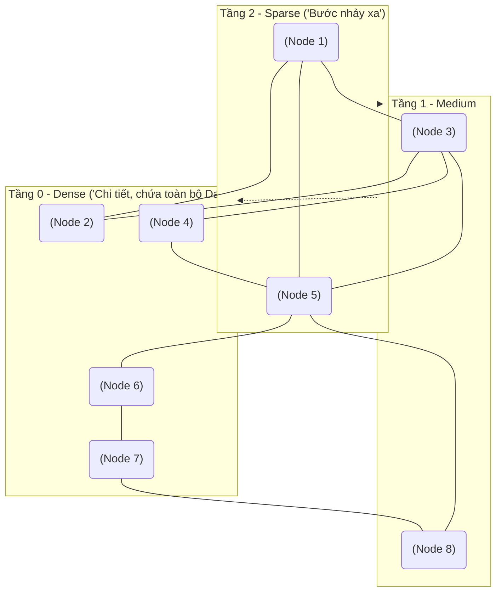

Trong trào lưu Generative AI và RAG (Retrieval-Augmented Generation), Cơ sở dữ liệu Vector (Vector Database) thường được ví như "trí nhớ dài hạn" của các LLM. Tuy nhiên, dưới góc độ Thiết kế Hệ thống (System Design), Vector Database bản chất là một công cụ giải quyết bài toán **Tìm kiếm xấp xỉ lân cận gần nhất (Approximate Nearest Neighbor - ANN)** ở không gian hàng ngàn chiều (dimensions).

Vì sao chúng ta không dùng PostgreSQL B-Tree truyền thống? Bởi vì B-Tree sinh ra cho việc so khớp chính xác 1 chiều. Khi đối mặt với Vector 1536 chiều của OpenAI, hiệu ứng **Lời nguyền Đa chiều (Curse of Dimensionality)** xảy ra. Việc tính toán khoảng cách (Cosine/Euclidean) giữa vector truy vấn với *tất cả* các dòng trong Database (Exact kNN) sẽ mất hàng phút.

Để đạt được tốc độ mili-giây, Vector Database đánh đổi một phần nhỏ độ chính xác (Recall) lấy tốc độ (Latency) thông qua hai trường phái kiến trúc: **Đồ thị (Graph-based)** và **Phân cụm (Clustering)**.

---

## 1. Trường phái Đồ thị: HNSW (Hierarchical Navigable Small World)

HNSW là thuật toán "quốc dân" (Mặc định trên Pinecone, Milvus, pgvector). Nó xây dựng một cấu trúc đồ thị nhiều tầng dựa trên nguyên lý "Thế giới nhỏ" (Sáu cấp độ chia cách).



- **Cơ chế truy vấn:** Search Engine bắt đầu ở tầng cao nhất (thưa thớt) để nhảy những "bước dài" xuyên qua không gian vector. Khi đến gần mục tiêu, nó đi xuống các tầng thấp hơn (dày đặc hơn) để tinh chỉnh kết quả cục bộ.
- **Ưu điểm:** Latency cực thấp, Recall siêu cao (>95%). Hỗ trợ thêm/xóa dữ liệu (Dynamic Updates) rất mượt mà.
- **Nhược điểm:** Tiêu thụ **RAM cực khủng**. Bạn phải giữ toàn bộ đồ thị (Pointers) và Vector gốc trên Memory.

---

## 2. Trường phái Phân cụm & Nén: IVF-PQ

Khi dữ liệu vượt mốc 100 triệu vector, HNSW sẽ làm sập RAM. Lúc này, **IVF-PQ (Inverted File with Product Quantization)** là giải pháp mở rộng quy mô.

1. **IVF (Phân cụm Voronoi):** Phân chia không gian vector thành $K$ cụm (clusters) bằng thuật toán K-Means. Khi có câu query, hệ thống chỉ tính khoảng cách đến tâm cụm (Centroid), lấy ra `nprobe` cụm gần nhất và *chỉ* tìm kiếm trong các cụm đó.
2. **PQ (Nén lượng tử hóa):** Giả sử Vector 1024 chiều (float32). PQ cắt nó thành 8 block nhỏ, mỗi block 128 chiều. Áp dụng K-Means trên từng block để tìm ra ID của centroid gần nhất (nằm trong một Codebook). Kết quả: Vector gốc nặng 4096 bytes bị nén thành 8 bytes (Lưu mảng ID).

- **Ưu điểm:** Memory Footprint cực thấp (Có thể đưa xuống ổ đĩa Disk-backed).
- **Nhược điểm:** Tốc độ chậm hơn HNSW. Khi `INSERT` dữ liệu mới liên tục, các cụm bị lệch, buộc phải tốn tài nguyên chạy lại (Re-train) K-Means.

---

## 3. Rủi Ro Vận Hành & Sự Cố Hệ Thống (Incidents)

### 3.1. HNSW và cơn ác mộng OOMKilled
**Sự cố:** Một dự án RAG Ingest 20 triệu chunks văn bản (Dùng model OpenAI `text-embedding-3-large` 3072 chiều) vào PostgreSQL `pgvector` sử dụng index HNSW. Postgres liên tục sập do bị Linux OOM Killer chém đứt.
**Root Cause (Phân tích RAM):** 
1 Vector = $3072 \times 4 \text{" bytes"} \approx 12 \text{" KB"}$. 
Đồ thị HNSW: Mỗi node có $M$ liên kết (ví dụ $M=16$), mỗi liên kết 8 bytes pointer $\approx 128 \text{" Bytes/node"}$.
Tổng RAM cho 20 triệu dòng = $20,000,000 \times 12 \text{" KB"} \approx 240 \text{" GB RAM"}$ chỉ để nuôi Index. Nếu RAM nhỏ hơn số này, Postgres phải Spill-to-disk gây ra Thrashing, tốc độ tụt thảm hại.
**Giải pháp:** 
- Dùng kỹ thuật giảm chiều (Dimensionality Reduction) kết hợp Matryoshka Representation.
- Chuyển sang Scalar Quantization (SQ8) hoặc Index IVF-PQ.

### 3.2. Đau Đầu Lọc Metadata (Metadata Filtering)
Vector tìm kiếm nội dung, nhưng User tìm theo Filter: *"Tìm bài báo (Vector) thuộc chuyên mục Thể Thao trong khoảng năm 2024 (Metadata)"*.
Có 3 kiến trúc xử lý:
1. **Pre-filtering (Lọc trước):** Chạy SQL lấy các bài báo Thể Thao 2024 trước, sau đó nhét vào HNSW. 
   $\rightarrow$ **Tử huyệt:** Làm gãy đồ thị HNSW vì các node bị "che" đi, không thể đi tắt.
2. **Post-filtering (Lọc sau):** Chạy Vector ANN tìm Top 100 gần nhất. Sau đó loại đi các bài không phải Thể Thao 2024.
   $\rightarrow$ **Tử huyệt:** Nếu Metadata mang tính loại trừ cao, lọc xong có thể còn đúng 0 kết quả (Recall = 0).
3. **Single-Stage Filtering (Lọc ngầm):** Vector DB Native (Milvus, Qdrant) duyệt đồ thị và kiểm tra Metadata *đồng thời* tại mỗi node. Nếu không thỏa mãn, nó rẽ nhánh khác. Đây là kiến trúc tối ưu nhất.

---

## 4. Hybrid Search & Reciprocal Rank Fusion (RRF)

Dense Vector (HNSW/IVF) hiểu ngữ nghĩa rất tốt, nhưng lại cực kỳ dốt trong việc tìm kiếm từ khóa chính xác (Keyword Exact Match như tên riêng, ID sản phẩm "IP15-PRM").
Ngành công nghiệp chuẩn hóa bằng kiến trúc **Hybrid Search**: Chạy song song ANN [Dense] và BM25/Elasticsearch (Sparse).

Nhưng làm sao trộn 2 danh sách kết quả? Khoảng cách Cosine Similarity (0 -> 1) và điểm số thô của Elasticsearch (0 -> hàng ngàn) không thể cộng lại với nhau.
**Giải pháp: RRF (Reciprocal Rank Fusion)** - Cộng dồn nghịch đảo thứ hạng.
```python
def rrf_score(rank_vector, rank_bm25, k=60):
    # Vector top 1, BM25 top 5 -> tính ra score hợp nhất
    return (1 / (k + rank_vector)) + (1 / (k + rank_bm25))
```
Thằng nào đứng Top ở cả 2 bảng sẽ trồi lên cao nhất.

---

## Nguồn Tham Khảo (References)
* [HNSW (Hierarchical Navigable Small World) Algorithm Research Paper](https://arxiv.org/abs/1610.02415)
* [Faiss: Billion-scale similarity search with GPUs](https://arxiv.org/abs/1702.08734) - Lý thuyết về IVF-PQ.
* [Pinecone Learning: HNSW Indexing](https://www.pinecone.io/learn/series/faiss/hnsw/)
