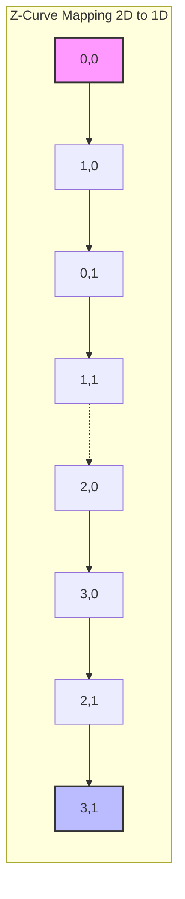

Để Data Skipping hoạt động ở quy mô hàng Petabyte, metadata (min/max stats) trong file Parquet footer cần được co hẹp tối đa. RDBMS truyền thống dùng B-Tree Index, nhưng trong thế giới Distributed Object Storage (S3, ADLS), I/O cost để duy trì B-Tree là bất khả thi. Thay vào đó, Databricks và Delta Lake sử dụng cụm tệp vật lý (Physical Data Clustering). Tuy nhiên, gom cụm theo nhiều cột đồng thời lại vướng phải bài toán muôn thuở: **Linear Sorting Bias**.

## 1. Linear Sorting Bias (Độ Lệch Sắp Xếp Tuyến Tính)

Khi thực thi câu lệnh `ORDER BY date, city`, Spark tạo ra một cấu trúc vật lý ưu tiên tuyệt đối cho cột `date`. 
- Truy vấn `WHERE date = '2023-01-01'` kích hoạt Data Skipping xuất sắc.
- Truy vấn `WHERE city = 'Hanoi'` kích hoạt **Full Table Scan**, vì dữ liệu của Hà Nội bị xé lẻ thành hàng nghìn mảnh nhỏ rải rác trên tất cả các file của mọi ngày.

**Systemic Trade-off:** Linear Sort đánh đổi hoàn toàn hiệu năng của các chiều dữ liệu phụ (secondary dimensions) để lấy hiệu năng cho chiều chính.

## 2. Z-Order Curve (Morton Code) dưới góc nhìn Hệ thống

Z-Order thuộc họ **Space-filling curves** – các hàm toán học ánh xạ không gian đa chiều $N$-D xuống không gian 1-D nhưng vẫn bảo tồn **Data Locality** (Tính cục bộ của dữ liệu).

### Bit Interleaving (Đan xen bit)
Dưới mui xe, Spark tính toán Z-value bằng cách chuyển đổi giá trị các cột sang nhị phân và đan xen chúng (interleave).
Ví dụ X = 3 (`011`), Y = 5 (`101`):
*   Y: `1 _ 0 _ 1`
*   X: `_ 0 _ 1 _ 1`
*   **Z-Value:** `10 01 11` (39)

Hệ thống sau đó Sort dữ liệu theo duy nhất chuỗi nhị phân 1-D này.



**Kết quả:** Cả 2 cột X và Y đều có vùng Min/Max hẹp tương đương nhau trong metadata của tệp Parquet. Engine cắt tỉa (prune) được 90% số lượng tệp dù bạn `WHERE` theo X hay Y.

## 3. Z-Order vs. Hive Partitioning (Physical Layout)

| Yếu tố Kiến trúc | Hive Partitioning | Z-Ordering |
| :--- | :--- | :--- |
| **I/O Mechanism** | Directory Pruning (Cắt tỉa thư mục vật lý) | Data Skipping (Cắt tỉa tệp bằng Min/Max Stats) |
| **Cardinality Target** | Low Cardinality (Date, Country). Gây lỗi `OOMKilled` trên Namenode/Driver nếu dùng High Cardinality. | High Cardinality (User_ID, Device_ID, Transaction_ID). |
| **Data Skew** | Lệch nặng nếu dữ liệu phân bố không đều (Ví dụ: 90% user ở VN). | **Skew-resistant**. Spark tự động đóng gói (bin-packing) thành các tệp ~1GB bất kể phân bố dữ liệu. |

## 4. Tình huống Sập Hệ Thống (Real-world Incidents)

Khác với quảng cáo, Z-Order là một con dao hai lưỡi tốn kém:

### Incident 1: Write Amplification (Bùng nổ I/O Ghi)
Để tính toán đường cong Z toàn cục, Spark buộc phải kích hoạt **Network Shuffle** siêu lớn. 
- **Triệu chứng:** Hóa đơn DBU (Compute) của Databricks tăng gấp 3 lần sau khi setup cronjob chạy `OPTIMIZE ZORDER BY` hàng đêm trên bảng Petabyte.
- **Cách khắc phục:** Lên lịch chạy Z-Order giới hạn trên các phân vùng gần đây:
```sql
-- Tối ưu hóa toàn bộ bảng
OPTIMIZE events 
ZORDER BY (eventType, userId);

-- Tối ưu hóa giới hạn trên các phân vùng gần đây (Tiết kiệm chi phí)
OPTIMIZE events 
WHERE date >= current_date() - INTERVAL 7 DAYS
ZORDER BY (eventType, userId);
```

### Incident 2: Dimensionality Decay (Pha loãng không gian)
Khi bạn Z-Order quá nhiều cột, toán học của nó sẽ bị "pha loãng". 
- **Triệu chứng:** Truy vấn chậm dần đều dù đã chạy Z-Order.
- **Cách khắc phục:** Quy tắc vàng là **tuyệt đối không Z-Order quá 4 cột**. Chỉ chọn những cột xuất hiện nhiều nhất trong mệnh đề `WHERE` của các "Slow Queries".

## 5. Advanced Configs (Cấu hình Chuyên sâu cho Senior)

Trong môi trường Production lớn, bạn nên tinh chỉnh các Table Properties sau đây để Z-Order đạt hiệu năng tối đa:

1. **Tuning `targetFileSize`**: Mặc định Databricks nhắm mục tiêu 1GB/tệp. Nếu hệ thống của bạn (như Athena, Presto) thích các file nhỏ hơn để nạp song song, hãy giảm xuống:
   ```sql
   ALTER TABLE events SET TBLPROPERTIES (
     'delta.targetFileSize' = '268435456' -- 256MB
   );
   ```
2. **Kiểm soát Indexed Columns**: Mặc định Delta chỉ thu thập Metadata (Min/Max) cho **32 cột đầu tiên**. Nếu bạn Z-Order một cột nằm ở vị trí thứ 40, Data Skipping sẽ bị "mù" và Z-Order trở nên vô dụng! Hãy cấu hình lại:
   ```sql
   ALTER TABLE events SET TBLPROPERTIES (
     'delta.dataSkippingNumIndexedCols' = '50'
   );
   ```

## Nguồn Tham Khảo (References)
* [Sách: Designing Data-Intensive Applications - Chapter 3 (Martin Kleppmann)](https://dataintensive.net/)
* [Databricks Blog: Processing Petabytes of Data with Databricks Delta](https://www.databricks.com/blog/2018/07/31/processing-petabytes-of-data-with-databricks-delta.html)
* [Databricks Documentation: Z-Ordering (multi-dimensional clustering)](https://docs.databricks.com/en/delta/optimize.html#z-order-by)
* [Whitepaper: The Delta Lake Architecture](https://github.com/delta-io/delta/blob/master/WhitePaper.md)
