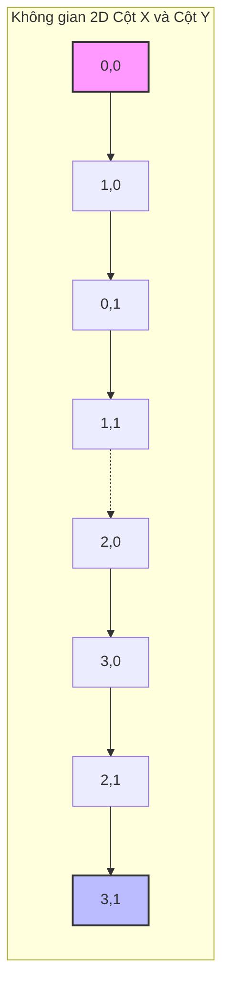

Trong môi trường Data Lakehouse (như Delta Lake trên Databricks), dữ liệu được lưu trữ phân tán dưới dạng các tệp Parquet. Khác với các hệ quản trị cơ sở dữ liệu (RDBMS) truyền thống sử dụng B-Tree Index, Lakehouse tối ưu hóa truy vấn thông qua cơ chế **Data Skipping** (Bỏ qua dữ liệu).

Để Data Skipping hoạt động hiệu quả, hệ thống cần dữ liệu được sắp xếp (clustered) sao cho các giá trị giống nhau nằm chung trong cùng một tệp. Tuy nhiên, việc sắp xếp dữ liệu theo nhiều cột cùng lúc là một bài toán hóc búa. **Z-Ordering** (đường cong Z-Order) sinh ra để giải quyết chính xác bài toán này.

## 1. Nỗi Đau Của Sắp Xếp Tuyến Tính (Linear Sorting Bias)

Hãy tưởng tượng bạn có một bảng hóa đơn (Sales) và muốn sắp xếp dữ liệu theo hai cột: `NgayBan` (Ngày bán) và `ThanhPho` (Thành phố). 

Trong phương pháp **Linear Sort** truyền thống (tương đương lệnh `ORDER BY NgayBan, ThanhPho`), dữ liệu sẽ được sắp xếp ưu tiên hoàn toàn cho cột đầu tiên (`NgayBan`). Chỉ khi các dòng có cùng ngày bán, hệ thống mới xét tiếp đến `ThanhPho`.

Kết quả khi ghi ra các tệp Parquet:
*   **Tệp 1:** `(01-01, Hà Nội)`, `(01-01, Đà Nẵng)`, `(01-01, HCM)`
*   **Tệp 2:** `(01-02, Hà Nội)`, `(01-02, Đà Nẵng)`, `(01-02, HCM)`

**Vấn đề (Optimization Bias):**
- Truy vấn `WHERE NgayBan = '01-01'` cực kỳ nhanh! Engine chỉ cần đọc Tệp 1 và bỏ qua Tệp 2. (Data Skipping xuất sắc).
- Truy vấn `WHERE ThanhPho = 'Hà Nội'` lại là thảm họa! Dữ liệu của 'Hà Nội' bị xé lẻ và phân tán đều trên *tất cả* các tệp (Tệp 1, Tệp 2, Tệp 3...). Engine buộc phải mở toàn bộ các tệp ra để tìm kiếm. Data Skipping hoàn toàn mất tác dụng đối với cột thứ hai trở đi.

## 2. Giải Pháp: Z-Order (Morton Code)

**Z-Order** là một kỹ thuật toán học (thuộc nhóm *Space-filling curves*) giúp ánh xạ dữ liệu nhiều chiều (nhiều cột) xuống thành một chiều duy nhất, trong khi vẫn **bảo tồn tối đa tính cục bộ (Data Locality)** của tất cả các chiều.

Thay vì ưu tiên cột này hơn cột kia, Z-Order đối xử công bằng với tất cả các cột tham gia. 

### Cách Z-Order Hoạt Động (Mã hóa Nhị Phân)

Để tạo ra một không gian 1 chiều, Z-Order sử dụng kỹ thuật **Bit Interleaving** (Đan xen bit).
Giả sử bạn gán giá trị nguyên cho hai cột:
- X = 3 (Nhị phân: `011`)
- Y = 5 (Nhị phân: `101`)

Z-Value (Mã Morton) được tính bằng cách lấy lần lượt từng bit của X và Y đan xen vào nhau:
*   Y: `1 _ 0 _ 1`
*   X: `_ 0 _ 1 _ 1`
*   **Z-Value:** `10 01 11` (Chuyển sang thập phân là 39).

Hệ thống Databricks sẽ tính Z-Value cho mỗi dòng dữ liệu dựa trên các cột bạn chỉ định, sau đó **Linear Sort** dữ liệu theo cái `Z-Value` duy nhất này để ghi ra tệp.

### Minh Họa Trực Quan Z-Curve

Hãy hình dung một lưới tọa độ 2D. Đường cong Z-Order sẽ đi ngoằn ngoèo qua các ô theo hình dạng chữ "Z" lặp đi lặp lại (Fractal).


*(Đường đi của thuật toán Z-Order luôn cố gắng gom các điểm lân cận trong không gian 2D vào cùng một đoạn thẳng liên tục).*

Nhờ tính chất này, nếu bạn cắt đường cong Z thành các đoạn nhỏ (mỗi đoạn tương ứng với 1 tệp Parquet), thì mỗi tệp sẽ chứa một vùng dữ liệu "Vuông vức" trên cả 2 chiều.
=> Kết quả: Khoảng (Min, Max) của cả `NgayBan` và `ThanhPho` trong mỗi tệp đều bị thu hẹp lại. Data Skipping hoạt động hiệu quả cho **bất kỳ cột nào** trong tập Z-Order!

## 3. Z-Order vs Hive Partitioning

Hive Partitioning (Chia thư mục vật lý theo cột) là một kỹ thuật lâu đời. Vậy khi nào dùng Partition, khi nào dùng Z-Order?

| Đặc điểm | Hive Partitioning (`PARTITIONED BY`) | Z-Ordering (`OPTIMIZE ... ZORDER BY`) |
| :--- | :--- | :--- |
| **Bản chất** | Chia nhỏ thành các thư mục vật lý. | Sắp xếp lại dữ liệu bên trong các tệp Parquet. |
| **Cardinality (Số lượng giá trị)** | Phù hợp cột có Cardinality thấp (Ngày, Tháng, Quốc gia). Cardinality cao sẽ gây lỗi Small Files. | Rất tốt cho cột có Cardinality cao (ID khách hàng, ID thiết bị, Mã đơn hàng). |
| **Nhiều cột lọc** | Cứng nhắc, buộc phải lọc theo đúng thứ tự thư mục để có hiệu quả tốt nhất. | Linh hoạt, lọc cột nào trong tập Z-Order cũng có lợi ích Data Skipping tương đương. |
| **Data Skew** | Dễ bị lệch. Phân vùng lớn thì tệp bự, phân vùng nhỏ sinh tệp vụn. | Không bị lệch (Skew-resistant). Databricks tự động chia thành các tệp Parquet có kích thước đều nhau (VD: 1GB/tệp). |

**Mẹo Thực Chiến:** Tại Databricks, một mô hình cực kỳ phổ biến cho các bảng khổng lồ (Petabytes) là **Kết hợp cả hai**:
*   **Partition** theo `Ngày` hoặc `Tháng` (Giới hạn vùng dữ liệu vật lý cần quét khi truy vấn theo thời gian).
*   **Z-Order** theo `KhachHang_ID`, `Ma_SanPham` bên trong mỗi phân vùng đó (Tăng tốc độ tìm kiếm các chiều dữ liệu cardinality cao).

## 4. Cách Sử Dụng Z-Order Trong Databricks

Bạn áp dụng Z-Order thông qua câu lệnh `OPTIMIZE`. Databricks sẽ khởi chạy một Spark Job để đọc dữ liệu, tính toán Z-Value, xáo trộn (shuffle) và ghi đè lại dữ liệu bằng các tệp Parquet mới gọn gàng hơn.

```sql
-- Tối ưu hóa toàn bộ bảng
OPTIMIZE events 
ZORDER BY (eventType, userId);

-- Tối ưu hóa giới hạn trên các phân vùng gần đây (Tiết kiệm chi phí)
OPTIMIZE events 
WHERE date >= current_date() - INTERVAL 7 DAYS
ZORDER BY (eventType, userId);
```

## 5. Những Cạm Bẫy (Pitfalls) Khi Dùng Z-Order

Z-Order không phải là viên đạn bạc. Nó có những giới hạn vật lý và chi phí đi kèm:

1.  **Write Amplification (Chi phí ghi khổng lồ):** Lệnh `OPTIMIZE ZORDER BY` đòi hỏi Spark phải đọc toàn bộ dữ liệu, shuffle toàn cục và viết lại. Với bảng lớn, việc chạy Z-Order hàng ngày tiêu tốn chi phí Compute (DBU) rất đắt đỏ.
2.  **Độ suy thoái (Decay):** Dữ liệu streaming hoặc batch mới chèn vào (`INSERT`) sẽ **không** tự động tuân theo cấu trúc Z-Order cũ. Theo thời gian, bảng của bạn sẽ dần mất đi tính "ngăn nắp". Bạn buộc phải đặt lịch chạy lại lệnh `OPTIMIZE` định kỳ để dọn dẹp lại.
3.  **Giới hạn số lượng cột:** Sự thật mất lòng: Toán học của Z-Order có tính chất "pha loãng". Càng nhiều chiều (cột) tham gia, tính cục bộ của từng chiều càng giảm theo cấp số nhân. **Khuyến nghị vàng:** Đừng bao giờ Z-Order quá 3-4 cột. Hãy chọn những cột xuất hiện nhiều nhất trong mệnh đề `WHERE` của các câu truy vấn chậm nhất.

## 6. Tổng Kết

Z-Order là một bước tiến vĩ đại của Data Lakehouse so với Data Warehouse truyền thống trong việc giải quyết bài toán truy vấn đa chiều (Multi-dimensional indexing). Nó xóa bỏ giới hạn "bias" của Linear Sorting và sự cứng nhắc của Hive Partitioning. 

Tuy nhiên, do chi phí bảo trì cấu trúc lớn, các nền tảng như Databricks đã phát triển thế hệ tiếp theo là **Liquid Clustering** để tự động hóa hoàn toàn quá trình này. (Xem chi tiết tại bài [Liquid Clustering Deep Dive](/concepts/3-storage-engines-formats/liquid-clustering-deep-dive/)).

---
**Bài viết tiếp theo:**
👉 **[Liquid Clustering Deep Dive: Tạm biệt Partitioning và Z-Order](/concepts/3-storage-engines-formats/liquid-clustering-deep-dive/)**
