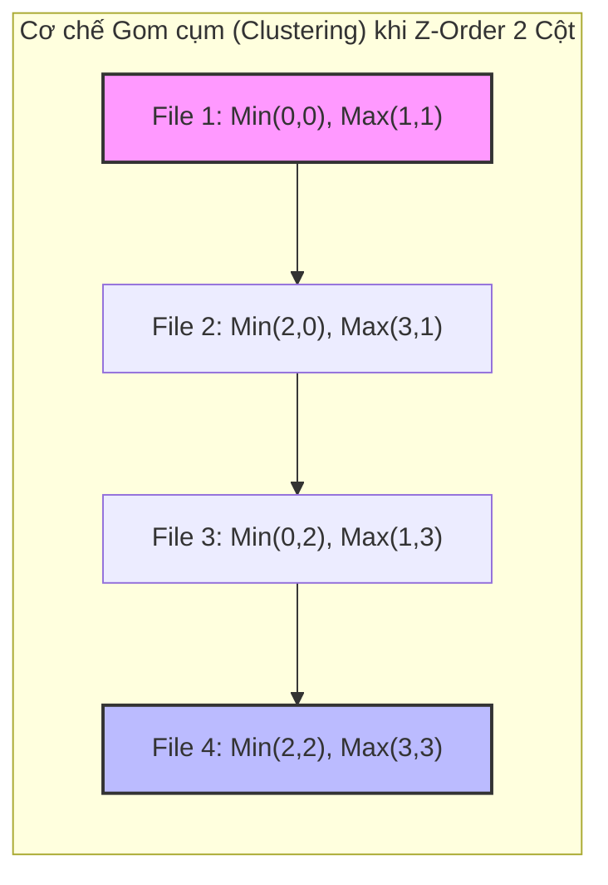

Để tính năng **Data Skipping** (cắt tỉa dữ liệu) có thể hoạt động hiệu quả ở quy mô hàng Petabyte, hệ thống lưu trữ phân tán (như AWS S3, Azure ADLS) phải giảm tải tối đa số lượng file Parquet cần đọc mạng. 

Các hệ thống cơ sở dữ liệu quan hệ truyền thống (RDBMS) giải quyết bài toán này bằng cách sử dụng **B-Tree Index**. Nhưng trong thế giới Distributed Object Storage, I/O cost để duyệt và cập nhật B-Tree liên tục qua mạng là quá đắt đỏ, dễ dẫn đến độ trễ không thể chấp nhận được.

Thay vì Indexing truyền thống, các engine phân tích hiện đại (như Databricks Delta Lake, Apache Iceberg) sử dụng chiến lược **Physical Data Clustering** (Gom cụm dữ liệu vật lý) kết hợp với các siêu dữ liệu thống kê File-level (Min/Max Statistics) lưu trong transaction log. Tuy nhiên, khi cố gắng gom cụm dữ liệu theo nhiều cột đồng thời, kiến trúc hệ thống lập tức vướng phải bài toán muôn thuở: **Linear Sorting Bias (Độ Lệch Sắp Xếp Tuyến Tính)**.

---

## 1. Vấn đề Cốt lõi: Linear Sorting Bias

Khi engine thực thi một câu lệnh như `ORDER BY date, city`, Spark bắt buộc phải tạo ra một cấu trúc vật lý sắp xếp tuần tự một chiều (1-D), ưu tiên tuyệt đối cho cột đầu tiên (`date`).

- Truy vấn `WHERE date = '2023-01-01'` kích hoạt Data Skipping xuất sắc. Spark chỉ quét các file Parquet chứa dữ liệu của ngày này.
- Nhưng khi truy vấn `WHERE city = 'Hanoi'`, hệ thống lập tức kích hoạt **Full Table Scan** (Quét toàn bộ bảng). Dữ liệu của 'Hanoi' bị xé lẻ thành hàng nghìn mảnh nhỏ (fragmentation) và nằm rải rác trên tất cả các file của mọi ngày.

**Systemic Trade-off:** Linear Sort mang tính cục bộ không gian (Spatial Locality) rất thiên lệch. Nó đánh đổi hoàn toàn hiệu năng quét của các chiều dữ liệu phụ (secondary dimensions) để tối ưu tuyệt đối cho chiều chính. Trong Data Analytics, user luôn filter trên nhiều dimension khác nhau tùy bài toán (ví dụ: `customer_id`, `product_id`, `event_type`), khiến Linear Sorting truyền thống trở nên vô dụng.

---

## 2. Kiến trúc Thực thi Vật lý (Physical Execution of Z-Order)

Để phá vỡ Linear Sorting Bias, Delta Lake áp dụng Z-Order Curve (hay còn gọi là **Morton Code**). Z-Order thuộc họ **Space-filling curves** — các hàm toán học chuyên dụng ánh xạ dữ liệu từ không gian đa chiều ($N$-D) xuống không gian một chiều (1-D) trong khi vẫn duy trì tối đa **Data Locality** (tính cục bộ của dữ liệu).

### 2.1. Bit Interleaving (Đan xen Bit)
Dưới nền tảng (under the hood), thuật toán tạo Z-value bằng cách lấy biểu diễn nhị phân của các giá trị cột và "đan xen" (interleave) chúng lại với nhau.

**Ví dụ thực tế:** Giả sử bạn `ZORDER BY` theo hai cột X và Y. Xét hàng có X = 3 (`011` trong nhị phân) và Y = 5 (`101` trong nhị phân):
- Giá trị Y (cột ưu tiên 2): `1 _ 0 _ 1`
- Giá trị X (cột ưu tiên 1): `_ 0 _ 1 _ 1`
- **Z-Value (Morton Code gộp):** `10 01 11` (Hệ thập phân: 39)

Spark Engine sau đó sẽ dùng mã Z-value 1-D duy nhất này để tiến hành **Sort** và ghi dữ liệu xuống các row groups trong file Parquet.

### 2.2. Minh họa Z-Order Mapping



**Kết quả Kiến trúc (Architectural Outcome):** 
Do tính chất đan xen bit, cả hai cột X và Y đều có khoảng (Range: Min-Max) rất hẹp trong Metadata (Footer) của file Parquet. Nhờ vậy, Spark Engine có thể prune (cắt tỉa) được 90% số lượng file không liên quan, bất kể bạn dùng mệnh đề `WHERE` để lọc theo cột X hay cột Y.

---

## 3. Z-Ordering vs. Hive Partitioning truyền thống

Các kỹ sư (đặc biệt là người chuyển từ Hadoop sang) thường nhầm lẫn giữa Partitioning truyền thống và Z-Ordering. Về bản chất thiết kế hệ thống, chúng giải quyết hai bài toán khác nhau:

| Tiêu chí | Hive Partitioning | Z-Ordering |
| :--- | :--- | :--- |
| **I/O Mechanism** | **Directory Pruning** (Cắt tỉa mức độ thư mục vật lý `year=2023/`). |" **Data Skipping** (Cắt tỉa mức độ File thông qua `_delta_log` Min/Max Stats). "|
| **Cardinality Target** | **Low Cardinality** (Date, Country). Gây lỗi `OOMKilled` trên HDFS/Driver nếu chia quá nhiều thư mục nhỏ. |" **High Cardinality** (User_ID, Device_ID, Transaction_ID). "|
|" **Data Skew (Lệch dữ liệu)** "| Lệch dữ liệu cực nặng nếu phân bố không đều (Vd: 90% traffic ở US, 1% ở VN). |" **Skew-resistant**. Spark Engine tự động bin-packing dữ liệu thành các file Parquet kích thước đều đặn (VD: ~1GB) bất kể phân bố gốc. "|

Trong thực chiến, Kiến trúc chuẩn (Standard Architecture) nhiều năm qua là **kết hợp cả hai**: Partition cứng theo `date` và chạy `ZORDER BY (customer_id, event_type)` bên trong mỗi partition đó.

---

## 4. Rủi ro Vận hành (Operational Risks) & Troubleshooting

Z-Order là một chiến lược đánh đổi cực lớn: Lấy sức mạnh Compute (CPU/Memory/Shuffle) ở thời điểm ghi (Write) để tiết kiệm băng thông I/O ở thời điểm đọc (Read).

### 🚨 Incident 1: Write Amplification (Bùng nổ I/O Ghi)
Để tính toán chuỗi Morton Code toàn cục và bin-pack file cho chuẩn, câu lệnh `OPTIMIZE ... ZORDER BY` buộc Spark phải kích hoạt **Network Shuffle** trên diện rộng.
- **Sự cố (Incident):** Chi phí Compute (Databricks DBU / EMR) tăng vọt gấp 3-5 lần sau khi Data Engineer thiết lập cronjob chạy lệnh Z-Order hàng đêm (Nightly Job) trên toàn bộ bảng lịch sử quy mô Petabyte.
- **Khắc phục (Remediation):** Tuyệt đối không chạy Z-Order quét lại toàn bảng mù quáng. Bạn phải giới hạn ranh giới I/O trên các phân vùng (partition) vừa mới ingest dữ liệu (Incremental Compute).

```sql
-- BAD: Gây bùng nổ Shuffle và bốc hơi ngân sách (FinOps Incident)
OPTIMIZE user_events ZORDER BY (device_id, event_type);

-- GOOD: Giới hạn không gian Shuffle, giảm Write Amplification triệt để
OPTIMIZE user_events 
WHERE event_date >= current_date() - INTERVAL 7 DAYS
ZORDER BY (device_id, event_type);
```

### 🚨 Incident 2: Dimensionality Decay (Sự Pha Loãng Chiều Dữ Liệu)
Data Analyst có xu hướng nhồi nhét quá nhiều cột (5-10 cột) vào câu lệnh Z-Order với hy vọng hệ thống sẽ "ngồi cấu hình phép màu" để mọi Query đều nhanh.
- **Hiện tượng:** Càng thêm nhiều cột vào Z-Order, tính hiệu quả của Data Skipping càng giảm đột ngột, Query trở lại trạng thái Scan chậm chạp.
- **Root Cause (Nguyên nhân lõi):** Dựa trên toán học của Bit Interleaving, mỗi khi bạn thêm một chiều (cột) mới, số lượng bit biểu diễn của cột đó trong chuỗi Morton Code bị giảm (pha loãng) tương đối. Dữ liệu lại bị phân tán mạnh trên không gian đa chiều quá lớn.
- **Best Practice:** **Tuyệt đối không Z-Order quá 3-4 cột.** Chỉ chọn các cột có tính High Cardinality và luôn luôn xuất hiện ở mệnh đề `WHERE` (hoặc `JOIN`) của những Query chậm nhất hệ thống (Slow Queries).

---

## 5. Cuộc Cách mạng Mới: Liquid Clustering (Hilbert Curve)

Z-Order mang theo những gánh nặng bảo trì khó chịu: Phải lập lịch chạy lệnh `OPTIMIZE` thủ công, phải lo quản lý kích thước file, và nó cực kỳ cứng nhắc (Rigid) khi schema hoặc pattern query của Business thay đổi.

Gần đây, Databricks đã ra mắt tính năng **Liquid Clustering** (Delta Lake 3.0+), thay thế hoàn toàn cả Hive Partitioning và Z-Order truyền thống. 
Liquid Clustering không sử dụng Z-Order Curve (Morton Code), mà sử dụng thuật toán **Hilbert Curve**.
*   **Z-Curve (Morton):** Dễ tính toán bitwise, nhưng có nhược điểm chí mạng là "Locality Jumps" (những cú nhảy không gian đột ngột khiến dữ liệu gần nhau lại bị lưu ở 2 file xa nhau).
*   **Hilbert Curve:** Phức tạp hơn về mặt toán học, nhưng bảo đảm tính liền kề địa lý (Geometric adjacency) tuyệt hảo. Không có "jumps".
Liquid Clustering tự động cấu trúc dữ liệu theo thuật toán này ngay lúc Ingestion diễn ra [Incremental Clustering], loại bỏ hoàn toàn việc phải manual `OPTIMIZE` partition, và cho phép thay đổi `CLUSTER BY` linh hoạt mà không cần rewrite toàn bộ bảng.

---

## 6. Cấu hình Vận hành (Advanced Configs cho Staff Engineer)

Trong môi trường Production thực tế với kiến trúc Z-Order/Optimize truyền thống, chỉ viết câu lệnh `OPTIMIZE` là chưa đủ. Bạn cần tinh chỉnh Table Properties.

### 6.1. Tuning `targetFileSize` (Tối ưu I/O Concurrency)
Thuật toán Bin-packing mặc định nhắm đến tạo file 1GB cho Z-Order. Kích thước này rất tốt cho Single-node đọc Tuần tự, nhưng nếu Lakehouse của bạn được kết nối với các Distributed Engine (Presto/Trino, Athena) vốn yêu cầu luồng nạp song song cực cao (high concurrency), file 1GB sẽ làm giảm độ song song. Hãy ép Z-Order tạo file nhỏ hơn (vd: 256MB):

```sql
ALTER TABLE user_events SET TBLPROPERTIES (
  -- Hạ Target File Size xuống 256MB để tăng tính song song khi Read
  'delta.targetFileSize' = '268435456' 
);
```

### 6.2. Cấu hình Indexed Columns (Rào chắn OOMKilled cho Driver)
Theo mặc định, Delta Lake chỉ thu thập Metadata (Min/Max/Nulls) cho **32 cột đầu tiên** của bảng. Việc lấy Stats này làm phình to Transaction Log (`_delta_log`). Nếu cột bạn chạy Z-Order lại xui xẻo nằm ở vị trí thứ 40, nó sẽ nằm ngoài vùng theo dõi của log, khiến Z-Order trở nên vô dụng hoàn toàn (Vì Engine không có Min/Max để Skipping). Bạn phải nới rộng biên độ này:

```sql
ALTER TABLE user_events SET TBLPROPERTIES (
  -- Tăng số lượng cột được Delta Log theo dõi Stats lên 50
  'delta.dataSkippingNumIndexedCols' = '50'
);
```
*(Lưu ý: Trade-off ở đây là thời gian ghi Commit log sẽ chậm hơn một chút do Driver node phải gánh bộ nhớ duy trì file JSON State lớn hơn).*

---

## Nguồn Tham Khảo (References)
* [Databricks Blog: Processing Petabytes of Data with Databricks Delta (Z-Ordering]][https://www.databricks.com/blog/2018/07/31/processing-petabytes-of-data-with-databricks-delta.html]
* [Delta Lake Official Documentation: Data Skipping and Z-Ordering][https://docs.delta.io/latest/optimizations-oss.html#z-ordering-multi-dimensional-clustering]
* [Wikipedia: Z-order curve (Morton space-filling curve]][https://en.wikipedia.org/wiki/Z-order_curve]
* [Databricks: Liquid Clustering and Hilbert Curve](https://docs.databricks.com/en/delta/clustering.html]
