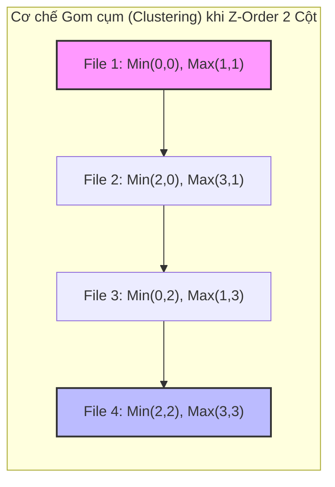

Để Data Skipping (cắt tỉa dữ liệu) có thể hoạt động hiệu quả ở quy mô hàng Petabyte, hệ thống lưu trữ phân tán (như S3, ADLS) phải giảm tải tối đa số lượng file cần đọc. Các hệ thống RDBMS truyền thống sử dụng B-Tree Index, nhưng trong thế giới Distributed Object Storage, I/O cost để duyệt và cập nhật B-Tree liên tục là quá đắt đỏ và bất khả thi.

Thay vì Indexing truyền thống, các engine như Databricks (Delta Lake) sử dụng **Physical Data Clustering** (Gom cụm dữ liệu vật lý) kết hợp với File-level Min/Max Statistics lưu trong transaction log (`_delta_log`). Tuy nhiên, khi cố gắng gom cụm theo nhiều cột đồng thời, hệ thống vướng phải bài toán muôn thuở của khoa học máy tính: **Linear Sorting Bias**.

## 1. Vấn đề Cốt lõi: Linear Sorting Bias (Độ Lệch Sắp Xếp Tuyến Tính)

Khi thực thi câu lệnh SQL như `ORDER BY date, city`, Spark Engine bắt buộc phải tạo ra một cấu trúc vật lý sắp xếp tuần tự, ưu tiên tuyệt đối cho cột đầu tiên (`date`).

- Truy vấn `WHERE date = '2023-01-01'` kích hoạt Data Skipping xuất sắc. Spark chỉ quét các Parquet files chứa dữ liệu của ngày này.
- Truy vấn `WHERE city = 'Hanoi'` kích hoạt **Full Table Scan** (Quét toàn bộ bảng). Dữ liệu của 'Hanoi' bị xé lẻ thành hàng nghìn mảnh nhỏ (fragmentation) và nằm rải rác trên tất cả các file của mọi ngày.

**Systemic Trade-off:** Linear Sort mang tính cục bộ không gian (Spatial Locality) ưu tiên. Nó đánh đổi hoàn toàn hiệu năng của các chiều dữ liệu phụ (secondary dimensions) để tối ưu tuyệt đối cho chiều chính. Trong Data Analytics, user thường query trên nhiều dimension khác nhau (ví dụ: `customer_id`, `product_id`, `event_type`), khiến Linear Sorting trở nên kém hiệu quả.

## 2. Kiến trúc Thực thi Vật lý (Physical Execution of Z-Order)

Để phá vỡ Linear Sorting Bias, Delta Lake áp dụng Z-Order Curve (hay còn gọi là Morton Code). Z-Order thuộc họ **Space-filling curves** — các hàm toán học ánh xạ dữ liệu từ không gian đa chiều ($N$-D) xuống không gian một chiều (1-D) trong khi vẫn duy trì tối đa **Data Locality** (tính cục bộ của dữ liệu).

### 2.1. Bit Interleaving (Đan xen Bit)

Dưới nền tảng (under the hood), thuật toán tạo Z-value bằng cách lấy biểu diễn nhị phân của các giá trị cột và "đan xen" (interleave) chúng lại với nhau.

**Ví dụ:** Giả sử bạn Z-Order theo hai cột X và Y, với X = 3 (`011`) và Y = 5 (`101`):
- Giá trị Y (cột 2): `1 _ 0 _ 1`
- Giá trị X (cột 1): `_ 0 _ 1 _ 1`
- **Z-Value (Morton Code):** `10 01 11` (Hệ thập phân: 39)

Spark Engine sau đó sẽ dùng Z-value 1-D duy nhất này để tiến hành **Sort** và ghi xuống các row groups trong file Parquet.

### 2.2. Minh họa Z-Order Mapping


*Minh họa hàm Z-Order Curve ánh xạ không gian 2D xuống mảng 1D, bảo toàn cụm không gian.*



**Kết quả Kiến trúc:** 
Do tính chất đan xen bit, cả hai cột X và Y đều có khoảng (Range: Min-Max) rất hẹp trong Metadata của file Parquet. Nhờ vậy, Spark Engine có thể prune (cắt tỉa) được 90% số lượng file không liên quan, bất kể bạn dùng mệnh đề `WHERE` lọc theo cột X hay cột Y.

## 3. Hệ thống Cắt tỉa: Z-Ordering vs. Hive Partitioning

Kỹ sư thường nhầm lẫn giữa Partitioning truyền thống và Z-Ordering. Về bản chất hệ thống, chúng giải quyết hai bài toán khác nhau:

| Tiêu chí | Hive Partitioning | Z-Ordering |
| :--- | :--- | :--- |
| **I/O Mechanism** | Directory Pruning (Cắt tỉa mức độ thư mục vật lý `year=2023/`). | Data Skipping (Cắt tỉa mức độ File thông qua `_delta_log` Min/Max Stats). |
| **Cardinality Target** | **Low Cardinality** (Date, Country). Gây lỗi `OOMKilled` trên Driver nếu chia quá nhiều partition nhỏ. | **High Cardinality** (User_ID, Device_ID, Transaction_ID). |
| **Data Skew** | Lệch dữ liệu cực nặng nếu phân bố không đều (Vd: 90% traffic ở VN, 10% ở Lào). | **Skew-resistant**. Spark Engine tự động bin-packing thành các file Parquet kích thước ~1GB bất kể phân bố dữ liệu gốc. |

Trong thực chiến, Kiến trúc chuẩn (Standard Architecture) là **kết hợp cả hai**: Partition theo `date` và `ZORDER BY (customer_id, event_type)` bên trong mỗi partition.

## 4. Rủi ro Vận hành & Trade-offs (Operational Risks)

Z-Order là một chiến lược đánh đổi cực lớn: Lấy sức mạnh Compute (CPU/Memory) ở thời điểm ghi (Write) để tiết kiệm I/O ở thời điểm đọc (Read).

### Incident 1: Write Amplification (Bùng nổ I/O Ghi)

Để tính toán chuỗi Morton Code toàn cục và bin-pack file, câu lệnh `OPTIMIZE ... ZORDER BY` buộc Spark phải kích hoạt **Network Shuffle** trên diện rộng.
- **Hiện tượng:** Chi phí Compute (DBU) của Databricks tăng vọt gấp 3-5 lần sau khi Data Engineer thiết lập cronjob chạy Z-Order hàng đêm (Nightly Job) trên toàn bộ bảng lịch sử (Petabyte scale).
- **Khắc phục:** Tuyệt đối không chạy Z-Order quét lại toàn bảng. Bạn phải giới hạn phạm vi quét trên các phân vùng (partition) vừa mới đổ dữ liệu (Incremental Compute).

```sql
-- BAD: Gây bùng nổ Shuffle và bốc hơi ngân sách (Compute Cost)
OPTIMIZE user_events ZORDER BY (device_id, event_type);

-- GOOD: Giới hạn không gian Shuffle, giảm Write Amplification
OPTIMIZE user_events 
WHERE event_date >= current_date() - INTERVAL 7 DAYS
ZORDER BY (device_id, event_type);
```

### Incident 2: Dimensionality Decay (Sự Pha Loãng Chiều Dữ Liệu)

Nhiều Data Engineer có xu hướng nhồi nhét quá nhiều cột vào câu lệnh Z-Order với hy vọng query nào cũng nhanh.
- **Hiện tượng:** Càng thêm nhiều cột vào Z-Order, tính hiệu quả của Data Skipping càng giảm đột ngột, Query trở lại trạng thái Scan chậm chạp.
- **Root Cause:** Dựa trên toán học của Bit Interleaving, mỗi khi bạn thêm một chiều (cột) mới, số lượng bit biểu diễn của cột đó trong Morton Code bị giảm tương đối. Dữ liệu bị phân tán mạnh trên không gian đa chiều lớn.
- **Best Practice:** **Tuyệt đối không Z-Order quá 4 cột.** Chỉ chọn các cột High Cardinality thường xuyên xuất hiện ở mệnh đề `WHERE` (hoặc `JOIN`) của những Query chậm nhất hệ thống (Slow Queries).

### Cuộc Cách mạng Mới: Liquid Clustering

Vì Z-Order mang theo gánh nặng bảo trì (phải lập lịch chạy `OPTIMIZE` thủ công) và không linh hoạt khi schema thay đổi, Databricks đã ra mắt tính năng **Liquid Clustering**. Liquid Clustering thay thế cả Hive Partitioning và Z-Order, cho phép hệ thống tự động tái cấu trúc dữ liệu theo thuật toán clustering ngầm (Incremental Clustering) ngay lúc đang Ingest dữ liệu mà không cần phải ghi lại toàn bộ bảng.

## 5. Cấu hình Vận hành (Advanced Configs cho Staff Engineer)

Trong môi trường Production thực tế, chỉ viết câu lệnh `OPTIMIZE` là chưa đủ. Bạn cần tinh chỉnh Table Properties trong Delta Lake để Data Skipping thực sự hiệu quả.

### 5.1. Tuning `targetFileSize` (Tối ưu kích thước File)
Mặc định thuật toán Bin-packing của Databricks nhắm đến file 1GB cho Z-Order. Kích thước này rất tốt cho Single-node đọc Tuần tự, nhưng nếu Lakehouse của bạn được kết nối với các Engine khác (Presto/Trino, Athena) vốn yêu cầu luồng nạp song song cao (high concurrency), bạn nên ép Z-Order tạo ra file nhỏ hơn:

```sql
ALTER TABLE user_events SET TBLPROPERTIES (
  -- Hạ Target File Size xuống 256MB để tăng tính song song khi Read
  'delta.targetFileSize' = '268435456' 
);
```

### 5.2. Kiểm soát Indexed Columns (Rào chắn OOMKilled)
Theo mặc định, Delta Lake chỉ thu thập Metadata (Min/Max) cho **32 cột đầu tiên** của schema. Quá trình lấy Stats này tiêu tốn memory. Nếu cột bạn Z-Order nằm ở vị trí thứ 40, nó sẽ nằm ngoài vùng theo dõi của transaction log, khiến Z-Order vô dụng. Bạn phải nới rộng (hoặc thu hẹp) biên độ này bằng cách:

```sql
ALTER TABLE user_events SET TBLPROPERTIES (
  -- Tăng số lượng cột được Delta Log theo dõi Stats
  'delta.dataSkippingNumIndexedCols' = '50'
);
```
*(Lưu ý: Đánh đổi (Trade-off) ở đây là thời gian ghi Commit log sẽ chậm hơn do Driver phải duy trì cây JSON lớn hơn trong bộ nhớ).*

## Nguồn Tham Khảo (References)
* [Databricks Blog: Processing Petabytes of Data with Databricks Delta](https://www.databricks.com/blog/2018/07/31/processing-petabytes-of-data-with-databricks-delta.html)
* [Sách: Designing Data-Intensive Applications - Chapter 3 (Martin Kleppmann)](https://dataintensive.net/)
* [Delta Lake Official Documentation: Data Skipping and Z-Ordering](https://docs.delta.io/latest/optimizations-oss.html#z-ordering-multi-dimensional-clustering)
* [Wikipedia: Z-order curve (Morton space-filling curve)](https://en.wikipedia.org/wiki/Z-order_curve)
