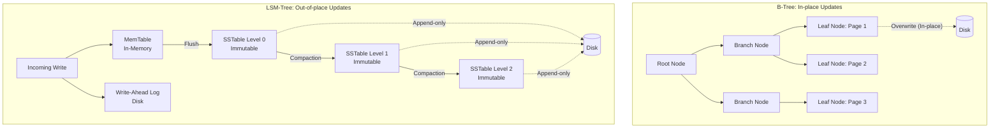

Trong thế giới của cơ sở dữ liệu (Database), Storage Engine (Công cụ lưu trữ) là thành phần cốt lõi chịu trách nhiệm ghi dữ liệu xuống đĩa (disk) và đọc dữ liệu trở lại. Mặc dù có nhiều loại cơ sở dữ liệu khác nhau (Relational, NoSQL, Time-series...), phần lớn các Storage Engine hiện đại đều được xây dựng dựa trên một trong hai cấu trúc dữ liệu nền tảng: **B-Tree** (và các biến thể như B+Tree) hoặc **LSM-Tree** (Log-Structured Merge-Tree).

Bài viết này sẽ đi sâu vào việc mổ xẻ nguyên lý hoạt động, cấu trúc, và phân tích các đánh đổi (trade-offs) giữa hai kiến trúc này.

## 1. B-Tree: Chuẩn mực cổ điển (In-place Updates)

B-Tree (đặc biệt là B+Tree) là cấu trúc dữ liệu mặc định cho hầu hết các cơ sở dữ liệu quan hệ truyền thống (như PostgreSQL, MySQL/InnoDB, Oracle) từ những năm 1970.

### Cơ chế hoạt động
B-Tree chia cơ sở dữ liệu thành các khối (block) hoặc trang (page) có kích thước cố định (thường là 4KB hoặc 8KB) và đọc/ghi trên từng trang này. Cấu trúc cây giúp duy trì dữ liệu luôn được sắp xếp, cho phép tìm kiếm, chèn, và xóa theo thời gian logarit $O(\log n)$.

### In-place Updates (Cập nhật tại chỗ)
Điểm đặc trưng nhất của B-Tree là cơ chế **In-place updates**. Khi bạn muốn cập nhật một bản ghi, Storage Engine sẽ tìm trang (page) chứa bản ghi đó trên disk, tải nó vào bộ nhớ (RAM), thay đổi giá trị, và sau đó **ghi đè (overwrite)** trang đó trở lại vị trí cũ trên disk. 

Để đảm bảo tính toàn vẹn dữ liệu nếu hệ thống bị crash giữa chừng lúc đang ghi đè, B-Tree thường đi kèm với một cấu trúc gọi là **Write-Ahead Log (WAL)**. Mọi thay đổi đều được nối (append) vào WAL trước khi thực sự ghi đè lên trang B-Tree.

## 2. LSM-Tree: Ngôi sao của kỷ nguyên Big Data (Out-of-place Updates)

LSM-Tree (Log-Structured Merge-Tree) là cấu trúc nền tảng cho nhiều cơ sở dữ liệu phân tán và NoSQL hiện đại như Cassandra, RocksDB, LevelDB, HBase.

### Cơ chế hoạt động
Thay vì cập nhật tại chỗ như B-Tree, LSM-Tree sử dụng cơ chế **Out-of-place updates** (hay append-only). LSM-Tree không bao giờ ghi đè dữ liệu cũ. Thay vào đó, nó chia luồng xử lý thành các thành phần in-memory và on-disk:

1. **MemTable:** Mọi thao tác ghi mới (insert, update, delete) đều được lưu vào một cấu trúc dữ liệu trên RAM (thường là Red-Black Tree hoặc Skip List) được gọi là MemTable.
2. **Write-Ahead Log (WAL):** Tương tự B-Tree, để tránh mất dữ liệu trên RAM khi mất điện, dữ liệu cũng được ghi tuần tự (append) vào WAL trên đĩa.
3. **SSTables (Sorted String Tables):** Khi MemTable đầy, nó sẽ được "flush" (đẩy) xuống đĩa thành một file SSTable bất biến (immutable). Dữ liệu trong SSTable luôn được sắp xếp theo key.

### Quá trình Compaction (Nén và Gộp)
Vì LSM-Tree liên tục tạo ra các file SSTable mới, việc đọc sẽ ngày càng chậm vì phải quét qua nhiều file. Để giải quyết, một background thread sẽ liên tục chạy quá trình **Compaction**. Compaction sẽ đọc một số file SSTable cũ, gộp chúng lại, loại bỏ các bản ghi bị xóa (tombstones) hoặc bị ghi đè, và tạo ra một SSTable mới ở tầng (level) sâu hơn.

## 3. Kiến trúc tổng quan: B-Tree vs LSM-Tree

## 4. Mổ xẻ Trade-offs: B-Tree và LSM-Tree

Sự khác biệt cốt lõi giữa "Overwrite" và "Append-only" dẫn đến những trade-off rõ rệt về hiệu suất giữa hai kiến trúc này.

### Write Amplification (Khuếch đại ghi)
Write amplification là hiện tượng lượng dữ liệu vật lý ghi xuống đĩa lớn hơn lượng dữ liệu logic thực tế mà ứng dụng yêu cầu.
- **B-Tree:** Có write amplification cao trong quá trình ghi (ví dụ update 10 bytes có thể phải ghi lại toàn bộ page 4KB, cộng thêm ghi vào WAL). Hiện tượng phân mảnh (fragmentation) cũng làm tăng write amplification.
- **LSM-Tree:** Tối ưu hóa cực tốt cho thao tác ghi. Ghi vào MemTable và tuần tự vào WAL cực kỳ nhanh (băng thông tuần tự của ổ đĩa rất cao). Tuy nhiên, **Compaction** ở background lại tạo ra Write Amplification ở mức độ khác (dữ liệu bị đọc/ghi lại nhiều lần khi chuyển qua các levels). Dù vậy, tổng thể LSM-Tree vẫn vượt trội hơn B-Tree trong các workload **Write-heavy**.

### Read Amplification (Khuếch đại đọc)
- **B-Tree:** Rất thấp. Việc tìm kiếm một key thường chỉ tốn vài thao tác đọc disk (theo chiều sâu của cây), và nếu các page ở nhánh trên đã nằm trong cache, thường chỉ cần 1 lần disk I/O.
- **LSM-Tree:** Rất cao. Để tìm một key không có trong MemTable, hệ thống phải tìm ngược từ SSTable mới nhất về cũ nhất. Mặc dù có sử dụng Bloom Filters để loại trừ nhanh các SSTable không chứa key, trong trường hợp xấu nhất (hoặc thực hiện range query), LSM-Tree vẫn phải kiểm tra qua rất nhiều file. Do đó, B-Tree chiến thắng tuyệt đối trong các workload **Read-heavy**.

### Compaction Overhead (Chi phí nén của LSM-Tree)
Một trong những vấn đề lớn nhất của LSM-Tree là **Compaction Overhead**.
Quá trình compaction tiêu tốn rất nhiều tài nguyên Disk I/O và CPU. Nếu tốc độ ghi của hệ thống (write rate) quá cao, quá trình compaction có thể không theo kịp tốc độ tạo ra SSTable mới. Điều này dẫn đến lượng SSTable chưa gộp phình to, làm chậm thê thảm tốc độ đọc (Read Amplification tăng vọt) và có thể gây ra hiện tượng *write stalls* (hệ thống tự động chặn ghi để chờ compaction). Cấu hình và tuning quá trình compaction (như Size-tiered hay Levelled compaction) là một trong những nghệ thuật phức tạp nhất khi vận hành các database LSM-Tree như Cassandra hay RocksDB.

### Tổng kết Trade-offs
| Đặc điểm | B-Tree | LSM-Tree |
| :--- | :--- | :--- |
| **Cơ chế cập nhật** | In-place update (Overwrite) | Out-of-place update (Append-only) |
| **Hiệu năng Ghi (Writes)** | Trung bình / Tốt (Random I/O) | Xuất sắc (Sequential I/O) |
| **Hiệu năng Đọc (Reads)** | Xuất sắc (Ít Read Amplification) | Trung bình (Nhiều file SSTables) |
| **Lưu trữ** | Có thể bị phân mảnh (Fragmentation) | Tối ưu dung lượng tốt hơn (nhờ nén) |
| **Overhead** | Ghi đè toàn bộ page (Write Amplification) | Trễ do Compaction tranh chấp I/O |
| **Workload lý tưởng** | Read-heavy, Read-modify-write | Write-heavy, Timeseries, Logs |

## Nguồn tham khảo

- Designing Data-Intensive Applications: The Big Ideas Behind Reliable, Scalable, and Maintainable Systems (Martin Kleppmann)
- The Log-Structured Merge-Tree (LSM-Tree) (Patrick O'Neil, Edward Cheng, Dieter Gawlick, Elizabeth O'Neil)
- LevelDB Architecture and Implementation (Google Open Source)
- RocksDB: A Persistent Key-Value Store for Flash and RAM Storage (Facebook Engineering)
- The Ubiquitous B-Tree (Douglas Comer, ACM Computing Surveys)
