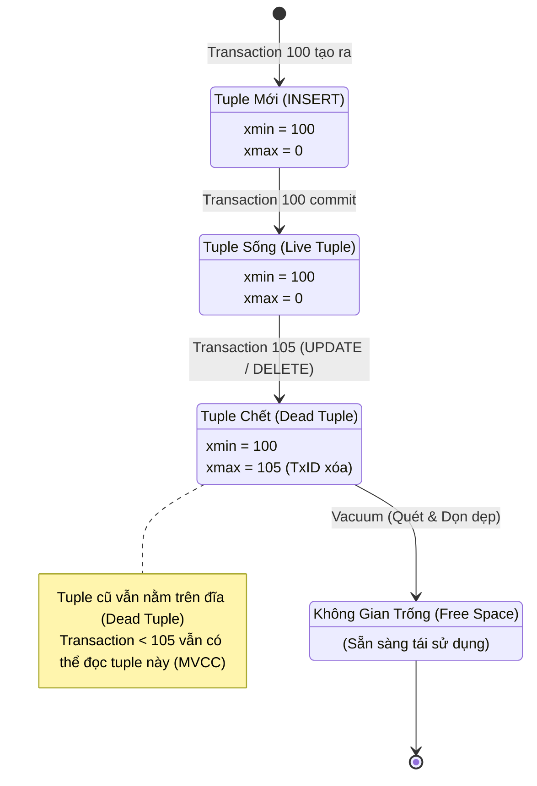

# Mổ xẻ Postgres MVCC & ACID Internals

Khi làm việc với các hệ quản trị cơ sở dữ liệu quan hệ (RDBMS), tính chất **ACID** (Atomicity, Consistency, Isolation, Durability) là nền tảng cốt lõi đảm bảo sự tin cậy của dữ liệu. Trong đó, **Isolation** (Tính cô lập) là yếu tố quyết định hiệu năng khi có hàng ngàn giao dịch (transactions) cùng đọc/ghi đồng thời.

PostgreSQL giải quyết bài toán Isolation thông qua kiến trúc **Multi-Version Concurrency Control (MVCC)**. Thay vì dùng lock (khóa) trên từng dòng gây nghẽn cổ chai (như lock-based concurrency control truyền thống), MVCC cho phép **"Người đọc không chặn người ghi, và người ghi không chặn người đọc"**. 

Bài viết này sẽ deep-dive vào kiến trúc nội tại của Postgres MVCC, cách nó quản lý các phiên bản dữ liệu (tuples), và những hệ quả thiết kế đặc trưng như Write Amplification hay Table Bloat.

---

## 1. Tuple Storage và Cơ Chế xmin, xmax

Trong PostgreSQL, dữ liệu không bị ghi đè trực tiếp. Mỗi dòng dữ liệu trong bảng được gọi là một **Tuple**. Một Tuple trong Postgres có thêm phần meta-data (header) chứa các thông tin phục vụ cho MVCC. Hai trường quan trọng nhất là `xmin` và `xmax`.

*   **`xmin`**: ID của Transaction (TxID) đã tạo ra (INSERT) phiên bản tuple này.
*   **`xmax`**: ID của Transaction đã xóa (DELETE) hoặc cập nhật (UPDATE) tuple này. Nếu tuple chưa bị xóa, `xmax = 0`.

Khi một Transaction đọc dữ liệu, Postgres sẽ dùng TxID hiện tại để so sánh với `xmin` và `xmax` của từng tuple để quyết định xem tuple đó có **hiển thị (visible)** đối với transaction này hay không.

### Sơ đồ: Vòng đời của Tuple và Vacuum

Dưới đây là sơ đồ minh họa vòng đời của một Tuple khi trải qua các thao tác INSERT, UPDATE, DELETE và quá trình dọn dẹp của Vacuum.

---

## 2. Tại sao UPDATE trong Postgres thực chất là DELETE + INSERT?

Không giống như một số DB khác (ví dụ MySQL với InnoDB lưu trữ in-place update và dùng undo log), thiết kế lõi của PostgreSQL áp dụng triết lý **Append-Only** (hay còn gọi là bản chất của MVCC không ghi đè). 

Khi bạn thực hiện lệnh `UPDATE` trên một hàng, Postgres **không hề sửa dữ liệu trực tiếp tại vị trí bộ nhớ/ổ đĩa đó**. Thực chất, một lệnh `UPDATE` bao gồm hai bước liền kề:

1.  **DELETE (Logic)**: Postgres đánh dấu phiên bản hiện tại của tuple là "đã bị xóa" bằng cách cập nhật trường `xmax` của nó bằng ID của Transaction đang thực hiện UPDATE. Tuple này biến thành một **Dead Tuple** (với các transaction mới).
2.  **INSERT (Mới)**: Postgres tạo ra một tuple hoàn toàn mới (phiên bản mới) chứa dữ liệu đã được cập nhật, với `xmin` là Transaction ID hiện tại và `xmax = 0`.

### Ưu điểm của thiết kế này:
*   **Rollback cực nhanh**: Nếu transaction bị lỗi hoặc người dùng gõ `ROLLBACK`, Postgres không cần đảo ngược (undo) dữ liệu. Nó chỉ đơn giản đánh dấu transaction đó là "aborted" (hủy). Các transaction khác sẽ biết tự bỏ qua tuple mới (`xmin` aborted) và tiếp tục đọc tuple cũ (vì tuple cũ chỉ bị đánh dấu `xmax` bởi một transaction đã aborted).
*   **Không cần cấu trúc Undo Log phức tạp**: Lịch sử phiên bản nằm luôn ngay trên bảng dữ liệu (Table Heap), giúp quản lý concurrency dễ dàng hơn.

---

## 3. Hệ quả: Write Amplification và Table Bloat

Mọi thiết kế đều có sự đánh đổi. Việc biến `UPDATE` thành `DELETE + INSERT` kéo theo hai vấn đề lớn nhất của Postgres:

### A. Table Bloat (Phình to dữ liệu)
Vì bản ghi cũ không bị xóa đi ngay lập tức (để phục vụ cho các transaction cũ có thể đang đọc nó), các **Dead Tuples** sẽ tích tụ dần trên file vật lý của bảng. 
*   Hiện tượng bảng chứa quá nhiều Dead Tuples không còn ai dùng tới, gây lãng phí dung lượng đĩa và làm chậm quá trình Sequential Scan, được gọi là **Table Bloat**.
*   Index cũng bị phình to (Index Bloat) vì Postgres phải tạo pointer mới trong Index trỏ tới tuple mới, ngay cả khi cột được index không hề thay đổi. (Mặc dù Postgres đã giảm nhẹ điều này qua cơ chế HOT - Heap-Only Tuples nếu thỏa mãn điều kiện).

### B. Write Amplification (Khuếch đại ghi)
Write Amplification xảy ra khi một lượng thay đổi nhỏ ở tầng logic lại gây ra một lượng ghi lớn ở tầng đĩa vật lý. 
Trong Postgres, mỗi lần `UPDATE`, bạn không chỉ phải ghi tuple mới vào Heap, mà còn phải cập nhật WAL (Write-Ahead Logging), và phải cập nhật **tất cả** các Index của bảng đó để trỏ tới bản ghi mới (trừ khi áp dụng được HOT update). Nếu bảng có 10 Index, một thao tác UPDATE một cột không được index vẫn có thể phải ghi dữ liệu ra đĩa cho cả 10 file Index.

---

## 4. Giải pháp: Vacuum Mechanism

Để giải quyết Table Bloat và dọn dẹp các Dead Tuples, Postgres sử dụng quá trình **VACUUM**.

**Nhiệm vụ của VACUUM:**
1.  Quét qua tất cả các trang (pages) của bảng.
2.  Xác định các Dead Tuples (`xmax` của tuple thuộc về các transaction đã commit từ rất lâu và không còn transaction nào đang chạy cần đọc nó nữa).
3.  Đánh dấu không gian của các Dead Tuples này trong **Free Space Map (FSM)**.
4.  Lần `INSERT` hoặc `UPDATE` sau sẽ tái sử dụng lại không gian đã được Vacuum giải phóng, thay vì xin thêm block nhớ mới ở cuối file.

*Lưu ý:* `VACUUM` thông thường không trả lại dung lượng đĩa cho Hệ điều hành (trừ khi trang trống nằm ở cuối file), nó chỉ tái sử dụng không gian bên trong bảng. Để thực sự thu nhỏ file dữ liệu và trả dung lượng cho OS, phải dùng `VACUUM FULL` (sẽ khóa toàn bộ bảng `AccessExclusiveLock` và viết lại toàn bộ file vật lý).

### Autovacuum Daemon
Trong thực tế, Postgres chạy một tiến trình nền là **Autovacuum**. Nó tự động theo dõi (thống kê) số lượng dead tuples trong từng bảng. Khi số lượng này vượt qua một ngưỡng nhất định, autovacuum worker sẽ tự động thức dậy và dọn dẹp, giúp DBA không cần phải chạy lệnh `VACUUM` bằng tay.

---

## Kết luận

Kiến trúc MVCC của PostgreSQL mang lại khả năng xử lý đồng thời tuyệt vời, giúp các giao dịch đọc và ghi không block lẫn nhau. Tuy nhiên, việc thực thi Update thông qua "Delete + Insert" cùng cơ chế lưu trữ version ngay trên Heap đòi hỏi các kỹ sư phải hiểu sâu về Dead Tuples, Bloat và cấu hình Autovacuum đúng đắn để duy trì hiệu năng ổn định cho hệ thống lớn.

---

*   PostgreSQL Official Documentation: Concurrency Control (Chapter 13)
*   PostgreSQL Official Documentation: Routine Vacuuming (Chapter 25)
*   "An Empirical Evaluation of In-Memory Multi-Version Concurrency Control" - Wu et al. (CMU Database Group, VLDB 2017)
*   CMU 15-445/645 Database Systems: Lecture Notes on Multi-Version Concurrency Control
*   The Internals of PostgreSQL (Hironobu Suzuki): Chapter 5 - Concurrency Control
