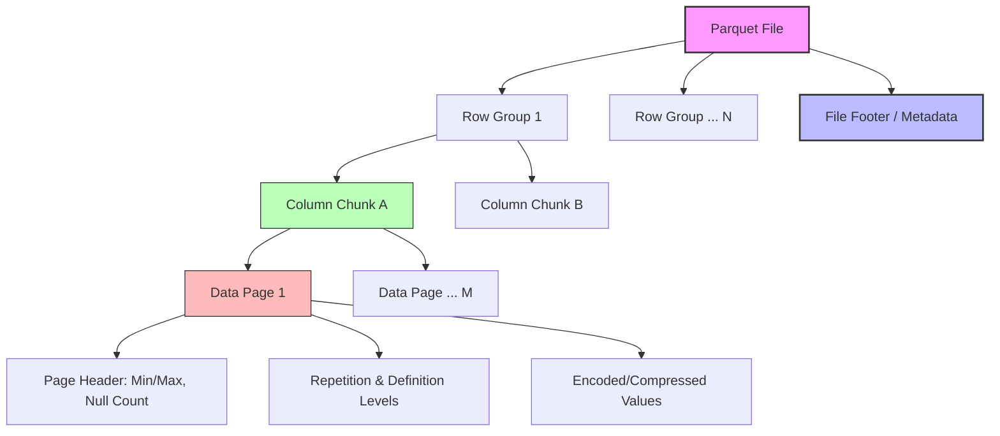
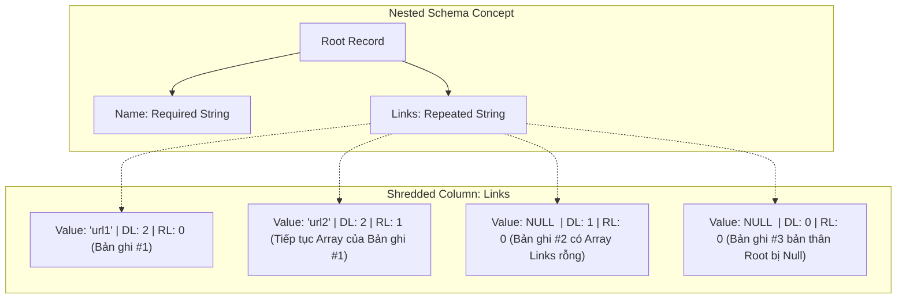

Trong hệ sinh thái Dữ liệu lớn (Big Data), định dạng lưu trữ đóng vai trò tối quan trọng quyết định hiệu năng truy vấn. Apache Parquet ra đời dựa trên nền tảng lý thuyết từ báo cáo **Dremel** của Google, mang đến khả năng lưu trữ dữ liệu dạng cột (Columnar Format) cực kỳ tối ưu cho các tác vụ phân tích (OLAP).

Bài viết này sẽ mổ xẻ kiến trúc vật lý của Parquet, cách nó biểu diễn dữ liệu lồng nhau (Nested Data) thông qua Record Shredding, và các kỹ thuật nén/encoding làm nên tên tuổi của nó.

## Tại Sao Columnar Lại "Hủy Diệt" Row-based Trong OLAP?

Trong mô hình hướng dòng (Row-based) như CSV hay Avro, dữ liệu của một bản ghi (record) được lưu trữ liền kề nhau trên đĩa. Điều này rất tốt cho hệ thống OLTP vì tác vụ ghi/đọc một bản ghi cụ thể diễn ra tuần tự.

Tuy nhiên, trong OLAP, các truy vấn phân tích (ví dụ: `SUM`, `AVG`, `GROUP BY`) thường quét qua hàng tỷ bản ghi nhưng chỉ chọn ra một vài cột nhất định.
- **Row-based**: Hệ thống phải đọc *toàn bộ* dữ liệu từ đĩa lên bộ nhớ, sau đó loại bỏ các cột không cần thiết. Quá trình này lãng phí IO Disk và RAM khổng lồ.
- **Columnar-based**: Dữ liệu của từng cột được lưu trữ liên tiếp nhau. Truy vấn chỉ đọc đúng các byte thuộc về cột cần thiết (Projection Pushdown). Hơn nữa, dữ liệu cùng kiểu nằm cạnh nhau giúp các thuật toán nén (RLE, Dictionary) hoạt động với hiệu suất tối đa.

## Kiến Trúc Lưu Trữ Của Parquet

Parquet không đơn thuần là lưu từng cột riêng biệt từ đầu đến cuối file. Nó chia dữ liệu theo dạng **Hybrid**: cắt dữ liệu thành các cục lớn (Row Group), trong mỗi cục mới lưu theo cột (Column Chunk).

- **Row Group**: Chứa các dòng dữ liệu (thường từ 50MB - 1GB). Giúp hệ thống vẫn giữ được tính cục bộ khi đọc một dải bản ghi.
- **Column Chunk**: Dữ liệu của một cột nằm gọn trong một Row Group.
- **Page**: Đơn vị nhỏ nhất trong Parquet (thường 1MB). Mỗi Page chứa header, metadata (min, max, dict) và dữ liệu thực tế.

## Dremel Record Shredding: Xử Lý Dữ Liệu Lồng Nhau (Nested Data)

Lưu trữ dữ liệu dạng bảng (flat) theo cột thì dễ, nhưng làm sao lưu trữ dạng JSON/Nested với các mảng (Array) lồng nhau mà vẫn không mất đi cấu trúc khi ghép lại? Google Dremel giải quyết bài toán này bằng thuật toán **Record Shredding** thông qua hai chỉ số: **Repetition Level (RL)** và **Definition Level (DL)**.

### Definition Level (DL)
Xác định mức độ "sâu" của một trường dữ liệu (field) trên cây schema. Nó cho biết trường đó hoặc các trường cha của nó có giá trị `NULL` ở cấp độ nào.
- Nếu trường bắt buộc (Required), không cần DL.
- Nếu trường có thể Null (Optional/Repeated), DL chỉ ra nút nào trên cây bị thiếu.

### Repetition Level (RL)
Cho biết giá trị hiện tại thuộc về bản ghi mới, hay là phần tử tiếp theo của mảng (Array) trong cùng một bản ghi.
- `RL = 0`: Bắt đầu một bản ghi (Root record) hoàn toàn mới.
- `RL > 0`: Mức độ sâu của mảng đang được lặp lại.

*Ghi chú: Khi giải nén, Parquet đọc các luồng DL và RL này dưới dạng một máy trạng thái (State Machine) để ráp lại cấu trúc JSON ban đầu mà không cần đọc các cột khác.*

## Dictionary Encoding & Run Length Encoding (RLE)

Sức mạnh nén của Parquet đến từ việc phối hợp thông minh các thuật toán ở mức Page.

### Dictionary Encoding
Dữ liệu phân tích thường có tính trùng lặp cao (Cardinality thấp). Thay vì lưu chuỗi `"Hanoi"` 1 triệu lần, Parquet tạo một từ điển (Dictionary):
- `0 -> "Hanoi"`
- `1 -> "HCM"`

Trong Data Page, Parquet chỉ lưu các số nguyên `0`, `1` (kích thước tính bằng bit) thay vì toàn bộ chuỗi.

### Run Length Encoding (RLE) & Bit Packing
Khi dữ liệu đã biến thành các số nguyên (từ Dictionary) hoặc chính RL/DL, chúng có xu hướng lặp lại liên tục: `0, 0, 0, 0, 1, 1, 1`.
RLE sẽ nén chúng thành: `(4 lần số 0), (3 lần số 1)`.

Nếu dùng **Bit Packing**, thay vì dùng 32-bit (4 bytes) để lưu số `1`, Parquet nhận thấy từ điển chỉ có 2 giá trị nên chỉ dùng đúng **1 bit** để mã hóa. 

Kết hợp Dictionary + RLE + Bit Packing + thuật toán nén khối (GZIP/Snappy/ZSTD), Parquet có thể nén dữ liệu nhỏ hơn CSV từ 70% đến 90%.

## Tối Ưu Truy Vấn: Predicate Pushdown Ở Mức Byte

Trong hệ sinh thái Hadoop/Spark/Trino, Parquet tỏa sáng nhờ khả năng **Predicate Pushdown** (đẩy điều kiện lọc xuống thẳng lớp đọc file trên đĩa).

Thay vì đưa toàn bộ data vào bộ nhớ rồi mới chạy `WHERE age > 30`, Parquet sử dụng metadata nằm ở Footer và Page Header để lọc dữ liệu ở mức byte:

1. **Row Group Skipping**: Metadata trong File Footer chứa `Min`, `Max` của từng Column Chunk trong mỗi Row Group. Nếu truy vấn `WHERE age = 50`, hệ thống kiểm tra thấy `Min = 10, Max = 40` ở Row Group 1, nó sẽ **bỏ qua hoàn toàn** (skip) việc đọc Row Group 1 vào bộ nhớ.
2. **Page Skipping & Bloom Filters**: Trong một Column Chunk, Header của từng Page cũng lưu `Min/Max`. Nếu bật Bloom Filter, Parquet kiểm tra siêu nhanh xem giá trị `50` có tồn tại trong Page đó không. Nếu không, bỏ qua việc giải mã (Decode) và giải nén (Decompress) toàn bộ Page đó.

Việc bỏ qua hàng loạt Block/Page ở mức byte giúp tiết kiệm I/O throughput và CPU cycles cực lớn, biến Parquet thành tiêu chuẩn de-facto (thực tế) của mọi kiến trúc Data Lake / Lakehouse hiện đại.

---
- Google Dremel: Interactive Analysis of Web-Scale Datasets
- Apache Parquet Format Specifications
- Dremel Made Simple with Parquet - Twitter Engineering
- The Design and Implementation of Modern Column-Oriented Database Systems
- Spark SQL: Relational Data Processing in Spark
