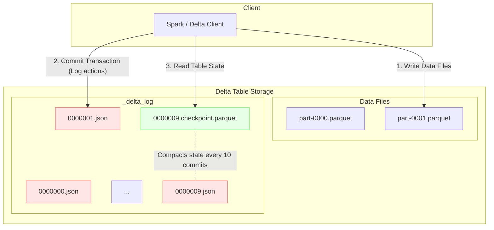

Delta Lake là trái tim của kiến trúc Data Lakehouse hiện đại, mang đến sự tin cậy (ACID transactions) và hiệu năng cực cao trên nền tảng lưu trữ Object Storage (S3, ADLS, GCS). Sức mạnh của Delta Lake đến từ hai thành phần cốt lõi: **Transaction Log** và các kỹ thuật tối ưu hoá dữ liệu như **Z-Ordering**.

Bài viết này sẽ "mổ xẻ" cơ chế hoạt động bên trong của hai thành phần trên, giúp bạn hiểu rõ cách Delta Lake duy trì tính nhất quán và tối ưu hóa truy vấn với độ trễ thấp trên hàng Petabyte dữ liệu.

## 1. Transaction Log (`_delta_log`) & Checkpointing

Tại cốt lõi của mỗi Delta table là Transaction Log (thư mục `_delta_log`). Thay vì ghi đè hay xóa trực tiếp file dữ liệu, mọi thao tác (INSERT, UPDATE, DELETE, MERGE) đều được Delta Lake ghi nhận tuần tự vào thư mục log dưới định dạng file JSON. 

Bằng cách đọc Transaction Log, engine (như Spark, Trino, v.v.) có thể tái tạo chính xác trạng thái mới nhất của bảng hoặc thực hiện Time Travel (truy vấn dữ liệu tại một thời điểm trong quá khứ).

### Cơ chế tạo Checkpoint (Checkpointing)

Nếu hệ thống luôn phải đọc lại toàn bộ hàng nghìn file JSON từ lúc bảng được tạo để tính toán trạng thái hiện tại, tốc độ xử lý sẽ bị suy giảm nghiêm trọng. Để khắc phục, Delta Lake sử dụng cơ chế **Checkpoint**. Cứ sau mỗi 10 commits (mặc định), hệ thống sẽ nén và tổng hợp trạng thái của các file JSON trước đó vào một file Parquet (gọi là Checkpoint file). File Checkpoint cho phép đọc trạng thái của hàng triệu file cực kỳ nhanh chóng.

Dưới đây là sơ đồ minh họa luồng ghi log và tạo Checkpoint trong thư mục `_delta_log`:

**Chi tiết luồng hoạt động:**
1. **Write Data Files**: Engine phân tích dữ liệu và ghi các file định dạng Parquet mới vào thư mục chứa dữ liệu (data directory). 
2. **Commit Transaction**: Engine thực hiện commit (Optimistic Concurrency Control) bằng cách tạo file JSON trong `_delta_log`. File này ghi nhận các hành động: `add` (file mới tạo), `remove` (file bị đánh dấu xóa), cập nhật thống kê (min/max).
3. **Compacting / Checkpointing**: Khi đạt đến `0000009.json`, một tác vụ chạy nền sẽ gom trạng thái bảng hiện tại thành file `0000009.checkpoint.parquet`. Ở lần đọc tiếp theo, thay vì đọc 10 file JSON, hệ thống chỉ cần đọc Checkpoint mới nhất và áp dụng những file JSON sinh ra sau Checkpoint đó.

---

## 2. Z-Ordering: Tối ưu hoá Data Skipping

Bên cạnh Transaction Log, Data Skipping là chìa khoá để Delta Lake trả về kết quả nhanh chóng. Delta Lake lưu giữ thống kê về **Min** và **Max** của các cột (columns) trên từng file Parquet ngay bên trong Transaction Log. Khi truy vấn được thực thi kèm theo mệnh đề `WHERE`, engine sẽ đọc Min/Max từ log, nhờ đó có thể mạnh dạn bỏ qua (Skip) toàn bộ các file chắc chắn không chứa dữ liệu thoả mãn điều kiện.

Tuy nhiên, nếu dữ liệu nằm rải rác ngẫu nhiên ở khắp các file, Data Skipping sẽ kém hiệu quả. Đó là lúc **Z-Ordering** phát huy tác dụng.

### Nguyên lý hoạt động của Z-Ordering
Z-Ordering là một thuật toán ánh xạ nhiều chiều (multi-dimensional clustering) giúp "gom cụm" (co-locate) các điểm dữ liệu có liên quan lại với nhau vào cùng một file dữ liệu vật lý. Việc gom cụm giúp các giá trị Min và Max trong mỗi file nằm trong một phạm vi hẹp nhất có thể, nâng cao tỉ lệ file được "skip" đi trong quá trình truy vấn.

### Mổ xẻ: Z-Ordering vs. Hive Partitioning truyền thống

Các hệ thống truyền thống trước đây thường dựa vào **Hive Partitioning** (chia thư mục dựa trên giá trị của một hoặc nhiều cột). Mặc dù rất phổ biến, Hive Partitioning có những hạn chế chí mạng mà Z-Ordering giải quyết triệt để:

| Tiêu chí | Hive Partitioning | Z-Ordering (Delta Lake) |
|---|---|---|
| **Cách tổ chức** | Tạo thư mục vật lý (Ví dụ: `year=2023/month=08/`) | Sắp xếp lại thứ tự dữ liệu vật lý bên trong các file (Row-level sorting) |
| **Bản chất cột (Cardinality)** | Chỉ hiệu quả với cột có **Độ phân tán thấp (Low Cardinality)** như năm, tháng, phòng ban. Nếu dùng cho các cột High Cardinality (như `user_id`, `timestamp`), sẽ gây ra thảm họa "bùng nổ" file nhỏ (Small File Problem). | Đặc biệt hiệu quả với các cột có **Độ phân tán cao (High Cardinality)** như `user_id`, `device_id`, `order_id` mà không tạo ra thêm bất kỳ folder nhỏ lẻ nào. |
| **Đa chiều (Multi-dimensional)** | Partitioning trên nhiều cột tạo cấu trúc thư mục lồng nhau sâu, dẫn đến số lượng file phân mảnh theo cấp số nhân và bị giới hạn cứng. | Có thể dễ dàng Z-Order trên nhiều cột đồng thời. Thuật toán cân bằng hoàn hảo mật độ dữ liệu giữa các chiều khác nhau. |
| **Hiệu năng cập nhật** | Việc thay đổi cấu trúc Partition tốn chi phí toàn bảng (full table rewrite). | Việc chạy lệnh `OPTIMIZE ... ZORDER BY` có thể chạy dưới dạng incremental trên một phần dữ liệu. |

**Ví dụ thực tế:**
Giả sử bạn có hàng tỷ bản ghi giao dịch và cần truy vấn: `SELECT * FROM sales WHERE user_id = 12345 AND store_id = 'A'`.
- **Nếu dùng Hive Partitioning**: Không thể partition theo `user_id` vì có hàng triệu user. Dữ liệu của một `user_id` nằm rải rác ở hàng nghìn file.
- **Nếu dùng Z-Ordering trên `(user_id, store_id)`**: Dữ liệu của cùng user và store sẽ co cụm lại trong một số ít file. Thông qua Min/Max trong `_delta_log`, engine phát hiện ngay lập tức chỉ có 2 trên 10,000 file chứa `user_id = 12345`, do đó bỏ qua đọc toàn bộ 9,998 file còn lại. Hiệu năng quét giảm từ vài phút xuống còn vài giây.

## Tổng kết

Transaction Log (`_delta_log`) là xương sống đảm bảo tính trọn vẹn dữ liệu và cung cấp metadata cho việc tối ưu hoá; trong khi Z-Ordering làm nhiệm vụ nhào nặn cấu trúc dữ liệu vật lý để tối đa hoá tỉ lệ Data Skipping. Kết hợp cả hai, Delta Lake mang đến sức mạnh xử lý lượng dữ liệu khổng lồ theo cách trước đây chỉ có thể tìm thấy ở các Data Warehouse đắt đỏ.

## Tham khảo

- Databricks Blog: Diving Into Delta Lake: Unpacking The Transaction Log
- Databricks Blog: Processing Petabytes of Data in Seconds with Databricks Delta
- Delta Lake: High-Performance ACID Table Storage over Cloud Object Stores (VLDB 2020)
- Delta Lake Documentation: What is the Delta Lake transaction log?
- Databricks Documentation: Z-order clustering
