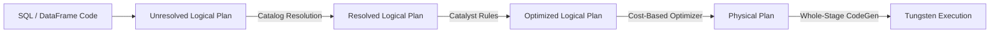

Khởi nguồn từ AMPLab (UC Berkeley) và sau này được thương mại hóa bởi Databricks, Apache Spark đã định hình lại toàn bộ cảnh quan xử lý dữ liệu phân tán (Distributed Data Processing). Nếu Hadoop MapReduce chỉ có thể làm việc trên ổ cứng vật lý (Disk-based), thì Spark mang đến một cú sốc thực sự về tốc độ nhờ mô hình **In-Memory Computation** (Tính toán trên RAM).

Bài viết này bỏ qua các API cơ bản để mổ xẻ trực tiếp kiến trúc vật lý, hệ thống Memory Management, trình tối ưu hóa truy vấn, và những bài toán "đau đầu" nhất khi vận hành Spark ở quy mô hàng Petabyte.

---

## 1. Kiến Trúc Cụm Vật Lý [Physical Cluster Architecture]

Spark tuân thủ nghiêm ngặt mô hình **Master/Worker Architecture**. Spark bản thân nó không trực tiếp cấp phát tài nguyên RAM/CPU từ phần cứng, mà nó phải đi đàm phán với một **Cluster Manager** (YARN, Kubernetes, hoặc Mesos).

![Spark Cluster Architecture][/images/4-compute-engines-batch/spark-cluster-architecture.png]
*Kiến trúc Driver và Executor của Apache Spark (Nguồn: Apache Spark).*

### 1.1. Driver Process (The Brain)
- **Vai trò:** Driver là trái tim của ứng dụng. Khi bạn chạy một đoạn mã PySpark, đoạn mã đó được thực thi trên Driver. Driver chịu trách nhiệm duy trì trạng thái của toàn bộ ứng dụng (SparkContext/SparkSession), dịch mã người dùng thành Kế hoạch Thực thi (Logical Plan), và biến nó thành Đồ thị Hướng Không Chu Trình (DAG). Sau cùng, nó chia DAG thành các Task nhỏ để gửi xuống các Executor.
- **Rủi ro vận hành (Driver OOM):** Driver không được thiết kế để chứa dữ liệu (Data Payload). Nếu bạn gọi lệnh `df.collect()` trên một bảng 50GB, toàn bộ 50GB dữ liệu sẽ được truyền qua mạng (Network I/O) từ các Executor về Driver. Do cấu hình bộ nhớ của Driver thường rất nhỏ (ví dụ: `spark.driver.memory = 4g`), nó sẽ lập tức bị nổ tung và văng lỗi `java.lang.OutOfMemoryError: Java heap space`.

### 1.2. Executor Processes (The Muscle)
- **Vai trò:** Các JVM (Java Virtual Machine) chạy trên các node Worker. Mỗi Executor có nhiệm vụ duy nhất: Nhận Task từ Driver, thực thi tính toán trên dữ liệu cục bộ (Partition), và giữ lại kết quả trên RAM hoặc ghi xuống đĩa (Spill-to-disk).
- **CPU Cores:** Cấu hình `spark.executor.cores` quyết định số lượng Thread (Luồng) chạy đồng thời. Thông số tối ưu nhất thường là `5`. Nếu đặt quá cao (ví dụ: 16 hoặc 32), chi phí Context Switching của CPU và Garbage Collection (Dọn rác) trong JVM sẽ bóp nghẹt hiệu năng của Executor.

---

## 2. Trái Tim Của Spark SQL: Catalyst Optimizer & Tungsten Engine

Vào những ngày đầu, người ta code Spark bằng RDD (Resilient Distributed Datasets). Tuy nhiên, RDD quá Low-level và mỗi ngôn ngữ (Python, Scala, Java) lại phải đi qua bước Serialization/Deserialization (Pickling/Kryo) rất tốn kém. 

Databricks đã tạo ra **DataFrame API** đi kèm với hai công nghệ mang tính cách mạng: Catalyst và Tungsten.



### 2.1. Catalyst Optimizer
Catalyst là một cỗ máy tối ưu hóa quy trình (Query Optimizer] dựa trên Cây Logic (Tree-based rules).
- **Predicate Pushdown:** Nếu bạn viết mã tải toàn bộ bảng 1 tỷ dòng sau đó gọi hàm `filter(col("date") > '2026-01-01')`, Catalyst sẽ tối ưu bằng cách đẩy (pushdown) cái filter này thẳng xuống tầng Storage (như Parquet, Delta Lake). Nó chỉ đọc đúng những file chứa dữ liệu năm 2026.
- **Column Pruning:** Chỉ trích xuất đúng các cột mà truy vấn cần sử dụng thay vì đọc toàn bộ các cột (tối ưu cực mạnh cho định dạng cột như Parquet).
- **Cost-Based Optimization (CBO):** Dựa trên thống kê dữ liệu, nếu nó thấy bạn đang JOIN một bảng 5TB với một bảng 10MB, nó sẽ không dại gì đi Shuffle bảng 5TB. Nó tự động chuyển sang **Broadcast Hash Join**.

### 2.2. Tungsten Execution Engine
Nếu Catalyst tối ưu hóa *kế hoạch làm việc*, thì Tungsten tối ưu hóa *sức mạnh cơ bắp*.
- **Off-Heap Memory Management:** Thay vì lưu trữ đối tượng dạng Java Objects (rất cồng kềnh, một chuỗi "abcd" ở Java tốn 48 bytes), Tungsten lưu dữ liệu trực tiếp dưới dạng Binary nhị phân trên vùng nhớ ngoài JVM Heap. Điều này triệt tiêu hoàn toàn nỗi ám ảnh Garbage Collection (GC Pause) của Java.
- **Whole-Stage Code Generation:** Gộp nhiều thao tác vật lý (`Scan` -> `Filter` -> `Project`) thành một hàm Java siêu to khổng lồ duy nhất. Giúp giữ dữ liệu luôn nằm trong L1/L2 Cache của CPU, không cần phải truyền dữ liệu qua lại giữa các hàm.

---

## 3. Kiến Trúc Bộ Nhớ (Memory Management Framework)

Kể từ phiên bản 1.6, Spark sử dụng **Unified Memory Management**. Bộ nhớ trong một Executor (thường chiếm 60% tổng Heap Space) được chia đôi thành 2 khu vực tương tác với nhau linh hoạt:

1. **Storage Memory (Bộ nhớ lưu trữ):** Dành riêng cho Cache (khi gọi `df.cache()`, `df.persist()` hoặc Broadcast variables).
2. **Execution Memory (Bộ nhớ thực thi):** Dành cho các tính toán sinh ra bộ đệm lớn như Shuffles, Joins, Aggregations, Sorts.

**Sự đánh đổi (The Trade-off):**
Nếu Execution Memory cần không gian để JOIN, nó có quyền "chiếm đoạt" (Evict) các Block của Storage Memory và đẩy chúng rớt xuống ổ đĩa (Spill-to-disk). Tuy nhiên, Storage Memory không bao giờ được quyền đuổi các Block của Execution. 
=> **Bài học:** Đừng lạm dụng `df.cache()`. Nếu bạn cache quá nhiều, không gian cho Execution bị thu hẹp, dẫn đến Shuffle phải ghi xuống ổ cứng, làm hệ thống chậm đi gấp 10 lần.

---

## 4. Operational FinOps & Troubleshooting

### 4.1. Khủng Hoảng Tràn Bộ Nhớ (OOM - Out of Memory)
- **Vấn đề:** Spark là In-Memory engine. Dữ liệu khi giải nén từ Parquet (trên S3) lên RAM (Uncompressed objects) có thể phình to gấp 3 đến 5 lần. Một Executor 16GB RAM hoàn toàn có thể chết ngắc khi xử lý partition nén kích thước chỉ 1GB.
- **Troubleshooting:**
  - Kích hoạt Adaptive Query Execution (AQE) từ Spark 3.0: Cấu hình `spark.sql.adaptive.enabled = true`.
  - Giảm kích thước của mỗi Partition: Cấu hình `spark.sql.files.maxPartitionBytes` xuống thấp hơn (ví dụ `64MB` thay vì mặc định `128MB`).
  - Hạn chế sử dụng UDF (User Defined Functions) trong Python. PySpark UDF buộc dữ liệu phải Serialize và bắn từ JVM sang Python Process, tốc độ rùa bò và cực kỳ tốn RAM. Hãy dùng Pandas UDF (Vectorized) hoặc Built-in functions.

### 4.2. Khắc Phục Lệch Dữ Liệu Với Kỹ Thuật Salting (Data Skew)
- **Vấn đề:** Một node phải làm việc cật lực trong khi các node khác đã xong việc, do key JOIN bị lệch quá mức (Ví dụ, khoá rỗng `NULL` hoặc user `'unknown'` chiếm 60% dataset).
- **Xử lý:**

```python
# Kỹ thuật Salting (thêm muối) để băm nhỏ dữ liệu Skew
import pyspark.sql.functions as F

# 1. Thêm một giá trị ngẫu nhiên từ 1 đến 10 vào khoá của bảng lớn
df_large_skewed = df_large.withColumn(
    "salted_key", 
    F.concat(F.col("skewed_key"), F.lit("_"), F.floor(F.rand() * 10))
)

# 2. Xoá khoá gốc, nhân bản bảng nhỏ ra 10 lần (Explode)
df_small_exploded = df_small.withColumn(
    "salt_array", F.array[[F.lit(i] for i in range(10)])
).withColumn(
    "salt", F.explode("salt_array")
).withColumn(
    "salted_key", F.concat(F.col("join_key"), F.lit("_"), F.col("salt"))
)

# 3. Thực hiện JOIN trên Salted Key. Lúc này dữ liệu đã được chia đều ra 10 Executors!
df_joined = df_large_skewed.join(
    df_small_exploded, 
    on="salted_key", 
    how="inner"
)
```

### 4.3. Định cỡ EKS Kubernetes / YARN (Infrastructure as Code)
Nếu bạn chạy Spark trên AWS EMR hay EKS (Kubernetes), cấu hình Pod Resource Limits rất quan trọng. Tránh cung cấp quá nhiều CPU cho một Executor.

*Cấu hình SparkApplication trên Kubernetes (YAML):*
```yaml
apiVersion: "sparkoperator.k8s.io/v1beta2"
kind: SparkApplication
metadata:
  name: spark-heavy-etl
spec:
  type: Python
  mode: cluster
  image: "gcr.io/spark-operator/spark-py:v3.4.0"
  mainApplicationFile: "s3a://data-bucket/scripts/etl.py"
  driver:
    cores: 1
    coreLimit: "1200m"
    memory: "4g"  # Đừng để quá to nếu không collect() dữ liệu
  executor:
    cores: 5        # Sweet spot cho HDFS/Network I/O
    instances: 20   # 20 Executors x 5 Cores = 100 Cores cluster
    memory: "16g"
    memoryOverhead: "4g" # Cực kỳ quan trọng để chứa Off-Heap Tungsten memory
```

---

## Nguồn Tham Khảo

*   [Deep Dive into Spark SQL’s Catalyst Optimizer [Databricks Blog]][https://databricks.com/blog/2015/04/13/deep-dive-into-spark-sqls-catalyst-optimizer.html]
*   [Project Tungsten: Bringing Apache Spark Closer to Bare Metal (Databricks Blog]][https://databricks.com/blog/2015/04/28/project-tungsten-bringing-spark-closer-to-bare-metal.html]
*   [Apache Spark Cluster Mode Overview](https://spark.apache.org/docs/latest/cluster-overview.html]
