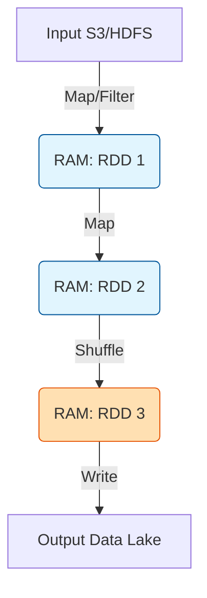

Trong kỷ nguyên của Real-time Data, **Batch Processing** (Xử lý theo lô) vẫn chiếm hơn 80% khối lượng công việc Data Engineering tại các tập đoàn công nghệ lớn. Khác với xử lý dòng (Streaming), Batch Processing hoạt động trên các tập dữ liệu có giới hạn (Bounded Data), chịu trách nhiệm thực thi các phép biến đổi nặng (Heavy-lifting Transformations), backfill dữ liệu lịch sử và huấn luyện mô hình Machine Learning. 

Bài viết này bỏ qua những định nghĩa sách giáo khoa để tập trung vào kiến trúc hệ thống phân tán, các điểm nghẽn (Bottlenecks) và sự đánh đổi (Trade-offs) khi vận hành Batch Pipelines ở quy mô Petabyte.

---

## 1. Bản chất Kiến trúc của Batch Processing

Khác với các ứng dụng OLTP (Online Transaction Processing) nhạy cảm với độ trễ (Latency), hệ thống Batch Processing tối ưu hóa cho **Thông lượng (Throughput)**. 

### 1.1 Tính chất Idempotent và Khả năng Chịu lỗi (Fault Tolerance)
Một Batch Pipeline chuẩn mực phải có tính chất **Idempotent** (Khả năng lặp lại an toàn). Khi một node trong cụm (Cluster) bị sập giữa chừng do lỗi phần cứng hoặc `OOMKilled` (Out of Memory), hệ thống Orchestration (Airflow, Dagster) phải có khả năng chạy lại (Retry) Task đó mà không làm nhân đôi dữ liệu đầu ra.

Điều này thường được thực hiện thông qua:
1. Ghi đè toàn bộ phân vùng (Overwrite Partitions).
2. Câu lệnh `MERGE INTO` (Upsert) trong các định dạng dữ liệu hiện đại như Apache Iceberg hoặc Delta Lake.

```sql
-- Ví dụ: Upsert dữ liệu (Idempotent) bằng MERGE trong Delta Lake/Iceberg
MERGE INTO target_table AS t
USING source_table AS s
ON t.id = s.id
WHEN MATCHED THEN 
  UPDATE SET t.value = s.value, t.updated_at = current_timestamp()
WHEN NOT MATCHED THEN 
  INSERT (id, value, updated_at) VALUES (s.id, s.value, current_timestamp());
```

---

## 2. Tiến hóa Kiến trúc: Disk I/O vs. In-Memory Computing

Sự phát triển của Batch Processing gắn liền với cách quản lý State và bộ nhớ trung gian (Intermediate Data).

### 2.1 Thế hệ 1: Hadoop MapReduce (Disk-bound Processing)
Kiến trúc MapReduce chia mọi bài toán thành hai Phase: `Map` và `Reduce`. 
- **Điểm yếu chí mạng:** Sau giai đoạn Map, toàn bộ dữ liệu trung gian bắt buộc phải được ghi chép (Spill) xuống đĩa HDFS để đảm bảo Fault Tolerance. 
- **Trade-off:** Chấp nhận Disk I/O cực cao và tốc độ chậm chạp để đổi lấy khả năng xử lý lượng dữ liệu vô hạn trên một lượng RAM hạn chế. MapReduce thường thất bại trong các bài toán Machine Learning cần lặp lại (Iterative algorithms).

### 2.2 Thế hệ 2: Apache Spark (Memory-bound Processing)
Apache Spark giới thiệu khái niệm **RDD (Resilient Distributed Dataset)**, một đồ thị tính toán lười biếng (Lazy Evaluation DAG). Thay vì ghi xuống đĩa, Spark giữ trạng thái trung gian hoàn toàn trên RAM (In-Memory). Nếu một Executor sập, Spark dựa vào *Lineage Graph* để tính toán lại phân vùng bị mất.


> *Biểu đồ DAG của Spark: Dữ liệu được xử lý trong RAM cho đến khi gặp Action.*

---

## 3. Giải phẫu Nút Thắt Hệ Thống (System Bottlenecks)

Khi chạy Batch Processing, bạn sẽ luôn phải đối mặt với hai bóng ma: **Network Shuffle** và **OOMKilled**.

### 3.1 Cơn ác mộng Network Shuffle
Shuffle xảy ra khi dữ liệu cần được phân phối lại giữa các node trong cụm (ví dụ: `GROUP BY`, `JOIN`, `DISTINCT`). Dữ liệu được tuần tự hóa (Serialized), nén, gửi qua mạng và giải nén ở đích.

- **Network I/O Saturation:** Hàng ngàn Executor đồng thời gửi nhận dữ liệu có thể làm bão hòa băng thông mạng (Network Saturation), gây ra tình trạng Timeout (`FetchFailedException`).
- **Disk Spill:** Khi bộ nhớ đệm (Shuffle Buffer) của node đích không đủ chứa lượng dữ liệu đang đổ về, Spark buộc phải "Spill-to-disk" - ghi dữ liệu tràn ra đĩa cứng cục bộ của Node, kéo tốc độ xử lý xuống ngang bằng MapReduce.

### 3.2 OOMKilled (Out of Memory) và JVM Garbage Collection
Dấu hiệu phổ biến nhất của sự cố Batch là Executor bị hệ điều hành "giết" (SIGKILL 9) do vượt quá giới hạn RAM cấp phép.
- **Nguyên nhân chính:** Lệch phân phối dữ liệu (Data Skew) khiến một Executor phải nhét 50GB dữ liệu vào 16GB RAM. Hoặc Garbage Collection (GC) của Java Virtual Machine mất quá nhiều thời gian để dọn rác, làm treo tiến trình (GC Pause).

---

## 4. Triển khai Hạ tầng Vật lý (Physical Execution)

Ngày nay, cụm Batch hiếm khi được triển khai cố định. Các công ty áp dụng mô hình Ephemeral Clusters (Cụm dùng một lần) trên hạ tầng Cloud (AWS EMR, Databricks, GCP Dataproc) kết hợp với Spot Instances để tối ưu 70-80% chi phí (FinOps).

```hcl
# Ví dụ Terraform cấu hình EMR Ephemeral Cluster với Spot Instances để tối ưu FinOps
resource "aws_emr_cluster" "batch_cluster" {
  name          = "daily-batch-processing"
  release_label = "emr-6.5.0"
  applications  = ["Spark", "Hadoop"]

  core_instance_group {
    instance_type  = "r5.4xlarge" # RAM Optimized
    instance_count = 10
    bid_price      = "0.20"       # Sử dụng Spot Instances để tiết kiệm chi phí
  }
}
```

---

## 5. Tổng Kết Đánh Đổi (Systemic Trade-offs)

| Tiêu chí | Batch Processing | Streaming Processing |
| :--- | :--- | :--- |
| **Mục tiêu tối ưu** | Tối đa hóa Throughput (MB/s). | Tối thiểu hóa Latency (ms). |
| **Mô hình tài nguyên** | Cấp phát linh hoạt (Elastic), sử dụng Spot Instances rẻ. | Chạy liên tục (Always-on), tài nguyên On-demand đắt đỏ. |
| **Fault Tolerance** | Đơn giản: Rerun hoặc Overwrite. | Phức tạp: Checkpointing, Watermarks, Exactly-once semantics. |
| **Bảo trì Hệ thống** | Dễ debug, dễ scale out khi cần. | Khó quản trị State và out-of-order data. |

---

## Nguồn Tham Khảo (References)
* [Designing Data-Intensive Applications (Martin Kleppmann) - Chương 10: Batch Processing](https://dataintensive.net/)
* [Apache Spark: A Unified Engine for Big Data Processing (CACM)](https://cacm.acm.org/magazines/2016/11/209116-apache-spark/fulltext)
* [Troubleshooting Spark OOM and Memory Management - Uber Engineering](https://www.uber.com/en-VN/blog/)
* [AWS EMR Architecture and Best Practices](https://aws.amazon.com/blogs/architecture/)
