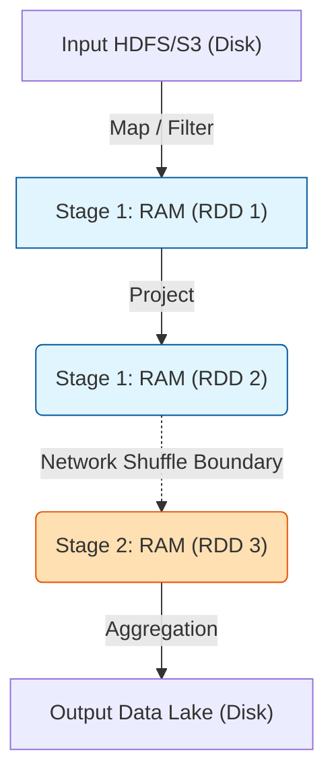

Trong kỷ nguyên của Real-time Data và Streaming Analytics, **Batch Processing** (Xử lý theo lô) vẫn lặng lẽ chiếm hơn 80% khối lượng công việc Data Engineering tại các tập đoàn công nghệ lớn (FAANG). Khác với xử lý dòng (Streaming), Batch Processing hoạt động trên các tập dữ liệu có giới hạn (Bounded Data). Nó là xương sống chịu trách nhiệm thực thi các phép biến đổi nặng (Heavy-lifting Transformations), backfill dữ liệu lịch sử hàng Terabyte và tiền xử lý dữ liệu cho các mô hình Machine Learning.

Bài viết này bỏ qua những định nghĩa sách giáo khoa chung chung để mổ xẻ trực tiếp kiến trúc hệ thống phân tán, các điểm nghẽn vật lý (Bottlenecks) và sự đánh đổi (Trade-offs) khi vận hành Batch Pipelines ở quy mô Petabyte.

## 1. Bản chất Kiến trúc của Batch Processing

Khác với các ứng dụng OLTP (Online Transaction Processing) nhạy cảm với độ trễ (Latency), hệ thống Batch Processing tối ưu hóa hoàn toàn cho **Thông lượng (Throughput)**. Hệ thống có thể mất 2 tiếng để chạy xong một Pipeline, nhưng khi xong, nó đã quét qua hàng chục tỷ bản ghi.

### 1.1 Tính chất Idempotent và Khả năng Chịu lỗi (Fault Tolerance)
Một tiêu chuẩn vàng của kiến trúc Batch là tính chất **Idempotent** (Khả năng lặp lại an toàn). Trong môi trường phân tán gồm hàng trăm máy chủ, việc một Node (máy ảo) bị sập giữa chừng do lỗi phần cứng hoặc `OOMKilled` (Out of Memory) là chuyện xảy ra như cơm bữa. Khi đó, hệ thống Orchestration (như Airflow, Dagster) phải có khả năng chạy lại (Retry) tác vụ đó mà **không làm nhân đôi dữ liệu đầu ra**.

Có 2 cách thực thi Idempotent phổ biến ở tầng Storage:
1. Ghi đè toàn bộ phân vùng (Overwrite Partitions) của một ngày cụ thể (Logical Partition).
2. Sử dụng câu lệnh `MERGE INTO` (Upsert) kết hợp với các định dạng bảng ACID như Apache Iceberg hoặc Delta Lake.

```sql
-- Code Thực chiến: Cấu trúc MERGE đảm bảo tính Idempotent 
-- Chạy lại (Retry) lệnh này 100 lần vẫn ra cùng 1 kết quả duy nhất
MERGE INTO dwh.fact_sales AS target
USING staging.daily_sales AS source
ON target.order_id = source.order_id
WHEN MATCHED AND target.updated_at < source.updated_at THEN 
  UPDATE SET 
    target.amount = source.amount, 
    target.updated_at = source.updated_at
WHEN NOT MATCHED THEN 
  INSERT (order_id, amount, created_at, updated_at) 
  VALUES (source.order_id, source.amount, current_timestamp(), source.updated_at);
```

## 2. Sự Tiến hóa của Kiến trúc: Disk-bound vs. Memory-bound

Cách một Batch Engine quản lý bộ nhớ trung gian (Intermediate Data) quyết định hiệu năng của nó.

### 2.1 Thế hệ 1: Hadoop MapReduce (Disk-bound Processing)
Kiến trúc MapReduce chia mọi bài toán thành hai Phase cứng nhắc: `Map` và `Reduce`. 
- **Quy trình**: Input -> Map -> Disk Spill (Shuffle Write) -> Network Transfer -> Reduce -> Disk Write.
- **Điểm yếu chí mạng:** Sau giai đoạn Map, toàn bộ dữ liệu trung gian bắt buộc phải được ghi xuống ổ đĩa cứng (HDFS) để đảm bảo Fault Tolerance. Disk I/O cực kỳ chậm, biến MapReduce thành hệ thống rất ì ạch trong các bài toán lặp (Iterative algorithms) như huấn luyện thuật toán Machine Learning.
- **Systemic Trade-off:** MapReduce hi sinh tốc độ và chấp nhận thắt cổ chai I/O khổng lồ để đổi lấy khả năng xử lý lượng dữ liệu vô hạn trên những máy chủ phần cứng rẻ tiền (commodity hardware) có lượng RAM rất nhỏ.

### 2.2 Thế hệ 2: Apache Spark (Memory-bound Processing)
Spark thay đổi luật chơi bằng cách mang dữ liệu lên RAM. Nó giới thiệu khái niệm **RDD (Resilient Distributed Dataset)** và mô hình Execution DAG (Directed Acyclic Graph).
- Thay vì ghi xuống đĩa, Spark giữ toàn bộ trạng thái trung gian (Intermediate state) trên RAM của Worker Nodes. 
- Fault Tolerance được xử lý qua *Lineage*: Nếu một Executor sập và mất một phân vùng RAM, Spark không hốt hoảng. Nó tra cứu lại DAG Lineage và ra lệnh cho một Node khác tính toán lại chính xác phân vùng bị mất đó từ dữ liệu gốc, thay vì phải chạy lại từ đầu.



## 3. Giải phẫu Nút Thắt Hệ Thống (System Bottlenecks)

Vận hành Spark/Batch Cluster ở quy mô hàng chục Terabyte, Data Engineer thường xuyên phải đối phó với hai bóng ma khét tiếng: **Network Shuffle** và **JVM OOMKilled**.

### 3.1 Cơn ác mộng Network Shuffle
Network Shuffle xảy ra khi dữ liệu bắt buộc phải di chuyển chéo qua mạng giữa các Executor để nhóm hoặc tính toán dữ liệu (Ví dụ: `GROUP BY`, `JOIN`, `Window Functions`).
- **Network I/O Saturation:** Hàng ngàn Executor mở kết nối socket gửi/nhận dữ liệu cho nhau cùng lúc. Nếu băng thông mạng nội bộ bị nghẽn (Network Saturation), các Executor sẽ chờ nhau dẫn đến rớt kết nối (`FetchFailedException`).
- **Disk Spill (Tràn đĩa):** Khi bộ nhớ đệm (Shuffle Read Buffer) của Node đích bị đầy do dữ liệu ập về quá nhanh, hoặc Partition quá lớn so với RAM, Spark buộc phải "Spill-to-disk" - rớt toàn bộ dữ liệu xuống đĩa cứng NVMe hoặc SSD cục bộ. Lúc này, hiệu năng In-memory của Spark hoàn toàn biến mất, hệ thống chậm chạp y hệt như MapReduce.

### 3.2 OOMKilled (Out of Memory) tại Cấp độ Container
Đây là lỗi kinh điển trong logs: `Container killed by YARN for exceeding memory limits`.
- **Nguyên nhân vật lý (Data Skew):** Lệch phân phối dữ liệu là nguyên nhân cốt lõi. Ví dụ, 99% keys phân phối đồng đều, nhưng 1 key khổng lồ (như `customer_id = 'UNKNOWN'`) chiếm trọn 50GB. Task phụ trách xử lý key này sẽ ngốn toàn bộ Heap Space của Java Virtual Machine (JVM). Khi JVM phình to vượt quá RAM mà Container được cấp phép (ví dụ 16GB), hệ điều hành sẽ kích hoạt OOM Killer, gửi cờ `SIGKILL 9` để bắn hạ Container ngay lập tức.
- **Khắc phục (Troubleshooting):** Thay vì nâng RAM mù quáng (Scale-up) cực kỳ tốn kém, Staff Engineer sẽ dùng kỹ thuật "Salting" để băm nhỏ các Skew Keys, hoặc tăng mạnh `spark.sql.shuffle.partitions` (ví dụ: từ 200 lên 4000) để chia nhỏ tải trọng trên mỗi Task.

## 4. Triển khai Hạ tầng Vật lý (Physical Execution & FinOps)

Ngày nay, cụm Batch hiếm khi được triển khai dưới dạng Cluster vật lý On-premise sống 24/7. Các tập đoàn lớn áp dụng mô hình **Ephemeral Clusters** (Cụm dùng một lần, chạy xong thì tự động xóa) trên nền tảng Cloud (AWS EMR, Databricks, GCP Dataproc).

Đặc biệt, Batch Processing là "sân chơi" hoàn hảo cho **Spot Instances** (máy ảo đấu giá dư thừa của Cloud Provider). Vì Batch Job không yêu cầu phản hồi Real-time, nếu Spot Node bị AWS thu hồi giữa chừng (với cảnh báo 2 phút), Spark Lineage sẽ tự tính toán lại dữ liệu. Điều này giúp đội Data tối ưu 70-80% chi phí Compute so với On-demand.

```hcl
# Code Thực chiến: Terraform cấp phát AWS EMR Ephemeral Cluster 
# Kết hợp Spot Instances để ép giá FinOps xuống mức tối thiểu
resource "aws_emr_cluster" "daily_batch_cluster" {
  name          = "heavy-daily-etl-pipeline"
  release_label = "emr-6.10.0"
  applications  = ["Spark", "Hadoop", "Hive"]

  master_instance_group {
    instance_type  = "m5.xlarge"
    instance_count = 1
  }

  core_instance_group {
    instance_type  = "r5.4xlarge"  # R5: Dòng máy tối ưu RAM (Memory Optimized) cho Spark
    instance_count = 20
    bid_price      = "0.25"        # Sử dụng Spot Instances, chỉ trả tối đa 0.25$/giờ
  }

  # Tính năng cốt lõi: Tự động hủy cụm sau khi rảnh rỗi 30 phút để chặn lãng phí FinOps
  auto_termination_policy {
    idle_timeout = 1800 
  }
}
```

## 5. Tổng Kết Đánh Đổi [Systemic Trade-offs Overview]

Khi so sánh giữa hệ thống Batch Processing và Streaming Processing, các Data Architect phải cân nhắc các thông số vật lý sau:

| Tiêu chí | Batch Processing (Spark/MapReduce) |" Streaming Processing (Flink/Kafka Streams) "|
| :--- | :--- | :--- |
|" **Mục tiêu tối ưu (Objective)** "| Tối đa hóa Thông lượng (Throughput tính bằng MB/s). |" Tối thiểu hóa Độ trễ (Latency tính bằng ms). "|
|" **Mô hình tài nguyên (Compute)** "| Ephemeral / Elastic, tận dụng tối đa Spot Instances siêu rẻ. | Always-on 24/7, yêu cầu cấp phát tài nguyên On-demand đắt đỏ. |
|" **Quản lý Lỗi (Fault Tolerance)** "| Đơn giản: Sập thì Rerun toàn bộ hoặc Overwrite (Idempotent). | Cực kỳ phức tạp: Yêu cầu State Checkpointing, Watermarks, Exactly-once semantics. |
|" **Độ phức tạp Vận hành (Ops)** "| Dễ debug logs, dễ cô lập lỗi (Isolate), dễ Scale-out cực đại. |" Khó quản trị State (In-memory state size) và xử lý dữ liệu đến trễ (Out-of-order data). "|

## Nguồn Tham Khảo (References)

* Thiết kế Hệ thống Dữ liệu Chuyên sâu (Designing Data-Intensive Applications - Martin Kleppmann) - Phân tích chi tiết về kiến trúc Batch Processing và MapReduce.
* [Apache Spark: A Unified Engine for Big Data Processing (CACM]][https://cacm.acm.org/magazines/2016/11/209116-apache-spark/fulltext]
* [Troubleshooting Spark OOM and Memory Management - Uber Engineering][https://www.uber.com/en-VN/blog/apache-spark-oom/]
* [AWS Architecture Blog - Cost Optimization with Amazon EMR and Spot Instances](https://aws.amazon.com/blogs/big-data/cost-optimization-with-amazon-emr-and-spot-instances/]
