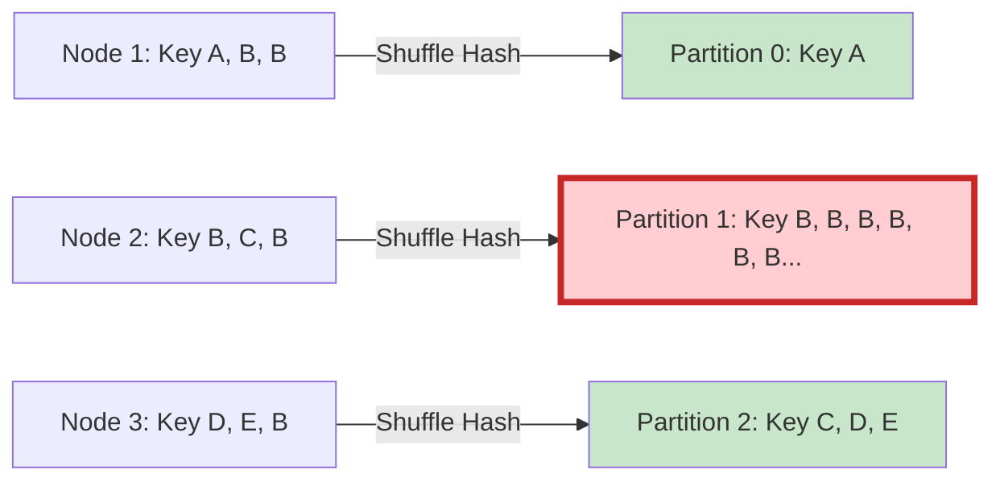

Data Skew (Lệch dữ liệu) được mệnh danh là "bệnh nan y" phổ biến nhất và tàn phá nhất trong bất kỳ hệ thống xử lý phân tán nào (Apache Spark, Presto, BigQuery). Khi xảy ra Data Skew, nó phá vỡ hoàn toàn nguyên lý mở rộng ngang (Scale-out). Mặc dù bạn có ném thêm hàng ngàn CPU Cores vào Cluster, hệ thống vẫn có thể bị "đóng băng" (Hang) nhiều giờ đồng hồ hoặc văng lỗi `Out of Memory (OOM)` chỉ vì một vài node đang phải gánh toàn bộ tải trọng của hệ thống.

Là một Staff Data Engineer, bạn không thể tránh khỏi Data Skew, bạn chỉ có thể học cách thiết kế hệ thống để triệt tiêu nó. Bài viết này sẽ đi sâu vào bản chất vật lý của Skew và mổ xẻ sự đánh đổi giữa các phương pháp xử lý: từ tự động (AQE) đến thủ công (Salting).

---

## 1. Cơ chế Vật lý sinh ra Data Skew

Trong mô hình tính toán phân tán, các phép biến đổi hẹp (Narrow Transformations) như `Map`, `Filter` chạy độc lập trên từng node. Nhưng các phép biến đổi rộng (Wide Transformations) như `JOIN`, `GROUP BY`, hay `WINDOW` bắt buộc phải gom nhóm những dữ liệu có cùng Khóa (Key) về chung một node vật lý. Quá trình di chuyển dữ liệu qua mạng này được gọi là **Network Shuffle**.

Để xác định một dòng dữ liệu (Row) sẽ bay về Node nào, Spark chạy một hàm băm (Hash Function) trên Khóa:
`Partition_ID = Hash(Key) % Number_of_Partitions`

### Bài toán Phân phối Zipfian (Pareto)
Trong thực tế kinh doanh, dữ liệu hiếm khi phân phối đồng đều (Uniform Distribution). Nó thường tuân theo quy luật Pareto (80/20) hoặc Zipfian. Ví dụ: 
- 80% doanh thu đến từ 20% khách hàng VIP.
- Hàng triệu giao dịch mua hàng vô danh có `user_id` là `NULL` hoặc `-1`.

Khi Hash Function gặp phải các Key có tần suất xuất hiện khổng lồ, nó sẽ đẩy toàn bộ dữ liệu của Key đó về cùng một `Partition_ID`.



### Hậu quả Cấp Hệ thống (Systemic Consequences)
Partition 1 trong sơ đồ trên chính là tâm điểm của thảm họa. Nó sinh ra một **Straggler Task** (Tác vụ rùa bò).
1. **OOMKilled (Out Of Memory):** RAM của Executor chịu trách nhiệm chạy Partition 1 không đủ sức chứa khối dữ liệu khổng lồ. JVM Heap bị tràn, hệ điều hành (YARN/K8s) sẽ giết chết Container ngay lập tức (SIGKILL).
2. **Spill-to-Disk (Tràn đĩa):** Nếu may mắn không bị OOM (nhờ bộ nhớ Off-heap hoặc cấu hình bộ đệm tốt), Spark buộc phải xả (Spill) dữ liệu trung gian ra ổ cứng cục bộ. Tốc độ xử lý rơi tự do từ tốc độ RAM (100ns) xuống tốc độ Disk I/O (vài mili-giây).
3. **Resource Starvation (Đói tài nguyên):** Giả sử bạn có 100 Tasks. 99 Tasks xử lý xong trong 1 phút và nhả CPU. Nhưng Task 1 (Straggler) phải chạy mất 5 tiếng. Toàn bộ Cluster vẫn bị giữ trạng thái "Đang chạy" (Running) trong 5 tiếng đó, gây lãng phí hàng ngàn USD tiền Cloud Compute.

---

## 2. Các Kỹ thuật Khắc phục: Trade-offs & Implementation

### 2.1. Kỹ thuật Giải Quyết Ngay Tại Chỗ: Broadcast Hash Join

**Bối cảnh:** Bạn cần Join một Bảng Sự kiện (Fact Table) khổng lồ bị Skew với một Bảng Chiều (Dimension Table) tương đối nhỏ (< 1 GB).
**Cơ chế:** Thay vì thực hiện Shuffle Hash cả 2 bảng (bắt dữ liệu Fact di chuyển), Spark sẽ copy (Broadcast) toàn bộ Bảng Dim tới Memory của tất cả các Executor chứa Bảng Fact. Việc Join diễn ra ngay tại chỗ (Map-side Join). Bảng Fact không hề bị xê dịch.

```python
from pyspark.sql.functions import broadcast

# Ép buộc Spark sử dụng Broadcast Join
df_result = df_fact.join(broadcast(df_dim), "product_id")
```

**Trade-offs (Sự đánh đổi):**
- **Điểm lợi:** Nhanh tuyệt đối. Triệt tiêu 100% Network Shuffle của bảng Fact. Loại bỏ hoàn toàn ảnh hưởng của Data Skew.
- **Rủi ro:** Kích thước bảng Broadcast bị giới hạn bởi tham số `spark.sql.autoBroadcastJoinThreshold` (mặc định 10MB, có thể tăng lên tối đa khoảng 1GB-2GB). Nếu bảng Dim vượt qua kích thước này, bạn sẽ làm tràn RAM (OOM) trên Driver (do Driver phải gom dữ liệu bảng Dim trước) và OOM trên tất cả các Executors. Đồng thời, cáp quang của Cluster sẽ bị bão hòa (Network Saturation) nếu bạn đẩy 2GB dữ liệu tới 1000 Executors cùng lúc (tương đương 2TB băng thông mạng bị chiếm dụng).

### 2.2. Kỹ thuật Trấn Áp Tự Động: AQE Skew Join

Được giới thiệu từ Spark 3.0, **Adaptive Query Execution (AQE)** thay đổi cuộc chơi bằng cách tối ưu hóa kế hoạch thực thi *ngay trong lúc chạy* (Runtime), thay vì chỉ đoán mò trước khi chạy (Compile time).

**Cơ chế:** Khi giai đoạn Map (chuẩn bị dữ liệu Shuffle) kết thúc, AQE thu thập thống kê thực tế. Nếu nó phát hiện một Partition có kích thước lớn bất thường (vượt quá ngưỡng cho phép), AQE sẽ tự động "chia cắt" (Split) Partition bị lệch của Bảng A thành nhiều phân vùng nhỏ hơn. Sau đó, nó tự động nhân bản (Replicate) Partition tương ứng của Bảng B để Join với từng phần nhỏ của Bảng A.

**Cấu hình Thực chiến (YAML/Spark Properties):**
```properties
# Kích hoạt AQE (Mặc định True trên Spark 3.2+)
spark.sql.adaptive.enabled=true

# Kích hoạt tính năng xử lý Skew Join
spark.sql.adaptive.skewJoin.enabled=true

# Một partition lớn gấp bao nhiêu lần kích thước trung bình thì bị coi là Skew?
# Mặc định là 5. Nếu dữ liệu của bạn lệch nhẹ, có thể giảm xuống 3.
spark.sql.adaptive.skewJoin.skewedPartitionFactor=5

# Partition phải lớn hơn bao nhiêu MB mới được chia cắt?
# Mặc định là 256MB. Rất quan trọng để tránh AQE chia cắt lắt nhắt các partition nhỏ.
spark.sql.adaptive.skewJoin.skewedPartitionThresholdInBytes=256MB
```

**Trade-offs:**
- **Điểm lợi:** Không cần sửa code SQL/Python. Hoạt động "Out-of-the-box" (tự động).
- **Rủi ro:** AQE **CHỈ** hỗ trợ thuật toán `SortMergeJoin`. Hơn nữa, nó rất nhạy cảm với cấu hình Threshold. Nếu dữ liệu Skew của bạn là 200MB (dưới ngưỡng 256MB) nhưng chứa logic tính toán cực nặng, AQE sẽ phớt lờ nó, và bạn vẫn bị treo Job.

### 2.3. Vũ Khí Hạng Nặng: Kỹ Thuật Salting Thủ Công

Khi cả Bảng A và Bảng B đều khổng lồ (hàng Terabyte), và AQE không thể giải quyết triệt để, **Salting** là vũ khí cuối cùng của Data Engineer.

**Bản chất:** "Đánh lừa" hàm Hash. Chúng quy chủ động phá vỡ Key bị lệch bằng cách nối thêm một số ngẫu nhiên (Salt) vào Key của Bảng A. Điều này buộc hàm Hash phải phân tán dữ liệu của Key đó ra nhiều Node. Để Join đúng kết quả, ta phải "nhân bản" (Explode) Bảng B lên N lần, tương ứng với N giá trị Salt.

**Thực thi bằng PySpark:**

```python
from pyspark.sql import functions as F

SALT_BINS = 10 # Số lượng Executors bạn muốn chia tải

# BƯỚC 1: Bảng Fact (Bị Skew) - Nối thêm Salt ngẫu nhiên từ 0 đến 9
df_fact = df_fact.withColumn("salt", F.floor(F.rand() * SALT_BINS))
df_fact_salted = df_fact.withColumn("salted_key", 
                                    F.concat_ws("_", F.col("user_id"), F.col("salt")))

# BƯỚC 2: Bảng Dim (Không Skew) - Nhân bản mỗi dòng lên 10 lần (Explode)
salt_df = spark.range(0, SALT_BINS).toDF("salt")
# Cross Join để nhân bản
df_dim_exploded = df_dim.crossJoin(salt_df)
df_dim_salted = df_dim_exploded.withColumn("salted_key", 
                                           F.concat_ws("_", F.col("user_id"), F.col("salt")))

# BƯỚC 3: Join trên khóa mới
result = df_fact_salted.join(df_dim_salted, on="salted_key", how="inner") \
                       .drop("salt", "salted_key")
```

**Trade-offs Khốc Liệt:**
- **Sức mạnh:** Đập tan mọi giới hạn Skew. Bạn có thể ép dữ liệu dàn đều hoàn hảo trên 1000 Executors bằng cách set `SALT_BINS = 1000`.
- **Cái giá phải trả [Cartesian Explosion]:** Bảng B sẽ bị phình to (Data Explosion) theo cấp số nhân. Nếu Bảng B có 1 tỷ dòng, `SALT_BINS = 10` sẽ tạo ra 10 tỷ dòng. Điều này tiêu tốn CPU và RAM cực kỳ tàn bạo. Do đó, Salting là con dao hai lưỡi, chỉ dùng cho các Key thực sự bị lệch nặng (bằng cách filter tách riêng nhóm bị Skew ra xử lý Salting, nhóm bình thường xử lý Join thường, sau đó `UNION` lại - hay còn gọi là *Isolated Salting*).

---

## 3. Real-World Incident: Cartesian Explosion do Giá trị `NULL`

**Tình huống (Incident):** 
Tại Uber, một Data Pipeline hằng ngày dùng để Join bảng `Trips` (Chuyến đi) với bảng `User_Profiles` đột ngột bị treo (Hang) trong 8 tiếng và liên tục báo lỗi OOMKilled trên YARN.

**Phân tích nguyên nhân (Root Cause):**
Team Data Scientist phát hiện ra rằng trong bảng `Trips`, có khoảng 15 triệu chuyến đi vô danh (do lỗi hệ thống tracking) bị gán `user_id = NULL`. 
Khi thực hiện JOIN, Spark ném toàn bộ 15 triệu dòng `NULL` này vào chung một Partition. Tệ hại hơn, bảng `User_Profiles` cũng chứa 2 triệu dòng tài khoản rác có `user_id = NULL`.
Khi Spark cố gắng khớp nối (Join) hai bên có giá trị `NULL`, nó thực hiện phép **Cartesian Product (Tích Đề-các)** trên Partition đó: tạo ra $15,000,000 \times 2,000,000 = 30 \times 10^{12}$ (30 ngàn tỷ) kết quả trung gian. Đương nhiên, không một thanh RAM nào trên thế giới có thể chứa nổi lượng dữ liệu này.

**Khắc phục (Troubleshooting):**
Rule of thumb (Quy tắc ngón tay cái): Trong SQL, `NULL` không bằng `NULL`. Việc Join trên giá trị Null là vô nghĩa về mặt logic kinh doanh và là thảm họa về mặt kỹ thuật.

```sql
-- Giải pháp SQL: Loại bỏ NULL trước khi Shuffle
SELECT t.*, p.profile_score
FROM trips t
JOIN user_profiles p ON t.user_id = p.user_id
WHERE t.user_id IS NOT NULL AND p.user_id IS NOT NULL;
```
*Lưu ý: Nếu bạn dùng `LEFT JOIN` và cần giữ lại các dòng Null của bảng Left, hãy dùng hàm `COALESCE` biến Null thành một UUID ngẫu nhiên để ép chúng phân tán ra các partition khác nhau, tương tự triết lý của Salting.*

---

## Nguồn Tham Khảo (References)

- [Adaptive Query Execution: Speeding Up Spark SQL at Runtime (Databricks Blog]][https://www.databricks.com/blog/2020/05/29/adaptive-query-execution-speeding-up-spark-sql-at-runtime.html]
- [Optimize Data Workloads Guide - Databricks][https://www.databricks.com/discover/pages/optimize-data-workloads-guide]
- [Handling Data Skew in Apache Spark - Tư duy phân tán từ các Big Tech](https://www.uber.com/en-VN/blog/]
- *Designing Data-Intensive Applications* (Sách của Martin Kleppmann, chương Partitioning và Data Skew).
