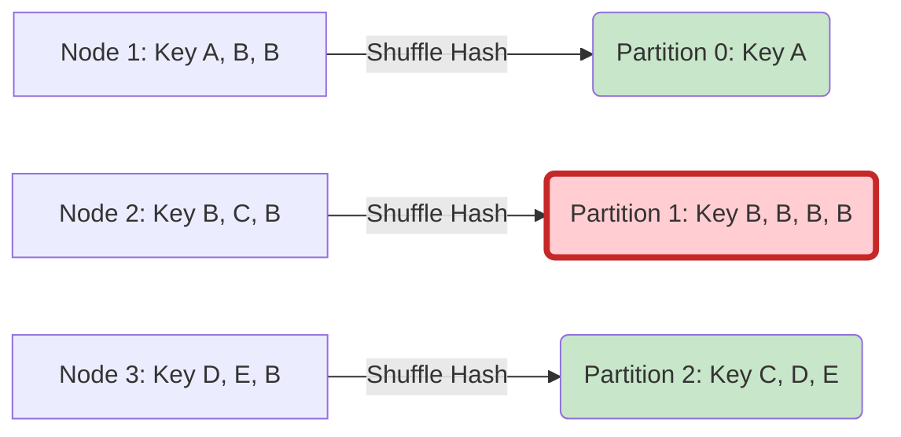

Data Skew (Lệch dữ liệu) là "bệnh nan y" phổ biến nhất trong hệ thống xử lý phân tán (Apache Spark, Presto, BigQuery). Nó phá vỡ hoàn toàn nguyên lý mở rộng ngang (Scale-out). Mặc dù bạn cấp phát hàng ngàn CPU Cores, hệ thống vẫn có thể bị "treo" (Hang) hoặc văng lỗi `Out of Memory (OOM)` chỉ vì một vài node đang gánh toàn bộ tải trọng.

Bài viết này đi sâu vào bản chất kiến trúc của Data Skew, so sánh sự đánh đổi của các phương pháp xử lý truyền thống (Salting) so với các bộ máy tự động (AQE).

---

## 1. Cơ chế Vật lý sinh ra Data Skew

Trong mô hình phân tán, các phép biến đổi Wide Transformations (`JOIN`, `GROUP BY`, `WINDOW`) yêu cầu phải tổ chức lại dữ liệu. Quá trình này gọi là **Network Shuffle**.

Hệ thống sẽ chạy một hàm băm (Hash Function) trên Khóa (Key):
`Partition_ID = Hash(Key) % Number_of_Partitions`

Nếu dữ liệu tuân theo phân phối Pareto (Zipfian Distribution) hoặc chứa quá nhiều giá trị Null, hàm Hash sẽ đẩy phần lớn Rows về cùng một `Partition_ID`.


> *Partition 1 bị quá tải do nhận toàn bộ Key B. Đây là điểm nghẽn (Straggler Task).*

### 1.1 Hậu quả Kỹ thuật
- **OOMKilled:** RAM của Executor xử lý Partition lệch không đủ chứa dữ liệu, dẫn đến vỡ Heap Space.
- **Spill-to-disk:** Spark buộc phải xả dữ liệu trung gian ra ổ cứng, làm tăng kịch liệt I/O Wait.
- **Resource Starvation (Lãng phí tài nguyên):** 99 Tasks chạy xong trong 1 phút và giải phóng CPU, nhưng toàn bộ Job vẫn phải đợi 1 Task (Straggler) chạy nốt trong 3 tiếng tiếp theo.

---

## 2. Kỹ thuật Giải quyết: Trade-offs & Implementation

Có nhiều chiến lược giải quyết Skew, mỗi chiến lược lại đánh đổi giữa CPU, Network IO hoặc Memory.

### 2.1 Broadcast Hash Join (Map-Side Join)
**Bối cảnh:** Bảng A (Fact) cực lớn và bị lệch, Bảng B (Dimension) nhỏ (< 1-2 GB).
**Cơ chế:** Thay vì Shuffle Hash cả 2 bảng, Spark Broadcast (gửi bản sao) bảng B tới từng Executor chứa bảng A. Việc Join diễn ra ngay trong Memory (Map-side) mà không cần Network Shuffle.
- **Trade-off:** Tốn RAM của Executor để chứa bảng B. Cáp quang có thể bị bão hòa (Network Saturation) nếu bảng B lớn và có quá nhiều Executors.

### 2.2 Kỹ thuật Salting (Chiến lược kinh điển)
**Bối cảnh:** Cả 2 bảng đều khổng lồ (vượt quá giới hạn Broadcast).
**Cơ chế:** "Đánh lừa" hàm Hash bằng cách nối thêm một số ngẫu nhiên (Salt) vào Khóa lệch, buộc Shuffle phải chia nhỏ dữ liệu ra nhiều phân vùng. Bên Bảng B, ta phải nhân bản (Explode) các dòng lên N lần để đảm bảo khớp nối.

```python
# Kỹ thuật Salting trong PySpark
from pyspark.sql import functions as F

SALT_BINS = 10

# Bảng A (Fact) bị skew: Thêm salt ngẫu nhiên [0, 9]
df_fact = df_fact.withColumn("salt", F.floor(F.rand() * SALT_BINS))
df_fact = df_fact.withColumn("salted_key", F.concat_ws("_", F.col("join_key"), F.col("salt")))

# Bảng B (Dim) không skew: Explode nhân bản N dòng
salt_df = spark.range(0, SALT_BINS).toDF("salt")
df_dim_exploded = df_dim.crossJoin(salt_df)
df_dim_exploded = df_dim_exploded.withColumn("salted_key", F.concat_ws("_", F.col("join_key"), F.col("salt")))

# Join bằng salted_key, chia nhỏ khối skew ra 10 Executors
result = df_fact.join(df_dim_exploded, on="salted_key", how="inner").drop("salt", "salted_key")
```
- **Trade-off:** Kỹ thuật này đòi hỏi lập trình viên phải hiểu cực sâu về phân phối dữ liệu. Nhược điểm chí mạng là làm **bùng nổ dữ liệu (Data Explosion)** ở Bảng B do `crossJoin`, tốn thêm CPU và RAM.

### 2.3 Adaptive Query Execution (AQE) Skew Join
Từ Spark 3.0, Databricks giới thiệu **AQE**. Đây là cơ chế tối ưu hóa động lúc Runtime (Khác với Catalyst tối ưu trước khi chạy).
**Cơ chế:** Khi một Stage (Map) chạy xong, AQE thu thập thống kê (Statistics). Nếu thấy Shuffle Size của một partition vượt ngưỡng bất thường, AQE tự động chia nhỏ (Split) partition đó thành nhiều phần. Sau đó, nó tự động nhân bản partition tương ứng ở bảng đối diện, thay thế cho thao tác Salting thủ công.

```properties
# Cấu hình AQE Skew Join Optimization
spark.sql.adaptive.enabled=true
spark.sql.adaptive.skewJoin.enabled=true
# Nếu một partition lớn gấp 5 lần trung bình, nó bị coi là skew
spark.sql.adaptive.skewJoin.skewedPartitionFactor=5
# Kích thước tối thiểu để kích hoạt chia tách
spark.sql.adaptive.skewJoin.skewedPartitionThresholdInBytes=256MB
```
- **Trade-off:** Mặc dù AQE tự động hóa hầu hết công việc, nhưng nó chỉ hoạt động với `SortMergeJoin`. Nếu cấu hình kích thước ngưỡng (Threshold) sai, AQE sẽ không kích hoạt hoặc chia tách quá vụn.

---

## 3. Real-World Incident: Cartesian Explosion do Null Values
**Tình huống:** Một Data Pipeline liên tục sập (OOM) khi Join dữ liệu giao dịch với thông tin người dùng. 
**Phân tích nguyên nhân (Root Cause):** Khóa `user_id` trong hệ thống chứa tới 15 triệu bản ghi mang giá trị `Null` (khách hàng vãng lai không đăng nhập). Khi Join, Spark tự động nhóm 15 triệu dòng này vào cùng một Partition. Tệ hơn, nếu bên bảng B cũng có `Null`, Spark thực hiện phép Cartesian Product (Tích Đề-các), tạo ra \$15M \times 15M$ dòng trên một RAM Executor.
**Cách khắc phục:** Luôn loại bỏ `Null` (`filter(col.isNotNull)`) hoặc gán ngẫu nhiên (UUID) trước khi Shuffle.

---

## Nguồn Tham Khảo (References)
* [Adaptive Query Execution: Speeding Up Spark SQL at Runtime (Databricks Blog)](https://databricks.com/blog/2020/05/29/adaptive-query-execution-speeding-up-spark-sql-at-runtime.html)
* [Handling Data Skew in Apache Spark (Uber Engineering Blog)](https://www.uber.com/en-VN/blog/)
* [Designing Data-Intensive Applications (Martin Kleppmann)](https://dataintensive.net/)c tiên" giúp kỹ sư dữ liệu giảm thiểu đáng kể thời gian ngồi debug thủ công với kỹ thuật Salting truyền thống.

### 5.5 Two-Stage Aggregation (Map-Side Reduce / Băm nhỏ phép Group By)

Nếu bạn gặp Data Skew khi thực hiện phép `GROUP BY` (ví dụ đếm số lượng giao dịch của từng khách hàng), bạn có thể áp dụng chiến lược gom nhóm 2 bước:
- **Bước 1 (Local Aggregation):** Thêm một thành phần random (salt) vào khóa gom nhóm ban đầu, sau đó group by theo khóa salted đó.
- **Bước 2 (Global Aggregation):** Loại bỏ salt để khôi phục khóa gốc, rồi group by thêm lần nữa để tính tổng số liệu thực tế.

Cơ chế này chia áp lực khổng lồ trên một node thành nhiều cụm tính toán ở bước 1, sau đó gom kết quả rút gọn ở bước 2 một cách nhẹ nhàng.

## 6. Tổng Kết

Hiểu và khắc phục được Data Skew là ranh giới phân biệt giữa một Data Engineer có kinh nghiệm và người mới vào nghề. Hãy luôn chủ động giám sát qua Spark UI, theo dõi các chỉ số về shuffle read và execution time percentile để phát hiện sớm các dấu hiệu Straggler Task. Tùy thuộc vào kích thước dữ liệu và bản chất phép toán, hãy chọn cho mình phương án phù hợp: từ việc làm sạch dữ liệu Null, áp dụng Broadcast Join, tận dụng tự động hóa của AQE cho đến triển khai kỹ thuật Salting chuyên sâu.

---

## Tài Liệu Tham Khảo
* [Apache Spark: A Unified Engine for Big Data Processing (CACM 2016)](https://cacm.acm.org/magazines/2016/11/209116-apache-spark/fulltext)
* [Adaptive Query Execution in Spark 3.0 - Databricks Blog](https://databricks.com/blog/2020/05/29/adaptive-query-execution-speeding-up-spark-sql-at-runtime.html)
* **Troubleshooting Spark OOM and Memory Management - Uber Engineering**
* [Spark Shuffle Architecture - DataBricks Deep Dive](https://databricks.com/session/deep-dive-into-spark-sql-with-advanced-performance-tuning)
* **Presto: SQL on Everything - Facebook Engineering**
