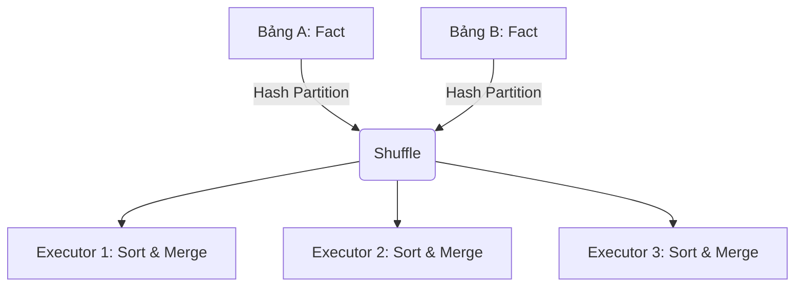

Trong các hệ thống phân tán (Distributed Compute Engines) như Apache Spark, Trino hay Flink, thao tác JOIN không đơn thuần là ghép các bản ghi như Single-Node RDBMS (PostgreSQL/MySQL). Thay vào đó, nó là một bài toán **Network I/O & Memory Management** cực kỳ tốn kém. Dữ liệu phải được xáo trộn qua mạng giữa các Executors (Network Shuffle) để đảm bảo các bản ghi có cùng Join Key hội tụ về cùng một Node vật lý trước khi việc so khớp (probing) thực sự diễn ra.

Tùy thuộc vào kích thước dữ liệu và cấu hình hệ thống, Query Optimizer sẽ quyết định chọn một trong ba chiến lược cốt lõi: **Broadcast Hash Join (BHJ)**, **Sort-Merge Join (SMJ)**, hoặc **Shuffle Hash Join (SHJ)**.

---

## 1. Kiến trúc Thực thi Vật lý (Physical Execution)

### 1.1. Broadcast Hash Join (BHJ)
Đây là chiến lược Map-side Join nhanh nhất, được dùng khi một bảng (Dimension table) đủ nhỏ để vừa vặn trong RAM của mọi Executors, trong khi bảng còn lại (Fact table) rất lớn.

*   **Nguyên lý hoạt động:** Driver Node đọc toàn bộ bảng nhỏ, sau đó *broadcast* (phát sóng) bản sao của bảng này tới từng Executor. Tại Executor, hệ thống dựng một In-Memory Hash Table từ bảng nhỏ. Bảng lớn được xử lý song song (Map phase), mỗi dòng sẽ được lookup (probe) trực tiếp vào Hash Table cục bộ.
*   **Network I/O:** O(N) với N là số Executors. Hoàn toàn **KHÔNG có Shuffle** đối với bảng lớn.
*   **Trade-off:** Đánh đổi Memory (tốn RAM ở Driver và Executor để chứa Hash Table) lấy Tốc độ (tránh Shuffle).

**Cấu hình thực chiến (Spark):**
```python
# Tăng ngưỡng tự động Broadcast lên 50MB (Mặc định là 10MB)
spark.conf.set("spark.sql.autoBroadcastJoinThreshold", "52428800")
```

### 1.2. Sort-Merge Join (SMJ)
SMJ là cơ chế default cho hai bảng lớn từ Spark 2.3+. Khác với Hash Join đòi hỏi RAM, SMJ là chiến lược an toàn (Robust) nhất để chống lại rủi ro **JVM OOMKilled**.

*   **Nguyên lý hoạt động:** Cả hai bảng phải trải qua 3 giai đoạn (Phases):
    1.  **Shuffle:** Cả hai bảng được re-partition qua mạng dựa trên Hash của Join Key.
    2.  **Sort:** Tại mỗi partition của từng node, dữ liệu được sắp xếp (Sort) theo Join Key. Nếu RAM không đủ, JVM sẽ *Spill-to-disk* (ghi tạm xuống đĩa).
    3.  **Merge:** Dùng hai con trỏ (Pointers) quét tuyến tính O(N) qua hai tập dữ liệu đã Sort để merge các records khớp nhau.
*   **Trade-off:** Đánh đổi Tốc độ và Disk/CPU I/O (Sort phase cực kỳ đắt đỏ về Compute và I/O) để lấy sự Ổn định (Robustness), tránh OOM.



### 1.3. Shuffle Hash Join (SHJ)
SHJ là một phương án lai. Cả hai bảng vẫn bị Shuffle (như SMJ) để gom chung Join Key, nhưng thay vì Sort, Executor sẽ dựng Hash Table cho phân vùng của bảng nhỏ hơn và probe phân vùng của bảng lớn hơn.

*   **Trade-off:** Tiết kiệm CPU (không phải Sort) nhưng rủi ro OOM rất cao. Thường chỉ hiệu quả khi kích thước partition đủ nhỏ để fit vào memory của Executor, và không có Skew.

---

## 2. Rủi ro Vận hành (Operational Risks & Incidents)

Trong thực tế production, quá trình Join thường xuyên là tác nhân gây sập hệ thống (Incident).

### 2.1. Cartesian Explosion (Bùng nổ dữ liệu Cross Join)
Khi thực hiện JOIN với điều kiện không đủ chặt (Non-equi join kiểu `<`, `>` hoặc thiếu key), Query Engine có thể rơi vào trạng thái Nested Loop Join (Cartesian Product), sinh ra $M \times N$ bản ghi, làm nghẽn toàn bộ Cluster.
*   *Triệu chứng:* Disk Spill lên tới hàng Terabytes, Network Inbound bão hòa (saturated).

### 2.2. JVM OOMKilled & Broadcast Timeout
Nếu ép buộc (Hint) dùng Broadcast Join cho một bảng có kích thước thực tế lớn hơn Driver/Executor Memory, Garbage Collector (GC) của JVM sẽ rơi vào tình trạng "GC Pause" liên tục (Stop-the-world) và kết thúc bằng lỗi OOM.
Đồng thời, nếu timeout cấu hình quá thấp, tác vụ Broadcast bị fail giữa chừng: `spark.sql.broadcastTimeout`.

### 2.3. Data Skew (Lệch dữ liệu)
Đây là sát thủ thầm lặng của Shuffle. Nếu Fact table có 80% dữ liệu thuộc về một `client_id = 'NULL'` hoặc một khách hàng quá lớn, khi Shuffle, toàn bộ 80% dữ liệu này đổ dồn vào một Task/Executor duy nhất, gây ra **Straggler Task** (1 Task chạy mất 5 tiếng trong khi các tasks khác xong trong 2 phút).

---

## 3. Tối ưu Hệ thống (Systemic Troubleshooting)

### 3.1. Adaptive Query Execution (AQE) trong Spark 3+
AQE cho phép Spark tự động đổi chiến lược Join trong lúc Run-time (Execution Phase) thay vì Plan-time.

1.  **Dynamically Switching Join Strategies:** Nếu sau giai đoạn Filter, một bảng lớn bỗng nhiên thu nhỏ lại dưới ngưỡng 10MB, AQE sẽ tự động đổi từ Sort-Merge Join thành Broadcast Hash Join (Loại bỏ Local Sort).
2.  **Dynamically Optimizing Skew Joins:** AQE phát hiện partition bị lệch, tự động "xé nhỏ" (Split) partition đó và nhân bản (Replicate) partition đối ứng.

```python
# Cấu hình bật AQE và Skew Join Optimization
spark.conf.set("spark.sql.adaptive.enabled", "true")
spark.conf.set("spark.sql.adaptive.skewJoin.enabled", "true")
spark.conf.set("spark.sql.adaptive.skewJoin.skewedPartitionFactor", "5")
```

### 3.2. Manual Salting (Kỹ thuật băm dữ liệu thủ công)
Khi không có AQE, ta phải can thiệp thủ công (Salting) để phân tán Data Skew.

**Giải pháp (PySpark):** Thêm một Salt ngẫu nhiên từ 1 đến N vào Join Key của bảng lớn, và Explode bảng nhỏ tương ứng.
```python
from pyspark.sql import functions as F

# Bảng lớn: Fact (bị Skew ở client_id = 1)
df_fact = df_fact.withColumn("salt", F.round(F.rand() * 9))
df_fact = df_fact.withColumn("salted_client_id", F.concat_ws("_", "client_id", "salt"))

# Bảng nhỏ: Dimension (Explode x10)
salts = spark.range(0, 10)
df_dim_exploded = df_dim.crossJoin(salts).withColumn("salted_client_id", F.concat_ws("_", "client_id", "id"))

# Thực hiện Join trên Key mới (hoàn toàn được phân tán)
df_joined = df_fact.join(df_dim_exploded, "salted_client_id")
```

---

## Nguồn Tham Khảo

*   [Apache Spark: A Unified Engine for Big Data Processing (CACM 2016)](https://cacm.acm.org/magazines/2016/11/209116-apache-spark/fulltext)
*   [Adaptive Query Execution in Spark 3.0 - Databricks Engineering Blog](https://databricks.com/blog/2020/05/29/adaptive-query-execution-speeding-up-spark-sql-at-runtime.html)
*   *Designing Data-Intensive Applications* - Chapter 10: Batch Processing, Martin Kleppmann.
*   [Presto: SQL on Everything (Facebook Engineering)](https://engineering.fb.com/2019/06/06/data-infrastructure/presto/)
