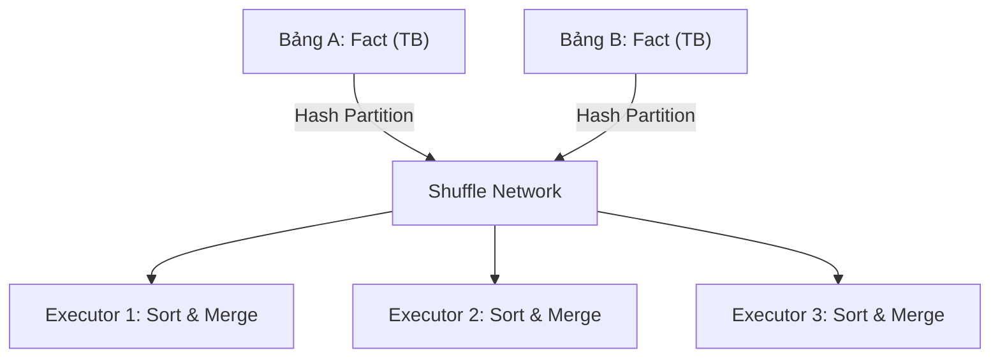

Trong các hệ thống tính toán phân tán (Distributed Compute Engines) quy mô lớn như Apache Spark, Trino, Presto hay Flink, thao tác JOIN không đơn thuần là ghép các bản ghi như Single-Node RDBMS (PostgreSQL/MySQL). Thay vào đó, nó là một bài toán **Network I/O & Memory Management** cực kỳ tốn kém và đau đầu.

Khi dữ liệu nằm rải rác trên hàng ngàn máy chủ (Nodes), để nối hai bảng, dữ liệu phải được xáo trộn qua mạng (Network Shuffle) để đảm bảo các bản ghi có cùng Join Key hội tụ về cùng một Node vật lý trước khi việc so khớp (probing) thực sự diễn ra. Tùy thuộc vào kích thước dữ liệu và cấu hình hệ thống, Query Optimizer (như Catalyst của Spark) sẽ quyết định chọn một trong ba chiến lược cốt lõi: **Broadcast Hash Join (BHJ)**, **Sort-Merge Join (SMJ)**, hoặc **Shuffle Hash Join (SHJ)**.

---

## 1. Kiến trúc Thực thi Vật lý (Physical Execution Strategies)

Mỗi chiến lược Join đều có những đánh đổi (Trade-offs) riêng biệt giữa CPU, RAM và Network I/O. 

### 1.1. Broadcast Hash Join (BHJ)
Đây là chiến lược Map-side Join nhanh nhất, được dùng khi một bảng (thường là Dimension table) đủ nhỏ để vừa vặn trong RAM của mọi Executors, trong khi bảng còn lại (Fact table) rất lớn.

*   **Nguyên lý hoạt động:** Driver Node đọc toàn bộ bảng nhỏ, sau đó *broadcast* (phát sóng) bản sao của bảng này qua mạng tới từng Executor trong Cluster. Tại mỗi Executor, hệ thống dựng một In-Memory Hash Table từ bảng nhỏ. Bảng lớn được đọc và phân tán xử lý song song (Map phase), mỗi dòng sẽ được lookup (probe) trực tiếp vào Hash Table cục bộ.
*   **Network I/O:** Chi phí truyền tải là $O(N)$ với $N$ là số Executors. Tuyệt vời nhất là hoàn toàn **KHÔNG có quá trình Shuffle** đối với bảng lớn, giúp tiết kiệm hàng giờ đồng hồ ghi đọc đĩa.
*   **Trade-off:** Đánh đổi Memory (tốn RAM ở Driver và Executor để chứa toàn bộ Hash Table) lấy Tốc độ (tránh Shuffle).

**Cấu hình thực chiến (PySpark):**
```python
# Tăng ngưỡng tự động Broadcast lên 50MB (Mặc định thường là 10MB)
spark.conf.set("spark.sql.autoBroadcastJoinThreshold", "52428800")

# Hoặc ép buộc (Hint) dùng BHJ trong SQL
```
```sql
SELECT /*+ BROADCAST(d) */ f.order_id, d.store_name
FROM fact_orders f
JOIN dim_stores d ON f.store_id = d.store_id;
```

### 1.2. Sort-Merge Join (SMJ)
SMJ là cơ chế default và đáng tin cậy (Robust) nhất cho bài toán JOIN hai bảng khổng lồ (Large-to-Large). Khác với Hash Join đòi hỏi RAM, SMJ là chiến lược sinh ra để chống lại rủi ro sập hệ thống **JVM OOMKilled**.

*   **Nguyên lý hoạt động:** Cả hai bảng phải trải qua 3 giai đoạn (Phases):
    1.  **Shuffle (Xáo trộn):** Cả hai bảng được re-partition qua mạng dựa trên hàm Hash của Join Key. Các bản ghi có chung Key sẽ trôi về cùng một phân vùng (Partition).
    2.  **Sort (Sắp xếp):** Tại mỗi partition của từng node, dữ liệu được sắp xếp (Sort) theo Join Key. Nếu RAM không đủ chứa khối dữ liệu này, JVM sẽ *Spill-to-disk* (ghi tạm xuống đĩa cứng).
    3.  **Merge (Trộn):** Dùng hai con trỏ (Pointers) quét tuyến tính $O(N)$ qua hai tập dữ liệu đã Sort để merge các records khớp nhau.
*   **Trade-off:** Đánh đổi Tốc độ và Disk/CPU I/O (Sort phase cực kỳ đắt đỏ về tính toán Compute và ghi đĩa I/O) để lấy sự Ổn định (Robustness), tránh Out-Of-Memory.



### 1.3. Shuffle Hash Join (SHJ)
SHJ là một phương án lai. Cả hai bảng vẫn bị Shuffle (như SMJ) để gom chung Join Key, nhưng thay vì tốn CPU để Sort, Executor sẽ dựng Hash Table cho phân vùng của bảng nhỏ hơn và probe phân vùng của bảng lớn hơn ngay trên RAM.

*   **Trade-off:** Tiết kiệm CPU (không phải Sort) nhưng rủi ro OOM cực cao nếu một phân vùng bất kỳ bị phình to (Data Skew). Thường chỉ hiệu quả khi kích thước partition đủ nhỏ để fit vào memory của Executor.

---

## 2. Rủi ro Vận hành (Operational Risks & Incidents)

Trong thực tế production tại các Data Platform quy mô Petabyte, quá trình Join thường xuyên là tác nhân số 1 gây sập hệ thống (Severity 1 Incident).

### 2.1. Cartesian Explosion (Bùng nổ dữ liệu Cross Join)
Khi Data Engineer viết truy vấn JOIN với điều kiện không đủ chặt (Non-equi join kiểu `<`, `>` hoặc quên mất Join Key), Query Engine có thể rơi vào trạng thái Nested Loop Join (Cartesian Product), sinh ra $M \times N$ bản ghi, làm nghẽn toàn bộ Cluster.
*   *Triệu chứng:* Lượng Disk Spill lên tới hàng Terabytes, Network Inbound bão hòa (Saturated), Job bị treo vĩnh viễn không bao giờ kết thúc.

### 2.2. JVM OOMKilled & Broadcast Timeout
Nếu bạn sử dụng Hint để ép buộc dùng Broadcast Join cho một bảng có kích thước thực tế sau khi decompress lớn hơn Driver/Executor Memory, Garbage Collector (GC) của JVM sẽ rơi vào tình trạng "GC Pause" liên tục (Stop-the-world) và kết thúc bằng lỗi OOMKilled.
Đồng thời, nếu timeout cấu hình quá thấp, tác vụ Broadcast qua mạng sẽ bị fail giữa chừng: Lỗi `TimeoutException` liên quan đến `spark.sql.broadcastTimeout`.

### 2.3. Data Skew (Lệch dữ liệu)
Đây là sát thủ thầm lặng đáng sợ nhất của Distributed Joins. Nếu Fact table có 80% dữ liệu thuộc về một `client_id = 'UNKNOWN'` hoặc một khách hàng quá lớn (ví dụ: Apple, Google), khi thực hiện giai đoạn Shuffle, toàn bộ 80% dữ liệu này đổ dồn vào một Task/Executor duy nhất. Điều này sinh ra hiện tượng **Straggler Task** (1 Task chạy mất 5 tiếng trong khi 999 tasks khác xong trong 2 phút).

---

## 3. Kiến trúc Cứu Cánh Tại Uber & Databricks (Big Tech Scale)

### 3.1. Databricks với AQE (Adaptive Query Execution)
Trong môi trường Databricks, AQE cho phép Catalyst Optimizer tự động đổi chiến lược Join trong lúc Run-time thay vì lập kế hoạch tĩnh:
1.  **Chuyển đổi chiến lược động (Dynamic Join Strategy):** Nếu sau giai đoạn Filter, một bảng lớn bỗng nhiên thu nhỏ lại dưới ngưỡng 10MB, AQE sẽ tự động hạ gục SMJ và đổi thành Broadcast Hash Join để loại bỏ hoàn toàn Local Sort và Shuffle.
2.  **Tối ưu Skew Join động:** AQE phát hiện partition bị lệch trong quá trình Shuffle Write, tự động "xé nhỏ" (Split) partition đó và nhân bản (Replicate) partition đối ứng bên kia để xử lý song song.

### 3.2. Uber với Remote Shuffle Service (RSS)
Uber chạy hơn 10.000 nodes Spark xử lý hàng trăm Petabytes mỗi ngày. Việc sử dụng Sort-Merge Join (SMJ) mặc định của Spark sinh ra một thảm họa vật lý: **Ổ cứng SSD bị hỏng cực nhanh**.

Trong thiết kế gốc của Spark, Shuffle Map Tasks ghi dữ liệu trực tiếp xuống ổ cứng cục bộ (Local Disk) của Node. Do quy mô quá lớn, các ổ cứng SSD có chỉ số DWPD (Drive Writes Per Day) thấp bị vắt kiệt và hỏng chỉ sau 6 tháng thay vì tuổi thọ 3 năm. Thêm vào đó, việc đọc/ghi chéo giữa các Node gây nghẽn cổ chai cục bộ (Noisy Neighbor).

**Giải pháp của Uber - RSS:**
Uber đã xây dựng và nguồn mở nền tảng **Remote Shuffle Service (RSS)**. Thay vì Map Task ghi xuống đĩa cục bộ, nó stream dữ liệu trực tiếp qua mạng đến một cụm RSS Servers độc lập chuyên dụng cho I/O (I/O-optimized hardware). Các Reduce Task sau đó chỉ cần đến 1 RSS Server duy nhất để lấy toàn bộ dữ liệu của phân vùng, thay vì phải mở kết nối đến hàng ngàn Map nodes. Kiến trúc này giúp tách biệt hoàn toàn Compute và Storage (Disaggregated Architecture), nâng tuổi thọ SSD lên 36 tháng và đạt độ tin cậy hệ thống 99.99%.

---

## 4. Thực Chiến Hệ Thống (Systemic Troubleshooting & IAC)

### 4.1. Terraform Cấp Phát Tài Nguyên Cho Joins
Để đảm bảo các chiến lược SMJ hoặc BHJ không bị OOM, cấu hình Memory Allocation cho Container là cực kỳ quan trọng. Dưới đây là cấu hình Terraform cho AWS EMR tối ưu hóa bộ nhớ cho Spark.

```terraform
resource "aws_emr_cluster" "optimized_spark_cluster" {
  name          = "spark-join-optimized"
  release_label = "emr-6.10.0"
  applications  = ["Spark", "Hadoop"]

  configurations_json = <<EOF
  [
    {
      "Classification": "spark-defaults",
      "Properties": {
        "spark.sql.join.preferSortMergeJoin": "true",
        "spark.sql.autoBroadcastJoinThreshold": "31457280", # 30MB
        "spark.executor.memoryOverhead": "2048", # Tránh OOMKilled do YARN container kill
        "spark.memory.fraction": "0.8",
        "spark.sql.shuffle.partitions": "2000"
      }
    }
  ]
  EOF

  # Cấp phát RAM khổng lồ cho Core Nodes để chống chịu Sort phase của SMJ
  core_instance_group {
    instance_type = "r5.8xlarge" 
    instance_count = 10
  }
}
```

### 4.2. Manual Salting (Kỹ thuật băm dữ liệu thủ công)
Khi bạn làm việc trên một Engine cũ hoặc không có bật tính năng AQE, ta phải can thiệp thủ công bằng kỹ thuật **Salting** để phân tán Data Skew phá vỡ điểm nghẽn.

**Giải pháp (PySpark):** Thêm một Salt ngẫu nhiên từ 1 đến N vào Join Key của bảng lớn (để xé nhỏ cục dữ liệu lớn ra N phần), và Explode bảng nhỏ tương ứng thành N bản sao để vẫn đảm bảo logic Join hội tụ được dữ liệu.

```python
from pyspark.sql import functions as F

# Bảng lớn: Fact (Đang bị Skew nghẽn cổ chai ở client_id = 1)
# Băm client_id bằng cách thêm suffix _0 đến _9
df_fact = df_fact.withColumn("salt", F.round(F.rand() * 9))
df_fact = df_fact.withColumn("salted_client_id", F.concat_ws("_", "client_id", "salt"))

# Bảng nhỏ: Dimension (Nhân bản x10 lần để đảm bảo khớp dữ liệu)
salts = spark.range(0, 10)
df_dim_exploded = df_dim.crossJoin(salts).withColumn(
    "salted_client_id", F.concat_ws("_", "client_id", "id")
)

# Thực hiện Join trên Key mới (dữ liệu giờ đây hoàn toàn được phân tán đều trên 10 tasks)
df_joined = df_fact.join(df_dim_exploded, "salted_client_id")
```

---

## Nguồn Tham Khảo

*   [Apache Spark: A Unified Engine for Big Data Processing [CACM 2016]][https://cacm.acm.org/magazines/2016/11/209116-apache-spark/fulltext]
*   [Uber Engineering Blog: Highly Scalable and Distributed Shuffle as a Service][https://www.uber.com/en-US/blog/ubers-highly-scalable-and-distributed-shuffle-as-a-service/]
*   [Adaptive Query Execution in Spark 3.0 - Databricks Engineering Blog](https://databricks.com/blog/2020/05/29/adaptive-query-execution-speeding-up-spark-sql-at-runtime.html]
*   *Designing Data-Intensive Applications* - Chapter 10: Batch Processing, Martin Kleppmann.
