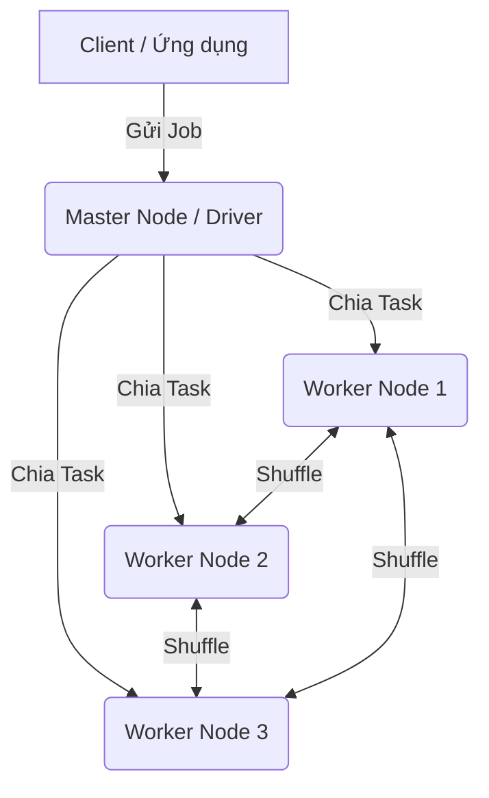

Trong kỷ nguyên số ngày nay, lượng dữ liệu sinh ra mỗi giây từ mạng xã hội, thiết bị IoT, các giao dịch tài chính hay hệ thống log là khổng lồ. Hãy tưởng tượng bạn có 1 Terabyte (TB) dữ liệu log cần phải lọc và đếm từ khóa. Một chiếc máy tính thông thường (Single Node) có thể sẽ mất hàng giờ đồng hồ, hoặc thậm chí gặp lỗi Out Of Memory (OOM) vì không thể tải nổi toàn bộ dữ liệu vào bộ nhớ RAM. 

Giải pháp cho vấn đề này chính là **Distributed Processing** (Xử lý phân tán).

Distributed Processing là mô hình chia nhỏ một khối lượng công việc khổng lồ ra cho nhiều máy tính (gọi là các **Nodes**) cùng xử lý song song, thay vì phụ thuộc vào một siêu máy tính đơn lẻ đắt tiền. 

---

## 1. Tại sao lại cần Xử lý phân tán?

Lý do quan trọng nhất dẫn đến sự bùng nổ của các hệ thống xử lý phân tán nằm ở giới hạn vật lý và bài toán chi phí trong kiến trúc máy tính.

### Scale Up (Mở rộng chiều dọc) vs Scale Out (Mở rộng chiều ngang)

- **Scale Up (Mở rộng chiều dọc):** Tăng cường sức mạnh phần cứng của một máy tính duy nhất bằng cách thêm RAM, CPU nhiều lõi hơn, hoặc ổ cứng tốc độ cao (SSD/NVMe). 
  - *Nhược điểm:* Giới hạn về vật lý (một bo mạch chủ chỉ cắm được tối đa bao nhiêu thanh RAM), và chi phí tăng theo cấp số nhân. Việc mua một siêu máy tính có 2TB RAM đắt hơn rất nhiều so với việc mua 20 máy tính thông thường, mỗi máy 100GB RAM.
  
- **Scale Out (Mở rộng chiều ngang):** Liên kết nhiều máy tính tính toán bình thường (Commodity Hardware) lại với nhau thành một cụm (Cluster) qua hệ thống mạng nội bộ tốc độ cao. Hệ thống xử lý phân tán sử dụng hướng tiếp cận này.
  - *Ưu điểm:* Chi phí rẻ, khả năng mở rộng (Scalability) gần như vô hạn. Khi cần thêm năng lực xử lý, bạn chỉ cần cắm thêm máy mới vào mạng.

### Khả năng chịu lỗi (Fault Tolerance)

Trong một hệ thống gồm hàng trăm, hàng ngàn máy tính, việc một ổ cứng bị hỏng hay một node bị sập nguồn là điều **chắc chắn sẽ xảy ra**. Các framework xử lý phân tán được thiết kế để chịu lỗi ngay từ trong lõi:
- Nếu một máy đang xử lý dữ liệu bị chết, công việc của máy đó sẽ tự động được điều chuyển (re-assigned) sang một máy khác đang rảnh.
- Dữ liệu cũng thường được nhân bản (Replication) ra nhiều máy khác nhau để tránh mất mát.

---

## 2. Kiến trúc cơ bản của hệ thống phân tán

Hầu hết các framework xử lý phân tán hiện đại (như Hadoop, Apache Spark, Presto, Flink) đều tuân theo kiến trúc **Master - Worker**.

1. **Master Node (Control Plane / Driver):** 
   - Đóng vai trò là "Bộ não" trung tâm.
   - Khi bạn gửi một câu lệnh SQL hoặc một đoạn code xử lý, Master sẽ không trực tiếp chạy nó. Thay vào đó, nó tạo ra một **Kế hoạch thực thi (Execution Plan)**.
   - Master chia nhỏ kế hoạch này thành các khối công việc nhỏ (Tasks) và phân phát cho các Worker.
   - Quản lý vòng đời (lifecycle), giám sát tài nguyên và theo dõi tiến độ của các Worker.

2. **Worker Node (Data Plane / Executor):**
   - Đóng vai trò là những "Công nhân".
   - Tiếp nhận Task từ Master, đọc dữ liệu thực tế từ hệ thống lưu trữ (HDFS, S3, GCS).
   - Tiến hành tính toán (Filter, Map, Join,...) và gửi trạng thái về cho Master.

---

## 3. Nguyên lý cốt lõi: Chia để trị (MapReduce Paradigm)

Mặc dù công nghệ ngày nay đã tiến xa so với Hadoop MapReduce đời đầu, nhưng tư duy cơ bản của việc phân tán dữ liệu vẫn xoay quanh các khái niệm Map, Shuffle và Reduce.

* **Map Phase:** Dữ liệu gốc được chia thành nhiều phần nhỏ (gọi là **Partitions**). Các Worker sẽ đọc song song các Partitions này và áp dụng các phép biến đổi (Transformation) một cách độc lập. Ở bước này, các Worker không cần nói chuyện với nhau.
* **Shuffle Phase:** Đây là công đoạn tốn kém và phức tạp nhất. Khi bạn cần nhóm dữ liệu (ví dụ: `GROUP BY user_id` hoặc `JOIN` hai bảng), hệ thống phải gom tất cả những bản ghi có chung `user_id` đang nằm rải rác ở các Worker khác nhau về cùng một Node. Quá trình trao đổi dữ liệu chéo qua mạng này gọi là **Shuffle**. Network và Disk I/O ở bước này thường trở thành nút thắt cổ chai (Bottleneck).
* **Reduce Phase:** Sau khi dữ liệu đã được gom về đúng chỗ (Colocated), Worker sẽ tiến hành tính toán tổng hợp (ví dụ: tính Sum, Count, Average) và xuất ra kết quả.

---

## 4. Các khái niệm nâng cao cần nắm vững

Trong thế giới Data Engineering, để viết các ứng dụng phân tán hiệu suất cao, bạn cần hiểu rõ các vấn đề dưới đây:

### 4.1. Phân mảnh dữ liệu (Partitioning)

Partitioning quyết định việc dữ liệu của bạn được phân chia như thế nào. 
- **Mức độ chia nhỏ (Parallelism):** Nếu bạn có 100 Cores xử lý nhưng dữ liệu chỉ chia thành 10 Partitions, thì 90 Cores sẽ ngồi chơi. 
- Ngược lại, nếu chia thành 10,000 Partitions cho dữ liệu quá nhỏ, chi phí quản lý Task (Overhead) từ Master sẽ làm chậm toàn bộ hệ thống.

### 4.2. Lệch dữ liệu (Data Skew)

Đây là "cơn ác mộng" của kỹ sư dữ liệu. Data Skew xảy ra khi dữ liệu phân bố không đồng đều theo khóa (Key).
- *Ví dụ:* Khi nhóm dữ liệu giao dịch theo Quốc gia, 95% giao dịch đến từ "Vietnam", phần còn lại rải rác ở 5% các nước khác.
- *Hậu quả:* Một Worker phụ trách Partition "Vietnam" sẽ nhận lượng dữ liệu khổng lồ, xử lý chạy mãi không xong (hoặc bị lỗi OOM), trong khi các Worker khác đã xong việc và ngồi chờ.

### 4.3. Xử lý trên bộ nhớ (In-memory Processing)

Hadoop đời cũ liên tục đọc/ghi kết quả trung gian xuống ổ cứng qua mỗi bước (Map -> Ghi đĩa -> Reduce -> Ghi đĩa), làm chậm quá trình do tốc độ Disk I/O thấp. 
Apache Spark đã làm một cuộc cách mạng bằng việc giới thiệu **In-memory computing** (sử dụng RDD - Resilient Distributed Datasets). Spark sẽ cố gắng giữ dữ liệu trung gian ở RAM nhiều nhất có thể, chỉ ghi xuống đĩa khi thật sự cần thiết. Điều này giúp tăng tốc độ lên gấp từ 10 đến 100 lần.

---

## 5. Các công cụ xử lý phân tán tiêu biểu

Sự phát triển của công nghệ xử lý dữ liệu trải qua nhiều giai đoạn:

1. **Hệ sinh thái Hadoop (MapReduce, Hive):** Tiên phong cho kỷ nguyên Big Data. Thích hợp cho xử lý Batch cực lớn, độ ổn định cực cao.
2. **Compute Engines thế hệ mới (Apache Spark, Apache Flink):** Hướng đến tốc độ bằng In-memory processing. Hỗ trợ tốt cho cả Batch Processing và Stream Processing.
3. **Distributed SQL Engines (Presto, Trino):** Thiết kế chuyên biệt để query SQL tương tác siêu tốc (Ad-hoc query) trên mọi nguồn dữ liệu (S3, HDFS, RDBMS) mà không cần di chuyển dữ liệu.
4. **Cloud-native / MPP Data Warehouses (BigQuery, Snowflake, Redshift):** Công nghệ hiện đại (Massively Parallel Processing). Người dùng không còn cần quan tâm đến máy chủ (Serverless), hệ thống tự động co giãn sức mạnh tính toán theo truy vấn SQL.

---

## 6. Lời kết

Việc chuyển dịch từ suy nghĩ theo hướng chạy ứng dụng trên một máy đơn lẻ sang hệ thống phân tán đòi hỏi kỹ sư dữ liệu phải có tư duy về tối ưu hóa mạng (Network), bộ nhớ (Memory) và luồng xử lý song song. Hiểu rõ bản chất Map, Shuffle, Reduce và Data Skew sẽ là nền tảng cốt lõi để bạn có thể làm việc hiệu quả với bất kỳ công cụ Big Data nào trên thị trường.

---

## Tài Liệu Tham Khảo
* [Apache Spark: A Unified Engine for Big Data Processing (CACM 2016)](https://cacm.acm.org/magazines/2016/11/209116-apache-spark/fulltext)
* [Adaptive Query Execution in Spark 3.0 - Databricks Blog](https://databricks.com/blog/2020/05/29/adaptive-query-execution-speeding-up-spark-sql-at-runtime.html)
* **Troubleshooting Spark OOM and Memory Management - Uber Engineering**
* [Spark Shuffle Architecture - DataBricks Deep Dive](https://databricks.com/session/deep-dive-into-spark-sql-with-advanced-performance-tuning)
* **Presto: SQL on Everything - Facebook Engineering**
