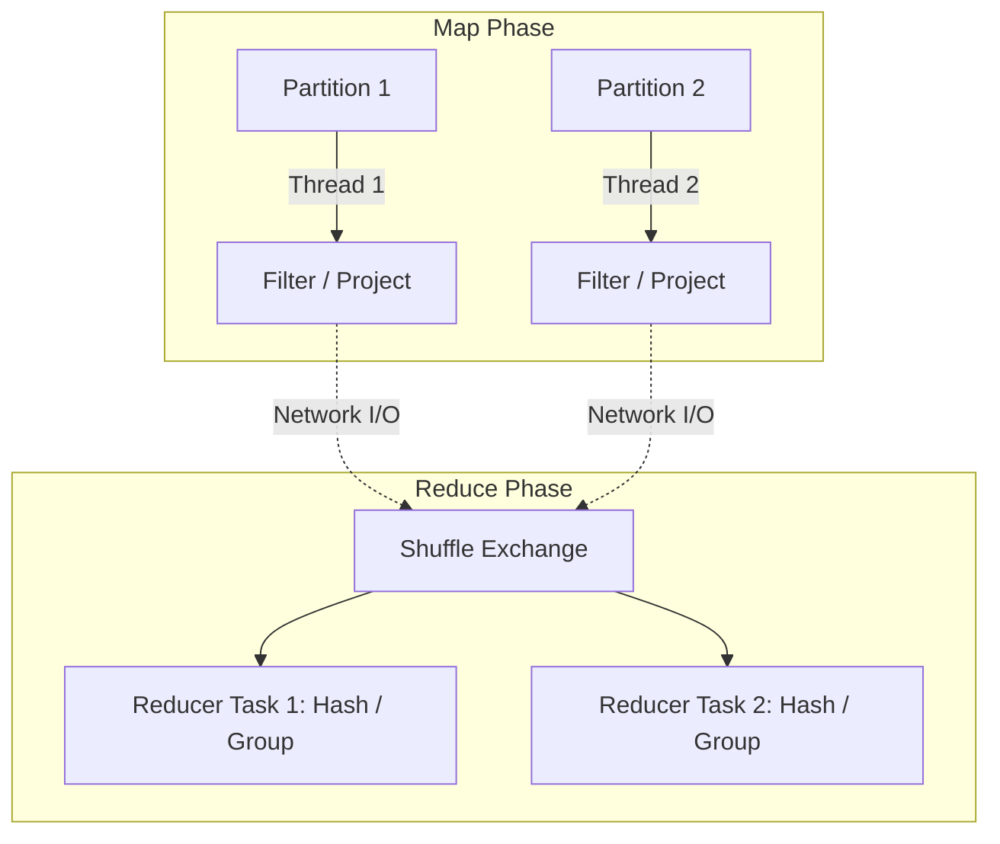

Khi khối lượng dữ liệu vượt qua giới hạn của hệ thống đơn [Single-Node Disk/RAM], việc phân mảnh bài toán tính toán (Distributed Processing) trở thành yêu cầu tiên quyết. Hệ thống tính toán phân tán hiện đại, từ Hadoop MapReduce đến Apache Spark và Presto/Trino, đều được xây dựng để giải quyết bài toán cốt lõi: Làm thế nào để điều phối hàng nghìn máy chủ commodity hardware xử lý một truy vấn phức tạp trong thời gian thực, đồng thời chống chịu được rủi ro hỏng hóc vật lý (Fault Tolerance)?

---

## 1. Kiến trúc Thực thi Vật lý (Physical Execution Architecture)

Phần lớn các Distributed Compute Engines đều tuân theo mô hình **Master/Worker (Control Plane / Data Plane)**. Trong mô hình này, việc tách bạch giữa node quản lý vòng đời truy vấn và node thực thi giúp cô lập rủi ro và tăng khả năng mở rộng (Scale-Out).


- **Vai trò:** Khi nhận một job SQL hoặc đoạn script, Driver Node đóng vai trò biên dịch (Compiler). Nó chuyển đổi Logical Plan thành Physical Execution Plan dưới dạng **DAG (Directed Acyclic Graph)**.
- **Tương tác:** Đàm phán với Cluster Manager (YARN, Kubernetes) để cấp phát tài nguyên (Cores, Memory). Control Plane hoàn toàn không chạm vào dữ liệu thực tế (Data Payload).

### 1.2. Data Plane (Executor/Worker Node)
- **Vai trò:** Đảm nhận việc xử lý số học và logic trên dữ liệu. Mỗi Worker cấp phát không gian JVM (Java Virtual Machine) và chạy nhiều Threads song song, mỗi thread tương ứng với một Task xử lý một block dữ liệu cục bộ (Partition).

---

## 2. Các Đánh đổi Hệ thống (Systemic Trade-offs)

Thiết kế kiến trúc phân tán luôn phải đối mặt với **Định lý CAP** và các giới hạn về vật lý. Dưới đây là những đánh đổi lớn nhất của hệ thống:

### 2.1. Scale-Up vs. Scale-Out
Hệ thống Big Data kiên định đi theo con đường **Scale-Out (Horizontal Scaling)**.
- **Cái giá phải trả (The Trade-off):** Mua hàng nghìn máy chủ giá rẻ (Commodity hardware) tiết kiệm hàng triệu USD so với việc mua một siêu máy chủ (Mainframe). Tuy nhiên, cái giá phải trả là chi phí độ trễ mạng (Network Latency) và xác suất hỏng hóc cao. 
- Nếu 1 ổ cứng có tỉ lệ hỏng là 0.1%/năm, với 1000 ổ cứng, hỏng hóc vật lý là sự kiện **chắc chắn xảy ra mỗi ngày**. Hệ thống buộc phải thiết kế xoay quanh tư duy "Expect failures".

### 2.2. In-Memory Computing vs. Disk-Spilling [Spark vs. MapReduce]
- **Hadoop MapReduce (Disk-based):** Buộc phải lưu kết quả trung gian sau mỗi phase Map và Reduce xuống ổ cứng cứng (`Spill-to-disk`). Tính Fault-tolerance cực cao (bởi vì dữ liệu trung gian luôn được persist) nhưng tốc độ chậm do thắt cổ chai ở Disk I/O.
- **Apache Spark (In-Memory):** Tận dụng **RDD (Resilient Distributed Dataset)** để giữ dữ liệu trung gian trên RAM. Tốc độ cao hơn Hadoop 10-100 lần, nhưng đánh đổi lại rủi ro gặp **JVM OOMKilled** (Out Of Memory) nếu dữ liệu phình to. Spark giải quyết lỗi thông qua Lineage Graph: khi một Executor sập, Driver nhìn vào DAG và tự động tính toán lại phân vùng dữ liệu đó từ đầu.

---

## 3. Vòng đời Xử lý Dữ liệu: Map, Shuffle và Reduce

Mọi truy vấn phức tạp (SQL JOINs, Window Functions) đều sẽ bị băm nhỏ thành ba phase vật lý:



### 3.1. Map Phase (Narrow Transformations]
Các thao tác xử lý không yêu cầu trao đổi trạng thái mạng (`SELECT`, `WHERE`, `CAST`, `REGEX`). Quá trình này diễn ra song song hoàn toàn (Embarrassingly parallel). Executor đọc trực tiếp data blocks từ HDFS/S3 và tính toán ngay tại chỗ. Băng thông mạng không bị ảnh hưởng.

### 3.2. Shuffle Phase (Cơn ác mộng phân tán)
Khi xuất hiện các thao tác gom nhóm hay liên kết bảng (`GROUP BY`, `JOIN`, `ORDER BY`), hệ thống bắt buộc phải **Shuffle (Xáo trộn)**. Tất cả bản ghi có cùng Hash Key phải được định tuyến (hội tụ) về cùng một Executor.
- Đây là **Nút thắt cổ chai (Bottleneck)** số một. Dữ liệu bị Serialize, đóng gói thành các Network Packets, gửi qua LAN.
- Nếu không được cấu hình đúng, băng thông mạng, CPU cho Serialize và Disk I/O (nếu RAM không chứa đủ) sẽ đồng loạt đạt đỉnh (Spike).

### 3.3. Adaptive Query Execution (AQE)
Spark 3.0+ mang đến khái niệm **AQE**, giải quyết yếu điểm chí mạng của Shuffle. AQE theo dõi thông số runtime ngay trong khi Shuffle diễn ra để tinh chỉnh lại Kế hoạch Thực thi, thay vì mù quáng làm theo kế hoạch tĩnh ban đầu (Static Plan).

- **Dynamically Coalescing Shuffle Partitions:** Nếu kết quả sau filter của Map Phase rất nhỏ, AQE sẽ tự động gom các partition nhỏ lại thành partition lớn để tiết kiệm số lượng Reduce Task (tránh overhead quản lý task của Master).
- **Dynamically Optimizing Skew Joins:** AQE phát hiện các phân vùng bị lệch (Skew) và tự băm nhỏ chúng ra để các node khác cùng hỗ trợ xử lý.

---

## 4. Rủi ro Vận hành (Troubleshooting & Incident)

### 4.1. Lỗi Cartesian Explosion & Tràn Bộ Nhớ (JVM OOMKilled)
- **Triệu chứng:** Container bị Kubernetes/YARN kill với mã lỗi 137 (`OOMKilled`) hoặc `java.lang.OutOfMemoryError: Java heap space`.
- **Nguyên nhân:** Xảy ra do Cross Join không có điều kiện ON hợp lý (Cartesian Explosion). Số lượng bản ghi bùng nổ theo cấp số nhân (VD: 1 triệu dòng x 1 triệu dòng = 1 nghìn tỷ dòng). Hệ thống cố gắng lưu trữ toàn bộ các object trung gian trên Heap Memory cho tới khi bộ thu gom rác (Garbage Collector - GC) không thể giải phóng kịp.
- **Cách khắc phục:** 
  1. Kiểm tra lại logic JOIN (thêm điều kiện WHERE/ON hợp lý).
  2. Bật chế độ Spill-to-disk sớm cho vùng nhớ Execution Memory (trong Spark cấu hình `spark.memory.fraction`).
  3. Cấu hình Broadcast JOIN cho bảng kích thước nhỏ, ép Worker sao chép toàn bộ bảng nhỏ thay vì thực hiện Shuffle Hash Join nặng nề.

### 4.2. Straggler Nodes & The Data Skew Problem
- **Triệu chứng:** Một job Spark đã hoàn thành 99% task, nhưng 1% task cuối cùng lại kẹt hàng giờ đồng hồ không xong.
- **Nguyên nhân:** Dữ liệu bị vẹo (Data Skew) do khóa JOIN hoặc GROUP BY tập trung vào một giá trị quá nhiều (VD: `country_code = 'US'` chiếm 80% lưu lượng). Kết quả là một Worker đơn độc phải xử lý 80% khối lượng công việc, trong khi 99 Worker khác rảnh rỗi.
- **Cách khắc phục thực chiến:**
  Thêm "Muối" (Salting) vào khóa phân phối:

```sql
-- Kỹ thuật Salting trong SQL xử lý Skew
SELECT 
  split_part(salted_key, '_', 1) as original_key,
  SUM(revenue) as total_revenue
FROM (
  -- Thêm hậu tố ngẫu nhiên từ 1 tới 10 để băm nhỏ dữ liệu bự
  SELECT 
    CONCAT(country_code, '_', CAST(FLOOR(RAND() * 10) AS STRING)) as salted_key,
    revenue
  FROM sales
)
GROUP BY salted_key;
```

### 4.3. Quản lý Tài nguyên với Terraform (FinOps)
Khi triển khai EMR/Databricks, việc phân bổ Node cực kỳ quan trọng. Bạn không thể ném bừa server vào cụm. Hãy quy định Spot Instances (giá rẻ, dễ bị thu hồi) cho Task Nodes (thực thi) và On-Demand Instances (ổn định) cho Master/Core Nodes (chứa HDFS).

*Cấu hình AWS EMR Terraform Minh Họa:*
```hcl
resource "aws_emr_cluster" "data_cluster" {
  name          = "spark-processing-cluster"
  release_label = "emr-6.10.0"
  applications  = ["Spark", "Hadoop"]

  # Master Node: Phải luôn sống (On-Demand)
  master_instance_group {
    instance_type  = "m5.xlarge"
    instance_count = 1
  }

  # Core Nodes: Lưu trữ HDFS, sử dụng On-Demand
  core_instance_group {
    instance_type  = "r5.2xlarge"
    instance_count = 2
  }

  # Task Nodes: Chỉ làm Compute, dùng Spot Instances tiết kiệm 70% chi phí
  task_instance_group {
    instance_type  = "c5.4xlarge"
    instance_count = 10
    bid_price      = "0.30" # Bidding cho Spot Instance
  }
}
```

---

## Nguồn Tham Khảo

*   [MapReduce: Simplified Data Processing on Large Clusters [Google Whitepaper 2004]][https://research.google.com/archive/mapreduce.html]
*   [Resilient Distributed Datasets: A Fault-Tolerant Abstraction for In-Memory Cluster Computing (NSDI 2012]][https://cs.stanford.edu/~matei/papers/2012/nsdi_spark.pdf]
*   [Adaptive Query Execution: Speeding Up Spark SQL at Runtime (Databricks Blog]](https://www.databricks.com/blog/2020/05/29/adaptive-query-execution-speeding-up-spark-sql-at-runtime.html)
*   *Designing Data-Intensive Applications* - Chapter 10: Batch Processing, Martin Kleppmann.
