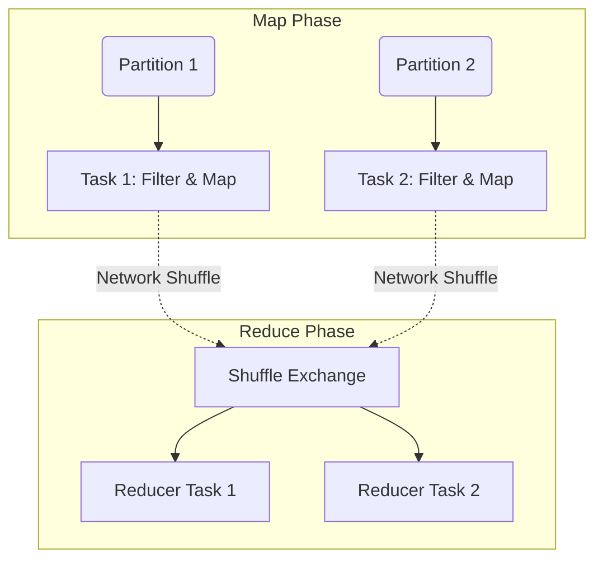

Khi khối lượng dữ liệu (Data Volume) vượt qua giới hạn vật lý của một ổ cứng (Single-Node Disk) hay bộ nhớ (Single-Node RAM), chúng ta buộc phải chia nhỏ bài toán tính toán ra để thực thi đồng thời trên hàng trăm, hàng nghìn máy chủ. Hệ thống xử lý dữ liệu phân tán (Distributed Processing) chính là công nghệ cốt lõi đứng sau những gã khổng lồ Big Data như Hadoop, Spark, hay Presto.

## 1. Kiến trúc Hệ thống (System Architecture)

Sự phân tán dữ liệu không chỉ là chia file thành nhiều mảng, mà còn là quản lý vòng đời tính toán (Compute Lifecycle). Hầu hết các Distributed Compute Engines đều dựa trên kiến trúc **Master/Worker (Control Plane / Data Plane)**.


### 1.1. Control Plane (Driver/Master)
*   Đây là "bộ não" điều phối. Khi Client gửi một câu lệnh SQL hoặc một đoạn code (job), Master Node không tham gia tính toán trực tiếp.
*   Nhiệm vụ của nó là xây dựng một đồ thị luồng công việc (Execution Plan / DAG), đàm phán với Cluster Manager (như YARN, Kubernetes) để xin cấp phát tài nguyên (CPU cores, RAM), và phân bổ các Task nhỏ (micro-tasks) tới các Worker.

### 1.2. Data Plane (Executor/Worker)
*   Các máy chủ Worker (thường là Commodity Hardware - máy chủ giá rẻ) nhận các Task từ Control Plane.
*   Mỗi Worker sẽ khởi tạo một vùng không gian bộ nhớ trong JVM (Java Virtual Machine) gọi là Executor, trực tiếp xử lý các khối dữ liệu vật lý (Partitions/Chunks) bằng các luồng (Threads) độc lập.

---

## 2. Các Đánh đổi trong Thiết kế (Systemic Trade-offs)

### 2.1. Scale-Up vs Scale-Out
Hệ thống phân tán chọn hướng đi **Scale-Out (Mở rộng theo chiều ngang)**.
*   **Trade-off:** Đổi sự phức tạp trong việc quản trị mạng lưới (Network Management, Node failure) lấy khả năng mở rộng vô hạn (Infinite Scalability). Mua 50 máy chủ 64GB RAM rẻ hơn rất nhiều so với mua một cỗ siêu máy chủ 3.2TB RAM.

### 2.2. In-Memory Processing vs Disk-Based MapReduce
*   **MapReduce truyền thống (Hadoop):** Sau mỗi pha tính toán (Map/Reduce), kết quả trung gian bị ép buộc phải Ghi xuống đĩa (Spill-to-disk). Đảm bảo tính chống chịu lỗi (Fault-Tolerance) cực cao nhưng bị chậm do Disk I/O Bottleneck.
*   **In-Memory Processing (Apache Spark):** Sử dụng RDD (Resilient Distributed Datasets) và DAG (Directed Acyclic Graph) để lưu trữ kết quả trung gian trực tiếp trên RAM. Tốc độ cao gấp 10-100 lần Hadoop, nhưng đối mặt với rủi ro JVM OOMKilled nếu không quản lý Garbage Collector cẩn thận.

---

## 3. Map, Shuffle và Reduce: Vòng đời vật lý của Dữ liệu

Dù là viết SQL (Snowflake/BigQuery) hay DataFrame (Spark), tầng vật lý bên dưới vẫn quy về 3 nguyên lý cốt lõi:



1.  **Map Phase (Narrow Transformations):** Các Worker đọc dữ liệu cục bộ (Local Partitions) và áp dụng các thao tác xử lý không yêu cầu trao đổi thông tin với các Worker khác (Ví dụ: `SELECT`, `WHERE`, `CAST`). Quá trình này hoàn toàn song song (embarrassingly parallel) và cực kỳ nhanh.
2.  **Shuffle Phase:** Cơn ác mộng hệ thống. Khi thao tác tính toán cần gom nhóm (`GROUP BY`, `JOIN`, `WINDOW`), toàn bộ dữ liệu phải được trao đổi (Xáo trộn chéo) qua mạng LAN giữa tất cả các Worker. Băng thông mạng (Network I/O) bị bão hòa, dữ liệu phải được serialize/deserialize và có thể phải ghi tạm ra đĩa (Shuffle Spill).
3.  **Reduce Phase:** Sau khi Shuffle hoàn tất, các bản ghi có cùng Hash Key hội tụ tại một node. Worker thực thi tổng hợp cuối cùng (`SUM`, `COUNT`) và xuất ra Data Lake/Warehouse.

---

## 4. Tối ưu Vận hành (Operational FinOps & Troubleshooting)

### 4.1. Lỗi Cấu hình Partition (The Partitioning Problem)
*   **Too Few Partitions:** Số lượng Partitions quá ít (ví dụ: 10 Partitions chạy trên cụm 100 Cores). Hệ thống bị Lãng phí (Idle), 90 cores ngồi chơi không. Hơn nữa, mỗi partition quá to dẫn đến Out-Of-Memory.
*   **Too Many Partitions:** Số lượng Partitions quá lớn (hàng trăm ngàn). Mỗi task xử lý vỏn vẹn vài KB dữ liệu. Task Scheduling Overhead (chi phí quản lý từ Master) lớn hơn thời gian thực thi, làm sập Driver.

**Giải pháp (Spark):**
Luôn căn chỉnh số Shuffle Partitions tương ứng với tài nguyên cụm. Cấu hình mặc định của Spark là 200, nhưng production thường đặt số này gấp 2-3 lần tổng số Cores khả dụng.
```python
# Căn chỉnh dựa trên volume dữ liệu thực tế (VD: Data Volume / 128MB = Partitions)
spark.conf.set("spark.sql.shuffle.partitions", "2400")
```

### 4.2. Straggler Node & Fault Tolerance
Trong cụm 1000 nodes, xác suất một ổ cứng hay card mạng bị hỏng là điều diễn ra hàng ngày. 
Nếu một Worker chết, Master không làm sập toàn bộ luồng. Hệ thống sử dụng mô hình RDD Lineage Graph để tái lập lại (recompute) chính xác vùng dữ liệu đã bị mất trên một Worker khác (Fault Tolerance). Hiện tượng một Node bị chậm đột biến do lỗi phần cứng (Straggler Node) được xử lý bằng cơ chế **Speculative Execution** (khởi chạy task dự phòng trên node khác).

---

## Nguồn Tham Khảo

*   [MapReduce: Simplified Data Processing on Large Clusters (Google Whitepaper 2004)](https://research.google.com/archive/mapreduce.html)
*   [Resilient Distributed Datasets: A Fault-Tolerant Abstraction for In-Memory Cluster Computing (NSDI 2012)](https://cs.stanford.edu/~matei/papers/2012/nsdi_spark.pdf)
*   *Designing Data-Intensive Applications* - Chapter 10: Batch Processing, Martin Kleppmann.
