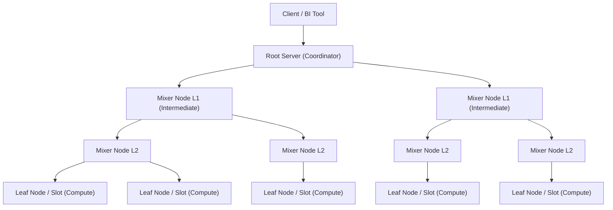

Sự chậm trễ và tính chất Batch của Hadoop MapReduce đã thúc đẩy Google tìm kiếm một giải pháp thay thế phục vụ việc truy vấn dữ liệu ở tốc độ "Interactive" (vài giây cho PetaBytes). Giải pháp đó chính là hệ thống **Dremel**, được mô tả qua một bài báo khoa học vào năm 2010. Công nghệ này chính là lõi (Engine) đứng đằng sau **Google BigQuery**, và là nền tảng cho sự bùng nổ của các MPP Data Warehouses hiện đại (Snowflake, Redshift, ClickHouse).

## 1. Bản chất của MPP (Massively Parallel Processing)

MPP áp dụng kiến trúc **Shared-nothing** (Không chia sẻ tài nguyên). Trong đó, mỗi Node (máy chủ vật lý hoặc container) tham gia vào hệ thống sở hữu độc quyền CPU, RAM và Disk riêng biệt. Chúng giao tiếp nội bộ qua một mạng băng thông lớn. 

- **Cơ chế hoạt động**: Khi một truy vấn SQL bay tới, Coordinator Node sẽ Compile và băm nhỏ Query đó ra thành các Fragment, đẩy song song xuống hàng nghìn Worker Nodes. Mỗi Worker Node quét phần dữ liệu cục bộ của nó, tính toán và trả kết quả ngược lên.
- **Systemic Trade-off (Đánh đổi hệ thống)**: MPP hi sinh tính Consistency (trong mô hình ACID của cơ sở dữ liệu OLTP truyền thống) và năng lực xử lý giao dịch ghi siêu nhỏ (row-level inserts). Đổi lại, hệ thống có năng lực xử lý truy vấn phân tích khổng lồ (OLAP) thông qua mô hình chia-để-trị (Divide and Conquer). Dữ liệu trong MPP được coi là *Append-only* hoặc *Bulk load* theo các batch lớn.

## 2. Kiến trúc Cây thực thi (Execution Tree) của Dremel

Dremel không dựa trên mô hình MapReduce hai tầng cứng nhắc, mà sử dụng cơ chế định tuyến hình cây đa tầng (Multi-level Execution Tree) kết hợp với mô hình Scatter-Gather. Cơ chế này đặc biệt hiệu quả để tính toán Aggregation phân tán với độ trễ siêu thấp (Low Latency).



1. **Root Server:** Tiếp nhận SQL Query từ người dùng, parse, đọc metadata, compile ra Execution Plan. Nó định tuyến truy vấn (Scatter) xuống các Mixer bên dưới và Gom kết quả (Gather) để trả về client.
2. **Mixer Nodes (Intermediate Servers):** Hoạt động như mạng phân phối tính toán. Chúng nhận Query một phần, đẩy xuống Leaf. Khi có dữ liệu trả ngược lên, Mixer đóng vai trò là Aggregator (Ví dụ: Partial Sum, Partial Count) để giảm băng thông chuyển tải (Network transfer) trước khi tới Root. Cấu trúc In-Memory Streaming này loại bỏ hoàn toàn hiện tượng Disk I/O Write của MapReduce trung gian.
3. **Leaf Nodes (Slots):** Là các đơn vị Compute nằm dưới cùng. Mỗi Leaf trực tiếp đọc một cục (chunk) dữ liệu từ Disk (Colossus), filter, project, và tính toán logic tầng thấp nhất.

## 3. Khởi nguồn Columnar Storage & Dữ liệu lồng nhau (Nested Data)

Yếu tố giúp Dremel quét hàng tỷ dòng trong giây lát là sự kết hợp giữa MPP và định dạng lưu trữ cột (Columnar Storage). Trong các bài toán phân tích, truy vấn thường chỉ yêu cầu quét 3-5 cột trên tổng số 100 cột. Columnar format tối ưu hóa I/O bằng cơ chế **Projection Pushdown** (chỉ đọc các block của cột được yêu cầu).

Tuy nhiên, Big Data thường tồn tại dưới dạng JSON lồng nhau (Nested/Repeated records) như Protocol Buffers. Dremel đã phát minh ra thuật toán "kéo phẳng" (Flaten) các Node dạng cây này thành định dạng cột phẳng thông qua hai metadata flags cực kỳ quan trọng:

- **Repetition Level (RL):** Giá trị này chỉ định tại Node nhánh nào (tree level) trong record, mảng danh sách bắt đầu lặp lại. Giúp hệ thống biết khi nào một giá trị thuộc về record hiện tại hay bắt đầu một record mới.
- **Definition Level (DL):** Để tiết kiệm dung lượng khi field mang giá trị `NULL` hoặc `Optional`, DL cho biết có bao nhiêu Node trên đường dẫn path từ Root đến field này thực sự tồn tại. Dữ liệu NULL sẽ không tốn byte lưu trữ nào trên đĩa cứng.

> **Note**: Thuật toán Columnar của Dremel sau này đã truyền cảm hứng trực tiếp cho Apache Foundation tạo ra **Apache Parquet**, chuẩn lưu trữ Big Data thống trị thế giới hiện nay. Trong BigQuery, định dạng này được tối ưu hóa riêng mang tên **Capacitor**.

## 4. Dremel Tiến Hóa thành BigQuery (The BigQuery Stack)

Trong BigQuery, kiến trúc Dremel đã được tái thiết kế triệt để nhằm tối ưu mô hình **Serverless Data Warehouse**. BigQuery không chỉ là Dremel mà là sự tổng hòa của 4 hạ tầng khổng lồ từ Google:

1. **Phân tách Storage và Compute (Separation of Storage & Compute):** 
   Khác với MPP nguyên thủy cài đặt chung Storage và Compute trên một Rack vật lý (Hardware lock-in), BigQuery tách rời chúng:
   - **Tầng Storage (Colossus):** Hệ thống lưu trữ bền vững phân tán thế hệ kế tiếp của GFS (Google File System). Dữ liệu được mã hóa, replicate và nén bằng định dạng Capacitor.
   - **Tầng Compute (Dremel & Borg):** Hàng vạn Compute Slot là các container được quản lý bởi **Borg** (tiền thân của Kubernetes). Borg có thể spin-up hàng vạn micro-services để làm Leaf Node trong vài nano giây khi có truy vấn lớn ập đến.

2. **Jupiter Network:** 
   Để khắc phục độ trễ I/O khi Compute và Storage cách xa nhau vật lý, Google kết nối chúng qua hệ thống mạng quang học Jupiter với băng thông lõi lên đến 1 Petabit/giây. Điều này đảm bảo Compute Node (Dremel) có thể đọc Storage (Colossus) mượt mà như đọc ổ đĩa Local NVMe.

3. **In-Memory Shuffle Service:** 
   Các tác vụ JOIN lớn đòi hỏi Network Shuffle khổng lồ. Thay vì ghi đĩa tạm (Spill-to-disk) làm nghẽn cổ chai, BigQuery đẩy dữ liệu trung gian vào một Cluster bộ nhớ RAM phân tán chuyên dụng (Shuffle tier), giúp giải quyết các rủi ro Node OOM và tăng tốc độ xử lý lặp.

### Code Thực Chiến: Terraform cấp phát BigQuery Reservation

Thay vì dùng On-demand pricing dễ gây bùng nổ hóa đơn (Bill shock), Staff Engineer thường cấu hình cấp phát Compute (Slots) cứng qua Terraform để kiểm soát FinOps:

```hcl
# Cấu hình cấp phát Slots (Compute) chuyên dụng cho BigQuery
resource "google_bigquery_capacity_commitment" "commitment" {
  capacity_commitment_id = "prod-dremel-capacity"
  location               = "US"
  slot_count             = 1000  # Thuê cứng 1000 Dremel Leaf Nodes
  plan                   = "MONTHLY"
}

# Tạo Reservation gán vào Commitment
resource "google_bigquery_reservation" "reservation" {
  name                   = "etl-heavy-workload"
  location               = "US"
  slot_capacity          = 1000
  ignore_idle_slots      = false
}

# Gán Project vào Reservation để các Query chạy bằng Slot riêng
resource "google_bigquery_reservation_assignment" "assignment" {
  assignee               = "projects/my-data-project"
  job_type               = "QUERY"
  reservation            = google_bigquery_reservation.reservation.id
}
```

## 5. Rủi ro Hệ thống (Troubleshooting in Dremel/MPP)

Dù BigQuery che giấu rất nhiều sự phức tạp của hạ tầng, Kỹ sư Dữ liệu vẫn phải đối mặt với các giới hạn vật lý của MPP.

### 5.1. Distributed JOIN Bottlenecks & Data Skew
**Sự cố (Incident)**: Khi JOIN hai bảng Fact siêu lớn (Terabytes) bằng một key bị nghiêng (Data Skew - ví dụ: 90% giao dịch nằm ở chi nhánh "Hồ Chí Minh"). 
- **Hệ lụy vật lý**: Dremel sử dụng Hash Shuffle Join. Thuật toán Hash sẽ đẩy toàn bộ dữ liệu của chi nhánh "Hồ Chí Minh" về cùng một [hoặc một vài] Dremel Leaf Node (Slot). Node này bị phình RAM (OOM) và báo lỗi `Resources exceeded during query execution: The query could not be executed in the allotted memory`.
- **Khắc phục**: Tránh Hash Shuffle bằng cách tận dụng Broadcast Join (chỉ khi 1 bảng đủ nhỏ) hoặc thay đổi logic bằng cách chia nhỏ truy vấn, hoặc lọc trước (Pre-filtering) các Skewed Keys để xử lý riêng.

### 5.2. Hạn chế Concurrency (Inter-query Concurrency Limits)
- **Bản chất vật lý**: Vì kiến trúc MPP/Dremel đẩy tính song song nội bộ (Intra-query parallelism) lên tối đa (huy động 5,000 slots cho 1 query duy nhất để trả về trong 2 giây), nó không được thiết kế để xử lý hàng vạn query cùng lúc. 
- **Hệ lụy**: Nếu bạn gắn trực tiếp một API Web server (với 1000 TPS - Transactions Per Second) vào BigQuery để query Real-time, hệ thống sẽ sập hoặc báo lỗi Rate Limit `quotaExceeded`.
- **Khắc phục**: KHÔNG bao giờ dùng BigQuery làm Backend cho các ứng dụng OLTP/Real-time Web. Cần phải có một lớp Serving Layer ở giữa như Redis, Bigtable, hoặc PostgreSQL, đồng bộ dữ liệu bằng Batch từ BigQuery sang.

### 5.3. Cạm bẫy SELECT * (The `SELECT *` Anti-Pattern)
- **Lý thuyết**: Columnar Storage (Capacitor) cực kỳ tỏa sáng khi bạn chỉ chọn vài cột. 
- **Đánh đổi**: Việc chạy `SELECT *` ép Dremel phải quét toàn bộ các cột, lắp ráp lại chúng qua các Definition/Repetition Levels. Chi phí quét Disk/Network tăng vọt 100x so với bình thường, biến Columnar thành một gánh nặng I/O đắt đỏ hơn cả định dạng Row-based truyền thống.

## Nguồn Tham Khảo

- [Dremel: Interactive Analysis of Web-Scale Datasets (Google Whitepaper, VLDB 2010]][https://research.google/pubs/pub36632/]
- [A Look at Dremel (Google Cloud Blog]][https://cloud.google.com/blog/products/data-analytics/a-look-at-dremel]
- [BigQuery Under the Hood - Architecture (Google Cloud Official Docs]](https://cloud.google.com/bigquery/docs/architecture)
- Designing Data-Intensive Applications (Martin Kleppmann) - Phân tích về Column-Oriented Storage.
